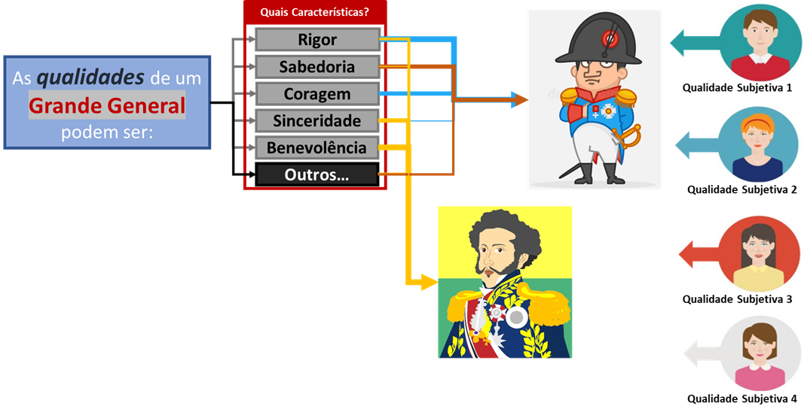
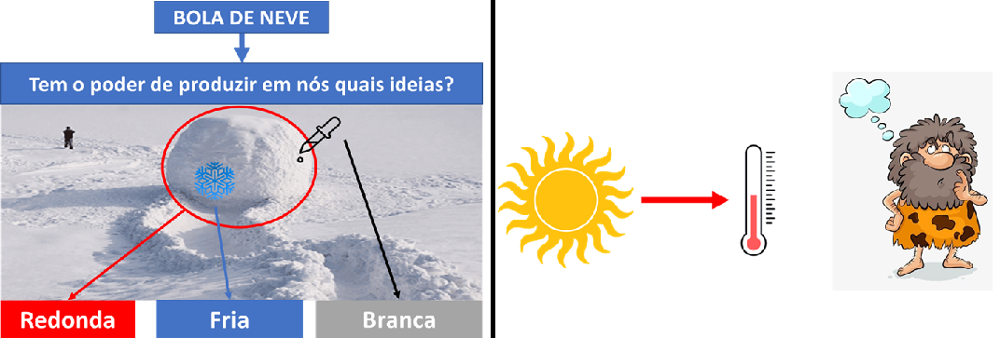
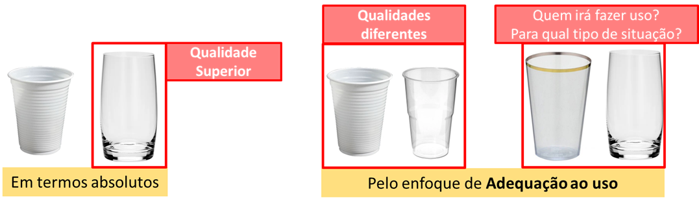
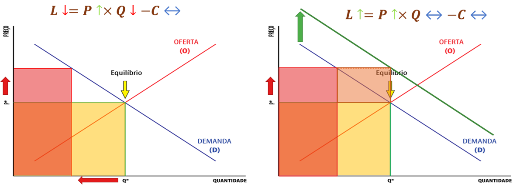
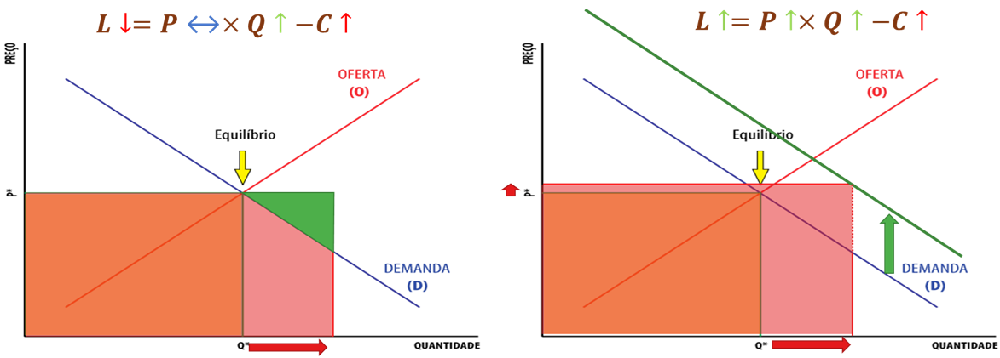
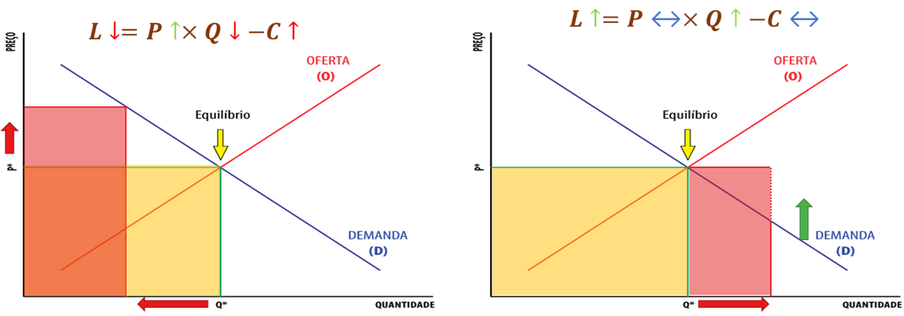
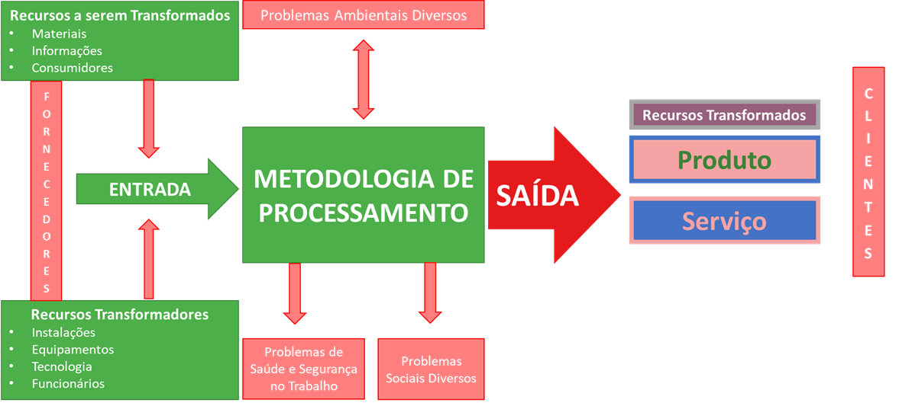

# Fundamentos e Conceitos da Qualidade {#sec-cap1}

::: {.callout-tip title="🎯 Objetivos deste Capítulo"}

Neste capítulo, estabeleceremos os alicerces teóricos e normativos da Qualidade. Ao final da leitura, você será capaz de:

* **Compreender** a dupla dimensão da Qualidade (objetiva e subjetiva) e sua evolução histórica rumo à gestão estratégica (*Market-in*).
* **Analisar** o impacto econômico da Qualidade, utilizando a equação de Valor Agregado para diferenciar requisitos qualificadores de critérios ganhadores de pedido.
* **Correlacionar** a excelência operacional com as variáveis microeconômicas de Preço, Custo, Produtividade e Participação no Mercado.
* **Dominar** a taxonomia da ISO 9000, diferenciando rigorosamente Produto de Serviço, e o conceito de Qualidade do conceito de Grau (luxo).
* **Estruturar** a base lógica para a modelagem analítica, traduzindo o vocabulário normativo em variáveis matemáticas prontas para a engenharia.
:::

## Evolução Histórica e Definições {#sec-evolucao-historica}

### O Conceito Geral e a Subjetividade da Qualidade {#sec-conceito-geral}

A popularização do termo "Qualidade" é fruto de um esforço histórico para disseminar o conceito, o que não é, por si só, um aspecto negativo. O problema central reside na imprecisão das definições adotadas pelo senso comum, que frequentemente se distanciam do rigor técnico necessário. Para a gestão, isso representa um desafio considerável: é extremamente complexo tentar "redefinir" ou restringir o uso de uma expressão que já se tornou patrimônio do domínio público e que todos acreditam compreender plenamente.

Em seu sentido genérico, a Qualidade é definida como:

> *"Propriedade, atributo, característica ou condition das coisas ou das pessoas capaz de distingui-las das outras e de lhes determinar a essência ou a natureza".*

Dessa definição, extraímos três pilares fundamentais:

i. A Qualidade é um **atributo** ou característica inerente ao objeto.
ii. Ela atua como um **fator de distinção** ou diferenciação.
iii. Ela é o que **determina a essência** ou a natureza do que se avalia.

A dificuldade de observar a Qualidade de forma isolada ocorre porque ela só se materializa através de seus atributos. Consideremos a afirmação: *"Napoleão Bonaparte possuía as qualidades de um grande general"*. A Qualidade não é algo identificável e observável diretamente de forma isolada; ela é definida por meio de suas características. O que significa na prática essa frase? Significa que as palavras "qualidades", "propriedades", "atributos" ou "características" são intercambiáveis. Ele possuía os atributos que definiam a essência de um grande general (como rigor, sabedoria, coragem, sinceridade e benevolência).

::: {.callout-note title="💡 Reflexão sobre o uso do termo"}

A ambiguidade que cerca a palavra "Qualidade" decorre, em grande parte, da omissão do contexto por parte de quem a utiliza. Tecnicamente, a Qualidade não deveria ser tratada como um adjetivo isolado, mas sim como um termo composto. É indispensável atrelá-la sempre a um substantivo específico, pois as competências que definem a excelência de um estrategista militar não guardam relação direta com as características exigidas de um líder político. Sem essa delimitação contextual, o atributo perde seu sentido prático na gestão.
:::

Essas qualidades podem se manifestar de diferentes formas:

* **Possuídas:** Podem ser adquiridas, aprendidas e treinadas.
  *(Ex: Napoleão quer possuir as características de um Grande General. Ele pode adquiri-las, aprendê-las e treiná-las).*
* **Atribuídas e Exigidas:** O ambiente ou a função exige essas características, forçando a sua busca.
  *(Ex: São exigidas as características de um Grande General. Outras pessoas atribuíram, reconheceram e concederam essas características a Napoleão).*
* **Percebidas:** As pessoas notam essas características.
  *(Ex: As pessoas percebem essas características em Napoleão. As histórias transmitidas produziram ideias sobre a figura do general).*

O emprego genérico da palavra Qualidade para representar coisas distintas deve-se ao fato de que o usuário da expressão não explica a que aspecto se refere o atributo. Para evitar essa ambiguidade, a palavra Qualidade deveria ser sempre empregada de forma composta, explicitando qual o substantivo a que se refere.

A @fig-caracteristicas-general ilustra visualmente essa dinâmica ao analisar as qualidades de um "Grande General". O diagrama apresenta um conjunto de características inerentes potenciais (como rigor, sabedoria e coragem) e demonstra como diferentes avaliadores (representados à direita) criam associações completamente distintas. Enquanto um avaliador (linhas azuis) associa fortemente "rigor" e "coragem" a Napoleão, outro avaliador (linhas laranjas) foca na "sabedoria" e atribui a característica de "benevolência" tanto a Napoleão quanto a Dom Pedro I.

{#fig-caracteristicas-general fig-align="center"}

A partir da interpretação desta figura, conseguimos materializar a aplicação prática dos três pilares da definição genérica de qualidade:

* **A propriedade (i) – O Atributo:** O quadro "Quais Características?" materializa os atributos. O diagrama prova que a percepção é individual: pessoas diferentes podem simplesmente eleger e focar em conjuntos de características completamente diferentes para avaliar o mesmo objeto.
* **A propriedade (ii) – A Distinção:** Refere-se à qualificação comparativa. As setas apontando para personagens distintos mostram que, utilizando esse conjunto de características, o avaliador consegue distinguir indivíduos, percebendo que Napoleão possui um perfil de atributos diferente de Dom Pedro I.
* **A propriedade (iii) – A Essência:** É o conjunto mínimo e inegociável de características que descreve a natureza do que se avalia. Para ilustrar, se descrevermos um animal "grande, pesado, que vive na selva, possui tromba e orelhas enormes", você identifica intuitivamente a essência de um elefante. Se adicionarmos a característica "tem um par de asas" ou "tem duas patas", ele é imediatamente descaracterizado. De forma análoga, uma bola de neve pode ter várias características adicionais, mas a sua característica *essencial* é ser esférica; sem isso, deixa de ser uma bola. No contexto da @fig-caracteristicas-general, a essência está atrelada à natureza inconfundível do que significa ser um "general" — que indica o mais alto posto militar e deriva da palavra latina *generalis* (comum a todos).

A qualidade possui, portanto, níveis intrínsecos de subjetividade:

* A **definição** de quais características importam pode ser subjetiva.
* A **intensidade** da associação dessas características pode ser subjetiva.
* A **forma de mensuração** e **interpretação** pode ser subjetiva.
* A **própria característica** pode ser subjetiva.

A qualidade pode ser entendida como o conjunto de atributos que determina a essência de um objeto, permitindo sua identificação e diferenciação. Ela não existe como entidade autônoma, mas manifesta-se por meio de características observáveis.

Considere um exemplo simples e direto da indústria pesada: um rolamento. Dizer que ele "tem qualidade" não significa absolutamente nada se não forem explicitados atributos como tolerância dimensional, capacidade de carga, resistência ao desgaste e vida útil esperada. A ausência de qualquer uma dessas características compromete a essência funcional do objeto: ele deixará de girar com precisão e confiabilidade. O mesmo raciocínio aplica-se a serviços. Um serviço de manutenção industrial tem sua essência definida pelo tempo de resposta, precisão do diagnóstico e segurança da intervenção. A falta de apenas um desses atributos descaracteriza a natureza do serviço, ainda que os demais estejam corretos.

Dessa forma, a qualidade é inseparável do conceito de essência funcional: um objeto deixa de ser o que é quando perde suas características essenciais, mesmo que apresente atributos acessórios sofisticados.

### Dimensões da Qualidade: Objetiva vs. Subjetiva {#sec-dimensoes-qualidade}

É exatamente para lidar com essa forte carga de interpretação individual que a engenharia e a gestão precisaram categorizar o conceito. Toda essa subjetividade intrínseca listada acima divide a nossa compreensão da Qualidade em duas grandes dimensões:

* **Dimensão Objetiva (ou primária):** Refere-se à qualidade intrínseca das coisas. É aquilo que faz parte da essência e é inerente ao objeto, independente do ponto de vista do ser humano (como o peso, as dimensões físicas ou a composição química).
* **Dimensão Subjetiva (ou secundária):** Refere-se à percepção que as pessoas têm dessas características. Está associada à capacidade humana de pensar, sentir e diferenciar (como o conforto, o sabor ou o status).

Para compreender a complexidade de medir e atestar a qualidade de um produto, precisamos separar com clareza a característica real do objeto da forma como o observador o interpreta.

Retomando a nossa analogia da bola de neve e expandindo-a para uma nova perspectiva térmica, essa dicotomia exata entre o objetivo e o subjetivo é ilustrada na @fig-boladeneve-termometro através de dois cenários distintos:

::: {.example #exm-percepcao-sensorial name="A Percepção Sensorial - A Bola de Neve"}

No primeiro cenário, o objeto (bola de neve) possui propriedades materiais exatas. No entanto, o "poder" desse objeto na nossa percepção é a capacidade de gerar em nossa mente ideias qualitativas e sensoriais, como "esférica", "gelada" e "branca". O desafio gerencial surge exatamente dessa distinção: é extremamente difícil padronizar ou verificar um atributo de qualidade se ele depender puramente da capacidade de "produzir uma sensação" no cliente, pois essa percepção varia de pessoa para pessoa.
:::

::: {.example #exm-causalidade-oculta name="A Causalidade Oculta - O Sol e o Termômetro"}

A dificuldade de verificação se torna ainda mais evidente quando o observador capta o efeito, mas ignora a causa, como demonstrado na segunda parte da figura. Sabemos, de forma objetiva, que o Sol emite energia térmica com a propriedade física de dilatar o mercúrio dentro de um termômetro. Contudo, se entregarmos esse instrumento a um "homem das cavernas", ele perceberá visualmente a coluna de líquido subindo (experimentando a dimensão subjetiva do fenômeno), mas não fará a menor ideia da relação físico-química que a radiação solar exerce sobre o equipamento (a dimensão objetiva real).
:::

{#fig-boladeneve-termometro fig-align="center"}

Na engenharia de produção, o @exm-causalidade-oculta atua como um alerta crítico: não podemos atestar a qualidade de um processo baseando-nos apenas naquilo que conseguimos enxergar superficialmente, sem compreender a variável raiz que governa o sistema.

Para tangibilizar esse descompasso na rotina de um processo industrial de produção (como a fabricação de componentes mecânicos ou o beneficiamento de minério), a divisão ocorre da seguinte forma:

**Dimensão Objetiva:** Reflete-se nas tolerâncias dimensionais, resistência mecânica, taxa de defeitos, tempo de ciclo e custo por unidade. São os números frios do processo.

**Dimensão Subjetiva:** Reflete-se na percepção do cliente sobre a confiabilidade do produto, a facilidade de uso, a imagem da marca e a confiança no fornecedor.

Esse descompasso entre o real e o percebido cria desafios críticos. Um cabo de aço pode ser tecnicamente perfeito em seu limite de tração (objetivo), mas ser rejeitado se não transmitir segurança visual ao operador (subjetivo). A qualidade só é considerada plena e efetiva quando os indicadores técnicos objetivos sustentam uma percepção positiva do mercado. A gestão eficaz exige transformar essas percepções subjetivas em variáveis objetivas de controle.

### A Evolução do Conceito (Níveis de Adequação) {#sec-evolucao-conceito}

Apesar do interesse corporativo, a confusão conceitual sobre o que realmente define um bom produto ou serviço exige um alinhamento rigoroso. A evolução do conceito de qualidade é caracterizada por quatro adequações ou níveis:

* **Adequação ao Padrão:** Define a qualidade como o produto que faz estritamente aquilo que os projetistas pretenderam que ele fizesse (conformidade com a especificação).
* **Adequação ao Uso:** É o meio de garantir a satisfação das necessidades de mercado. O produto pode ser utilizado da maneira como os clientes querem utilizá-lo na prática? Neste nível, qualidade é a satisfação do cliente quanto à utilidade real do produto.
* **Adequação ao Custo:** Significa alta qualidade atrelada a custo baixo. Remete ao conceito estatístico de que a qualidade é inversamente proporcional à variabilidade no processo de produção (menos falhas, menor custo).
* **Adequação à Necessidade Latente:** Significa a satisfação das necessidades do cliente antes mesmo que ele esteja consciente delas, gerando inovação e encantamento.

::: {.example #exm-niveis-caminhao name="Os Quatro Níveis em Equipamentos de Mineração"}

Para visualizar essa evolução no contexto de maquinário pesado, observe o desenvolvimento e a aquisição de um **Caminhão Fora-de-Estrada**:

1. **Padrão:** O equipamento sai da linha de montagem com o chassi soldado milimetricamente conforme o projeto de engenharia, a capacidade de carga é de exatas 240 toneladas e o motor entrega a potência rigorosamente especificada no manual.
2. **Uso:** A cabine possui isolamento acústico, ar-condicionado e ergonomia avançada, garantindo que o operador trabalhe um turno inteiro sem fadiga. A suspensão é projetada para lidar perfeitamente com as irregularidades das vias da mina.
3. **Custo:** A fabricante adota a padronização de componentes modulares na montagem, reduzindo o custo fabril. Para a mineradora, o caminhão oferece alta eficiência de combustível (*payload* por litro), reduzindo significativamente o custo operacional da lavra.
4. **Necessidade Latente:** O equipamento vem de fábrica com telemetria preditiva embarcada. O sistema avisa automaticamente o PCM (*Planejamento e Controle da Manutenção*) sobre a degradação de um componente hidráulico semanas antes da falha, evitando paradas não programadas e encantando a gestão da frota.
:::

Este conceito moderno exerce uma função dupla: satisfaz os clientes e permite à companhia funcionar da forma mais eficiente possível. A qualidade é, talvez, a única área na qual há grande alinhamento entre as metas dos clientes e as metas da organização.

Pressupõe-se que deve existir uma concordância de conceituação entre o produtor e o consumidor. Para o consumidor, o conceito de qualidade gravita em torno de um ponto de equilíbrio entre quatro fatores fundamentais:

* **Qualidade Intrínseca do Produto:** Refere-se aos atributos inerentes do produto (funcionalidade, durabilidade, confiabilidade técnica).
* **Qualidade do Atendimento:** Envolve a quantidade ofertada, o cumprimento de prazos de entrega, a disponibilidade e a responsividade comercial.
* **Qualidade dos Serviços Associados:** Inclui a assistência técnica, a garantia, o suporte pós-venda e a facilidade de manutenção.
* **Custo Total:** A soma de todos os gastos envolvidos na aquisição, uso operacional e descarte do produto.

A satisfação total do consumidor só é alcançada quando há equilíbrio em todos esses fatores. Para transformar essa expectativa abstrata em algo gerenciável, a indústria precisou estabelecer uma linguagem de controle universal.

::: {.example #exm-fatores-caminhao name="Os Quatro Fatores de Satisfação em Ativos Críticos"}

Ainda analisando o mesmo **Caminhão Fora-de-Estrada**, o equilíbrio para a satisfação da mineradora (consumidora) gravita nos seguintes fatores:

* **Qualidade Intrínseca:** A robustez estrutural do chassi, a confiabilidade do motor sob regime severo e a resistência dos pneus contra cortes nas rochas.
* **Atendimento:** O cumprimento rigoroso do prazo de entrega do equipamento na mina (montagem e *site assembly* no prazo) e a prontidão do time comercial para ajustes no contrato.
* **Serviços Associados:** A presença de técnicos do fabricante (*site support*) na operação, o treinamento fornecido aos operadores e mecânicos locais, e a agilidade no fornecimento de peças sobressalentes.
* **Custo Total:** A visão financeira completa (TCO - *Total Cost of Ownership*), que soma o valor de aquisição (*CapEx*), os gastos ao longo da vida útil com combustível, pneus e manutenção (*OpEx*), e o valor residual do ativo no momento do descarte ou revenda.
:::

## Múltiplas Perspectivas e a Evolução Operacional {#sec-perspectivas-evolucao}

### Concepções Contemporâneas de Qualidade {#sec-concepcoes-contemporaneas}

A literatura contemporânea sistematiza diferentes concepções de qualidade, que coexistem e se sobrepõem conforme o contexto da organização. Para a engenharia de produção, elas não são excludentes, mas ditam a forma como a empresa se posiciona no mercado, aloca seus recursos e enxerga o seu próprio produto:

**1. Qualidade como Intencional (Conformidade Rigorosa)**
A qualidade intencional define excelência como o cumprimento fiel e irrestrito do que foi planejado no projeto ou estabelecido em contrato. Em uma linha de envase, por exemplo, a qualidade intencional é atingida quando cada garrafa contém o volume exato especificado e o rótulo está posicionado nas coordenadas milimétricas corretas. Sob essa ótica, não se trata de surpreender ou encantar o cliente com algo novo, mas de cumprir rigorosamente a promessa técnica. Essa concepção é o núcleo de ambientes altamente regulados (como a indústria farmacêutica ou aeronáutica), onde qualquer desvio ou variação representa um risco crítico.

**2. Qualidade como Excepcional (Superação Deliberada)**
Esta concepção está associada à superação de padrões mínimos e à busca constante por distinção. É a transição da "qualidade obrigatória" para a "qualidade atrativa". Algumas empresas elevam deliberadamente o padrão do processo, reduzindo ainda mais a variabilidade e oferecendo um desempenho superior ao mínimo exigido por norma. Um equipamento fora-de-estrada *premium*, por exemplo, pode apresentar sistemas redundantes e materiais de altíssima resistência que excedem em muito os requisitos básicos da mineração. Essa qualidade excepcional sustenta a vantagem competitiva de longo prazo, mas exige extrema cautela gerencial: se os atributos superlativos não forem percebidos ou valorizados pelo cliente, eles se transformam em custo inútil (o desperdício da superqualidade).

**3. Qualidade como Transformadora (Impacto no Cliente)**
A concepção transformadora tira o foco do "objeto físico" e passa a avaliar a qualidade pelo impacto positivo gerado na operação e na vida do usuário. O valor do produto não reside apenas no que ele *é*, mas no que ele *permite que o cliente faça*. Considere um software de planejamento de produção (ERP): sua qualidade não é atestada apenas pela ausência de *bugs* ou travamentos, mas pela sua capacidade real de transformar a rotina de quem o utiliza. Se a ferramenta reduz o tempo de tomada de decisão, aumenta a previsibilidade financeira e simplifica a operação de um setor inteiro, ela atinge a qualidade transformadora, tornando-se indispensável para o cliente.

**4. Qualidade como Responsável (Externalidades e Sociedade)**
A qualidade responsável é a visão mais madura e sistêmica, pois amplia o olhar para além do cliente imediato e do lucro de curto prazo. A empresa passa a avaliar os impactos externos (externalidades) de sua operação na sociedade. Envolve o controle rigoroso sobre o desperdício de matéria-prima, o consumo energético, a geração de resíduos e os riscos de acidentes. Um motor de grande porte pode ser altamente eficiente e potente (cumprindo as outras três concepções), mas se gerar resíduos tóxicos de difícil tratamento ou emitir ruído acima do tolerável, ele falha sob a ótica da responsabilidade. Na engenharia contemporânea, alinhada aos pilares ESG (*Environmental, Social, and Governance*), a não qualidade manifesta-se sempre que os custos operacionais da fábrica são, de forma antiética, transferidos para a sociedade pagar.

::: {.callout-important title="🚀 O Gancho para a Prática: Rumo à Modelagem"}

Todas essas dimensões abstratas e concepções filosóficas convergem para um único objetivo na engenharia: a necessidade de quantificação. A Modelagem Analítica de Requisitos (ARM) transforma a qualidade de um conceito interpretativo em um sistema mensurável, no qual variáveis representam atributos, pesos traduzem o valor percebido e o índice final expressa, de forma objetiva, a capacidade do processo em atender e sustentar os requisitos do mercado.

**Nota:** No Capítulo 7 (Estudos de Caso Integrados), retomaremos estas quatro concepções (Intencional, Excepcional, Transformadora e Responsável) para demonstrar, na prática, como elas se alinham às diretrizes da ISO 9001 e às equações do ARM.
:::

### As Eras da Qualidade: Uma Evolução Operacional {#sec-eras-qualidade}

Desde a Idade Média, a necessidade de diferenciar os produtos oferecidos em um mercado competitivo forçou a evolução do significado e das práticas de qualidade. Historicamente, a literatura divide essa evolução em três grandes eras operacionais.

#### A Era da Inspeção {#sec-era-inspecao}

O período de fiscalização teve seus primeiros traços na Idade Média, com os artesãos que trabalhavam para garantir a qualidade individual de seus produtos. Nesse período, começaram a ser definidos padrões básicos de qualidade para bens e serviços, bem como níveis primários de desempenho do trabalho.

Com o advento da produção em massa, surgiu a necessidade de uma "inspeção formal", impulsionada primordialmente pela exigência de verificação de peças intercambiáveis nas linhas de montagem. Em 1922, a obra *The Control of Quality in Manufacturing* de G.S. Radford apresentou, de forma pioneira, as atividades de inspeção ligadas ao controle da qualidade. Pela primeira vez, a qualidade foi vista como uma responsabilidade gerencial distinta e uma função independente.

Nesta primeira era, a preocupação central estava em examinar o produto detalhadamente, um a um, com o objetivo exclusivo de encontrar possíveis falhas para impedir que o defeito chegasse ao cliente. Essa atividade era majoritariamente corretiva e realizada sem metodologias analíticas preestabelecidas. As principais conquistas foram a introdução de sistemas racionais de medidas, gabaritos e acessórios de verificação.

#### A Era do Controle Estatístico da Qualidade {#sec-era-controle-estatistico}

A segunda fase da evolução ocorreu quando o aumento em larga escala da produção tornou inviável (tanto física quanto financeiramente) a verificação de produtos um a um. A inspeção precisou evoluir e passou a ser realizada através da amostragem e da utilização de técnicas estatísticas.

As ferramentas estatísticas foram desenvolvidas com o intuito de satisfazer as reais necessidades de controle de qualidade em ambientes de alto volume. É nesta fase que a engenharia introduz conceitos fundamentais e preditivos, tais como: risco do produtor e do consumidor, probabilidade de aceitação, fração tolerada defeituosa e o Nível Aceitável de Qualidade (AQL - *Acceptable Quality Level*).

#### A Era da Garantia e Gestão Estratégica da Qualidade {#sec-era-garantia}

Todo esse movimento de racionalização ganhou força monumental após a 2ª Guerra Mundial e estende-se até os dias de hoje, marcando a terceira era. Nela, a qualidade deixa de ser apenas uma ferramenta de fábrica e passa a ser vista como parte indissociável do gerenciamento estratégico da organização.

A era contemporânea é caracterizada pelo surgimento de novos elementos integradores, como a quantificação dos custos da qualidade, a engenharia de confiabilidade, o conceito de "zero falhas" e o Controle Total da Qualidade (*Total Quality Control*). A gestão deslocou-se definitivamente do foco em "encontrar o defeito" para o foco em "garantir que o sistema não produza o defeito".

::: {.example #exm-eras-automobilistica name="A Evolução Histórica na Indústria Automobilística"}
Para tangibilizar essa evolução, observe a mudança de foco no setor automotivo:

* **Inspeção:** No início das linhas de montagem da Ford, um inspetor batia com um martelo em cada peça para ouvir o som e decidir se estava "boa ou ruim" antes de montá-la. O foco era totalmente na detecção manual.

* **Controle Estatístico:** A fábrica passou a retirar 5 motores a cada 100 produzidos para testes de desempenho em bancada, utilizando cálculos matemáticos para prever se o lote inteiro estava dentro do Nível Aceitável de Qualidade (AQL).

* **Garantia Estratégica:** A montadora implementa o *Poka-Yoke* (dispositivos à prova de erros) direto na linha, onde uma peça só encaixa se estiver na posição exata. A qualidade deixa o chão de fábrica e é discutida na diretoria como diferencial competitivo (oferecendo 5 anos de garantia para dominar fatias de mercado).
:::

## Vertentes Clássicas no Conceito de Qualidade {#sec-vertentes-qualidade}

A evolução da qualidade, partindo de uma visão estritamente subjetiva para um modelo de gestão pragmático, pode ser compreendida através de diferentes correntes de pensamento. Para facilitar o entendimento, dividiremos o conceito em quatro abordagens centrais.

### Qualidade sob a Ótica da Adequação ao Uso {#sec-adequacao-uso}

Esta corrente defende que um produto detém qualidade se ele cumpre de forma satisfatória a função para a qual foi adquirido pelo usuário final. Ou seja, a sua excelência é medida pela sua utilidade prática no dia a dia. A qualidade aqui é situacional: ela não mora no objeto, mas no encontro entre o objeto e a necessidade do usuário.

Sob essa ótica, a premissa mercadológica de que "o cliente sempre sabe o que quer" nem sempre é absoluta, uma vez que inovações são empurradas para o mercado, gerando novas necessidades antes mesmo que o consumidor as exija (Necessidades Latentes). Ao se distanciar da busca por uma "perfeição técnica" utópica e isolada, essa visão pragmática permite que as empresas incorporem a qualidade em suas estratégias comerciais.

#### A Perfeição Técnica vs. A Utilidade Prática

Muitas vezes, uma solução "simples" tem mais qualidade do que uma "sofisticada", dependendo estritamente do contexto. O erro comum da engenharia é achar que qualidade é apenas sinônimo de "mais recursos" ou "materiais caros". Na realidade, um relógio digital de plástico de R$ 50,00 tem maior *adequação ao uso* para um mergulhador do que um relógio de luxo de ouro que não é à prova d'água. O relógio de ouro tem *Grau* superior, mas para aquela função subaquática, tem uma *Qualidade* muito inferior.

As demandas do mercado são naturalmente dinâmicas. Consumidores diferentes possuem rotinas e níveis de exigência distintos para um mesmo item.

::: {.example #exm-relatividade-uso name="A Relatividade do Uso e as Perguntas de Contorno"}

Para dominar essa vertente, o engenheiro deve sempre aplicar o filtro das **Perguntas de Contorno**: *Quem é o usuário? Onde será usado? Para que serve?*

**Cenário: Ferramentas de Manutenção (O Martelo)**

* **Contexto 1 (Uso Doméstico):** Um martelo simples, leve e barato. *Alta Adequação:* O usuário vai pregar um quadro uma vez por ano. É fácil de guardar e o custo foi baixo.
* **Contexto 2 (Uso Industrial/Mina):** O mesmo martelo simples. *Baixa Adequação:* Ele quebrará no primeiro turno de trabalho pesado. Aqui, a adequação exige um martelo de aço forjado com cabo antivibração. A "perfeição" do martelo doméstico é inútil para a oficina da mineradora.

**Cenário: A Inovação e a Necessidade Latente (Mala com Rodinhas)**

A adequação ao uso muitas vezes é algo que o cliente descobre apenas quando recebe o produto. Por décadas, as pessoas carregavam malas pesadas nas mãos (Baixa Adequação). Ninguém "pedia" rodinhas, até que a indústria as colocou. A inovação criou uma nova régua: hoje, uma mala sem rodinhas é considerada de baixíssima qualidade para o uso em aeroportos, pois falha na adequação ao uso de transporte fluido.
:::

A @fig-copos-descartaveis ilustra visualmente essa relatividade em um ambiente de grandes eventos. Imagine a venda de bebidas nas arquibancadas de um estádio de futebol. Um copo de plástico descartável atende de forma brilhante à necessidade (fácil manuseio, segurança contra cortes e baixo custo). Contudo, se tentarmos utilizar este exato recipiente para servir um café recém-coado, ele perderá completamente a sua "adequação". A alta condutividade térmica do plástico fino causaria queimaduras, falhando na missão do produto.

{#fig-copos-descartaveis fig-align="center"}

::: {.callout-important title="🎯 Dinâmica de Classe: Análise de Contorno"}

**O Problema:** "Uma mineradora precisa comprar lanternas para seus operários que trabalham no subsolo."

* **Debate 1:** Uma lanterna de plástico de altíssima potência de iluminação, mas que usa pilhas comuns que duram apenas 2 horas, tem Adequação ao Uso neste contexto?
* **Debate 2:** Se a lanterna for de metal super resistente e durar 20 horas, mas for muito pesada e difícil de prender no capacete, ela é de Alta Qualidade para esse operário? Qual seria a "Lanterna de Qualidade Plena"?
:::

### Qualidade como Conformidade com o Projeto {#sec-conformidade-projeto}

Esta segunda abordagem argumenta que a gestão da qualidade só se torna viável na prática diária de uma operação se for balizada por métricas e especificações técnicas estabelecidas antes do início da fabricação. Nesse cenário, o nível de excelência é determinado rigorosamente pelo alinhamento exato entre o item entregue e o que foi parametrizado no projeto de engenharia. A qualidade não é uma opinião, mas uma **comparação estatística** entre o "Dever Ser" (Projeto) e o "É" (Produto Real).

#### A Ficha Técnica (O "DNA" da Qualidade)

Na conformidade, o documento mestre é a Especificação Técnica. Ela transforma desejos abstratos em números auditáveis.

* **Limites de Tolerância:** O projeto nunca define apenas um número fixo (ex: 10 mm), mas uma faixa aceitável (ex: $10 \pm 0,05$ mm).
* **Conformidade Binária:** Se a peça mede 10,04 mm, ela é *Conforme*. Se mede 10,06 mm, ela é *Não Conforme* (defeito), mesmo que ainda funcione. Para a engenharia de conformidade, o erro é puramente o desvio do plano.

::: {.example #exm-otica-laboratorial name="A Lógica do Laboratório e da Conformidade"}

**Cenário A: Indústria de Parafusos Automotivos**

* *O Projeto:* O parafuso deve suportar um torque de 50 N.m e ter uma rosca com passo de 1,25 mm.
* *A Auditoria:* O laboratório testa amostras. Se o passo for de 1,30 mm, o lote é bloqueado. Mesmo que "pareça" bom, ele impediria a montagem automatizada na fábrica de carros.

**Cenário B: Produção de Medicamentos (Cápsulas)**

* *O Projeto:* Cada cápsula deve conter exatamente 500 mg de princípio ativo.
* *A Auditoria:* Uma balança de precisão pesa a amostra. Se tiver 510 mg, é Não Conforme. O desvio gera risco de superdosagem, provando que seguir o projeto é uma questão de segurança.
:::

#### O Indicador Chave: Taxa de Refugo e Retrabalho

Na rotina industrial, a conformidade é medida pelo impacto financeiro da falha:

* **Refugo (*Scrap*):** Peças não conformes que não podem ser consertadas (Perda Total).
* **Retrabalho (*Rework*):** Peças não conformes que voltam para a máquina para ajustes (Perda de Produtividade).

O objetivo é reduzir a variabilidade para que 100% das peças "nasçam" dentro da faixa.

::: {.callout-tip title="💡 Insight Pedagógico: Conformidade vs. Satisfação"}

A Conformidade é uma condição necessária, mas não suficiente. Um restaurante pode seguir o projeto (receita) à risca e entregar um prato na temperatura exata (Alta Conformidade), mas se o cliente não gostar do tempero, o prato terá Baixa Adequação ao Uso. A Conformidade garante que a fábrica fez o que prometeu a si mesma; a Satisfação garante que fez o que o cliente queria.
:::

Esta **Tabela de Inspeção de Atributos** (Tabela Passa/Não Passa) é a ferramenta básica de controle. Ela transforma a observação subjetiva em um dado binário.

::: {.example #exm-auditoria-canetas name="Auditoria de Conformidade (Simulação de Chão de Fábrica)"}

*Instruções:* Vocês são Inspetores de uma linha de canetas. O projeto definiu 4 requisitos críticos. O lote é rejeitado se houver mais de 1 Não Conformidade (NC) total nas amostras.

| Amostra | Req 1: Comprimento ($140 \pm 1$ mm) | Req 2: Esfera na Ponta | Req 3: Cor Tinta | Req 4: Escrita (Sem falha) | Status |
| :---: | :---: | :---: | :---: | :---: | :---: |
| **#01** | $140,5\text{ mm}$ | Presente | Azul | OK | **C** |
| **#02** | $139,8\text{ mm}$ | Presente | Azul | OK | **C** |
| **#03** | $141,2\text{ mm}$ | Presente | Azul | OK | **NC** |
| **#04** | $140,0\text{ mm}$ | Ausente | Azul | Falha | **NC** |
| **#05** | $140,0\text{ mm}$ | Presente | Azul | OK | **C** |

**A Lógica da Conformidade Binária (O "Muro" da Qualidade)**

Amostra #03: Tem $141,2\text{ mm}$. São apenas $0,2\text{ mm}$ acima do Limite Superior. A caneta ainda escreve? Sim. Mas é NÃO CONFORME. Ela pode travar a máquina de embalagem ou não caber na caixa padrão, gerando custo logístico imenso.

**O Indicador de Qualidade do Processo**

Das 5 peças, 3 estão conformes.

* **Yield (Rendimento):** $60\%$ (apenas $60\%$ do que foi produzido presta).
* **Refugo (*Scrap*):** $40\%$.
* *Conclusão:* Este processo está "fora de controle". O custo de $40\%$ de perda tornará o produto inviável financeiramente.
:::

#### A Deriva do Processo e Limites de Conformidade

Para visualizar como a conformidade se comporta ao longo do tempo, o gráfico de Controle de Tendência mostra que um processo pode estar "conforme" hoje, mas caminhando para o erro amanhã.

```{mermaid}
%%| label: fig-deriva-processo
%%| fig-cap: "Evolução temporal da Deriva de um Processo rumo à Não Conformidade"
flowchart LR
    A["08:00h<br>Medida: 10,00 mm<br>No ALVO"] --> B["10:00h<br>Medida: 10,02 mm<br>Aceitável"]
    B -->|Início da Deriva| C["12:00h<br>Medida: 10,05 mm<br>Atenção"]
    C -->|Subindo| D["14:00h<br>Medida: 10,08 mm<br>Risco Crítico"]
    D -->|Ultrapassa LSE| E["16:00h<br>Medida: 10,12 mm<br>REFUGO"]

    style A fill:#2ecc71,stroke:#333,color:#fff
    style B fill:#27ae60,stroke:#333,color:#fff
    style C fill:#f1c40f,stroke:#333,color:#000
    style D fill:#e67e22,stroke:#333,color:#fff
    style E fill:#e74c3c,stroke:#333,color:#fff
```
**Explicação Pedagógica: A "Deriva" da Qualidade**

* **Conformidade Estática (O Passa/Não Passa):** Às 08:00h, a peça mede 10,00 mm (No Alvo). Às 12:00h, mede 10,05 mm. O Inspetor diz: "Aprovada" (ainda abaixo do LSE). O Perigo: olhar apenas para o "Sim/Não" passa a falsa impressão de que está tudo bem.
* **Conformidade Dinâmica (Visão do Engenheiro):** O gráfico revela uma Deriva. O processo está perdendo o ajuste. Às 16:00h, ultrapassa o LSE gerando Não Conformidade (Refugo).
* O Inspetor *Reativo* espera a peça sair do limite para parar a máquina. O Engenheiro *Proativo* percebe a tendência de subida às 12:00h e manda ajustar a máquina *antes* do erro.

#### O Custo Oculto: RTY (Rolled Throughput Yield)

Na engenharia, "fazer certo da primeira vez é o caminho mais curto para o lucro". Diferente do rendimento comum, o **RTY** mede a capacidade do processo de entregar uma peça conforme *sem qualquer retoque ou ajuste*.

| Item de Custo | Peça Conforme (1ª vez) | Peça com Retrabalho (Consertada) |
| :--- | :--- | :--- |
| **Materiais** | R$ 10,00 | R$ 12,00 (Desperdício) |
| **Mão de Obra** | R$ 5,00 | R$ 13,00 (Tempo extra) |
| **Energia/Máquina** | R$ 3,00 | R$ 6,00 (Re-processamento) |
| **Inspeção Extra** | R$ 0,00 | R$ 2,00 (Validar o conserto) |
| **Custo Total** | **R$ 18,00** | **R$ 33,00 (83% mais caro!)** |

: O Custo Oculto do Retrabalho {#tbl-custo-retrabalho}

A peça com retrabalho está "conforme" no final, mas destruiu a margem de lucro da empresa (uma "Falsa Conformidade" em termos de eficiência). O retrabalho cria uma "Fábrica Oculta": pessoas e máquinas que trabalham apenas para consertar erros.

#### A Transição: Controle (QC) vs. Garantia (QA)

Aqui o foco muda de *medir* a peça para *garantir* o processo.

* **Inspeção (QC - Quality Control):** "Vou medir essa caneta para ver se ela tem 140 mm." (Reativo).
* **Garantia (QA - Quality Assurance):** "Vou auditar se a máquina está calibrada para que todas as canetas saiam com 140 mm." (Proativo).

::: {.example #exm-qa-cozinha name="Manual de Garantia (QA): Cozinha Industrial"}

Para eliminar o retrabalho em uma cozinha que faz 2.000 refeições/dia:

1. **Padronização das Entradas:** A Falha (QC): Tempero forte por sal diferente. A Garantia (QA): Ficha Técnica com pesos exatos em balança digital.
2. **Poka-Yoke (À Prova de Erro):** A Falha (QC): Feijão queimou. A Garantia (QA): Instalação de *Timers* com Travamento de Gás automático.
3. **Controle de Processo:** A Falha (QC): Medir temperatura da carne apenas na hora de servir. A Garantia (QA): Uso de Sensores de Núcleo *durante* o cozimento (ação preventiva).

| Situação | Ação de Inspeção (QC - Reativa) | Ação de Garantia (QA - Preventiva) |
| :--- | :--- | :--- |
| **Sopa sem sal** | Adicionar sal no prato do cliente. | Calibrar o dosador da cozinha. |
| **Bife duro** | Oferecer outro bife (Gasto duplo). | Trocar o fornecedor de carne. |
| **Atraso na entrega**| Correr e trabalhar sob estresse. | Planejar o *Mise en place* (preparação). |
:::

::: {.callout-important title="🎯 Desafios Práticos para a Sala de Aula"}

**Debate 1: A Falsa Sensação de Conforto**

"Um lote de parafusos foi produzido com o aço correto, mas a rosca ficou ligeiramente mais grossa ($0,02\text{ mm}$ acima do limite). O cliente consegue rosquear com mais força." O inspetor deve aprovar esse lote por ser "funcional"? Qual o risco para a montagem final automatizada se ele aprovar?

**Debate 2: Auditoria Poka-Yoke**

"Em uma oficina, 15% dos carros voltam porque o mecânico esqueceu de apertar o bujão de óleo." Proponha um Poka-Yoke (método à prova de falha) para garantir que o óleo nunca mais vaze.
:::

### Qualidade Mensurada pelas Perdas à Sociedade {#sec-perdas-sociedade}

Ao contrário das visões tradicionais focadas no lucro da corporação, esta vertente analisa o problema sob a ótica da falha, ou da "não qualidade", de forma macro. A avaliação fundamenta-se no impacto financeiro ou socioambiental que um produto gera para a comunidade após ser comercializado e entrar em uso. Essas perdas são categorizadas em duas frentes:

* **Perdas por desvios na função principal:** Ocorrem quando a operação básica do produto apresenta ineficiência estrutural. Considere um motor elétrico que desperdiça energia sob a forma de vibração excessiva ou ruído ensurdecedor.
* **Perdas por impactos colaterais:** Estão ligadas aos prejuízos externos gerados não pela falha, mas pelo próprio uso ou descarte do produto.

Para expandir esse conceito, devemos recorrer à lógica de **Genichi Taguchi**, que revolucionou a engenharia ao afirmar que a qualidade não é apenas "estar dentro da tolerância", mas sim *minimizar a perda total para o sistema*.

#### A Função Perda de Taguchi (O Conceito Matemático)

Tradicionalmente, se um produto está dentro do limite (ex: entre 9,9 mm e 10,1 mm), ele é considerado "bom". Para Taguchi, se o alvo é 10,0 mm, qualquer valor diferente disso (mesmo 10,01 mm) já começa a gerar uma **perda incremental**.

* **A Lógica:** Quanto mais longe do alvo, maior o custo de ajuste, maior o desgaste de peças e maior o consumo de energia. A perda cresce de forma quadrática conforme nos afastamos do centro do projeto.

A fórmula simplificada de Taguchi é:
$$L = k(x - t)^2$$ {#eq-taguchi}

Onde:

* $L$ = Perda financeira (em Reais).
* $x$ = Valor medido da característica.
* $t$ = Valor Alvo (*Target*).
* $k$ = Constante de custo financeiro da falha.

O termo $(x - t)^2$ faz com que a perda dispare rapidamente conforme o desvio aumenta. **Qualidade é acertar o alvo, não apenas estar dentro do limite.**

Para que o aluno visualize a diferença entre a visão tradicional (binária: dentro ou fora) e a visão de Taguchi (gradual), observe o gráfico abaixo:

```{mermaid}
%%| label: fig-taguchi-comparativo
%%| fig-cap: "Comparativo Lógico: Visão Tradicional (Degrau) vs. Função Perda de Taguchi"
flowchart TD
    subgraph TRADICIONAL ["Visão Tradicional: O Degrau de Tolerância"]
        direction LR
        T1["No Alvo<br>10,00 mm"] -->|Aceito| T_OK["Zero Perda<br>Financeira"]
        T2["No Limite<br>10,09 mm"] -->|Aceito| T_OK
        T3["Fora do Limite<br>10,11 mm"] -->|Rejeitado| T_NOK["Perda Total<br>Refugo"]
    end

    subgraph TAGUCHI ["Visão de Taguchi: A Perda Incremental"]
        direction LR
        G1["No Alvo<br>10,00 mm"] -->|Perfeição| G_OK["Zero Perda<br>Financeira"]
        G2["Fora do Alvo<br>10,05 mm"] -->|Desgaste Ativo| G_WARN["Perda Financeira<br>Leve"]
        G3["No Limite<br>10,09 mm"] -->|Quase Falhando| G_CRIT["Alta Perda<br>Financeira"]
    end

    style T_OK fill:#2ecc71,color:#fff,stroke:#333
    style T_NOK fill:#e74c3c,color:#fff,stroke:#333
    style G_OK fill:#2ecc71,color:#fff,stroke:#333
    style G_WARN fill:#f1c40f,color:#000,stroke:#333
    style G_CRIT fill:#e67e22,color:#fff,stroke:#333
```

* **Curva A (Visão Tradicional - "Meta do Engenheiro de Papel"):** Se o Alvo é 10 mm e os limites são 9,9 e 10,1, qualquer valor dentro dessa faixa tem zero perda. O problema: um produto com 10,09 mm é aceito como "perfeito", mas ele já está quase falhando.
* **Curva B (Função Perda - "Meta do Engenheiro de Valor"):** A perda é zero *apenas* no ponto exato do Alvo. Por que existe perda mesmo dentro do limite? Porque peças que não estão no alvo geram maior atrito e menor durabilidade.

::: {.example #exm-taguchi-ventilador name="A Visão de Taguchi: O Eixo do Ventilador"}

* **Padrão Tradicional:** O eixo deve ter 10 mm. Se tiver 10,05 mm, o inspetor aprova. O ventilador funciona e o cliente compra.
* **Visão de Taguchi:** O eixo de 10,05 mm causa uma microvibração. Essa vibração gera ruído (perda de função) e faz o motor esquentar mais (impacto colateral: gasto de energia). Em 2 anos, o rolamento quebra.
* **A Perda Social:** O cliente gastou mais na conta de luz e terá que descartar o ventilador mais cedo, gerando lixo eletrônico. A fábrica economizou na precisão de usinagem, mas a *Sociedade pagou a conta*.
:::

#### Exemplos Práticos: Desvios de Função vs. Impactos Colaterais

**Cenário A: Indústria de Pneus de Carga**

* **Perda por Desvio na Função:** O pneu foi projetado para rodar 60.000 km, mas devido à baixa qualidade da borracha, deforma com 40.000 km.
  * *Perda para a sociedade:* O transportador gasta mais com substituição, o frete encarece e os alimentos no supermercado ficam mais caros.

* **Perda por Impacto Colateral:** O pneu tem uma resistência ao rolamento muito alta (gera muito atrito).
  * *Perda para a sociedade:* O caminhão queima mais diesel para vencer o atrito, lançando mais CO2, mesmo que o pneu nunca fure.

**Cenário B: Lâmpada de LED de Baixo Custo**

* **Perda por Desvio na Função:** A lâmpada pisca (*flicker*) ou queima em 6 meses, em vez de durar 5 anos.
  * *Perda para a sociedade:* Gera frustração e custo de reaquisição.

* **Perda por Impacto Colateral:** Utiliza componentes de difícil reciclagem (metais pesados).
  * *Perda para a sociedade:* Quando descartada, contamina o solo, gerando custo de remediação ambiental pago via impostos.

**Cenário C: O Dilema das Sacolas de Supermercado**

* **Perda por Desvio de Função:** Uma sacola fina rasga no estacionamento. Ovos quebram e produtos sujam. O cliente perdeu dinheiro e tempo.

* **Perda por Impacto Colateral:** Bilhões de sacolas descartadas entopem bueiros (causando inundações) e matam a fauna marinha.
  * *Quem paga?* O cidadão, através de impostos para limpeza urbana e obras de drenagem.

#### O Custo de Oportunidade como Perda Social

A "não qualidade" também gera o Custo de Oportunidade Social. Por exemplo, um software de gestão pública que trava constantemente. A perda não é apenas o valor do *software*, mas as horas de cidadãos parados em filas em serviços de saúde. Essa energia humana desperdiçada é uma perda invisível, mas real, para o PIB e o bem-estar.

#### Matriz de Avaliação: Perdas à Sociedade (Taguchi vs. Mercado)

Esta ferramenta analítica permite visualizar a "perda para a sociedade", retirando o foco do lucro da empresa e colocando-o no custo real para o cidadão e o meio ambiente.

| Dimensão da Perda | Critério de Análise | Produto A (Referência) | Produto B (Baixo Custo) |
| :--- | :--- | :--- | :--- |
| **Desvio de Função** | O produto entrega 100% da sua promessa técnica? | Ilumina bem por 5 anos. | Pisca ou queima em 6 meses. |
| **Custo de Reposição** | Com que frequência a sociedade precisa comprar outro? | Baixa (Longa durabilidade). | Alta (Ciclo de descarte rápido). |
| **Ineficiência Energética** | O uso consome mais recursos do que o necessário? | Baixa (Eficiência A). | Alta (Esquenta e gasta mais). |
| **Impacto Colateral** | O descarte gera poluentes ou resíduos tóxicos? | Reciclável / Logística Reversa. | Lixo comum / Metais pesados. |
| **Custo Oculto (Impostos)**| A sociedade pagará pela limpeza ou saúde pública? | Baixo impacto no sistema. | Alto custo de remediação. |

: Matriz de Análise de Impacto Social da Qualidade {#tbl-matriz-perdas-sociedade}

::: {.callout-note title="💡 Insight Pedagógico: A Qualidade Ética e o ESG"}

Esta vertente transforma o engenheiro em um agente social. Projetar algo que "funciona, mas polui" ou que "dura pouco para vender mais" (obsolescência programada) é um atentado ético contra a qualidade, pois transfere o prejuízo da fábrica para o bolso do cidadão. Empresas modernas usam a redução dessas perdas como estratégia de **ESG (*Environmental, Social, and Governance*)**.
:::

::: {.callout-important title="🎯 Dinâmicas de Debate para a Sala de Aula"}

**Debate 1: O Dilema do Carro Popular**

*"Um carro barato é fabricado sem isolamento acústico para reduzir o preço. O motorista fica exposto a ruídos acima de 85 decibéis durante 2 horas de trânsito por dia."*
Isso é um Desvio de Função ou um Impacto Colateral? Quem paga a "conta" dessa economia da fábrica no longo prazo? *(Dica: Pense em saúde pública e perda auditiva).*

**Debate 2: O Gás Refrigerante**

*"Um fabricante de ar-condicionado usa um gás refrigerante barato que é altamente inflamável e destrói a camada de ozônio."*
Como o Engenheiro de Processos pode usar a lógica matemática da Função Perda de Taguchi para convencer a diretoria a trocar o gás, mesmo que o novo seja mais caro? *(Dica: Foque na redução do risco $L$ de multas astronômicas e no valor de marca).*
:::

#### A Função Perda Aplicada a Serviços: O Pronto Socorro

Para fechar este conteúdo com uma visão de Serviços, vamos aplicar a lógica de Taguchi (Perda à Sociedade) ao tempo de espera em um Pronto Socorro (PS). Aqui, o "Alvo" não é um milímetro, mas sim o *tempo ideal de início do tratamento*.

**1. O Alvo ($t$) e o Desvio em Serviços**

Imagine que o protocolo médico (Requisito) define que um paciente com dor abdominal suspeita deve ser atendido em, no máximo, 30 minutos ($LSE$) para garantir a eficácia do diagnóstico. O alvo ($t$) ideal, contudo, é o atendimento imediato (ex: 5 minutos para triagem).

* **Visão Tradicional:** Se o paciente espera 29 minutos, o hospital considera "Meta Batida" (Qualidade OK). Se espera 31 minutos, é "Falha".
* **Visão de Taguchi:** Cada minuto que o paciente passa sentado na recepção além dos 5 minutos iniciais já gera uma *perda incremental*. O desvio do alvo ($x - t$) começa a cobrar seu preço muito antes do limite burocrático.

**2. Decomposição das Perdas no Pronto Socorro**

* **Perda por Desvios na Função Principal (Ineficiência):** O objetivo do PS é diagnosticar e estabilizar. Quanto mais tempo o paciente espera, maior a probabilidade de o quadro clínico se agravar (ex: uma apendicite que vira infecção generalizada). O desvio do tempo alvo gera uma "não qualidade" estrutural: o tratamento será mais complexo, exigirá mais exames e ocupará o leito por mais dias.
* **Perda por Impactos Colaterais (Prejuízo Externo):** São os custos gerados para a sociedade que não aparecem na conta do hospital, mas existem no sistema. O paciente perde um dia de trabalho (perda de produtividade para o país). A família precisa faltar ao emprego para acompanhá-lo. O estresse gerado na recepção causa conflitos e sobrecarga emocional na equipe de enfermagem.

> *O Custo Social:* Se o hospital demora 4 horas para atender 100 pessoas por dia, ele está "roubando" 400 horas de vida produtiva daquela comunidade diariamente. Isso é uma Baixa Qualidade Sistêmica.

::: {.callout-tip title="💡 Insight Pedagógico: A Função Perda no Tempo"}

Explique aos alunos que, em serviços, a **variabilidade do tempo** é a maior fonte de perda social. Um hospital que atende *sempre* em 20 minutos é muito superior a um que atende "na média" de 20 minutos, mas que às vezes demora 5 minutos e às vezes 2 horas. A incerteza gera custo: o paciente não consegue planejar sua vida, o transporte fica parado e a rede de apoio se desarticula.
:::

**Resumo do Módulo:** A qualidade mensurada pelas Perdas à Sociedade ensina que o engenheiro de produção bem-sucedido não busca apenas a "aprovação no teste", mas a *estabilidade no alvo*. Reduzir a variabilidade é a forma mais ética e lucrativa de gerir um negócio.

### Qualidade Definida pela Satisfação Plena (Market-in) {#sec-satisfacao-plena}

Nesta quarta vertente, a busca por atender expectativas evolui para o conceito macro de "Qualidade Total". Significa a entrega contínua de soluções que sejam não apenas corretas, mas profundamente confiáveis, seguras, acessíveis e no tempo (prazo) exato para o usuário.

Para dominar esse nível estratégico, é imprescindível entender a transição da filosofia de produção voltada estritamente para dentro da fábrica (*Product-out*) para a filosofia voltada para o mercado (*Market-in*).

* Na cultura **Market-in**, o cliente dita o ritmo e o escopo do negócio. As informações do mercado alimentam o planejamento produtivo.
* Na gestão contemporânea, a qualidade passa a englobar a habilidade da empresa em prever movimentos e despertar necessidades adormecidas (latentes) que o próprio consumidor ainda não sabia que possuía.

Outro pilar revolucionário dessa vertente é a consciência de que **toda pessoa dentro da organização possui um cliente**. A equipe de britagem é "cliente" da equipe de perfuração de mina. Essa rede de "cliente-fornecedor interno" exige que todos os departamentos operem sob o mesmo padrão de excelência, onde desde o operador até a Alta Direção tornam-se responsáveis diretos pela garantia da excelência.

#### O Contraste Estratégico: Product-out vs. Market-in

Para expandir o entendimento dessa transição estratégica, vamos contrastar as duas mentalidades com exemplos práticos que mostram como a "direção" do pensamento muda o resultado final do negócio.

**1. Product-out: "Eu fabrico o que eu sei fazer"**

Nesta abordagem, a empresa olha primeiro para dentro (suas máquinas, sua tecnologia e seus processos) e depois "empurra" o resultado para o mercado.

* **Lógica:** O departamento de engenharia projeta o que considera tecnicamente superior e o marketing tenta convencer o cliente de que ele precisa daquilo.
* **Exemplo na Indústria de Celulares:** Uma fabricante desenvolve um aparelho com uma câmera de 500 megapixels (extrema capacidade técnica), mas o celular é pesado e a bateria dura apenas 4 horas. Ela foca na *capacidade de produção*, ignorando que o uso real do cliente exige portabilidade e autonomia.
* **Risco:** Gerar estoques de produtos que ninguém quer ou produzir algo com *Superqualidade* (excesso de funções caras que o cliente não valoriza).

**2. Market-in: "Eu fabrico o que o cliente valoriza"**

Aqui, o fluxo é invertido: a empresa começa ouvindo o mercado (dores, desejos e necessidades latentes) e usa essas informações para configurar sua fábrica.

* **Lógica:** O cliente é o "ponto de partida" do projeto. A qualidade é medida pela satisfação e pelo valor percebido, não apenas pela precisão do parafuso.
* **Exemplo na Mineração (Logística):** A mineradora percebe que as usinas siderúrgicas (clientes) estão sofrendo com a variação da umidade do minério, que trava os silos no inverno. Em vez de apenas "vender minério", a empresa investe em filtragem e galpões cobertos. Ela resolve um problema do cliente, garantindo a entrega no tempo exato (*Just-in-Time*).
* **Necessidade Latente:** O cliente nem pediu o galpão, mas a empresa previu que isso evitaria paradas na usina dele. Isso é *Market-in estratégico*.

A @tbl-contraste-estrategico consolida as diferenças operacionais entre essas duas visões:

| Característica | Product-out (Foco Interno) | Market-in (Foco Externo) |
| :--- | :--- | :--- |
| **Ponto de Partida** | Capacidade da Fábrica / Tecnologia. | Necessidades e Desejos do Cliente. |
| **Definição de Qualidade**| Conformidade com o projeto técnico. | Satisfação plena e valor percebido. |
| **Papel do Cliente** | Alvo de vendas (passivo). | Guia da estratégia (ativo). |
| **Cadeia de Valor** | Departamentos isolados (Silos). | Rede de Cliente-Fornecedor Interno. |
| **Exemplo de Frase** | *"Este é o melhor motor que já fizemos."* | *"Como este motor resolve o problema do cliente?"* |

: Contraste Estratégico: Product-out vs. Market-in {#tbl-contraste-estrategico}

**3. O Pilar do Cliente Interno (O "Market-in" dentro de casa)**

Para que o produto chegue com qualidade ao mercado, o conceito de *Market-in* deve ser aplicado entre os departamentos:

* **Cena 1 (Falha):** A equipe de Planejamento entrega um cronograma impossível para a Manutenção. Ela está sendo *Product-out* (olhando apenas para sua planilha e capacidade de gerar relatórios).
* **Cena 2 (Excelência):** A equipe de Planejamento pergunta à Manutenção: *"Quais ferramentas você precisa que eu preveja no cronograma para você trabalhar com segurança?"*. Ela está sendo *Market-in* (tratando a Manutenção como seu cliente interno).

::: {.callout-tip title="💡 Insight Pedagógico para os Alunos"}

Explique que o **Product-out** foi o sucesso da Era da Produção em Massa (como dizia Henry Ford: *"o cliente pode ter o carro da cor que quiser, desde que seja preto"*). Já o **Market-in** é a única forma de sobreviver na Era da Experiência e da Concorrência Global contemporânea.
:::

::: {.example #exm-nokia-apple name="Estudo de Caso: A Batalha dos Gigantes (Nokia vs. Apple)"}

Este estudo de caso é o exemplo clássico da literatura de negócios para ilustrar a queda de uma gigante focada no produto e a ascensão de uma novata focada na experiência do usuário.

**1. O Cenário (Anos 2000)**

A Nokia era a líder absoluta do mercado mundial de celulares. Seus aparelhos eram famosos pela *Qualidade Intrínseca*: baterias que duravam uma semana, resistência a quedas ("inquebráveis") e sinal de recepção impecável. A engenharia da Nokia era a melhor do mundo em hardware.

**2. A Abordagem Nokia: O auge do Product-out**

A mentalidade da Nokia era: *"Nós sabemos fazer os melhores telefones. O cliente quer um teclado físico durável e um sistema operacional que economize memória."*

* **Foco Interno:** A engenharia ditava o que o mercado deveria consumir.
* **O Erro:** Eles ignoraram que o cliente estava mudando. O usuário não queria mais apenas um "telefone", ele queria um "computador de bolso" para navegar na internet e usar aplicativos.
* **Resultado:** A Nokia continuou lançando modelos baseados em sua capacidade técnica de hardware, "empurrando" teclados físicos e telas pequenas quando o mundo pedia toque e interface fluida.

**3. A Abordagem Apple (iPhone): O triunfo do Market-in**

Em 2007, a Apple entrou no mercado sem nunca ter fabricado um telefone antes. Ela não olhou para o que "sabia fazer", mas para o que o consumidor desejava (e nem sabia que podia ter).

* **Foco Externo:** Identificou a *Necessidade Latente*: o cliente odiava teclados minúsculos e queria uma tela grande para fotos, vídeos e música.
* **Estratégia:** O iPhone nasceu da interface (software/usuário) para o hardware. A tecnologia servia ao desejo do cliente, e não o contrário.
* **Resultado:** Mesmo com uma bateria que durava menos e sendo mais frágil que um Nokia, o iPhone entregava *Satisfação Plena*. O cliente aceitou os "defeitos" técnicos em troca da *Adequação ao Uso* e do prazer da experiência.

**4. Aplicação no ARI (Ambiente de Relacionamento Interno)**

* Na **Nokia**, o setor de Software era "escravo" do Hardware. O hardware (fornecedor interno) entregava uma tela pequena e o software (cliente interno) que se virasse para enfiar os menus ali.
* Na **Apple**, o Design de Interface era o "chefe". Ele definia a experiência e a Engenharia de Hardware tinha que encontrar uma forma de fazer aquela bateria fina e aquela tela gigante funcionarem.

| Dimensão | Nokia (Product-out) | Apple (Market-in) |
| :--- | :--- | :--- |
| **Voz do Projeto** | Engenharia de Hardware (O que podemos fazer?) | Voz do Cliente / UX (O que o usuário deseja?) |
| **Qualidade** | Conformidade Técnica (Resistência e Sinal) | Adequação ao Uso (Navegação e Apps) |
| **Inovação** | Incremental (Melhorar o teclado atual) | Disruptiva (Eliminar o teclado físico) |
| **Visão do Cliente** | Consumidor de um aparelho de voz | Usuário de um ecossistema digital |
:::

::: {.callout-important title="🎯 Pergunta para Debate em Sala"}

"A Nokia tinha **Alta Qualidade** em seus requisitos de durabilidade, mas faliu. A Apple tinha **Baixa Qualidade** inicial (bateria ruim e sem 3G na primeira versão), mas dominou o mundo. Como os conceitos de *Adequação ao Uso* e *Market-in* explicam esse paradoxo?"

*(Resposta esperada: A Apple acertou no Grau e na Adequação ao Uso, entregando um benefício tão superior que o cliente perdoou a falha técnica inicial. A Nokia ficou presa na Conformidade de um Projeto perfeito que o mercado não queria mais comprar).*
:::

#### O Perfil do Engenheiro de Excelência

Este infográfico resume a mudança de mentalidade necessária para o profissional moderno. Enquanto o engenheiro tradicional foca na *máquina*, o engenheiro de excelência foca na *solução*.

| Dimensão Analisada | 🏭 Engenheiro PRODUCT-OUT ("O Guardião da Fábrica") | 🎯 Engenheiro MARKET-IN ("O Arquiteto de Valor") |
| :--- | :--- | :--- |
| **Objetivo Principal** | Otimizar a máquina e o custo interno de produção. | Resolver o problema do cliente final e interno. |
| **Prioridades (Top 3)** | 1. Especificação Técnica <br> 2. Velocidade da Linha <br> 3. Redução de Refugo | 1. Necessidade do Usuário <br> 2. Facilidade de Uso (UX) <br> 3. Valor Percebido |
| **Visão do Erro** | "O cliente não sabe usar o que nós projetamos." | "O processo falhou em entender o que o cliente precisa." |
| **Relação Interna (ARI)**| Entrega o que está no *script* e "passa a bola" adiante. | Pergunta ao próximo processo: "Como posso facilitar seu trabalho?" |
| **Métrica de Sucesso** | Bater a meta de produção diária ou mensal. | Bater a meta de satisfação e uso fluido do cliente. |

: Perfil Profissional: O Guardião vs. O Arquiteto {#tbl-perfil-engenheiro}

* **Engenheiro Product-out (Foco no "COMO"):** Sua obsessão é a *Conformidade com o Projeto*. Ele acredita que se o produto segue a norma técnica, ele tem qualidade automática. *Frase típica:* "O produto está perfeito, o mercado é que não entende a nossa tecnologia."
* **Engenheiro Market-in (Foco no "PORQUÊ"):** Sua obsessão é a *Adequação ao Uso* e a *Satisfação Plena*. Ele entende que a norma técnica é o mínimo, mas a qualidade real é o benefício que o cliente obtém. *Frase típica:* "Se o cliente está tendo dificuldade, nosso projeto precisa mudar, não importa o quão 'perfeito' ele pareça no papel."

#### As Vertentes Trabalhando em Conjunto

Para compreender como as diferentes vertentes (Conformidade, Perdas à Sociedade, Adequação ao Uso e Satisfação Plena) se aplicam simultaneamente a um mesmo cenário, analise as aplicações cotidianas a seguir:

::: {.example #exm-vertentes-estadio name="As Vertentes da Qualidade: O Copo no Estádio"}

Vamos analisar o fornecimento de copos em um estádio de futebol, dividindo a análise entre bebidas frias e quentes:

**Cenário A: Copo Descartável para Bebida Fria (Água/Cerveja)**

* **Conformidade com o Projeto:** O copo deve atender rigorosamente à ficha técnica: 0,5mm de espessura e diâmetro de boca de 70mm. Se apresentar bordas cortantes, é "não conforme", independentemente de segurar a bebida.
* **Perdas à Sociedade:** Se o copo racha, a *perda de função* é a bebida desperdiçada. A *perda colateral* é o custo público de varrição e o dano ambiental dos plásticos entupindo bueiros.
* **Satisfação Plena (Market-in):** A organização foca na "experiência". O fornecedor propõe um copo reutilizável com cordão (brinde sustentável). Internamente, a logística garante bebidas geladas para a frente de caixa, assegurando entrega rápida e sem filas.

**Cenário B: Recipiente para Café Recém-Coado (Bebida Quente)**

* **Conformidade com o Projeto:** A engenharia define um copo de parede dupla com coeficiente térmico exato para a face externa não ultrapassar 45°C. Uma falha na colagem da base torna o lote "não conforme".
* **Perdas à Sociedade:** Se o copo falhar no isolamento, a perda imediata é a queimadura na mão do torcedor. Sob a ótica colateral, copos de isopor impõem um passivo ambiental de longo prazo à cidade.
* **Satisfação Plena (Market-in):** O estádio percebe que o torcedor quer tomar café, mas não quer perder o lance do jogo. O fornecedor oferece um copo com tampa hermética e bico pequeno (*sip-hole*), evitando derramamentos na comemoração do gol.
:::

::: {.example #exm-vertentes-brinde name="As Vertentes da Qualidade: O Brinde Corporativo"}

Aplicando as mesmas vertentes para entender como um brinde promocional é percebido:

* **Adequação ao Uso:** Uma caneta de metal pesada é excelente para assinar contratos. No entanto, se entregue em uma corrida de rua, perde sua adequação ao uso, pois é pesada para carregar (uma garrafa flexível seria ideal).
* **Conformidade com o Projeto:** A logomarca deve ter a cor exata do manual (Pantone). Se a caneta for entregue com tinta preta em vez de azul, ela é não conforme, mesmo que escreva bem.
* **Perdas à Sociedade:** Se a caneta vaza no bolso, há desvio de função (estragou a roupa). Se for de plástico não reciclável que vai para o lixo rapidamente, gera-se um passivo ambiental e imagem de poluidora.
* **Satisfação Plena (Market-in):** A fornecedora antecipa a "fadiga de telas" e oferece um caderno de papel semente. O setor de compras (cliente interno) o recebe separado em kits, permitindo que o marketing entregue o brinde com agilidade e zero erro, encantando o cliente final.
:::

::: {.callout-note title="🎯 Conclusão do Módulo de Vertentes"}

O aluno agora compreende que a Engenharia de Produção não é apenas sobre "fazer coisas", mas sobre **gerenciar sistemas que geram valor para pessoas**. A qualidade não é um acidente; ela é o resultado direto de processos desenhados com os olhos voltados para fora da fábrica.
:::

### Síntese das Vertentes da Qualidade {#sec-sintese-vertentes}

Para fechar o entendimento teórico, o quadro abaixo consolida a "personalidade" das quatro correntes de pensamento que vimos ao longo desta seção. Um Engenheiro de Produção de Classe Mundial não escolhe apenas uma vertente; ele deve **equilibrar as quatro simultaneamente**: ele projeta para o Uso correto, garante a Conformidade na linha de montagem, minimiza a Perda Social e ouve o mercado (Market-in) para não ficar obsoleto.

| Vertente | Pergunta Fundamental | O que é "Erro" ou "Falha"? | Exemplo: O Copo no Estádio |
| :--- | :--- | :--- | :--- |
| **Adequação ao Uso** | O produto resolve o problema do cliente na prática? | O produto é inútil ou difícil de usar no contexto real. | **Copo de Plástico:** Nota 10 para cerveja gelada (seguro/barato); Nota 0 para café quente (queima a mão). |
| **Conformidade** | O produto é idêntico ao que a engenharia desenhou? | O produto tem medidas ou materiais fora da especificação. | **Copo de Plástico:** O projeto pede 0,5 mm de espessura. Se vier com 0,4 mm, é defeito (mesmo que segure a bebida). |
| **Perda à Sociedade** | Qual o prejuízo total que este item gera para o mundo? | O produto polui, quebra rápido ou gera custos externos. | **Copo de Plástico:** Se for jogado no chão e entupir bueiros, gera "não qualidade" social e ambiental. |
| **Market-in** | O produto encanta e antecipa o que o cliente quer? | O produto é apenas "comum" e não evolui com o mercado. | **Copo de Plástico:** A empresa cria um copo colecionável com cordão, prevendo que o torcedor quer uma recordação prática. |

: Quadro Comparativo: As 4 Vertentes da Qualidade {#tbl-resumo-vertentes}

::: {.callout-note title="💡 Exercício Rápido de Fixação"}

"Uma fábrica de cadeiras de rodas produz um modelo de titânio (leve e caro). O projeto diz que ela suporta exatos 100 kg. Na prática, um usuário de 110 kg a compra, a usa e ela quebra. Além disso, o titânio utilizado não é reciclável na região."

*Analise sob as 4 vertentes:*

* **Conformidade:** Estava perfeitamente conforme (suportava os 100 kg testados no laboratório).
* **Uso:** Totalmente inadequada para usuários acima de 100 kg (falhou na missão prática).
* **Perda Social:** Alta (material não reciclável gerando passivo).
* **Market-in:** Falhou gravemente ao não prever a necessidade latente de que o mercado exigiria limites maiores de peso.
:::

## A Visão dos Autores Clássicos (Gurus da Qualidade) {#sec-gurus-qualidade}

Embora tenhamos consolidado uma definição normativa e prática, é fundamental reconhecer que o conceito de qualidade na literatura técnica apresenta uma vasta variação, onde diferentes autores enfatizam aspectos específicos de acordo com sua escola de pensamento. Essa diversidade teórica não deve ser vista como uma contradição, mas como camadas de entendimento que amadureceram paralelamente à própria profissão de gestor da qualidade.

Abaixo, a @tbl-gurus-qualidade sintetiza as visões dos principais "gurus" que fundamentaram a disciplina:

| Autor | Definição | Ênfase |
| :--- | :--- | :--- |
| **Deming** | Grau possível de uniformização e fiabilidade a um custo baixo, adequado às necessidades de mercado. | Conformidade do produto com as suas especificações técnicas. Empenho continuado da gestão de topo. |
| **Juran** | Adequação ao uso. | Satisfação da necessidade dos clientes. |
| **Feigenbaum** | Total das características de um produto ou serviço, referente ao marketing, engenharia, manufatura e manutenção, pelas quais o produto ou serviço, quando em uso, atenderá às expectativas. | Satisfação do cliente. Melhoria da comunicação entre departamentos funcionais da organização. |
| **Crosby** | Conformidade com as exigências (requisitos, especificações). | Produto sem defeitos. Envolvimento e motivação dos recursos humanos da organização. |

: Definições de Qualidade — Fonte: Adaptado de Lopes (2014) {#tbl-gurus-qualidade}

Para aplicar a visão dos Gurus de forma didática, vamos utilizar dois cenários que contrastam produtos físicos com serviços digitais, mostrando como cada autor "enxergaria" a excelência:

::: {.example #exm-gurus-paineis name="A Visão dos Gurus: Fabricação de Painéis Solares"}

* **Deming (Uniformização e Custo):** A qualidade é vista na linha de produção automatizada que garante que cada célula fotovoltaica seja idêntica à outra, reduzindo a variabilidade e o desperdício. O foco é produzir um painel fiável e barato, acessível ao mercado de massa.
* **Juran (Adequação ao Uso):** O painel tem qualidade se ele realmente gera a energia prometida sob o sol forte e resiste a 20 anos de intempéries (chuva, granizo). Se ele cumpre a função prática de reduzir a conta de luz do cliente, ele tem qualidade.
* **Feigenbaum (Total das Características):** A qualidade envolve desde o marketing (promessa clara de eficiência) até a manutenção (facilidade de limpar os painéis). É a integração sistêmica entre os departamentos para que o cliente não tenha dor de cabeça em nenhuma etapa.
* **Crosby (Zero Defeitos):** A qualidade é a conformidade estrita com os requisitos de segurança elétrica. O objetivo é "fazer certo da primeira vez": nenhum painel deve sair da fábrica com microfissuras, motivando os funcionários a serem inspetores de seu próprio trabalho.
:::

::: {.example #exm-gurus-streaming name="A Visão dos Gurus: Serviço de Streaming (Netflix/Spotify)"}

* **Deming (Especificações e Gestão):** A qualidade está na estabilidade do servidor (*uptime*). A gestão de topo investe continuamente em tecnologia para que o vídeo não trave, mantendo a uniformidade da transmissão mesmo em conexões lentas.
* **Juran (Satisfação das Necessidades):** O serviço tem qualidade porque permite que o usuário assista ao que quer, quando quer e em qualquer dispositivo. O foco é a conveniência e adequação de uso para o assinante.
* **Feigenbaum (Expectativas Globais):** A qualidade une a engenharia (algoritmo de recomendação) ao atendimento (suporte rápido). O produto só é bom se a experiência total (escolha, carregamento e pagamento) atender ao que o cliente espera sistemicamente.
* **Crosby (Conformidade com Exigências):** A qualidade é o cumprimento dos requisitos de contrato: se o plano é 4K, a imagem deve ser 4K. Não há espaço para erro no faturamento ou no catálogo; o sistema deve ser desenhado para ter zero falhas de acesso.
:::

::: {.callout-tip title="💡 Dica de Memorização: As Palavras-Chave dos Gurus"}

Para diferenciar rapidamente a essência de cada autor na prática gerencial, associe-os às seguintes premissas:
* **Deming:** Estatística, custos, uniformidade e papel da alta gestão.
* **Juran:** Adequação ao uso, utilidade e missão do produto.
* **Feigenbaum:** União dos departamentos, qualidade sistêmica (Total).
* **Crosby:** Conformidade com requisitos, erro zero e motivação.
:::

Historicamente, a palavra deriva do latim *qualitate* e, sob uma perspectiva moderna, tornou-se sinônimo da busca ininterrupta por melhorias em todas as esferas organizacionais, desde o planejamento estratégico até os indicadores financeiros de rentabilidade.

Complementando essa visão, autores contemporâneos como Paladini (2019) reforçam que qualquer definição de qualidade será sempre considerada "complexa e imperfeita", dado que ela precisa descrever um ambiente de mercado extremamente dinâmico e em constante transformação. Por essa razão, a qualidade nunca deve ser interpretada no vazio; sua aplicação exige um olhar integrado ao contexto específico no qual o objeto (produto, serviço ou processo) está inserido.

Essa convergência de objetivos — onde as metas dos funcionários em produzir bem se alinham às expectativas do cliente em receber o melhor — é, possivelmente, a única área da gestão em que há harmonia absoluta entre as partes interessadas. Ao atingir esse alinhamento, o foco na qualidade cumpre sua dupla função: satisfazer o mercado e garantir a eficácia operacional da companhia.

## A Importância Estratégica e Econômica {#sec-importancia-estrategica}

Em um mercado dinâmico e altamente competitivo, as necessidades dos clientes evoluem constantemente. Nesse cenário, gerenciar a qualidade deixou de ser apenas uma métrica de chão de fábrica e tornou-se um imperativo de sobrevivência e um componente estratégico fundamental. Para isso, a Gestão da Qualidade precisa ter um impacto demonstrável sobre a base de negócios, estando intimamente associada a medidas-chave do desempenho empresarial, como o custo, a participação no mercado e a rentabilidade.

### Competitividade: Requisitos Qualificadores vs. Ganhadores de Pedido {#sec-competitividade}

A capacidade de projetar produtos que incorporem características e atributos otimizados para atender aos desejos dos usuários sempre foi uma prioridade dominante no meio industrial. O desenvolvimento de um produto para o mercado geralmente segue uma progressão estratégica de agregação de valor:

* A empresa investe fortemente na marca ou nome fantasia, pois se a marca é conhecida, os produtos e serviços transmitem maior confiança e parecem menos arriscados para o consumidor.
* Há uma grande preocupação com o preço, que define a faixa de mercado pretendida. Ao informar aos consumidores as diferenças de qualidade de seus produtos (o chamado efeito contraste), torna-se possível justificar a cobrança de preços mais altos, aumentando o faturamento.
* A empresa investe em propaganda para sinalizar que o produto apresenta as características adequadas, buscando aumentar sua participação no mercado.
* O objetivo central é que o mercado perceba no produto um conjunto de características motivadoras para a aquisição. Desde que o projeto seja bem desenvolvido, espera-se que ele seja fabricado exatamente de acordo com as especificações.

Portanto, adicionar ou agregar valor significa fornecer benefícios adicionais ao produto ou serviço sem que isso afete os custos envolvidos na sua aquisição.

$$Valor\,Agregado = Benefícios - Custos$$ {#eq-valor-agregado}

::: {.example #exm-show-artista name="A Matemática Intuitiva do Valor Agregado"}

Para materializar essa equação, vamos analisar uma decisão de consumo cotidiana. Faça a si mesmo a seguinte pergunta: **Qual é o valor máximo que você estaria disposto a pagar para ir a um show do seu artista preferido?**

Quando você faz esse cálculo mental para decidir se compra ou não o ingresso, seu cérebro está processando exatamente a equação do Valor Agregado, dividindo a decisão em duas dimensões opostas:

**1. Os Custos (A Dimensão Objetiva e Racional):**
O custo, neste caso, nunca é apenas o valor impresso no bilhete. Ele engloba a soma de todos os gastos financeiros necessários para a experiência ocorrer: o ingresso, a passagem aérea ou o combustível, a hospedagem, a alimentação no local e até o tempo de deslocamento. Esta é uma grandeza exata, em valores monetários reais (ex: R$ 1.500,00).

**2. Os Benefícios (A Dimensão Subjetiva e Emocional):**
O que você recebe em troca não é um bem físico, mas uma experiência. A emoção de ver o ídolo ao vivo, a energia do evento, o status de estar lá e as memórias criadas. Como quantificar a alegria em reais? Trata-se de uma percepção puramente subjetiva.

**O Critério de Decisão:**
A tomada de decisão de compra, mesmo que pareça passional, é baseada em um critério lógico de valor positivo. Você só passa o cartão de crédito se, na sua percepção individual, a experiência obtida (Benefícios) for "maior" ou "mais pesada" do que o sacrifício financeiro (Custos).

Se a resposta mental for positiva ($Benefícios > Custos$), há **Valor Agregado**. A transação acontece porque o cliente sente que "saiu ganhando".
:::

::: {.example #exm-jarro-quebrado name="A Matemática do Valor e o Custo Irrecuperável"}

Imagine que você decidiu comprar um jarro de porcelana por **R$ 314,30** — um valor superior à média de mercado de R$ 219,90. Sua decisão levou em consideração as qualidades superiores e os traços refinados da peça.

Para a sua mente aprovar a compra inicial, o benefício subjetivo precisa ser maior que o custo objetivo. Suponha que, para você, a satisfação de ter aquele jarro na sala tenha um "valor monetário equivalente" de **R$ 380,00**.
A equação inicial faz todo o sentido:
* Valor Agregado = Benefícios (380,00) - Custos (314,30) = **+ R$ 65,70** (Decisão: Comprar).

No entanto, no caminho de volta para casa, o jarro quebra de forma irreparável. O que você faria? Compraria outro ou desistiria do jarro, amargando a perda financeira?

Na teoria econômica puramente racional, o dinheiro do primeiro jarro é um custo irrecuperável. Se você comprar novamente, seu saldo financeiro-emocional será de **- R$ 248,60** (pois 380,00 de benefício - 628,60 de custo total). Se você desistir e for para casa de mãos vazias, seu prejuízo será pior: **- R$ 314,30** (0 de benefício - 314,30 de custo). Logo, a lógica dita que você deveria comprar novamente para reduzir a perda.

Mas, na prática, a mente do consumidor não funciona assim. O cérebro faz uma "Contabilidade Mental" e unifica a operação. Ele percebe que terá de desembolsar o dobro do valor (R$ 628,60) por um benefício que continua valendo apenas R$ 380,00. O Valor Agregado da operação como um todo passa a ser violentamente negativo, fazendo com que a esmagadora maioria das pessoas desista da segunda compra.
:::

::: {.callout-tip title="💡 INSIGHT ESTRATÉGICO: A Relatividade do Valor"}

**O Dilema da Padaria vs. Supermercado**

Para consolidar a complexidade do Valor Agregado, suponha que no meio da tarde surja a vontade de comer um bolo. Você se depara com duas opções clássicas:

1. **A Padaria:** Comprar um bolo pronto, pagando um preço financeiro maior, mas resolvendo a vontade de forma imediata.
2. **O Supermercado:** Comprar os ingredientes e assar o bolo em casa, com um custo financeiro menor, porém investindo tempo e esforço.

Onde está o valor agregado? A resposta é que ele não é uma propriedade exclusiva de uma ou de outra decisão. O conceito profundo de valor não diz respeito a apontar qual é a escolha universalmente "melhor", mas sim a entender a **necessidade latente do consumidor no momento exato da decisão**.

Se a necessidade for *urgência* (ex: uma visita inesperada), a padaria agregou um valor imenso. Se a necessidade for *experiência e economia* (ex: cozinhar com a família no domingo), o supermercado agregou o valor.

Portanto, agregar valor não é ditar regras absolutas de consumo; é mapear qual é a carência do cliente naquele instante e projetar os meios exatos para supri-la.
:::

Esse cenário evidencia para a engenharia que a percepção de valor não é fixa. Ela é um balanço dinâmico entre o benefício percebido e o custo total da operação na mente de quem avalia.

Na engenharia de produção e na qualidade, o nosso desafio diário espelha esse mesmo raciocínio. O objetivo das ferramentas de gestão não é apenas cortar custos (o que tem um limite físico), mas descobrir como injetar **benefícios percebidos** no produto — como maior confiabilidade, entrega mais rápida ou menor variação técnica — fazendo com que o cliente enxergue um valor muito superior ao preço que está pagando.

A partir dessa percepção de valor pelo cliente, definimos a escala evolutiva da competitividade das organizações:

* **Competitividade:**
  É o ato de ter valor agregado aos seus produtos. Significa que o produto atende aos *requisitos qualificadores* — o nível mínimo de desempenho exigido pelos clientes para que a empresa possa sequer disputar aquele mercado com os concorrentes.
* **Vantagem Competitiva:**
  É gerar mais valor que os seus concorrentes. Ocorre quando o produto possui *critérios ganhadores de pedido*, que são os aspectos que contribuem direta e significativamente para a venda, sendo a razão chave para a escolha do cliente em meio a tantas opções.
* **Vantagem Competitiva Sustentável:**
  É gerar mais valor que seus concorrentes por um longo período de tempo. Exige possuir aspectos, características ou atributos de qualidade difíceis de serem copiados, como, por exemplo, a excelência no atendimento e nos serviços associados.

::: {.example #exm-praca-alimentacao name="A Batalha da Praça de Alimentação e o ARM"}

Para visualizar a evolução dessa competitividade, imagine uma praça de alimentação em um grande shopping center. Todos os estabelecimentos ali presentes (hamburgueria, pizzaria, comida a quilo, culinária oriental) agregam valor à sua maneira. Partindo da premissa básica de que a necessidade fisiológica do consumidor é "matar a fome", qualquer uma dessas opções é tecnicamente válida.

* **A Competitividade (Requisitos Qualificadores):** Para um restaurante simplesmente manter suas portas abertas naquela praça, ele precisa entregar o básico exigido pelo mercado. Isso significa possuir alvará da vigilância sanitária, aceitar pagamento via cartão ou Pix e servir comida em um tempo razoável e em um balcão limpo. Se a pizzaria falhar nesses requisitos, ela sequer entra na disputa mental do cliente. Ela está fora do jogo.
* **A Vantagem Competitiva (Ganhadores de Pedido):** Em um determinado dia, a hamburgueria atrai uma fila de clientes visivelmente maior que a do restaurante de macarrão ao lado. Ela possui uma vantagem competitiva porque entrega *critérios ganhadores de pedido*. Os benefícios (que nascem de forma subjetiva e individual na cabeça de cada consumidor) tornaram-se evidentes e formaram um consensos coletivo: seja pelo sabor exclusivo de um molho, pela rapidez imbatível ou pelo preço agressivo. Ela gera mais valor do que as demais.
* **A Vantagem Sustentável (O Atributo Oculto):** Ao ver o sucesso da hamburgueria, o restaurante vizinho tenta copiar: abaixa seus preços e lança um molho parecido. Mesmo assim, um ano depois, a fila da hamburgueria continua reinando. Por quê? Porque a vantagem da hamburgueria não era apenas o molho (que é visual e copiável), mas um sistema complexo: uma logística refinada que entrega ingredientes frescos diariamente e uma cultura de treinamento que zera os erros de anotação de pedidos. A dificuldade de copiar esses atributos reside no fato de que eles não são evidentes na vitrine.

:::

**A Conexão com a Engenharia e a Necessidade de Quantificação:**
Aqui reside o grande desafio da engenharia de produção. O sucesso comercial nasce de um conjunto de características subjetivas que, quando consolidadas, geram a vantagem competitiva. No entanto, o atributo que garante a sustentabilidade desse sucesso raramente é óbvio ou comum.

Como gerenciar e replicar algo que é, na sua essência, subjetivo? A resposta está na quantificação. O papel da engenharia é entrar nessa operação e transformar o "sucesso aparentemente subjetivo" em um modelo matemático. É preciso desdobrar a percepção do cliente em indicadores claros de desempenho (como o tempo exato da fila e a taxa de acerto do pedido) e atribuir pesos de importância para cada uma dessas exigências.

Sem essa estruturação, a vantagem competitiva é apenas um palpite ou um golpe de sorte. A ferramenta técnica exata para realizar essa tradução do mundo subjetivo dos negócios para as variáveis matemáticas da engenharia — denominada **Modelagem Analítica de Requisitos (ARM)** — será o objeto central de estudo do @sec-cap3.

### Relações Econômicas (Preço, Propaganda e Participação) {#sec-relacoes-economicas}

Para compreender o impacto da qualidade na base de negócios, é necessário analisar como ela se relaciona com as principais variáveis microeconômicas de uma organização: o Preço ($P$), a Quantidade Vendida ($Q$), o Custo de Produção ($C$) e o Lucro resultante ($L$).

#### Relação Qualidade vs. Preço

É considerada uma relação fraca e sem direção clara. Existe uma força negativa ditada pela Lei da Demanda (maiores preços tendem a reduzir a quantidade demandada) e uma força positiva, onde o preço mais alto atua como um "símbolo" de qualidade extra percebida pelo consumidor. A @fig-relacao-qualidade-preco ilustra o perigo de manipular preços sem embasamento de valor:

* **O Cenário de Risco (Gráfico da Esquerda):** A empresa decide aumentar seu preço ($P \uparrow$) de forma artificial, sem melhorar o produto. Como não há percepção de valor, a curva de Demanda (linha azul) permanece inalterada. O mercado reage negativamente, a quantidade vendida despenca ($Q \downarrow$) e, mesmo com o custo constante ($C \leftrightarrow$), a área total de faturamento encolhe, resultando em queda no lucro ($L \downarrow$).
* **A Estratégia de Valor (Gráfico da Direita):** A empresa investe em atributos que o cliente valoriza. Isso desloca toda a curva de Demanda para a direita/cima (linha verde). Agora, a empresa consegue cobrar um preço superior ($P \uparrow$) e, como o cliente percebe o benefício, o volume de vendas se mantém estável ($Q \leftrightarrow$). O resultado é uma expansão maciça da margem e o aumento real do lucro ($L \uparrow$).

{#fig-relacao-qualidade-preco fig-align="center"}

#### Relação Qualidade vs. Propaganda

Também apresenta uma relação de alto risco. O investimento em publicidade é útil para sinalizar menor risco e criar contraste frente à concorrência, mas ele introduz uma penalidade imediata na equação: a elevação direta dos custos operacionais ($C \uparrow$). A @fig-relacao-qualidade-propaganda demonstra essa dinâmica:

* **A Ilusão do Volume (Gráfico da Esquerda):** A empresa gasta com propaganda ($C \uparrow$) mantendo o preço estável ($P \leftrightarrow$). A demanda até sofre um leve deslocamento positivo, aumentando timidamente as vendas ($Q \uparrow$). Contudo, o ganho de receita não é suficiente para cobrir o rombo deixado pelo custo da publicidade, fazendo o lucro total cair ($L \downarrow$).
* **A Propaganda Efetiva (Gráfico da Direita):** A propaganda comunica de forma tão eficaz a qualidade do produto que o mercado aceita pagar mais caro ($P \uparrow$) e comprar em maior volume ($Q \uparrow$). Somente com esse deslocamento agressivo da demanda é que o aumento do faturamento supera o gasto publicitário ($C \uparrow$), gerando um lucro sustentável ($L \uparrow$).

{#fig-relacao-qualidade-propaganda fig-align="center"}

#### Relação Qualidade vs. Participação no Mercado

Apresenta uma relação com direção mais clara, dependendo da dimensão da qualidade explorada. Se a qualidade for focada estritamente em "desempenho tecnológico superior", o produto fatalmente custará mais e venderá menos volume. Porém, se o foco for melhoria de conformidade (redução de defeitos) e usabilidade, a lógica se inverte, como mostrado na @fig-relacao-qualidade-participacao:

* **O Custo da "Falsa" Qualidade (Gráfico da Esquerda):** A empresa tenta empurrar um produto com características complexas que o cliente não pediu. Isso encarece a produção ($C \uparrow$) e força um aumento de preço ($P \uparrow$), resultando em rejeição do mercado, queda nas vendas ($Q \downarrow$) e prejuízo na margem ($L \downarrow$).
* **Ganho de Escala pela Conformidade (Gráfico da Direita):** A empresa foca em reduzir a variabilidade de seus processos. O custo de produção se mantém estável ou até cai ($C \leftrightarrow$). Ela não aumenta o preço final ($P \leftrightarrow$), mas a altíssima confiabilidade e reputação do produto atraem os clientes da concorrência, deslocando a demanda. O volume de vendas dispara ($Q \uparrow$), dominando a participação no mercado e alavancando a rentabilidade de forma orgânica ($L \uparrow$).

{#fig-relacao-qualidade-participacao fig-align="center"}

### Qualidade vs. Custo e Produtividade {#sec-custo-produtividade}

Esta é a relação forte e de direção inquestionável. Na engenharia de produção, a qualidade está diretamente ligada à redução da variabilidade e das falhas operacionais. A confiança no processo produtivo remete ao conceito de que qualidade é inversamente proporcional à variabilidade (seja na manufatura, no ambiente de operação ou na deterioração do produto).

A equação fundamental que rege essa relação garante que alta qualidade e baixo custo devem caminhar juntos para gerar produtividade:

$$Produtividade = \frac{Valor\,Produzido}{Valor\,Consumido} = \frac{Qualidade}{Custo} = \frac{Faturamento}{Custos}$$ {#eq-produtividade}

#### A Equação da Produtividade na Prática {#sec-exemplo-calculo}

Para exemplificar a equação da produtividade financeira, considere uma fábrica de bicicletas analisando o impacto de suas ações na margem de lucro:

* **Cenário A (Baixa Qualidade):** Produz 100 unidades a R$ 1.000,00 cada, gerando R$ 100.000,00 de faturamento. Devido ao alto índice de retrabalho e sucata, o custo total de produção é alto: R$ 80.000,00.
  * $Produtividade = \frac{100.000}{80.000} = 1,25$ (Para cada R$ 1,00 investido, a empresa gera R$ 1,25).
* **Cenário B (Alta Conformidade):** A fábrica investe estrategicamente em controle, reduzindo as falhas. O custo total de operação cai para R$ 70.000,00. Simultaneamente, a alta confiabilidade do produto permite subir o preço de venda para R$ 1.100,00.
  * Novo Faturamento = $100 \times 1.100 = R\$ 110.000,00$.
  * $Produtividade = \frac{110.000}{70.000} = 1,57$.

**Resultado:** A qualidade atuou nas duas pontas da fração (elevando o valor produzido e reduzindo o valor consumido), aumentando a produtividade da empresa em **25,6%** ($1,57 / 1,25$).

#### Os Custos da Qualidade: A Tradução Financeira da Operação {#sec-custos-qualidade}

Para otimizar essa fração, não basta que a empresa corte gastos de forma arbitrária; o engenheiro precisa gerenciar os **Custos da Qualidade**. Em vez de uma simples categorização contábil, esses custos representam a tradução financeira do descompasso entre a capacidade do processo e os requisitos do cliente. Esses custos são divididos em quatro categorias fundamentais, agrupadas em **Custos de Controle** e **Custos de Falha**.

**1. Custos de Controle (O Investimento)**

É o capital alocado ativamente para blindar o sistema contra a variabilidade e garantir que o produto "nasça" correto.

* **Custos de Prevenção:** Gastos para evitar que o erro ocorra. Incluem o treinamento da equipe, a manutenção preditiva de máquinas, a homologação de fornecedores e o planejamento do SGQ. É o custo de "fazer certo da primeira vez".
* **Custos de Avaliação:** Gastos para descobrir erros antes que o produto saia da fábrica. Incluem inspeções de laboratório, testes de protótipos, auditorias de processo e calibração de instrumentos de medição.

**2. Custos de Falha (O Prejuízo)**

Representam o "desperdício puro", gerado quando o processo não atinge os requisitos estabelecidos.

* **Falhas Internas:** O erro é detectado ainda dentro da empresa. Gera **Refugo** (perda total do material) ou **Retrabalho** (custo extra de mão de obra e energia para consertar a peça). É a "fábrica oculta" trabalhando para corrigir o que foi feito mal.
* **Falhas Externas:** O erro chega ao cliente. É a categoria mais devastadora, pois inclui custos de garantia, *recalls*, devoluções, multas contratuais e, principalmente, a **perda de reputação** (custo de oportunidade).

::: {.example #exm-custos-mineracao name="O Custo da Não-Conformidade na Mineração"}

**Cenário: Britador de Mandíbulas**

* **Investimento (Prevenção):** R$ 10.000,00 em sensores de vibração e lubrificação automática.
* **Falha Interna:** O sensor avisa um superaquecimento; a máquina para por 1 hora para ajuste. *Custo:* R$ 5.000,00 de hora-máquina parada.
* **Falha Externa:** Não houve investimento em sensores. O rolamento trava, quebra o eixo e o britador para por 7 dias. *Custo:* R$ 500.000,00 (peças + perda de produção + multa por atraso no porto).

*Conclusão:* O custo da falha externa foi 50 vezes superior ao investimento em prevenção.
:::

::: {.example #exm-falha-externa-energytech name="Estudo de Caso: O Custo Invisível da Imagem (Falha Externa)"}

**Cenário: A Crise das Baterias "Premium"**

A empresa *EnergyTech* lançou um novo modelo de bateria para notebooks. Para economizar R$ 50,00 por unidade em custos de Avaliação (testes de estresse térmico), a diretoria decidiu lançar o produto baseada apenas em testes laboratoriais rápidos.

**O Evento de Falha Externa:**
Após 6 meses no mercado, 0,5% das baterias (500 unidades) começaram a superaquecer e derreter a carcaça dos notebooks dos clientes.

**O Levantamento dos Custos de Falha:**
* **Logística Reversa e Troca:** R$ 1.500,00 por unidade (R$ 750.000,00 total).
* **Indenizações Judiciais:** R$ 2.000.000,00 em processos por danos materiais.
* **Custo de Imagem (Marketing de Recuperação):** A empresa precisou gastar R$ 5.000.000,00 em publicidade para tentar reconstruir a confiança da marca.
* **Custo de Oportunidade (Vendas Perdidas):** O principal varejista cancelou um contrato de R$ 10.000.000,00 ao saber dos incidentes.

*Análise Crítica:* O que parecia uma economia de R$ 50,00 na inspeção gerou um prejuízo de quase R$ 17 milhões. Na Falha Interna, o engenheiro luta pela Eficiência; na Falha Externa, ele luta pela Sobrevivência da marca.
:::

**3. A Armadilha da Superqualidade (Exceder Requerimentos)**

Existe um custo sutil e perigoso: a **Superqualidade**. Ocorre quando a engenharia entrega atributos que o cliente não pediu, não valoriza e, consequentemente, não paga por eles. Na Superqualidade, o engenheiro luta contra o Desperdício.

* **O Erro:** Usar uma liga de aço inoxidável cirúrgico para fabricar um clipe de papel comum. O clipe será "eterno", mas o custo de produção inviabiliza o preço de venda no mercado.
* **O Insight:** Qualidade plena é atingir o alvo do requisito. Entregar a mais do que o necessário é gerar desperdício de recursos transformadores.

::: {.callout-important title="🎯 Dinâmica de Classe: O 'Trade-off' Econômico"}

**O Problema:** Uma fábrica de notebooks tem um custo de R$ 50,00 para inspecionar cada tela de sua linha de montagem. Se um notebook com tela defeituosa chegar ao cliente (falha externa), o custo do processo de garantia, devolução e queima de imagem atinge a marca de R$ 10.000,00 por caso.

* **Debate 1:** Considerando um lote de 1.000 notebooks com taxa histórica de falhas de 1%, qual a decisão financeiramente mais inteligente para o Engenheiro de Qualidade? Inspecionar todos ou pagar a garantia dos que falharem?
* **Debate 2:** Como o "Custo de Reputação" (difícil de medir contabilmente) deve pesar nessa equação matemática caso as reclamações se tornem virais nas redes sociais?
:::

#### A Modelagem Matemática dos Custos da Qualidade {#sec-modelagem-matematica}

O desafio do engenheiro de produção não é atingir o "erro zero" a qualquer custo, mas sim encontrar o nível de conformidade que minimiza o **Custo Total da Qualidade ($CTQ$)**. Matematicamente, o $CTQ$ é a soma dos investimentos (Controle) e das perdas (Falhas):

$$CTQ(q) = C_{controle}(q) + C_{falha}(q)$$ {#eq-ctq}

Onde $q$ representa o nível de conformidade (de 0 a 100%).

* **Curva de Falha (Decrescente):** Representa os prejuízos ($C_{falha}$). Quanto maior a conformidade ($q$), menores as falhas. Em processos críticos (como aviação), essa curva tem declínio exponencial, pois uma única falha custa milhões.
* **Curva de Controle (Crescente):** Representa o investimento ($C_{controle}$). Para aproximar-se da perfeição ($q \to 100\%$), o custo de prevenção e avaliação sobe de forma assintótica. Eliminar o "último 1%" de erro costuma custar mais caro do que eliminar os primeiros 50%.

**Cálculo do Ponto Ótimo de Qualidade (Otimização via Derivada)**

O gráfico de custos revela que existe um Ponto Ótimo de Qualidade. Se a empresa investe pouco, a falha destrói o lucro. Se investe demais, entra na zona de Superqualidade, onde o custo marginal do controle não compensa a redução marginal das falhas.

Para consolidar a visão analítica, considere uma fábrica de componentes eletrônicos onde as funções de custo (em Reais) foram modeladas da seguinte forma:

* Custo de Falhas (A perda cai conforme a conformidade $q$ aumenta): $C_{falha}(q) = \frac{1.194.000}{q}$
* Custo de Controle (O custo sobe exponencialmente para atingir a perfeição): $C_{controle}(q) = q^2$

**Qual o nível de conformidade ($q$) que minimiza o Custo Total ($CTQ$)?**

1. Montamos a Função Custo Total:
   $$CTQ(q) = q^2 + \frac{1.194.000}{q}$$
2. Derivamos em relação a $q$ para encontrar a taxa de variação marginal:
   $$CTQ'(q) = 2q - \frac{1.194.000}{q^2}$$
3. Igualamos a zero para achar o ponto mínimo da curva de custos:
   $$2q - \frac{1.194.000}{q^2} = 0 \implies 2q^3 = 1.194.000 \implies q^3 = 597.000$$
4. Extraindo a raiz cúbica:
   $$q = \sqrt[3]{597.000} \approx \mathbf{84,2\%}$$

**Insight para o Aluno:** Para este processo específico, o custo mínimo financeiro ocorre em **84,2%** de conformidade. Tentar forçar o processo a chegar em 99% custaria muito mais caro em inspeções do que o prejuízo gerado pelas falhas residuais. A matemática impede o "perfeccionismo antieconômico".

Para consolidar o aprendizado, vamos aplicar a modelagem matemática e o estudo de caso a um cenário de **Indústria de Alimentos (Linha de Envase de Sucos)**. Aqui, o desvio de qualidade pode significar tanto desperdício de produto quanto multas severas de órgãos reguladores (como o INMETRO e a Vigilância Sanitária).

**Modelagem Matemática: O Custo do "Enchimento Excessivo"**

Um engenheiro de produção monitora uma máquina de envase de sucos de $1.000\text{ ml}$. O projeto aceita uma variação mínima, mas o engenheiro quer saber qual o nível de precisão de conformidade ($q$) minimiza o custo total, considerando as seguintes funções modeladas (em Reais):

* **Custo de Falhas ($C_{falha}$):** Se o bico de envase erra para menos, o lote é rejeitado e gera multas. Se erra para mais, a empresa "doa" suco de graça (Superqualidade). A perda cai conforme a precisão aumenta:
  $$C_{falha}(q) = \frac{1.024.000}{q}$$

* **Custo de Controle ($C_{controle}$):** Para aumentar a precisão (comprando sensores a laser e parando para manutenção constante), o custo sobe exponencialmente:
  $$C_{controle}(q) = q^2$$

*Resolução do Ponto Ótimo (Custo Total Mínimo):*

1. **Função Custo Total:** $CTQ(q) = q^2 + \frac{1.024.000}{q}$
2. **Derivada (Igualando a Zero):** $CTQ'(q) = 2q - \frac{1.024.000}{q^2} = 0$
3. **Cálculo Algébrico:** $2q^3 = 1.024.000 \implies q^3 = 512.000$
4. **Raiz Cúbica:** $q = \sqrt[3]{512.000} \implies \mathbf{q = 80\%}$

*Conclusão para o Aluno:* O engenheiro descobriu matematicamente que manter o bico de envase com **80% de precisão absoluta** é o ponto de menor custo total financeiro. Tentar calibrar a máquina para chegar a 99% de precisão custaria tanto em manutenção e sensores de ponta que o "suco economizado" não pagaria o investimento de controle.

```{r}
#| label: fig-modelagem-custos
#| fig-cap: "Curvas de Custos da Qualidade e Ponto Ótimo de Precisão"
#| warning: false
#| echo: true

# Carregar bibliotecas necessárias
library(ggplot2)
library(scales)

# 1. Preparação dos Dados
# Definindo o intervalo de q (precisão de 40 a 100 para melhor visualização)
q_vals <- seq(40, 100, by = 0.5)

# Calculando os custos com base nas funções modeladas
c_falha <- 1024000 / q_vals
c_controle <- q_vals^2
c_total <- c_falha + c_controle

# Criando um DataFrame no formato longo para facilitar a plotagem no ggplot
df_custos <- data.frame(
  q = rep(q_vals, 3),
  Custo = c(c_falha, c_controle, c_total),
  Curva = factor(rep(c("Custo de Falhas", "Custo de Controle", "Custo Total (CTQ)"),
                     each = length(q_vals)),
                 levels = c("Custo de Controle", "Custo de Falhas", "Custo Total (CTQ)"))
)

# 2. Definição do Ponto Ótimo (calculado via derivada)
q_otimo <- 80
custo_otimo <- (q_otimo^2) + (1024000 / q_otimo) # Resultado = 19.200

# 3. Construção do Gráfico
ggplot(df_custos, aes(x = q, y = Custo, color = Curva, linetype = Curva)) +
  geom_line(linewidth = 1.2) +

  # Customizando cores (Azul para Controle, Vermelho para Falha, Verde para Total)
  scale_color_manual(values = c("Custo de Controle" = "#2980b9",
                                "Custo de Falhas" = "#c0392b",
                                "Custo Total (CTQ)" = "#27ae60")) +

  # Diferenciando o traço da curva total para destacá-la
  scale_linetype_manual(values = c("Custo de Controle" = "solid",
                                   "Custo de Falhas" = "solid",
                                   "Custo Total (CTQ)" = "dashed")) +

  # Destacando o eixo do Ponto Ótimo
  geom_vline(xintercept = q_otimo, linetype = "dotted", color = "#7f8c8d", linewidth = 1) +
  geom_point(aes(x = q_otimo, y = custo_otimo), color = "#27ae60", size = 4, show.legend = FALSE) +

  # Anotação de texto no ponto ótimo
  annotate("text", x = q_otimo, y = custo_otimo + 2000,
           label = paste0("Ponto Ótimo\n(q = 80%, R$ 19.200)"),
           color = "#27ae60", fontface = "bold", hjust = -0.1) +

  # Formatação dos Eixos (Porcentagem em X e Moeda em Y)
  scale_x_continuous(labels = function(x) paste0(x, "%"), breaks = seq(40, 100, by = 10)) +
  scale_y_continuous(labels = dollar_format(prefix = "R$ ", big.mark = ".", decimal.mark = ",")) +

  # Títulos e Tema
  labs(title = "Modelagem Matemática dos Custos da Qualidade",
       subtitle = "Máquina de Envase: Investimento em Controle vs. Prejuízo de Falhas",
       x = "Nível de Precisão da Máquina (q)",
       y = "Custo Mensal",
       color = "", linetype = "") +
  theme_minimal(base_size = 14) +
  theme(legend.position = "bottom",
        plot.title = element_text(face = "bold"),
        panel.grid.minor = element_blank())
```

::: {.example #exm-falha-externa-graos name="Estudo de Caso: Falha Externa em Lote de Exportação"}

**Cenário: Contaminação de Lote de Grãos**
Uma *trading* de grãos decidiu economizar R$ 20.000,00 em custos de Avaliação (testes laboratoriais de micotoxinas) em um carregamento de 30 mil toneladas de milho destinado à Europa.

**O Evento de Falha Externa:**
Ao chegar no porto de destino (Roterdã), a fiscalização sanitária europeia detectou níveis de aflatoxina acima do permitido. O lote foi imediatamente bloqueado.

**O Levantamento dos Custos de "Não Qualidade":**

* **Demurrage (Multa por navio parado):** US$ 10.000/dia durante 30 dias aguardando liberação. (Aprox. R$ 1.500.000,00).
* **Logística de Reenvio:** O milho teve que ser desviado para um mercado menos exigente (para fabricação de ração animal não nobre), gerando um frete extra de R$ 800.000,00.
* **Perda de Margem:** O produto foi vendido com desconto de 40% sobre o preço de mercado devido à baixa qualidade, resultando em perda de receita de R$ 12.000.000,00.
* **Blacklist:** A empresa foi suspensa de exportar para aquele grupo de compradores por 2 anos (Custo de Oportunidade imensurável).

*Análise Crítica:* A "economia" inicial de R$ 20.000,00 em testes gerou um prejuízo contábil direto de mais de R$ 14 milhões. Na engenharia de exportação e logística, o custo da *Avaliação* é, na verdade, um seguro obrigatório contra a destruição financeira da companhia.
:::

::: {.callout-tip title="💡 Insight de Fechamento: O Papel do Engenheiro de Produção"}
Nos dois exemplos acima, o engenheiro atua como um gestor de riscos e de capital:
* No **Envase**, ele evita a *Superqualidade* (dar produto de graça) e o custo de Avaliação excessivo.
* Na **Exportação**, ele investe o máximo possível na Avaliação para evitar a *Falha Externa* catastrófica que pode falir a empresa.
:::

#### Resumo das Categorias de Custo (Matriz de Decisão) {#sec-matriz-custos}

| Categoria | Tipo | Exemplo Prático | Objetivo Gerencial |
| :--- | :--- | :--- | :--- |
| **Prevenção** | Investimento | Treinamento e Manutenção Preditiva. | **Aumentar** (Reduz falhas no longo prazo). |
| **Avaliação** | Investimento | Inspeção, Testes e Auditorias. | **Otimizar** (Substituir por prevenção). |
| **Falha Interna** | Prejuízo | Retrabalho e Sucata (*Scrap*). | **Reduzir** (Eficiência operacional). |
| **Falha Externa** | Prejuízo | Devoluções, Multas e Perda de Imagem. | **Eliminar** (Sobrevivência do negócio). |
| **Superqualidade**| Desperdício | Polimento desnecessário em peça oculta. | **Cortar** (Não agrega valor ao cliente). |

: Matriz de Decisão Gerencial dos Custos da Qualidade {#tbl-matriz-custos}

Aqui estão dois exemplos práticos finais para diferenciar a Qualidade Estratégica da Superqualidade em ramos distintos da engenharia:

::: {.example #exm-superqualidade-concreto name="Superqualidade na Construção Civil: O Caso do Concreto"}
* **Requisito do Cliente:** Um prédio residencial comum exige colunas com resistência de 30 MPa (MegaPascal). Isso é o que garante a segurança estrutural e a conformidade técnica.
* **Qualidade (Ponto Ótimo):** O engenheiro calibra a betoneira para entregar 32 MPa, garantindo uma margem de segurança estatística para que nenhuma amostra fique abaixo dos 30 MPa exigidos por norma.
* **Superqualidade (Desperdício):** Por medo ou falta de controle de processo estatístico, a usina entrega um concreto de 50 MPa (resistência exigida para uma ponte estaiada) para uma simples casa térrea.
* **O Impacto Financeiro:** O custo do cimento extra é altíssimo, fazendo o custo de produção disparar ($C \uparrow$).
* **A Percepção de Valor:** O cliente final não enxerga diferença estrutural, não vai morar em uma casa "mais segura" por causa disso e não pagará um centavo a mais pelo excesso de cimento. É lucro jogado fora.
:::

::: {.example #exm-superqualidade-suco name="Superqualidade na Indústria de Alimentos: O Caso do Açúcar"}
* **Requisito do Mercado:** Um fabricante de suco de caixinha define que o teor de açúcar deve ser de 10% (± 0,5%) para manter o sabor padrão.
* **Qualidade (Ponto Ótimo):** O engenheiro instala sensores industriais que garantem que o suco saia sempre com 10,1%, evitando que o cliente sinta o suco "azedo" (prevenindo uma falha externa).
* **Superqualidade (Desperdício):** O engenheiro decide que o suco deve ter 0,001% de precisão. Ele aprova a compra de um espectrômetro de massa com precisão laboratorial da NASA para medir o açúcar em tempo real na linha de envase.
* **O Impacto Financeiro:** O custo de aquisição, depreciação da máquina e a manutenção especializada são astronômicos.
* **A Percepção de Valor:** O paladar humano não possui resolução para distinguir a diferença entre 10,1% e 10,1001% de açúcar. A empresa elevou drasticamente o custo de produção ($C \uparrow$) sem conseguir elevar o preço de venda ($P \leftrightarrow$). Consequentemente, a produtividade financeira ($Produtividade \downarrow$) despenca.
:::

::: {.callout-warning title="⚠️ A Armadilha do Engenheiro"}
O engenheiro estritamente técnico e perfeccionista tende a buscar a **Superqualidade** a qualquer custo. Já o engenheiro de produção busca a **Eficiência** sistêmica.

* **Qualidade:** É entregar ao cliente rigorosamente *tudo* o que ele pediu e valoriza.
* **Superqualidade:** É entregar o que o cliente *não pediu*, não percebe, não valoriza e, no final das contas, arcar com a conta desse excesso sozinho.
:::

| Categoria | Tipo | Exemplo Prático | Objetivo Gerencial |
| :--- | :--- | :--- | :--- |
| **Prevenção** | Investimento | Treinamento e Manutenção Preditiva. | **Aumentar** (Reduz falhas no longo prazo). |
| **Avaliação** | Investimento | Inspeção, Testes e Auditorias. | **Otimizar** (Substituir por prevenção). |
| **Falha Interna** | Prejuízo | Retrabalho e Sucata (*Scrap*). | **Reduzir** (Eficiência operacional). |
| **Falha Externa** | Prejuízo | Devoluções, Multas e Perda de Imagem. | **Eliminar** (Sobrevivência do negócio). |
| **Superqualidade**| Desperdício | Polimento desnecessário em peça oculta. | **Cortar** (Não agrega valor ao cliente). |

: Matriz de Decisão Gerencial dos Custos da Qualidade {#tbl-matriz-custos}

::: {.example #exm-bicicletas-eletricas name="Relações Econômicas e Custos na Prática: Bicicletas Elétricas"}
Para exemplificar essas relações econômicas e de custo de forma integrada na rotina, vamos utilizar o caso de uma Fabricante de Bicicletas Elétricas:

**Relação Qualidade vs. Preço**

* **Cenário de Risco:** A empresa sobe o preço da bicicleta para R$ 7.000 apenas para "parecer premium", sem mudar nada no produto. O cliente percebe que a bateria e o motor são os mesmos da concorrência. *Resultado:* As vendas despencam e o lucro encolhe.
* **Estratégia de Valor:** A empresa investe em um quadro de fibra de carbono (mais leve) e uma bateria de maior autonomia. O cliente vê valor real. A empresa sobe o preço para R$ 7.500 e as vendas continuam altas. *Resultado:* O lucro dispara porque a percepção de benefício deslocou a demanda para cima.

**Relação Qualidade vs. Propaganda**

* **A Ilusão do Volume:** A empresa gasta milhões em comerciais de TV com celebridades, mas a bicicleta continua apresentando falhas no freio. O custo da propaganda aumenta o custo total ($C \uparrow$), e o pequeno aumento nas vendas não paga a conta. *Resultado:* Queda no lucro ($L \downarrow$).
* **Propaganda Efetiva:** A propaganda foca em testes de segurança independentes que provam que a bicicleta é a mais confiável do mercado. Isso convence o público a pagar mais caro pelo produto. *Resultado:* O aumento no preço e no volume supera o gasto com marketing, gerando lucro real.

**Relação Qualidade vs. Participação no Mercado**

* **Custo da "Falsa" Qualidade:** A engenharia adiciona uma tela 4K *touch* no guidão que o ciclista não consegue usar sob o sol e que encarece o produto. O preço sobe, o cliente rejeita a complexidade e a empresa perde mercado.
* **Ganho por Conformidade:** A empresa foca em eliminar o ruído na corrente e garantir que a totalidade das bicicletas saia da fábrica sem ajustes necessários. A alta confiabilidade faz com que os clientes indiquem a marca. Sem subir o preço, ela atrai clientes da concorrência pelo boca a boca. *Resultado:* Domínio do mercado pelo volume e reputação.

**Qualidade vs. Custo e Produtividade (Os Custos da Qualidade)**
Imagine o dia a dia desta fábrica:

* **Custos de Prevenção (Investimento):** Treinar os montadores e fazer manutenção preventiva nas máquinas de solda.
* **Custos de Avaliação (Investimento):** Testar cada bateria em um simulador antes de instalar na bicicleta.
* **Falha Interna (Prejuízo):** Uma peça é montada errada e precisa ser desmontada e refeita antes de sair da fábrica (retrabalho).
* **Falha Externa (O Devastador):** A bicicleta quebra na mão do cliente, gerando custos de frete para devolução, troca de peças na garantia e uma avaliação negativa na internet (perda de oportunidade).
* **Superqualidade (O Desperdício):** Pintar a parte interna do quadro (onde ninguém vê) com 5 camadas de tinta automotiva de luxo, sendo que uma camada simples bastaria. O cliente não paga a mais por isso, e a empresa joga dinheiro fora.
:::

::: {.callout-tip title="💡 Dica de Aplicação para os Alunos"}
Peça para os alunos identificarem em uma marca famosa (como Apple, Tesla ou Havaianas) qual dessas estratégias ela utiliza para manter sua margem de lucro e como essas empresas gerenciam seus diferentes custos da qualidade.
:::

::: {.example #exm-custos-cafe name="Gestão dos Custos da Qualidade: Torrefação de Café Gourmet"}
Para exemplificar a gestão dos Custos da Qualidade, vamos utilizar o caso de uma Torrefação de Café Gourmet que fornece para cafeterias e supermercados. Este exemplo permite visualizar como cada real gasto ou perdido afeta a operação do engenheiro de produção:

**Custos de Controle (O Investimento)**

Aqui, a empresa gasta dinheiro para "comprar tranquilidade" e evitar que a variabilidade domine o processo.

* **Custos de Prevenção:** A empresa investe no treinamento dos mestres de torra e em um software de manutenção preditiva para os sensores de temperatura do torrador. O objetivo é evitar que o equipamento oscile e queime o grão.
* **Custos de Avaliação:** O engenheiro implementa um laboratório de classificação onde amostras de cada lote torrado são provadas (teste de *cupping*) e analisadas por colorímetros antes de serem embaladas.

**Custos de Falha (O Prejuízo)**

Aqui o dinheiro "escorre pelo ralo" porque o processo não foi capaz de atender aos requisitos.

* **Falhas Internas:** O sensor do torrador falhou e um lote de 500 kg de café saiu muito escuro (queimado). A empresa precisa moer esse café e vendê-lo como uma linha inferior (recirculação) ou descartá-lo, gerando perda de matéria-prima e tempo de máquina.
* **Falhas Externas:** Um lote com umidade acima do permitido chegou ao cliente e mofou na prateleira do supermercado. A empresa agora precisa pagar o frete de devolução, arcar com a multa contratual por desabastecimento e ainda sofre com o custo de oportunidade: o supermercado decide reduzir os pedidos futuros por falta de confiança na marca (má fama).

**Custos de Exceder Requerimentos (A Superqualidade)**

Este é o desperdício "disfarçado" de boa intenção, onde se entrega o que não foi pedido.

* **O Erro da Superqualidade:** O contrato com o cliente exige que o café seja entregue em embalagens de 500g com fechamento simples (clipe metálico). No entanto, o marketing decide usar uma válvula desgaseificadora italiana de alta tecnologia que custa 3 vezes mais, em um produto que o cliente vai consumir em apenas 2 dias.
* **O Impacto:** O cliente não valoriza o custo extra da válvula (não paga a mais por isso) e a empresa reduziu sua margem de lucro à toa. O engenheiro gastou recursos em um "requerimento" que o mercado não solicitou.
:::

Aqui estão dois exemplos práticos finais para diferenciar a Qualidade Estratégica da Superqualidade em ramos distintos da engenharia:

::: {.example #exm-superqualidade-concreto name="Superqualidade na Construção Civil: O Caso do Concreto"}
* **Requisito do Cliente:** Um prédio residencial comum exige colunas com resistência de 30 MPa (MegaPascal). Isso é o que garante a segurança estrutural e a conformidade técnica.
* **Qualidade (Ponto Ótimo):** O engenheiro calibra a betoneira para entregar 32 MPa, garantindo uma margem de segurança estatística para que nenhuma amostra fique abaixo dos 30 MPa exigidos por norma.
* **Superqualidade (Desperdício):** Por medo ou falta de controle de processo estatístico, a usina entrega um concreto de 50 MPa (resistência exigida para uma ponte estaiada) para uma simples casa térrea.
* **O Impacto Financeiro:** O custo do cimento extra é altíssimo, fazendo o custo de produção disparar ($C \uparrow$).
* **A Percepção de Valor:** O cliente final não enxerga diferença estrutural, não vai morar em uma casa "mais segura" por causa disso e não pagará um centavo a mais pelo excesso de cimento. É lucro jogado fora.
:::

::: {.example #exm-superqualidade-suco name="Superqualidade na Indústria de Alimentos: O Caso do Açúcar"}
* **Requisito do Mercado:** Um fabricante de suco de caixinha define que o teor de açúcar deve ser de 10% (± 0,5%) para manter o sabor padrão.
* **Qualidade (Ponto Ótimo):** O engenheiro instala sensores industriais que garantem que o suco saia sempre com 10,1%, evitando que o cliente sinta o suco "azedo" (prevenindo uma falha externa).
* **Superqualidade (Desperdício):** O engenheiro decide que o suco deve ter 0,001% de precisão. Ele aprova a compra de um espectrômetro de massa com precisão laboratorial da NASA para medir o açúcar em tempo real na linha de envase.
* **O Impacto Financeiro:** O custo de aquisição, depreciação da máquina e a manutenção especializada são astronômicos.
* **A Percepção de Valor:** O paladar humano não possui resolução para distinguir a diferença entre 10,1% e 10,1001% de açúcar. A empresa elevou drasticamente o custo de produção ($C \uparrow$) sem conseguir elevar o preço de venda ($P \leftrightarrow$). Consequentemente, a produtividade financeira ($Produtividade \downarrow$) despenca.
:::

::: {.callout-warning title="⚠️ A Armadilha do Engenheiro"}
O engenheiro estritamente técnico e perfeccionista tende a buscar a **Superqualidade** a qualquer custo. Já o engenheiro de produção busca a **Eficiência** sistêmica.

* **Qualidade:** É entregar ao cliente rigorosamente *tudo* o que ele pediu e valoriza.
* **Superqualidade:** É entregar o que o cliente *não pediu*, não percebe, não valoriza e, no final das contas, arcar com a conta desse excesso sozinho.
:::

### O Impacto Sistêmico: Ciclo Negativo vs. Ciclo Positivo {#sec-impacto-sistemico}

Para ilustrar de forma definitiva porque o gerenciamento se tornou vital, podemos contrastar os impactos sistêmicos de uma operação a partir do nível de qualidade alcançado:

* **O Ciclo Negativo:**
  Uma qualidade ruim gera desperdícios imediatos e baixa eficiência produtiva, o que eleva exponencialmente os custos. Simultaneamente, os clientes não percebem o valor do produto, o que mancha a reputação da empresa, dificulta a obtenção de novos pedidos e derruba o faturamento. A soma de altos custos e perdas de receita gera resultados financeiros negativos, culminando na insatisfação generalizada de acionistas, clientes e colaboradores.
* **O Ciclo Positivo:**
  Ao focar em maior qualidade, a organização atende rigorosamente aos requisitos do cliente e do sistema, aumentando sua eficiência e reduzindo os desperdícios. Isso diminui os custos diretos da qualidade. Essa mesma excelência gera grande percepção de valor, constrói uma reputação sólida e abre portas para novos pedidos e mercados, alavancando o faturamento. O resultado é a geração de caixa positivo e a plena satisfação de todas as partes interessadas.

::: {.example #exm-impacto-elevadores name="Impacto Sistêmico na Prática: Indústria de Peças para Elevadores"}
Para visualizar como a qualidade (ou a falta dela) dita o destino de uma organização, considere o caso de uma Indústria de Peças para Elevadores, setor onde a segurança é inegociável:

**O Ciclo Negativo (A "Espiral da Morte" Operacional)**
Imagine que a fábrica entrega roldanas com microfissuras por falhas na manutenção do maquinário:
* **Desperdício Imediato:** 20% das peças são descartadas ainda na linha (custo de material e energia perdidos).
* **Baixa Eficiência:** A produção é interrompida constantemente para ajustes reativos.
* **Impacto no Mercado:** Um elevador trava em um prédio comercial por fadiga da peça defeituosa. A notícia destrói a confiança das construtoras.
* **Resultado Financeiro:** O faturamento despenca e os custos de *recall* superam a margem. O ciclo encerra-se na perda de talentos e risco de falência.

**O Ciclo Positivo (A Espiral de Excelência)**
A mesma empresa decide investir em sensores de precisão e treinamento técnico:
* **Alta Eficiência:** As peças saem perfeitas na primeira tentativa (Zero Defeitos), eliminando o retrabalho.
* **Reputação Sólida:** O mercado reconhece a confiabilidade absoluta; os elevadores nunca quebram. O valor percebido (e o preço) sobe.
* **Expansão:** A empresa conquista novos mercados globais, aumentando faturamento e escala.
* **Resultado Financeiro:** O lucro é reinvestido em tecnologia, blindando a sustentabilidade do negócio.
:::

Foi justamente para induzir as organizações a abandonarem o ciclo negativo e adotarem o ciclo positivo que as normas internacionais de gestão precisaram evoluir e se adaptar ao mundo corporativo moderno. A série ISO 9001 passou por transformações cruciais em sua história:

* **1987 e 1994 (A Era Burocrática):**
  As primeiras edições sofreram duras críticas da comunidade empresarial devido ao excesso de documentação e geração de papel, o que tornava o sistema de qualidade puramente burocrático e engessava as empresas.
* **2000, 2008 e 2015 (A Era Estratégica):**
  A partir dos anos 2000, e consolidadas em 2015, várias mudanças foram incorporadas com o objetivo de tornar o sistema robusto e combater as críticas que comprometiam a credibilidade dos certificados. A premissa passou a ser a minimização da burocracia e a simplificação do sistema documental.

As auditorias deixaram de ser baseadas em "papel" e passaram a buscar evidências factuais da aplicação dos requisitos, forçando as empresas a, de fato, implementar a gestão da qualidade no dia a dia. Os novos princípios básicos passaram a incluir: comprometimento da liderança, melhoria contínua, capacitação de recursos humanos, gestão por processos e tomadas de decisão baseadas em fatos.

A ISO 9001 precisou mudar para refletir a crescente complexidade dos ambientes de negócios, melhorar a compatibilidade com outras normas e garantir a satisfação de todas as partes interessadas (*stakeholders*). O marco definitivo dessa evolução foi a exigência, a partir de 2015, de ações para tratar riscos e oportunidades, provendo uma base gerencial sólida para que as organizações enfrentem o dinamismo do mercado atual.

Para ilustrar como essa evolução normativa mudou a rotina das empresas, comparemos a aplicação da ISO 9001 em dois momentos distintos:

* **Cenário 1994 (A Era Burocrática):** Para obter o certificado, o gerente passava o dia preenchendo formulários manuais e carimbando planilhas. Na auditoria, apresentavam-se pastas e mais pastas de documentos. O sistema era "para o auditor ver", mas na prática, os erros na linha continuavam acontecendo. A qualidade residia no papel, não no produto.
* **Cenário 2015 (A Era Estratégica):** O auditor não busca mais apenas pastas. Ele questiona o operador no chão de fábrica: *"Como você identifica um risco de falha nesta máquina?"*. A decisão é baseada em fatos (dados em tempo real) e o foco é no **Gerenciamento de Riscos**: se há risco de um fornecedor falhar, a empresa já opera com um plano de contingência. A qualidade reside na gestão viva do dia a dia.

#### Mapa Comparativo: Qualidade de "Papel" vs. Qualidade de "Resultados"

| Característica | Qualidade de Papel (ISO 94) | Qualidade de Resultados (ISO 2015) |
| :--- | :--- | :--- |
| **Foco da Auditoria** | Conformidade documental (Pastas/Carimbos). | Evidências factuais e Desempenho. |
| **Papel da Liderança** | Delegava a qualidade a um setor isolado. | Comprometimento direto com a estratégia. |
| **Visão do Processo** | Engessada por procedimentos fixos. | Focada em Riscos e Oportunidades. |
| **Documentação** | Quanto mais papel, melhor (Burocracia). | Informação retida de forma Ágil e Simples. |
| **Tomada de Decisão** | Baseada no "eu acho" ou no que está escrito. | Baseada em Fatos e Dados (KPIs). |
| **Principal Objetivo** | Obter o "Selo" na parede. | Gerar o Ciclo Positivo e Valor ao Cliente. |

::: {.callout-tip title="💡 Dinâmica Sugerida: A Auditoria na Pizzaria"}
Para consolidar essa diferença, imagine que você é o auditor de uma Pizzaria:

1. Na **Era Burocrática**, você pediria a ficha de limpeza do forno assinada.
2. Na **Era Estratégica**, você buscaria evidências de que a pizza chega quente ao cliente (controle de tempo entre o pedido e a entrega) e como o motoboy é treinado para gerenciar riscos no trânsito.
:::

## Da Qualidade ao Sistema de Gestão (ISO 9000) {#sec-iso9000}

A transformação do conceito de qualidade em um Sistema de Gestão da Qualidade (SGQ) representa a passagem de percepções subjetivas para um conjunto integrado de políticas, medições e processos. Para compreender essa transição da filosofia para a engenharia, devemos partir da definição normativa fundamental da ISO 9000:

::: {.callout-note title="📌 DEFINIÇÃO NORMATIVA (ISO 9000:2015)"}
**Qualidade (3.6.2):** É o grau em que um conjunto de características (3.10.1) inerentes de um objeto (3.6.1) satisfaz requisitos (3.6.4).
:::

Para um engenheiro ou gestor, essa definição não é apenas um texto legal; ela é a base lógica de uma equação. Para entendermos como calcular a qualidade de algo, precisamos desmembrar os três componentes desta engrenagem:

### Objeto (3.6.1): Processo, Saída, Produto e Serviço {#sec-objeto}

Normativamente, um objeto (3.6.1) é qualquer entidade perceptível ou concebível. No entanto, para o escopo da excelência operacional e da engenharia, o nosso foco de análise recai estritamente sobre a dinâmica fabril: a execução de um processo e o resultado gerado por ele.

* **O Processo (3.4.1):** É o "motor" da organização. Define-se como o conjunto de atividades inter-relacionadas ou interativas que utilizam entradas para entregar um resultado pretendido.
  * Na indústria, as entradas para um processo são geralmente as saídas de processos anteriores.
  * Processos são planejados e realizados sob condições controladas para agregar valor.
* **A Saída (3.7.5):** É simplesmente o "resultado pretendido" de um processo. Toda saída da organização será classificada como um Produto ou um Serviço. A fronteira entre os dois dependerá da *preponderância* das características envolvidas. Para fazer essa distinção, a ISO 9000 estabelece o critério da transação interativa:
  * **Produto (3.7.6):** É a saída gerada sem que ocorra transação (interação) entre a organização e o cliente durante a sua produção. O elemento dominante é a *tangibilidade* (ex: bens, materiais processados e softwares).
  * **Serviço (3.7.7):** É a saída onde pelo menos uma atividade é necessariamente realizada na interface com o cliente. Os elementos dominantes são *intangíveis* e exigem um relacionamento (ex: manutenção, consultoria).

### Expansão Estratégica: Produto Tangível, Genérico e Ampliado {#sec-expansao-estrategica}

Embora a ISO 9000 seja rigorosa na distinção física e interativa, a gestão estratégica exige uma visão mais holística. Para expandir o conceito de Expansão Estratégica do Produto, devemos entender que o cliente não compra "objetos", mas sim a resolução de problemas ou a satisfação de desejos. Na engenharia de produção, essa visão transforma o foco da *saída da máquina* para a *entrega de valor*.

A gestão estratégica utiliza a metáfora das camadas para mostrar que o valor "engorda" conforme nos afastamos do núcleo físico:

1. **Produto Genérico (O Benefício Essencial):** É a resposta à pergunta: *"Por que o cliente tirou o dinheiro do bolso?"*.
  * *Exemplo:* Na compra de uma furadeira, o produto genérico não é a máquina, mas o *furo na parede*. Se a empresa focar apenas na máquina (tangível) e esquecer que o cliente quer o furo (benefício), ela perderá mercado para soluções como fitas adesivas de alta resistência.
2. **Produto Tangível (A Entrega Física):** É a materialização do benefício. Envolve as características inerentes que a ISO 9000 monitora: design, embalagem, marca e nível de qualidade técnica (durabilidade, potência). É aquilo que imediatamente se reconhece como a "coisa vendida".
3. **Produto Ampliado (A Experiência Total):** É o diferencial competitivo. Envolve tudo o que o cliente recebe além da posse física. É aqui que o custo de transação diminui para o cliente (facilidade de pagamento, entrega em casa, garantias, manutenção e assistência técnica).

::: {.example #exm-camadas-automotivo name="As Camadas no Setor Automotivo"}
* **Genérico:** Transporte, mobilidade, independência e status.
* **Tangível:** O carro em si (motor, cor, estofamento, freios ABS).
* **Ampliado:** Revisões com preço fixo, assistência 24h, seguro incluso e financiamento facilitado.
:::

A grande contribuição dessa estratificação para a engenharia é a compreensão de que as estratégias de mercado devem ser guiadas pelos benefícios (produto genérico), e não apenas pelas características do produto tangível. A satisfação real do consumidor se dá com o **produto ampliado**.

#### Qualidade do Produto vs. Qualidade do Serviço {#sec-produto-vs-servico}

A expansão estratégica revela que a medição da qualidade exige ferramentas distintas para o "O QUÊ" e para o "COMO".

* **Qualidade do Produto (O Lado *Hard*):** Foca na Conformidade. É baseada em fatos e dados. O engenheiro utiliza instrumentos de medição (paquímetros, balanças, sensores) para atestar se o produto está dentro dos limites de tolerância. (*Métrica: % de defeitos, densidade, dureza, vida útil*).
* **Qualidade do Serviço (O Lado *Soft*):** Foca na Percepção. É baseada em sentimentos e experiências. O cliente avalia a qualidade durante a interação. Mesmo que o produto tangível seja perfeito, uma falha no serviço pode destruir o valor total. (*Métrica: NPS - Net Promoter Score, tempo de espera, cortesia*).

::: {.callout-warning title="⚠️ O Perigo da Desconexão"}
Uma empresa pode ter **Alta Qualidade de Produto** (entrega o minério no teor exato) e **Baixa Qualidade de Serviço** (o motorista do caminhão é grosseiro e a nota fiscal vem com erro). O resultado para o mercado é um *Produto Ampliado* de baixa qualidade.
:::

Para o gestor, é vital separar as métricas para não tentar gerenciar pessoas (serviço) como se fossem máquinas (produto), conforme a tabela de diferenciação operacional abaixo:

| Dimensão | Qualidade do Produto (Tangível) | Qualidade do Serviço (Intangível) |
| :--- | :--- | :--- |
| **Foco Central** | **O QUÊ você obtém?** | **COMO você obtém?** |
| **Produção** | Ocorre na fábrica (sem o cliente). | Ocorre na interface (com o cliente). |
| **Estocagem** | Pode ser estocado para uso futuro. | Não pode ser estocado (é perecível). |
| **Correção** | Pode-se retrabalhar a peça defeituosa. | O erro é imediato (exige compensação). |
| **Exemplo** | A pureza do combustível na refinaria. | A agilidade e atenção do frentista. |

: Diferenciação Operacional: Produto vs. Serviço {#tbl-produto-vs-servico}

::: {.callout-tip title="💡 Insight Pedagógico: O Engenheiro de Valor"}
A engenharia moderna não termina quando o produto sai da expedição. O engenheiro deve projetar o Sistema de Entrega (Serviço) com o mesmo rigor com que projeta o Objeto (Produto), pois o cliente paga pelo conjunto.
:::

::: {.example #exm-servitizacao-rolls-royce name="Estudo de Caso: O Giro da Rolls-Royce e a Servitização"}
Este caso ilustra a transição definitiva da *Qualidade do Produto* para a *Qualidade do Serviço*, focando no modelo de negócio conhecido como **Servitização** (Transformar produto em serviço).

**1. O Cenário Tradicional (Foco no Produto Tangível)**
Até a década de 80, a Rolls-Royce vendia motores de turbina para companhias aéreas. O foco da engenharia era puramente a Qualidade do Produto:

  * *Produto Tangível:* O motor físico, com ligas metálicas de alta resistência.
  * *Métrica de Sucesso:* Vender o maior número de motores possível.
  * *O Conflito:* Para a Rolls-Royce, a manutenção corretiva era fonte de lucro (venda de peças). Para a companhia aérea, o motor quebrado era um prejuízo enorme. As metas operacionais não estavam alinhadas.

**2. A Estratégia de Servitização (Foco no Produto Ampliado)**
A empresa mudou radicalmente sua visão, criando o programa *Power-by-the-Hour*. Ela parou de vender "motores" e passou a vender "Horas de Voo Confiáveis".

  * *Produto Genérico:* O cliente não quer o motor de enfeite; ele quer a aeronave no ar transportando pessoas.
  * *Produto Ampliado:* A Rolls-Royce mantém a propriedade do motor. Ela cobra uma taxa fixa por hora que o motor está funcionando na asa do avião. Em troca, ela assume *toda* a manutenção, o monitoramento remoto 24h e a substituição preventiva de peças.

**3. A Transformação da Qualidade**
Com essa mudança, a engenharia de qualidade da Rolls-Royce teve que dominar duas frentes simultaneamente:

  * *Qualidade do Produto (O QUÊ):* Garantir que as peças não quebrem por fadiga. Se quebrar, a Rolls-Royce é quem paga a conta, não o cliente.
  * *Qualidade do Serviço (COMO):* Garantir que o técnico de manutenção esteja no aeroporto antes mesmo de o avião pousar, baseado em dados de telemetria. A meta do serviço é evitar que o cliente perceba qualquer falha (Experiência Fluida).

*(Insight para a Sala: A Rolls-Royce transformou um Ativo Físico em um Fluxo de Serviço contínuo. É o alinhamento total de interesses da engenharia de qualidade com o mercado).*
:::

### Característica (3.10.1): Inerente vs. Atribuída {#sec-caracteristicas}

Para completar a visão técnica da ISO 9000 e da Engenharia de Produção, precisamos separar o que pertence à "alma" do objeto do que é apenas uma "etiqueta" colocada nele. No contexto normativo, uma característica (3.10.1) é a propriedade diferenciadora de um objeto. Como a gestão exige medição, dividimos essas propriedades em duas naturezas:

**Características Inerentes (A Essência)**
São aquelas que existem no próprio objeto de forma permanente. Elas nascem com o produto durante o processo de transformação e não podem ser alteradas sem mudar o produto em si.
  * *Foco da Qualidade:* A norma ISO 9000 deixa claro que a qualidade é o grau em que as características **inerentes** satisfazem requisitos.
  * *Exemplos na Engenharia:* Teor de ferro em um minério, granulometria da brita, velocidade de processamento de um chip, resistência à tração de um cabo de aço.

**Características Atribuídas (A Convenção)**
São propriedades conferidas ao objeto de forma externa e mutável. Elas não definem a capacidade técnica ou funcional do item.
* *Fatores de Mercado:* Preço de venda, prazo de entrega, o nome do proprietário ou a cor da embalagem de transporte.
* *Aviso do Engenheiro:* Embora o Preço seja fundamental para a decisão de compra, ele não é uma característica de qualidade do produto sob a ótica normativa. Se um motor de R$ 1.000 passar a custar R$ 10.000 devido à inflação, sua qualidade técnica (inerente) permanece rigorosamente a mesma.

| Dimensão | Característica Inerente (Qualidade) | Característica Atribuída (Gestão/Mercado) |
| :--- | :--- | :--- |
| **Origem** | Interna (Vem do processo produtivo). | Externa (Vem da negociação ou do mercado). |
| **Medição** | Laboratorial (Física, Química, Mecânica).| Administrativa (Contábil, Comercial, Jurídica). |
| **Estabilidade** | Permanente (É a "alma" do produto). | Transitória (Pode mudar a qualquer momento). |
| **Exemplo (Celular)**| Resolução da tela, autonomia da bateria. | Preço na prateleira, prazo da garantia estendida. |

: Contraste: Característica Inerente vs. Atribuída {#tbl-inerente-atribuida}

#### A Tradução para as "Classes Auditáveis" {#sec-classes-auditaveis}

Para que o engenheiro consiga medir a qualidade de forma viável, ele desdobra as características inerentes em dimensões práticas que podem ser testadas. É aqui que o "Produto Tangível" encontra a inspeção técnica:

  * **Desempenho:** O produto realiza a tarefa pretendida? (Ex: A britadeira quebra a pedra?).
  * **Confiabilidade:** Qual a frequência de falhas? (Ex: O motor para de funcionar no meio do turno?).
  * **Durabilidade:** Quanto tempo o produto resiste ao uso severo? (Ex: Quantos anos dura o revestimento da mina antes da troca?).
  * **Conformação (Ajustamento):** O item real bate com o desenho técnico? (Ex: O parafuso encaixa no furo de 10 mm?).
  * **Interface e Meio:** O produto é fácil de operar? Ele polui o ambiente? (Ergonomia e Sustentabilidade).
  * **Características Subjetivas e Estéticas:** Aparência e reputação percebida da marca.

Para operacionalizar essa teoria, os quadros de auditoria a seguir traduzem as características da norma ISO 9000 para o "chão de fábrica" e para o setor de serviços:

::: {.example #exm-auditoria-elevador name="Camadas e Características: Elevador Residencial de Luxo"}
Neste exemplo, demonstramos como a Engenharia de Produção separa as camadas de valor para garantir o *Produto Ampliado* na fabricação de elevadores:

**1. O Objeto e suas Camadas**
* *Produto Tangível:* A cabine de aço inox, o motor de tração e o painel de botões.
* *Produto Genérico (Essencial):* O benefício de transportar pessoas entre andares com segurança e sem esforço físico.
* *Produto Ampliado (Total):* O elevador instalado + plano de manutenção mensal + resgate 24h em caso de parada + garantia de 5 anos.

**2. Características Inerentes vs. Atribuídas**
* *Inerente (Qualidade):* A velocidade de subida (ex: 1 m/s) e a capacidade de carga (ex: 450 kg). Se o motor quebrar, a qualidade inerente falhou.
* *Atribuída (Não é Qualidade):* O valor do condomínio cobrado pela manutenção ou o fato de o elevador ter o nome do edifício gravado na porta. Isso não altera a performance técnica do equipamento.

**3. Auditoria de Características (Classes)**
* *Desempenho:* O elevador para exatamente no nível do piso (sem formar degrau)?
* *Ergonomia (Interface):* Os botões estão em altura acessível para cadeirantes?
* *Disponibilidade:* Qual o tempo médio que o elevador fica parado para manutenção por ano?
* *Serviços Associados:* O técnico foi educado e deixou a casa limpa? (Qualidade do Serviço).
:::

::: {.example #exm-auditoria-elearning name="Auditoria aplicada a um Serviço Puro: Plataforma de E-learning"}
Neste caso, o "objeto" é intangível. O foco sai da durabilidade física e entra na disponibilidade e na experiência do usuário. O Produto Genérico é o *conhecimento/certificado* obtido.

| Classe Auditável | Característica Específica (O que medir?) | Requisito Esperado (Meta) | Natureza |
| :--- | :--- | :--- | :--- |
| **Desempenho** | Tempo de carregamento das videoaulas. | Menos de 2 segundos. | Inerente |
| **Confiabilidade** | Frequência de quedas do sistema (*Uptime*). | 99,9% do tempo no ar. | Inerente |
| **Interface/Usuário** | Facilidade de navegação. | Máximo de 3 cliques. | Inerente |
| **Disponibilidade** | Acesso simultâneo via *mobile* e *desktop*. | 24h/dia, 7 dias/semana. | Inerente |
| **Serviço Associado** | Tempo de resposta do suporte técnico/tutor. | Até 12 horas úteis. | Atribuída |
| **Estética** | Identidade visual e organização do layout. | *Clean Design*. | Subjetiva |
:::

::: {.example #exm-auditoria-processo name="Lista de Verificação para Auditoria de Processo: Linha de Envase"}
Enquanto as tabelas anteriores focam no resultado (a saída), este *checklist* audita o "Motor" (o Processo).

| Item de Verificação (Base ISO 9001) | Evidência Objetiva Encontrada | Status |
| :--- | :--- | :--- |
| **Entradas:** As garrafas estão conforme a especificação antes de entrar? | Laudos de recebimento dos fornecedores. | [ ] C [ ] NC |
| **Recursos:** Os sensores de nível de enchimento estão calibrados? | Plano de manutenção preventiva preenchido. | [ ] C [ ] NC |
| **Procedimentos:** O operador segue a instrução de trabalho para limpeza? | Entrevista com o operador no local. | [ ] C [ ] NC |
| **Meio Ambiente:** A temperatura atende às normas sanitárias da Anvisa? | Registros do termômetro de parede. | [ ] C [ ] NC |
| **Monitoramento:** Existem medições de hora em hora sobre o volume? | Cartas de controle estatístico (CEP). | [ ] C [ ] NC |
| **Saída:** O resultado final atende ao "resultado pretendido" da engenharia?| Inspecionar amostras aleatórias no fim da linha. | [ ] C [ ] NC |
:::

::: {.callout-note title="💡 Dica Pedagógica: Produto vs. Processo"}

A diferença crucial na mentalidade da auditoria reside na pergunta base:

* **Auditoria de Produto/Serviço:** A pergunta é *"O que eu recebi, presta?"*. No caso do elevador, se o Produto for perfeito (nunca quebra), mas o Serviço Associado for péssimo (técnico grosseiro), o Produto Ampliado falhou e a experiência foi ruim.
* **Auditoria de Processo:** A pergunta é *"O jeito que estamos trabalhando garante que o resultado sempre preste no futuro?"*.
:::

### As Múltiplas Dimensões da Qualidade em Modelos de Gestão {#sec-multiplas-dimensoes}

Embora as dimensões inerentes listadas anteriormente permitam uma análise técnica detalhada do objeto físico, a avaliação total da qualidade em sistemas complexos exige uma visão sistêmica das interações operacionais. Quando o alvo da análise deixa de ser apenas o minério e passa a ser o próprio **Modelo de Gestão** da organização, a literatura demonstra que a qualidade percebida deve ser subdividida em várias dimensões para refletir os diferentes contextos, aplicações e sujeitos envolvidos.

A principal motivação para estruturar essa avaliação gerencial decorre dos desafios práticos relatados nas indústrias: a dificuldade de alinhar a equipe de apoio (engenharia, planejamento, RH) com a equipe de operação (mina, usina, ferrovia) durante a implementação de diretrizes e metas.

Para materializar essa visão sistêmica, é fundamental definir a unidade básica da gestão. Conforme ilustrado na estrutura da @fig-dimensoes-modelo, **Processo** é um conjunto de atividades ou funções estruturadas em uma sequência lógica-temporal, com objetivo definido, realizadas por pessoas e/ou máquinas, que visam transformar recursos (entradas), agregando valores, através de recursos transformadores e de uma lógica preestabelecida (metodologia de processamento), resultando em bens e serviços (produtos) para a sociedade e/ou clientes.

{#fig-dimensoes-modelo fig-align="center"}

Com base nessa representação visual do processo, a avaliação total da qualidade do modelo de gestão divide-se em quatro dimensões estruturais:

1. **Qualidade dos Transformadores:** Representa os recursos, ferramentas e métodos necessários para *transformar* os indicadores específicos (advindos do desdobramento da estratégia) em produtos, serviços, treinamentos e informações prontas para uso. É a base para que a equipe de apoio compreenda seu papel e cumpra as metas estabelecidas.
2. **Qualidade Percebida dos Serviços:** Remete à satisfação do *cliente interno*. Compõe o conjunto de produtos, serviços, treinamentos e informações gerados pelas áreas de suporte para sustentar a operação diária.
3. **Qualidade Operacional:** Vai além da conformidade técnica. É medida pelo cumprimento das metas de produção estabelecidas e avaliada pela capacidade da equipe de operação em gerir e alcançar os indicadores traçados pelo desdobramento estratégico.
4. **Qualidade do Ambiente:** É a capacidade em que as equipes de apoio conseguem dar suporte às equipes de operação, transmitindo efetivamente as informações. Esta dimensão possui via de mão dupla: avalia o ofertante (ao entregar o serviço adequado ao propósito) e o cliente interno (ao fornecer informações claras sobre demandas, necessidades e dificuldades de área).

::: {.callout-note title="💡 Insight Operacional: O Fator Humano"}

Conjuntamente, essas quatro dimensões guiam a geração de resultados operacionais. A conceituação desse formato deixa claro que a excelência técnica (transformadores) e o batimento de metas (operacional) são insuficientes se não houver harmonia na interface de serviços e no ambiente. É a interação alinhada entre diferentes perfis de profissionais que sustenta os objetivos da empresa.
:::

Embora essas dimensões sejam uma proposição adaptada à realidade da gestão de processos dinâmicos, elas são amplamente fundamentadas pelos conceitos de satisfação do cliente e valor percebido. Essa flexibilidade estrutural evidencia que a qualidade nunca deve ser interpretada de forma estática; sua aplicação exige um desdobramento alinhado ao contexto específico no qual o processo está inserido.

Para tangibilizar essas quatro dimensões operando em conjunto, observe como elas se manifestam na rotina crítica da indústria pesada e do setor de energia.

::: {.example #exm-dimensoes-energia name="Múltiplas Dimensões: Usina Fotovoltaica"}

Em uma Usina de Energia Solar, a integração entre a engenharia (apoio) e a manutenção (operação) dita a eficiência da planta:

* **Qualidade dos Transformadores (A Base Técnica):** A Engenharia desenvolve um software de monitoramento e um manual de procedimentos para a limpeza dos painéis. Se o software trava ou o manual é confuso, a "Qualidade do Transformador" é baixa, impedindo o alcance da máxima eficiência energética.
* **Qualidade Percebida dos Serviços (Satisfação Interna):** O RH realiza um treinamento para os eletricistas e o Almoxarifado entrega os Kits de Reparo no horário. O supervisor (cliente interno) avalia se o material recebido permite executar o trabalho sem paradas.
* **Qualidade Operacional (O Batimento de Metas):** A meta da usina é gerar 500 MWh/mês com 98% de disponibilidade. A equipe de operação é avaliada por sua capacidade de gerir o dia a dia para que o sol captado se transforme efetivamente na energia planejada.
* **Qualidade do Ambiente (Interface e Comunicação):** Durante uma tempestade, a Operação informa rapidamente à Engenharia sobre uma queda de tensão. A Engenharia dá suporte imediato via rádio. Se a Operação omite a falha ou a Engenharia demora a responder, o ambiente rui, derrubando o resultado.
:::

::: {.example #exm-dimensoes-mineracao name="Múltiplas Dimensões: A Mineradora de Ferro"}

Em uma mina, o resultado financeiro depende da integração entre a oficina (apoio) e a operação de lavra:

* **Qualidade dos Transformadores:** O Planejamento de Manutenção cria um Cronograma de Preventivas e define os Procedimentos Operacionais Padrão (POP) para reforma de motores. Se o POP for falho, a oficina não terá a "ferramenta intelectual" adequada.
* **Qualidade Percebida dos Serviços:** O Almoxarifado entrega os filtros no *box* da oficina exatamente no horário em que o caminhão encosta. O mecânico avalia se o serviço foi ágil para evitar que a equipe fique ociosa esperando a peça.
* **Qualidade Operacional:** A meta da manutenção é manter a Disponibilidade Física (DF) da frota > 90%. Os mecânicos são avaliados pela capacidade de realizar a reforma no tempo previsto e com *zero retrabalho*.
* **Qualidade do Ambiente:** O Operador do caminhão relata um barulho estranho via rádio. A Oficina já prepara o *box* e a Engenharia analisa a telemetria antes da chegada do veículo. Se o operador esconder o defeito para não parar de produzir, o caminhão sofrerá uma falha catastrófica na pista, paralisando toda a cadeia.
:::

::: {.callout-important title="💡 Dinâmica de Classe: Role-Play - O Relógio Correndo"}
**Cenário:** O caminhão fora-de-estrada nº 42, vital para bater a meta de produção do dia, quebrou na pista. A produção parou e cada hora de atraso custa R$ 50.000,00 à empresa. O professor rodará um cronômetro no projetor.

**Divisão de Papéis (Grupos de 4):**

1. **O Planejador (Transformadores):** Detém o manual de conserto, mas ele está desatualizado.
2. **O Almoxarife (Serviços):** Tem a peça na prateleira, mas o sistema de estoque diz que está em falta.
3. **O Mecânico (Operacional):** Sofre extrema pressão; se errar a montagem, o caminhão quebra de novo (retrabalho).
4. **O Operador da Mina (Ambiente):** Viu o aviso de falha no painel horas antes, mas omitiu para não perder o bônus de produção.

**Desafio (20 minutos):**

1. **Diagnóstico:** Em qual das 4 dimensões a falha foi mais grave para iniciar esse caos sistêmico? (Gabarito: No Ambiente, pela omissão de informação).
2. **Solução Imediata:** Como o Ambiente (Operador) e o Serviço (Almoxarife) podem se coordenar *agora* para liberar o mecânico?
3. **Prevenção Longo Prazo:** O que o Planejador deve mudar nos Transformadores para que isso não ocorra na próxima quebra?
:::

### A Abordagem de Processos e o Ambiente de Relacionamento Interno (ARI) {#sec-ari-processos}

Para que as múltiplas dimensões da qualidade funcionem de forma harmônica, a organização não pode ser vista como um aglomerado de departamentos isolados, mas sim como um grande ecossistema de transformação. A ISO 9001 (2015) fundamenta essa visão através da **Abordagem de Processos**, onde a qualidade é garantida pela compreensão de que a saída de uma área é, inevitavelmente, a entrada da outra.

A figura clássica do Sistema de Produção ilustra que todo processo é um conjunto de atividades estruturadas em uma sequência lógico-temporal. Ele utiliza **recursos a serem transformados** (materiais, informações) e **recursos transformadores** (instalações, tecnologia, funcionários) sob uma metodologia preestabelecida, gerando produtos e serviços para um cliente, ao mesmo tempo em que precisa gerenciar externalidades (impactos ambientais, sociais e de segurança).

No entanto, quando aplicamos essa mesma lógica de engenharia de produção para a **dinâmica da gestão da informação**, o chão de fábrica dá lugar ao **Ambiente de Relacionamento Interno (ARI)**.

No ARI, a information que percorre o fluxo vertical — da alta gestão até o cliente final — é desdobrada em indicadores mensuráveis. Para que esse fluxo tenha qualidade e gere valor, torna-se estritamente necessário mapear o processo de geração de demandas e definir as responsabilidades das partes envolvidas:

**1. A Alta Gestão (Os Fornecedores de Entrada)**
É responsável por fornecer o conjunto de elementos, diretrizes e indicadores desdobrados dos objetivos estratégicos da empresa. No fluxo de processos do ARI, os "produtos" gerados pela alta gestão formam as informações de entrada (*recursos a serem transformados*) que alimentarão o sistema.

**2. A Equipe de Apoio (Os Recursos Transformadores)**
Visando fortalecer a cultura de excelência, áreas como engenharia, planejamento e RH são responsáveis por processar as diretrizes da alta gestão e transformá-las em produtos, serviços e treinamentos de apoio. O objetivo é subsidiar a linha de frente para o cumprimento das metas anuais de produção e especificações de qualidade.
* *Dinâmica Operacional:* Ao transmitir e transformar essas informações, a equipe de apoio exerce um papel de **educador/facilitador**, desenvolvendo as demandas conjuntamente com a área de atendimento.

**3. A Equipe de Operação (O Cliente Interno)**
Prioritariamente, sua responsabilidade é executar a metodologia de processamento físico e cumprir as metas estabelecidas. No entanto, o modelo de gestão exige que a operação compreenda a necessidade de integrar atividades gerenciais ao seu dia a dia operacional.

* *Dinâmica Operacional:* No ARI, a equipe de operação assume o papel de **aprendiz** e cliente. Para garantir a melhoria contínua (*feedback*), ela torna-se responsável por retroalimentar o sistema, informando com clareza suas demandas, necessidades e dificuldades de campo para que a equipe de apoio refine os produtos ofertados.

Para garantir a aderência de todo esse fluxo, as entregas entre essas três partes devem ser acompanhadas em frequências determinadas. Através do resultado dos indicadores alcançados, o relacionamento interno é medido e o ciclo de gestão se consolida.

Para exemplificar o Ambiente de Relacionamento Interno (ARI) e a Abordagem de Processos, vamos utilizar cenários onde a informação é o "combustível" que precisa ser transformado em resultado.

::: {.example #exm-ari-seguranca name="ARI na Indústria: Novo Protocolo de Segurança"}


Neste ARI, o "produto" é a integridade física dos colaboradores e a meta de "Zero Acidentes".

* **Alta Gestão (Fornecedor de Entrada):** Define a diretriz estratégica: *"Reduzir em 50% o índice de incidentes nas empilhadeiras"*. Ela fornece o recurso financeiro e a meta política.
* **Equipe de Apoio (Recursos Transformadores):** A Engenharia de Segurança e o RH pegam a diretriz (entrada) e a transformam em um Treinamento Prático e em um novo Checklist Digital de Inspeção. Eles atuam como educadores, facilitando a ferramenta para a operação.
* **Equipe de Operação (Cliente Interno):** Os Operadores de Logística recebem o treinamento e o checklist. Sua função é executar a inspeção diariamente.
* **Dinâmica de Feedback (ARI):** O operador percebe que o checklist digital trava em áreas sem Wi-Fi no galpão. Ele retroalimenta a Engenharia (Apoio), que ajusta o software para funcionar offline. Sem essa comunicação, o processo morreria com dados falsos ou incompletos.
:::

::: {.example #exm-ari-varejo name="ARI no Varejo: Campanha de Black Friday"}


Neste ARI, o "produto" é a entrega rápida e a satisfação do consumidor final.

* **Alta Gestão (Fornecedor de Entrada):** Define os indicadores: *"Meta de 1 milhão em vendas com prazo de entrega de no máximo 48h"*. Esta é a informação que alimenta o sistema.
* **Equipe de Apoio (Recursos Transformadores):** A TI e o Planejamento transformam a meta em um Plano de Escalonamento de Servidores e em uma Escala de Turnos Extras para o depósito. Eles subsidiam a linha de frente com infraestrutura e pessoal.
* **Equipe de Operação (Cliente Interno):** A Equipe do Depósito e Expedição executa o processamento físico (separação e embalagem). Eles são os "aprendizes" da nova metodologia de separação rápida desenhada pelo Planejamento.
* **Dinâmica de Feedback (ARI):** A expedição nota que as etiquetas de envio estão saindo com letras muito pequenas, dificultando a leitura dos *scanners*. Eles informam à TI imediatamente. A TI corrige o layout da etiqueta, garantindo que o fluxo vertical de informações resulte no batimento da meta de 48h.
:::

::: {.callout-tip title="💡 Insight Operacional"}
No ARI, a "falha de qualidade" geralmente não é uma peça fisicamente quebrada, mas uma informação mal transmitida ou não compreendida. Se a Alta Gestão dá a meta, mas o Apoio não cria a ferramenta correspondente, a Operação ficará "faminta" por recursos e não entregará o resultado esperado.
:::

Este esquema visual traduz a Engenharia de Processos aplicada ao fluxo de informações. Ele demonstra como a diretriz da diretoria se transforma em ação no chão de fábrica através da comunicação.

| Etapa | Ator (Papel no ARI) | Entrada (O que recebe?) | Processamento (O que faz?) | Saída (O que entrega?) |
| :--- | :--- | :--- | :--- | :--- |
| **1. Diretriz** | Alta Gestão (Fornecedor) | Visão de Mercado e Metas. | Define prioridades e recursos. | Indicadores Estratégicos. |
| **2. Suporte** | Equipe de Apoio (Transformador) | Indicadores da Gestão. | Traduz a meta em métodos. | Planos, Treinamentos e Padrões. |
| **3. Execução** | Operação (Cliente Interno) | Planos e Padrões do Apoio. | Executa a tarefa física. | Produto Conforme e Batimento de Metas. |
| **4. Feedback** | Ciclo de Retorno (ARI Ativo) | Dificuldades de Campo. | Comunica falhas e sugere melhorias. | Relatórios de Realidade (Retroalimentação). |

: Esquema ARI: O Fluxo da Qualidade Gerencial {#tbl-esquema-ari}

::: {.example #exm-ari-onibus name="Aplicação do Esquema: Manutenção de Frota de Ônibus"}


* **Entrada (Alta Gestão):** A diretoria define que o custo de manutenção por quilômetro deve cair 10% sem aumentar as quebras na rua.
* **Processamento Técnico (Equipe de Apoio):** A engenharia recebe essa meta, cria um novo plano de lubrificação e treina os mecânicos em uma nova ferramenta de diagnóstico. Transformam a "meta numérica" em "conhecimento prático".
* **Saída e Execução (Operação):** Os mecânicos (clientes internos) recebem o plano e a ferramenta, realizando a troca de óleo conforme o novo padrão.
* **O "Pulo do Gato" do ARI (Feedback):** O mecânico nota que a ferramenta nova não alcança um parafuso específico em um modelo mais velho. Ele informa à Engenharia, que ajusta o plano de ferramentas imediatamente.
:::

::: {.callout-warning title="⚠️ A 'Morte' do Processo"}
O processo gerencial geralmente "morre" em dois momentos críticos no ARI:
1. **Silêncio na Execução:** Quando a Operação tem dificuldade, mas não avisa o Apoio (Falha no Feedback).
2. **Torre de Marfim:** Quando o Apoio cria um plano que não serve na realidade da Operação e não aceita críticas (Falha no Transformador).
:::

::: {.callout-important title="💡 Dinâmica de Classe: O 'Telefone Sem Fio' do ARI"}
**Objetivo:** Demonstrar como uma meta da Alta Gestão pode chegar distorcida na Operação se a Equipe de Apoio não atuar como um "tradutor" eficiente.

**1. Preparação:** Divida a turma em trios representando a estrutura do ARI:

* Pessoa 1: Alta Gestão (O Estrategista)
* Pessoa 2: Equipe de Apoio (O Engenheiro/Planejador)
* Pessoa 3: Operação (O executor na linha de frente)

**2. A Execução:**

* O professor entrega um cartão com uma **Diretriz Complexa** apenas para a Alta Gestão. *(Exemplo: "Precisamos reduzir o refugo de polímero em 12% no 3º turno, ajustando a pressão da injetora 04 para 150 bar e trocando o molde a cada 500 ciclos para garantir a rugosidade N7.")*
* A Alta Gestão deve sussurrar (ou passar por um bilhete rápido) o que entendeu para a Equipe de Apoio.
* A Equipe de Apoio processa essa informação e sussurra para a Operação o que ela deve fazer na máquina.
* A Operação deve escrever em um papel a "Ação Final" que executará na fábrica.

**3. O Choque de Realidade:** Geralmente, a mensagem chega na Operação como: *"Ajusta a máquina 04 aí que o chefe quer menos lixo."* Perdem-se os parâmetros críticos (150 bar, 500 ciclos).

**4. Debriefing (Fechamento):**

* **Falha no Recurso Transformador:** Por que o Apoio não criou um "Padrão" (desenho ou instrução)? No ARI, o Apoio deve educar e facilitar, não apenas repassar ordens.
* **Falta de Feedback:** Por que a Operação não perguntou *"Como eu meço os 150 bar?"*. O Cliente Interno tem o dever de informar suas dúvidas.
* **O Papel da ISO 9001:** A norma exige **Informação Documentada** para evitar que a qualidade dependa do "sussurro". No ARI, a saída da Gestão é um *Indicador*, e a saída do Apoio é um *Procedimento Escrito*.
:::

::: {.example #exm-checklist-ari name="Checklist de Auditoria: Saúde do Ambiente de Relacionamento Interno (ARI)"}
Este instrumento foi desenhado para que o aluno ou profissional consiga identificar, em uma visita técnica, se o fluxo de informações está saudável ou se a empresa vive o "telefone sem fio" organizacional.

| Item de Auditoria (Fluxo ARI) | Critério de Avaliação | Evidência Base | Status |
| :--- | :--- | :--- | :--- |
| **1. Entrada da Gestão** | A alta gestão forneceu indicadores claros e metas desdobradas para o setor? | *(Quadro de metas na parede ou e-mail de diretriz)* | [ ] |
| **2. Papel do Apoio** | A engenharia/planejamento traduziu a meta em um "Padrão" (POP) ou treinamento? | *(Manual de instrução disponível na máquina)* | [ ] |
| **3. Recurso Transformador**| A equipe de apoio atua como facilitadora quando a operação tem dúvida técnica? | *(Engenheiro presente no chão de fábrica orientando)* | [ ] |
| **4. Cliente Interno** | A operação (executores) compreende quem é seu fornecedor interno e o que deve receber dele? | *(Operador sabe pedir a peça correta ao almoxarifado)* | [ ] |
| **5. Ciclo de Feedback** | Existe um canal formal para a operação relatar dificuldades de campo à equipe de apoio? | *(Caixa de sugestões, reunião de turno ou app interno)* | [ ] |
| **6. Medição do ARI** | A frequência de reuniões entre Gestão, Apoio e Operação é cumprida (Ritual)? | *(Agenda de reuniões semanais de indicadores)* | [ ] |
| **7. Informação Retida** | As decisões e mudanças de processo são documentadas ou ficam apenas no boca a boca? | *(Registro de alteração de projeto ou ata)* | [ ] |

**Dica Prática de Auditoria:** Se você encontrar um operador de máquina perdido, "suba o fluxo": O Apoio deu o treinamento? Se não deu, a Gestão deu a diretriz e o recurso? Se a gestão deu tudo, o Operador avisou que não entendeu? Onde o "fio" quebra, a Qualidade morre.
:::

### Requisito e Grau (Diferenciando Qualidade de Luxo) {#sec-requisito-grau}

**Requisito (3.6.4)**

É a necessidade ou expectativa declarada, obrigatória ou "geralmente implícita" (aquilo que o cliente nem pede, mas pressupõe que terá, como a segurança no uso). Se as características inerentes são as variáveis que medimos, os **requisitos** são os alvos que precisamos atingir. É o requisito (a voz do cliente ou da norma) que dita a "importância" ou o peso de cada característica.

**Grau (3.6.3)**

É a categoria ou classificação dada a diferentes requisitos para um objeto tendo o mesmo uso funcional.

* **Exemplos práticos:** A classe do tíquete de uma companhia aérea (Econômica vs. Primeira Classe) ou a categoria de um hotel em um folheto (3 estrelas vs. 5 estrelas). Ao estabelecer o requisito da qualidade, o grau é geralmente especificado.

::: {.callout-warning title="⚠️ ARMADILHA DE ENGENHARIA: Grau vs. Qualidade"}
É vital não confundir "Grau" com "Qualidade". Dois objetos podem ter o mesmo uso funcional (ex: transportar minério), mas possuírem graus diferentes (um caminhão fora de estrada de 100 toneladas vs. um de 400 toneladas).

Um produto de **baixo grau** (o caminhão menor, com menos tecnologia embarcada) pode ter uma **Qualidade altíssima** se não apresentar defeitos e cumprir perfeitamente o que promete. Em contrapartida, um produto de **alto grau** (o caminhão de 400 toneladas, super complexo) terá uma **péssima Qualidade** se falhar constantemente e não atender aos seus requisitos operacionais. A qualidade mede a excelência dentro da categoria escolhida, enquanto o grau dita o nível de exigência ou "luxo" do projeto original.
:::

### A Estratégia de Nomenclatura: Da Norma à Equação {#sec-estrategia-nomenclatura}

Ao compreendermos todas essas variáveis normativas (Objeto, Característica, Requisito e Grau), o segredo para a engenharia não é tratá-las apenas como jargão técnico de auditoria, mas sim como os elementos básicos de uma lógica matemática.

Para quantificar a excelência de um processo no dia a dia da mineração, precisamos realizar uma "tradução": pegar a terminologia qualitativa da ISO 9000 e convertê-la em vetores numéricos.

* O que a norma chama de **Característica**, a estatística chamará de **Variável**.
* O que a norma chama de **Requisito**, a engenharia chamará de **Peso**.
* O que a norma chama de **Grau**, o algoritmo chamará de **Nota**.

Com essa ponte conceitual estabelecida, encerramos a fundamentação teórica. O próximo passo é executar a matemática por trás da norma. No @sec-cap3, aprofundaremos essa estrutura por meio da **Modelagem Analítica de Requisitos (ARM)**, onde cada um desses termos ganhará um símbolo matemático para o cálculo do índice de qualidade.

Para fechar este módulo com clareza, vamos aplicar a distinção entre Grau e Qualidade em dois cenários, transformando a norma em uma lógica de engenharia:

::: {.example #exm-grau-hotelaria name="Grau vs. Qualidade: Setor de Hospedagem"}

Imagine dois hotéis que possuem o mesmo uso funcional (dormir e tomar banho):
* **Hotel A (Baixo Grau - 2 Estrelas):** O projeto prevê um quarto pequeno, ventilador e café da manhã simples.
  * **Qualidade:** O quarto está impecável, o ventilador é silencioso e o pão é fresco. **Resultado:** Alta Qualidade (atende 100% dos requisitos do seu grau).
* **Hotel B (Alto Grau - 5 Estrelas):** O projeto prevê lençóis de 600 fios, ar-condicionado central e banheira de hidromassagem.
  * **Qualidade:** O ar-condicionado vaza água, a banheira está com o motor queimado e o lençol tem uma mancha. **Resultado:** Péssima Qualidade (falhou em atender aos requisitos de luxo prometidos pelo seu projeto/grau).
:::

::: {.example #exm-grau-mineracao name="Tradução da Norma: Transporte de Carga na Mineração"}

Aplicando a estratégia de nomenclatura para o ambiente de uma mina:
* **Objeto:** Caminhão Basculante.
* **Grau (Nota):** Categoria de 30 toneladas (uso urbano) vs. Categoria de 240 toneladas (uso fora-de-estrada).
* **Característica (Variável):** Consumo de combustível e capacidade de subida em rampa.
* **Requisito (Peso):** O cliente da mina de ferro dá *peso 10* para a capacidade de carga e *peso 2* para o conforto da cabine.
* **Qualidade (A Equação):** É o cálculo final de aderência. Se o caminhão de 30 toneladas (baixo grau) entrega a carga sem quebrar e no tempo previsto, sua nota de qualidade é superior ao do gigante de 240 toneladas (alto grau) que vive quebrado e parado na oficina.
:::

::: {.callout-tip title="💡 Dica de Ouro: A Lógica Matemática"}
Para consolidar o raciocínio, explique que a Qualidade é, essencialmente, o resultado de uma divisão estrutural:
$$Qualidade = \frac{Desempenho\,Real\,Entregue}{Requisito\,Prometido\,(Expectativa)}$$
Se o resultado for $\ge 1$, a organização possui qualidade absoluta, não importando se o produto fabricado é um veículo popular (baixo grau) ou um carro de luxo (alto grau).
:::

### O Mapeamento Sistêmico: ISO 9001 e as Dimensões da Qualidade {#sec-mapeamento-iso-qualidade}

Para que a transição da filosofia normativa para a engenharia de dados seja executável, precisamos mapear exatamente onde cada conceito abstrato de qualidade "encosta" na norma ISO 9001. O diagrama abaixo ilustra o fluxo dessa operacionalização: a norma dita as regras do sistema, e o conceito de qualidade define os atributos vitais que precisarão ser controlados na rotina operacional.

Para sistematizar essa integração na rotina da engenharia de produção, a @tbl-mapeamento-iso cruza as concepções de qualidade com as cláusulas normativas:

| Conceito da Qualidade | Cláusulas ISO 9001 Relacionadas | Tradução Operacional |
| :--- | :--- | :--- |
| **Atributo e essência** | **8 (Operação); 8.5.1** (Controle da produção) | Os atributos vitais do produto tornam-se os indicadores críticos de controle. |
| **Dimensão objetiva e subjetiva** | **9 (Avaliação); 4.2** (Partes interessadas) | A medição real representa o objetivo; a expectativa do cliente dita a importância (subjetivo). |
| **Qualidade como intencional** | **6 (Planejamento); 8.5.1; 8.6** (Liberação) | Requisitos contratuais e de projeto tornam-se os alvos de aceitação. |
| **Qualidade como excepcional** | **6 (Planejamento); 9 (Avaliação); 10 (Melhoria)** | Desempenho superior só é válido se o mercado reconhecer valor estratégico nisso. |
| **Qualidade como transformadora** | **4 (Contexto); 9 (Avaliação); 10 (Melhoria)** | O impacto reflete-se no ganho de eficiência global do cliente. |
| **Qualidade como responsável** | **6.1 (Riscos); 8.7** (Saídas não conformes) | Desperdícios, passivos e riscos são classificados como não qualidade. |
| **Valor e competitividade** | **4.2 (Partes interessadas); 6.2** (Objetivos) | O valor percebido separa os requisitos qualificadores dos diferenciais competitivos. |
| **Sistema de gestão** | **4.4 (SGQ); 5 (Liderança); 7 (Suporte)** | A governança corporativa garante a manutenção e melhoria do ciclo (PDCA). |

: Mapeamento Integrado — Qualidade × ISO 9001 {#tbl-mapeamento-iso}

```{mermaid}
%%| label: fig-fluxo-iso-qualidade
%%| fig-cap: "Diagrama de Operacionalização: Da ISO 9001 à Engenharia de Dados"
flowchart TB
    subgraph ISO [ISO 9001 - SGQ]
        direction TB
        Ctx[4 Contexto / Partes interessadas]
        Lead[5 Liderança]
        Plan[6 Planejamento]
        Sup[7 Suporte]
        Oper[8 Operação]
        Perf[9 Avaliação]
        Imp[10 Melhoria]
    end

    ISO --> |Traduz o que importa em requisitos| Qualidade

    subgraph Qualidade [QUALIDADE - Conceito Integrador]
        direction TB
        A1[Atributos essenciais / Essência]
        A2[Conformidade / Intencional]
        A3[Excelência / Excepcional]
        A4[Impacto / Transformadora]
        A5[Risco e Externalidades / Responsável]
    end

    Qualidade --> |Base para modelagem quantitativa| Engenharia

    subgraph Engenharia [Engenharia de Dados]
        direction TB
        V1[Métricas e Variáveis] --- P1[Níveis de Importância]
        N1[Desempenho Medido] --> I1[Tomada de Decisão]
    end

    Engenharia --> |Retroalimenta o Sistema| ISO
```

#### A Universalidade do Modelo: Aplicações Setoriais {#sec-exemplos-setoriais-iso}

Para provar que essa lógica de mapeamento não é restrita a um único nicho, os exemplos a seguir demonstram como os mesmos conceitos da ISO 9001 se adaptam a diferentes realidades operacionais.

::: {.example #exm-siderurgia-iso name="Siderurgia: Produção e Fornecimento de Bobinas de Aço"}
* **Qualidade como atributo e essência:** Na siderurgia, a essência do produto é definida por composição química, propriedades mecânicas e dimensionalidade da bobina. Se qualquer um desses atributos estiver fora do especificado, o aço perde sua aplicabilidade industrial (Cláusula 8).
* **Dimensão objetiva e subjetiva:** Objetivamente, o aço atende às normas técnicas. Subjetivamente, o cliente avalia a regularidade entre lotes e a confiabilidade do fornecedor. Dois aços conformes podem gerar percepções distintas (Cláusula 9 e 4.2).
* **Qualidade como intencional:** O planejamento siderúrgico é orientado pelas especificações contratuais. Qualidade significa entregar exatamente o aço projetado, sem desvios (Cláusula 6).
* **Qualidade como excepcional:** Reduzir a variabilidade microestrutural além do exigido gera um aço mais previsível. Se o cliente valoriza isso, há qualidade excepcional; caso contrário, há superqualidade.
* **Qualidade como transformadora:** A estabilidade do aço reduz perdas diretas na estampagem do cliente.
* **Qualidade como responsável:** Alto consumo energético, sucata excessiva e retrabalho reduzem a qualidade sistêmica do processo siderúrgico (Cláusula 6.1 e 8.7).
:::

::: {.example #exm-montadora-iso name="Montadora de Automóveis: Produção em Linha de Montagem"}
* **Qualidade como atributo e essência:** A essência do veículo envolve segurança, funcionalidade, confiabilidade e conformidade dimensional. Um carro que falha em segurança deixa de cumprir sua função básica.
* **Dimensão objetiva e subjetiva:** Objetivamente, o veículo atende aos testes de fábrica. Subjetivamente, o cliente percebe ruídos (NVH), acabamento e a experiência de condução.
* **Qualidade como intencional:** A montadora planeja o veículo para cumprir rigorosamente normas de trânsito, projeto e requisitos legais.
* **Qualidade como excepcional:** Acabamento superior e maior durabilidade diferenciam o veículo no mercado de luxo. Só há excelência se o público-alvo valorizar esses atributos.
* **Qualidade como transformadora:** Um veículo altamente confiável reduz os custos de manutenção do cliente e aumenta a sua satisfação ao longo de todo o ciclo de vida.
* **Qualidade como responsável:** *Recalls*, desperdício na linha de produção, acidentes de trabalho e alto consumo energético afetam diretamente a governança ambiental e de segurança da montadora.
:::

::: {.example #exm-porto-iso name="Logística Portuária: Operação de Embarque e Desembarque"}
* **Qualidade como atributo e essência:** A essência do serviço portuário é movimentar cargas com segurança, no prazo estabelecido e com integridade. Se a carga não chega no tempo e nas condições acordadas, o serviço perde seu valor.
* **Dimensão objetiva e subjetiva:** Objetivamente, o navio atraca e a carga é movimentada. Subjetivamente, os armadores e clientes avaliam a previsibilidade, a fluidez e a ausência de burocracia na operação.
* **Qualidade como intencional:** O porto planeja suas operações conforme janelas de atracação, contratos e normas marítimas internacionais.
* **Qualidade como excepcional:** Operações mais rápidas e estáveis reduzem severamente os custos de *demurrage* (multas). Se o cliente valoriza essa velocidade, atinge-se a qualidade excepcional.
* **Qualidade como transformadora:** Uma operação previsível e sem gargalos permite ao cliente otimizar seus estoques e integrar suas cadeias de suprimento globais.
* **Qualidade como responsável:** Filas excessivas de caminhões, acidentes de trabalho, emissões e retrabalho caracterizam uma operação de não qualidade, mesmo que a carga seja movimentada no final do dia.
:::

> *Independentemente do setor — siderurgia, indústria automotiva ou logística portuária —, é a tradução rigorosa destes conceitos para a engenharia de dados que ditará o sucesso das operações. No @sec-cap3, aprofundaremos essa necessidade de quantificação através do modelo matemático ARM.*

---

## 📝 Resumo do Capítulo

* **A Subjetividade e o Contexto:** A Qualidade não é um adjetivo isolado. Ela é uma propriedade que determina a essência de um objeto e depende intimamente da percepção do usuário e do contexto de aplicação.
* **Evolução do Foco:** O conceito amadureceu saindo da mera "conformidade com o projeto" (visão laboratorial) para a "adequação ao uso" e a capacidade de suprir necessidades latentes (*Market-in*).
* **A Matemática do Valor Agregado:** A decisão de consumo baseia-se na percepção de que os Benefícios superam os Custos. A engenharia deve focar em gerar atributos que atuem como *Ganhadores de Pedido*, garantindo vantagem competitiva sustentável.
* **Economia e Produtividade:** A verdadeira Qualidade reduz a variabilidade operacional. Ao investir em custos de controle (prevenção), a operação elimina os devastadores custos de falha, aumentando a produtividade e a participação de mercado sem a necessidade de reduzir preços.
* **A Base Normativa (ISO 9000):** Para que a gestão seja universal, é preciso unificar o idioma. O "Objeto" gera "Saídas" (Produtos ou Serviços). O "Grau" representa o nível de exigência da categoria, enquanto a "Qualidade" é estritamente o nível de atendimento ao "Requisito".
* **A Ponte para a Engenharia de Dados:** O sistema normativo não é apenas um guia de auditoria, mas a base do nosso algoritmo. O que a norma chama de *Característica, Requisito e Grau*, a estatística e a programação tratarão como *Variável, Peso e Nota*.

> **Mensagem Final:** A qualidade moderna não é sobre preencher formulários para auditoria. É sobre usar a Gestão por Processos para blindar a empresa contra crises, identificar falhas antes que elas virem prejuízo e garantir que o cliente receba exatamente o que ele valoriza. O engenheiro de produção contemporâneo não gerencia papéis; ele gerencia evidências e melhoria contínua.

---

Para consolidar os conceitos deste capítulo, consulte a seção [**Capítulo 1 — Fundamentos e Conceitos da Qualidade**](cap8-exercicios-parte1.qmd#sec-cap8-cap1) no [**Capítulo 8: Exercícios Integrados da Parte I**](cap8-exercicios-parte1.qmd#sec-cap8-exercicios).

Para consolidar o entendimento sobre a Evolução do Conceito de Qualidade, resolva as questões teóricas e os estudos de caso propostos abaixo. As respostas detalhadas encontram-se no @sec-gabarito-parte1.

::: {#exr-qualidade-contexto name="A Dependência do Contexto"}
Explique por que o conceito de Qualidade não é um atributo isolado e depende fundamentalmente do contexto a que ele se refere.
:::

::: {#exr-qualidade-tempo name="O Fator Temporal na Qualidade"}
Justifique por que o conceito de Qualidade é dinâmico e depende do momento histórico em que a sociedade vive.
:::

::: {#exr-qualidade-aspectos name="Aspectos de Conceituação"}
Quais são os dois aspectos (ou passos) necessários para se estabelecer uma adequada conceituação de qualidade em um contexto específico?
:::

::: {#exr-fatores-consumidor name="Fatores de Equilíbrio do Consumidor"}
Cite e explique brevemente os quatro fatores fundamentais em torno dos quais o conceito de qualidade gravita na perspectiva do consumidor.
:::

::: {#exr-ferramenta-eletrica name="Aplicação Prática: Ferramenta Elétrica"}
Imagine a comercialização de uma Parafusadeira Profissional. Descreva como a satisfação do cliente pode ser alcançada aplicando os quatro fatores de avaliação do consumidor (Intrínseca, Atendimento, Serviços Associados e Custo Total).
:::

::: {#exr-garrafa-termica name="Adequação em Bens de Consumo: Garrafa Térmica"}
Descreva como os quatro níveis de adequação da qualidade (Padrão, Uso, Custo e Necessidade Latente) se aplicam ao projeto e comercialização de uma Garrafa Térmica de Café.
:::

::: {#exr-app-delivery name="Adequação em Plataformas Digitais: App de Delivery"}
Para um aplicativo de delivery (como iFood ou Uber Eats), demonstre como os quatro níveis de qualidade se manifestam na tecnologia e na logística de entrega.
:::

::: {#exr-ecommerce-roupas name="Adequação no Varejo Online: E-commerce"}
Analise um e-commerce de roupas e descreva como a aplicação dos quatro níveis de adequação é fundamental para converter uma simples visita em uma compra recorrente.
:::

::: {#exr-carro-eletrico name="Adequação na Indústria Automotiva: Carro Elétrico"}
Para um carro elétrico, a qualidade vai além da bateria e abrange toda a experiência de mobilidade. Aplique os quatro níveis de adequação a este produto.
:::

::: {#exr-banco-digital name="Adequação no Setor Financeiro: Banco Digital"}
Em um banco digital, a qualidade é frequentemente percebida na agilidade e na segurança de operações invisíveis ao usuário. Detalhe como os quatro níveis de adequação operam neste modelo de negócio.
:::

::: {#exr-curso-graduacao name="Adequação em Serviços Educacionais: Ensino Superior"}
Para um curso de graduação, demonstre como os quatro conceitos de qualidade (Padrão, Uso, Custo e Necessidade Latente) explicam a forma como o conhecimento é projetado, estruturado e entregue ao aluno.
:::

::: {#exr-salao-beleza name="Adequação em Serviços de Estética: Salão de Beleza"}
Para um salão de beleza, os conceitos de qualidade garantem que o cliente saia satisfeito com o visual e com a experiência. Descreva como os quatro níveis de adequação (Padrão, Uso, Custo e Necessidade Latente) se aplicam a este negócio.
:::

::: {#exr-hotelaria name="Adequação em Hospitalidade: Hotelaria"}
Aplique os quatro níveis de adequação da qualidade na operação de um Hotel, considerando desde a limpeza até a experiência do hóspede.
:::

::: {#exr-transporte-passageiros name="Adequação em Logística: Transporte de Passageiros"}
Para uma empresa de transporte (ônibus ou aérea), demonstre como os quatro níveis de adequação se manifestam na segurança, no conforto e na eficiência da viagem.
:::

::: {#exr-geladeira-inteligente name="Fatores do Consumidor: Geladeira Inteligente"}
Para exemplificar o conceito moderno de equilíbrio entre as metas da organização e do consumidor, descreva como a satisfação do cliente é alcançada em uma Geladeira Inteligente, aplicando os quatro fatores de avaliação do consumidor (Intrínseca, Atendimento, Serviços Associados e Custo Total).
:::

::: {#exr-saas-erp name="Fatores do Consumidor: Serviço de Software (SaaS)"}
Aplique os quatro fatores de avaliação do consumidor a um Serviço de Software B2B, como um ERP (Enterprise Resource Planning) para empresas.
:::

::: {#exr-fator-smartphone name="Fatores do Consumidor: Smartphones (Apple/Samsung)"}
Avalie a percepção de qualidade na compra de um Smartphone de alto padrão sob a ótica dos quatro fatores de equilíbrio do consumidor.
:::

::: {#exr-fator-cia-aerea name="Fatores do Consumidor: Companhia Aérea"}
Além da aeronave em si, aplique os quatro fatores do consumidor para mapear a qualidade da experiência em uma Companhia Aérea.
:::

::: {#exr-fator-concessionaria name="Fatores do Consumidor: Concessionária de Energia"}
Para uma Concessionária de Energia Elétrica, descreva como a qualidade é percebida pelo cliente final utilizando os quatro fatores do consumidor.
:::

::: {#exr-fator-tenis name="Fatores do Consumidor: Tênis de Performance"}
Analise um fabricante de tênis de alta performance (ex: Nike/Adidas) e detalhe como ele entrega valor através dos quatro fatores do consumidor.
:::

::: {#exr-fator-supermercado name="Fatores do Consumidor: Supermercado Online"}
Descreva como os quatro fatores do consumidor determinam o sucesso e a qualidade percebida de um Supermercado Online.
:::

::: {#exr-eras-lampada name="As Eras da Qualidade: Produção de Lâmpadas"}
Descreva como a fabricação em massa de lâmpadas evoluiu através das três eras da qualidade (Inspeção, Controle Estatístico e Garantia Estratégica).
:::

::: {#exr-eras-software name="As Eras da Qualidade: Desenvolvimento de Software"}
Na indústria de tecnologia, a busca por sistemas sem *bugs* também passou por estágios evolutivos. Aplique os conceitos das três eras da qualidade ao desenvolvimento de um *Software*.
:::

::: {#exr-eras-medicamentos name="As Eras da Qualidade: Indústria Farmacêutica"}
Dada a criticidade do setor, detalhe como a fabricação de medicamentos superou a era da inspeção visual e atingiu a gestão estratégica da qualidade.
:::

::: {#exr-eras-aviacao name="As Eras da Qualidade: Manutenção Aeronáutica"}
Utilize a aviação (manutenção e gestão de peças) para exemplificar a transição do foco em "olhar o produto pronto" para "gerenciar o sistema para que a falha não exista", passando pelas três eras operacionais.
:::

::: {#exr-eras-transicao name="A Mudança de Paradigma"}
Qual foi o principal fator físico e econômico que forçou a transição da "Era da Inspeção" (100% de verificação) para a "Era do Controle Estatístico da Qualidade"?
:::

::: {#exr-padaria-superqualidade name="Reflexão Econômica: Qualidade vs. Superqualidade"}
Uma padaria de bairro decide embalar cada pão francês individualmente em uma pequena caixa de cetim com laço de fita, sob o pretexto de garantir que ele chegue morno e com apresentação *premium* ao cliente. Contudo, o preço de venda do pão na vitrine continua o mesmo (R$ 0,50 a unidade).
Responda justificando economicamente:
a) Esta iniciativa caracteriza um ganho de Qualidade Estratégica ou um erro de Superqualidade?
b) O que acontecerá com a curva de Custo Total e com a Margem de Lucro desta padaria?
:::

::: {#exr-caneta-grau name="Grau vs. Qualidade: A Escolha da Caneta"}
Considere a seguinte situação de consumo: um aluno compra uma caneta esferográfica de plástico de R$ 1,00 (baixo grau) e um executivo compra uma caneta de metal luxuosa de R$ 500,00 (alto grau). Responda:

a) Se a caneta de R$ 1,00 escreve até o fim da carga sem falhar, qual a sua qualidade?
b) Se a caneta de R$ 500,00 vaza tinta na primeira semana, qual a sua qualidade?
c) O preço (uma característica atribuída) define se a caneta tem qualidade ou define apenas o seu grau?
:::

::: {#exr-dimensoes-hospital name="As Múltiplas Dimensões no Setor de Saúde"}
A excelência de um modelo de gestão exige a integração de quatro dimensões fundamentais. Utilizando como cenário um Hospital, relacione cada elemento abaixo com a sua respectiva dimensão de qualidade:

1. Qualidade dos Transformadores.
2. Qualidade Percebida dos Serviços.
3. Qualidade Operacional.
4. Qualidade do Ambiente.

( ) A lavanderia entregando lençóis esterilizados no horário correto para a equipe de enfermagem.
( ) A agilidade na troca de informações críticas entre a recepção e o centro cirúrgico sobre a chegada de um paciente acidentado.
( ) Os protocolos de triagem médica e a calibração dos equipamentos de Raio-X.
( ) A equipe médica realizando as cirurgias no tempo previsto e com taxa zero de infecções hospitalares.
:::

::: {#exr-taguchi-simulado name="Simulado Prático: A Função Perda de Taguchi"}
Este simulado confronta a visão tradicional de engenharia (binária) com a lógica de Taguchi (gradual e social), forçando a reflexão sobre o custo invisível do desvio.

**Questão 1: O "Aceitável" vs. o "Excelente"**
Uma fábrica de eixos para motores elétricos trabalha com um alvo de $10,0\text{ mm}$. O limite inferior de especificação (LIE) é $9,9\text{ mm}$ e o superior (LSE) é $10,1\text{ mm}$. Um lote de eixos é produzido com média de $10,09\text{ mm}$. Sob a ótica da visão tradicional e da Função Perda de Taguchi, como esse lote é classificado?
A) Tradicional: Rejeitado | Taguchi: Perda Zero.
B) Tradicional: Aprovado | Taguchi: Perda Zero.
C) Tradicional: Aprovado | Taguchi: Perda incremental (Afasta-se do alvo).
D) Tradicional: Rejeitado | Taguchi: Perda máxima.

**Questão 2: Identificando a Natureza da Perda**
Um fabricante de condicionadores de ar utiliza um compressor que, embora resfrie o ambiente conforme o projeto, gera uma vibração excessiva que causa ruído incômodo para os vizinhos e aumenta o consumo de energia elétrica em 15% acima do esperado. Essas falhas são classificadas, respectivamente, como:
A) Ambas são Impactos Colaterais.
B) Ambas são Desvios na Função Principal.
C) Ruído: Desvio na Função Principal | Consumo de Energia: Impacto Colateral.
D) Ruído: Impacto Colateral | Consumo de Energia: Desvio na Função Principal.

**Questão 3: A Lógica Matemática da Perda**
Considerando a fórmula da Função Perda de Taguchi $L = k(x - t)^2$, se um engenheiro consegue reduzir o desvio de uma peça em relação ao alvo pela metade, o que acontece com a perda financeira gerada para a sociedade?
A) A perda é reduzida pela metade.
B) A perda é reduzida a um quarto (redução de 75%).
C) A perda permanece constante se estiver dentro da tolerância.
D) A perda dobra, pois o custo de precisão aumenta.
:::

::: {#exr-taguchi-servicos name="Exercício de Fechamento: O Custo do Minuto"}
Um engenheiro de produção em um hospital reduz o tempo médio de espera de 45 para 20 minutos, mantendo a mesma equipe.
a) Calcule a redução da Perda Social usando a lógica de Taguchi (Dica: Lembre-se de que a perda cai ao *quadrado* da redução do desvio).
b) Como essa melhoria nos Processos Internos (BSC) impacta a Perspectiva Financeira do hospital no longo prazo? (Pense em redução de complicações clínicas e processos judiciais).
:::

### Simulado de Engenharia: Economia e Modelagem da Qualidade {#sec-simulado-economia}

Este simulado foi estruturado para que o aluno aplique a lógica matemática e o raciocínio estratégico da Engenharia de Produção, diferenciando onde a qualidade é um investimento e onde ela se torna um custo catastrófico ou um desperdício.

::: {#exr-modelagem-otimo name="O Ponto Ótimo de Investimento (Cálculo)"}
Uma fábrica de rolamentos possui uma função de Custo de Falhas de $C_{falha}(q) = \frac{843.750}{q}$ e uma função de Custo de Controle de $C_{controle}(q) = q^2$ (valores em Reais). Utilize a regra da derivada primeira para calcular qual é o nível exato de conformidade ($q$) que minimiza os gastos totais ($CTQ$) da empresa.
:::

::: {#exr-retrabalho-fabrica name="A Matemática da Fábrica Oculta (Retrabalho)"}
Uma linha de montagem produz 2.000 unidades/dia com um custo unitário de R$ 100,00. O rendimento de primeira passagem (RTY) é de apenas 85%. Os 15% restantes sofrem falha interna e precisam de retrabalho, o que custa R$ 60,00 adicionais por peça.
A) Qual o custo total financeiro do retrabalho por dia?
B) Se um investimento em Prevenção de R$ 5.000,00/dia for aprovado e elevar o RTY para 95%, qual será o ganho financeiro líquido diário da empresa com essa ação?
:::

::: {#exr-falha-externa-caso name="Análise de Falha Externa (Estudo de Caso)"}
Uma mineradora decidiu economizar R$ 50.000,00 cancelando a inspeção ultrassônica (Avaliação) nas correias transportadoras de um porto. Três meses depois, uma correia rompeu carregada, parando o embarque de um navio por 48 horas.
* Custo do reparo de emergência: R$ 120.000,00.
* Multa por atraso do navio (*Demurrage*): US$ 40.000,00 por dia (Considere a cotação US$ 1,00 = R$ 5,00).

Calcule o prejuízo financeiro total desta falha externa e explique, com base no conceito de "Custo de Oportunidade", por que essa economia inicial foi tecnicamente um erro gerencial amador.
:::

::: {#exr-superqualidade-desperdicio name="Identificando a Superqualidade (Desperdício)"}
Um engenheiro de processos decidiu aumentar o polimento das chapas internas de um silo de armazenamento de carvão para um "nível de espelho", acreditando que isso melhoraria o fluxo de material. O custo de produção do silo subiu 20%, mas o tempo de descarregamento do carvão permaneceu exatamente o mesmo. O cliente afirmou formalmente que não pagará a mais por esse acabamento estético.
Classifique essa ação dentro das 4 categorias de Custos da Qualidade e explique o seu impacto na Equação da Produtividade.
:::

::: {#exr-amostragem-risco name="O Dilema da Amostragem (Risco)"}
Explique, utilizando o comportamento da curva de *Custos de Falha*, por que uma empresa de aviação civil busca um nível de conformidade implacável próximo a 100%, enquanto uma fábrica de pregos aceita tranquilamente um nível de conformidade de 95%. Relacione sua resposta ao impacto financeiro e social da Falha Externa em cada um dos setores.
:::
