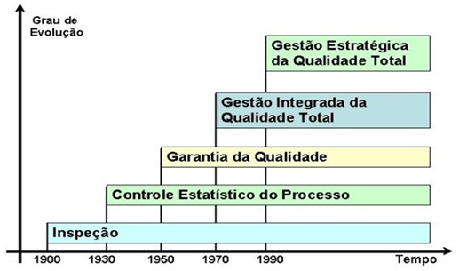

# Modelos de Gestão e Excelência Operacional {#sec-cap2}

::: {.callout-tip title="🎯 Objetivos deste Capítulo"}

* Compreender as três principais abordagens de excelência operacional: TQM, Lean e Seis Sigma.
* Diferenciar os objetivos, ferramentas e métricas de cada filosofia de gestão.
* Entender a aplicação dos modelos de excelência corporativa (MEG e VPS) no contexto mineral.
* Reconhecer como essas filosofias se integram ao Sistema de Gestão da Qualidade (SGQ).
:::

No @sec-cap1, estabelecemos os fundamentos conceituais e normativos da qualidade. Definimos o que é qualidade, compreendemos suas vertentes filosóficas e justificamos sua evolução histórica. Agora, daremos o próximo passo: conhecer os **modelos operacionais** que transformam essa teoria em sistemas de gestão práticos e escaláveis.

Este capítulo apresenta as três grandes filosofias de excelência que dominam o mercado global — **TQM (Gestão da Qualidade Total)**, **Lean Manufacturing (Manufatura Enxuta)** e **Seis Sigma** — e demonstra como elas foram adaptadas e integradas por grandes corporações através de sistemas proprietários.

## As Abordagens de Excelência Operacional {#sec-abordagens-excelencia}

### TQM (Total Quality Management) - Gestão da Qualidade Total {#sec-tqm}

A Gestão da Qualidade Total (TQM) é o estágio de maturidade onde as quatro vertentes que discutimos anteriormente (Padrão, Uso, Custo e Necessidade Latente) deixam de ser ilhas departamentais isoladas e passam a funcionar como um **sistema único e estratégico**.

Desenvolvida no Japão pós-guerra e consolidada por Deming, Juran e Ishikawa, o TQM coloca a qualidade como responsabilidade de todos os membros da organização, não apenas do departamento de inspeção. É o "guarda-chuva" que garante que o produto seja conforme o projeto, adequado ao uso do cliente, produzido com baixo custo interno e com o mínimo de perdas para a sociedade.

::: {.example #exm-tqm-fastfood name="A Integração das Vertentes: Rede de Fast-Food Global"}

Para conectar os conceitos do Capítulo 1 ao TQM, observe a operação de uma rede de *Fast-Food*:

* **Foco no Cliente (Market-in):** No TQM, a qualidade não nasce na cozinha, mas no mercado. A rede percebe que o cliente deseja opções saudáveis (Necessidade Latente). Ela desenha o cardápio com base no que o cliente valoriza, conectando a *Adequação ao Uso* à estratégia do negócio.
* **Melhoria Contínua (Conformidade):** A conformidade técnica (ex: fritar a batata a exatos 175°C por 3 minutos) não é um fim, mas o ponto de partida. Se o processo gera 1% de erro, o TQM busca reduzir para 0,1%, unindo a *Conformidade com o Projeto* à eficiência.
* **Cadeia Cliente-Fornecedor Interno (Envolvimento):** O conceito de que "toda pessoa tem um cliente" é vital. O almoxarifado (fornecedor interno) deve entregar o óleo no prazo para o cozinheiro (cliente interno). Se essa cadeia falha, a *Qualidade Intrínseca* do lanche é comprometida.
* **Responsabilidade Social (Perdas à Sociedade):** O TQM integra ética e sustentabilidade. A empresa substitui plásticos por papel. Ela entende que a não-qualidade (poluição) é um custo pago pela sociedade que destrói o valor da marca.
:::

#### A Evolução de Paradigma

Para consolidar o aprendizado estrutural, a tabela abaixo apresenta a evolução do pensamento focado no produto (Era da Inspeção) para o pensamento sistêmico do TQM:

| Característica | Era da Inspeção | Gestão da Qualidade Total (TQM) |
| :--- | :--- | :--- |
| **Foco Principal** | O Produto (encontrar o defeito) | O Processo e o Cliente (prevenir o defeito) |
| **Responsabilidade**| Departamento de Inspeção (Isolado) | Todos (do CEO à base Operacional) |
| **Orientação** | *Product-out* (empurrar para o mercado) | *Market-in* (ouvir a voz do cliente) |
| **Ação** | Corretiva (reparo ou descarte) | Preventiva e Proativa (melhoria contínua) |
| **Visão do Erro** | Falha humana ou "azar" | Falha do Sistema ou do Processo |
| **Relação Interna** | Departamentos isolados (Silos) | Cadeia Cliente-Fornecedor Interno |

: Evolução de Paradigma: Da Era da Inspeção ao TQM {#tbl-evolucao-paradigma}

::: {.example #exm-tqm-hospital name="TQM em Ambientes Críticos: Hospital de Alta Complexidade"}

Em cenários de alto risco, o TQM garante que a vida do usuário seja o centro do sistema:

* **Adequação ao Uso:** O hospital percebe que pacientes idosos têm dificuldade com totens digitais e instala um sistema híbrido com atendentes humanos, medindo a qualidade pela facilidade de acesso.
* **Conformidade com o Projeto:** Cada cirurgia segue um *Checklist*. A conformidade técnica exige que a pressão e a oxigenação sigam os parâmetros exatos do projeto médico. Um medicamento atrasado é uma não-conformidade grave.
* **Cadeia Cliente-Fornecedor:** A Lavanderia é a fornecedora interna do Centro Cirúrgico. Se os lençóis não chegam esterilizados no prazo, a cirurgia atrasa, impactando diretamente o paciente.
* **Perdas à Sociedade:** O hospital investe em tratamento de resíduos infectantes. O lixo hospitalar mal gerido cria um passivo ambiental e de saúde pública.
* **Melhoria Contínua (Kaizen):** Se o índice de infecção hospitalar subir 0,1%, a equipe redesenha o processo de higienização das mãos, buscando o "Zero Falhas".
:::

#### Princípios Fundamentais do TQM

1. **Foco no Cliente:** A qualidade é definida pelas necessidades e expectativas do cliente.
2. **Melhoria Contínua (Kaizen):** A busca permanente por pequenas melhorias incrementais.
3. **Envolvimento de Todos:** Do CEO ao operador, todos são responsáveis pela qualidade.
4. **Decisão Baseada em Fatos:** Uso intensivo de dados e estatísticas.
5. **Gestão de Processos:** Foco na prevenção de defeitos, não apenas na inspeção.

#### Ferramentas Características do TQM

* **Círculos de Controle da Qualidade (CCQ):** Grupos de trabalho autônomos focados em resolver problemas locais.
* **As 7 Ferramentas da Qualidade:** Diagrama de Pareto, Ishikawa, Histograma, Cartas de Controle, Diagrama de Dispersão, Fluxograma e Estratificação.
* **Ciclo PDCA:** *Plan-Do-Check-Act* como motor da melhoria contínua.

::: {.callout-note title="💡 APLICAÇÃO NA MINERAÇÃO"}

Na mineração, o TQM se manifesta através da integração rigorosa entre Operação, Manutenção e Engenharia. A qualidade do minério não é responsabilidade apenas do laboratório, mas de toda a cadeia: desde o plano de lavra (que define a frente de extração) até o controle de blendagem na usina de beneficiamento.
:::

#### Os 9 Fatores Críticos de Sucesso do TQM {#sec-tqm-9pilares}

```{mermaid}
%%| label: fig-fatores-tqm
%%| fig-cap: "Os Fatores Estruturais da Gestão da Qualidade Total (TQM)"

flowchart TD
    %% --- CONFIGURAÇÃO DE ESTILOS ---
    classDef mainStyle fill:#2c3e50,stroke:#2c3e50,stroke-width:2px,color:#ffffff,font-size:18px,font-weight:bold
    classDef catStyle fill:#34495e,stroke:#2c3e50,stroke-width:2px,color:#ffffff,font-size:16px,font-weight:bold
    classDef itemStyle fill:#f8f9fa,stroke:#bdc3c7,stroke-width:2px,color:#2c3e50,font-size:15px,font-weight:bold

    %% --- NÓ CENTRAL ---
    TQM{{"Gestão da<br/>Qualidade Total (TQM)"}}

    %% --- CATEGORIAS (PILARES) ---
    L("Liderança e Estratégia")
    P("Pessoas e Cultura")
    O("Processos e Operação")

    TQM ==> L
    TQM ==> P
    TQM ==> O

    %% --- FATORES DA LIDERANÇA ---
    L --> F1["1 - Comprometimento da Alta Administração"]
    F1 --> F2["2 - Foco no Consumidor"]
    F2 --> F8["8 - Benchmarking"]

    %% --- FATORES DE PESSOAS ---
    P --> F4["4 - Envolvimento dos Funcionários"]
    F4 --> F5["5 - Treinamento"]
    F5 --> F9["9 - Empowerment"]

    %% --- FATORES DE PROCESSOS ---
    O --> F3["3 - Parceria com o Fornecedor"]
    F3 --> F6["6 - Mensuração da Qualidade"]
    F6 --> F7["7 - Melhoria Contínua"]

    %% --- APLICAÇÃO DOS ESTILOS ---
    class TQM mainStyle;
    class L,P,O catStyle;
    class F1,F2,F3,F4,F5,F6,F7,F8,F9 itemStyle;
```

Para que o TQM seja efetivamente implantado e mensurado, a literatura consolida **9 Fatores Críticos de Sucesso (FCS)**. Estes pilares permitem auditar o grau de maturidade organizacional e identificar as práticas gerenciais que precisam ser fortalecidas:

##### Fator 1 - Comprometimento da Alta Administração

A qualidade deve começar no topo da hierarquia. A liderança não deve apenas apoiar, mas patrocinar ativamente o sistema.

  - **1.1.** Avaliação periódica da qualidade executada pela alta gestão.

  - **1.2.** Discussão constante da importância da qualidade nos fóruns executivos.

  - **1.3.** Alocação de verbas e recursos específicos para a qualidade definidos em orçamento.

  - **1.4.** Definição, identificação e documentação clara das metas.

  - **1.5.** Inserção das metas da qualidade diretamente no planejamento estratégico da empresa.

  - **1.6.** Comunicação ativa e visível do compromisso da direção para com toda a empresa.

##### Fator 2 - Foco no Consumidor

O mercado dita o que é valor. O TQM exige ouvir e reagir às necessidades do cliente.

  - **2.1.** Comparação da satisfação do cliente com indicadores internos e de concorrentes.

  - **2.2.** Fornecimento e transparência das reclamações dos consumidores a todos os departamentos (não apenas ao SAC).

  - **2.3.** Utilização das reclamações como base estrutural para a melhoria de processos.

  - **2.4.** Manutenção de um serviço ágil e resolutivo de atendimento ao consumidor.

  - **2.5.** Realização periódica de pesquisas de satisfação e expectativas.

##### Fator 3 - Parceria com o Fornecedor

A qualidade do produto final depende intrinsecamente da qualidade dos insumos recebidos.

  - **3.1.** Utilização da qualidade (e não apenas do preço) como critério de peso para a seleção de fornecedores.

  - **3.2.** Estabelecimento de contratos de longo prazo, gerando estabilidade.

  - **3.3.** Fornecimento de assistência técnica da contratante para desenvolver o fornecedor.

  - **3.4.** Participação do fornecedor desde o processo de desenvolvimento e projeto do produto.

##### Fator 4 -Envolvimento dos Funcionários**

A qualidade é construída pelas pessoas que operam o processo diariamente.

  - **4.1.** Realização periódica de reuniões em cada área específica para discussão sobre qualidade.

  - **4.2.** Criação de equipes interfuncionais (multidisciplinares) para tratar de problemas sistêmicos.

  - **4.3.** Avaliação rigorosa de todas as sugestões emitidas pelos funcionários.

  - **4.4.** Implantação efetiva das sugestões aprovadas.

  - **4.5.** Concessão de prêmios e recompensas não financeiras pelo engajamento e boas ideias.

##### Fator 5 -Treinamento**

A capacitação é o motor da estabilidade do processo.

  - **5.1.** Alocação de recursos financeiros e de tempo necessários para o treinamento.

  - **5.2.** Envolvimento de todos os escalões da empresa (da diretoria ao chão de fábrica) nos treinamentos de qualidade.

  - **5.3.** Capacitação de uma grande base de funcionários em técnicas metódicas de solução de problemas.

  - **5.4.** Treinamento técnico em ferramentas e controle estatístico.

##### Fator 6 - Mensuração da Qualidade**

O que não se mede, não se gerencia. A coleta de dados deve ser confiável e contínua.

  - **6.1.** Execução de inspeções por amostragem durante o processo de produção (preventivo).

  - **6.2.** Avaliação da qualidade em múltiplas etapas, não se limitando apenas à inspeção final do produto pronto.

  - **6.3.** Medição periódica dos índices de desperdícios, retrabalho e falhas de produtos não-conformes.

  - **6.4.** Manutenção rigorosa de registros e históricos das avaliações.

  - **6.5.** Transparência no fornecimento dos resultados das avaliações a todos os funcionários.

  - **6.6.** Utilização real dos resultados como suporte primário para a melhoria.

##### Fator 7 - Melhoria Contínua**

A busca incessante por estabelecer novos e melhores padrões de desempenho.

  - **7.1.** Manutenção de uma estrutura organizacional específica dedicada a apoiar a qualidade.

  - **7.2.** Existência de programas formais para a redução de tempo e custo nos processos internos.

  - **7.3.** Execução de avaliações profundas nos processos-chave (gargalos) de produção.

  - **7.4.** Programas formais para a redução do Lead Time (tempo de entrega do produto ao cliente).

  - **7.5.** Programas formais para a redução do tempo de ciclo de fabricação.

##### Fator 8 - Benchmarking**

Olhar para o mercado e aprender com os melhores, independentemente do setor.

  - **8.1.** Realização de visitas técnicas a outras organizações reconhecidamente líderes.

  - **8.2.** Procedimento efetivo de benchmarking para monitorar os competidores diretos mais fortes.

  - **8.3.** Procedimento de benchmarking com empresas líderes de outros setores (não competidores) para importar inovações.

  - **8.4.** Manutenção do benchmarking não como uma ação isolada, mas como uma política contínua da empresa.

##### Fator 9 - Empowerment (Delegação de Poderes)**

Dar autonomia à operação para agir rapidamente sobre os desvios.

  - **9.1.** Delegação de autoridade aos funcionários da linha de frente para a solução imediata de problemas operacionais.

  - **9.2.** Fornecimento de apoio gerencial e técnico para que os funcionários tomem essas decisões.

  - **9.3.** Transferência da execução da inspeção da qualidade para os próprios operadores (autocontrole), reduzindo a dependência de inspetores externos.

  - **9.4.** Divulgação e celebração interna das experiências de sucesso na solução de problemas.

::: {.example #exm-tqm-implementos name="Os 9 Fatores na Prática: Fabricação de Implementos Agrícolas"}

Para exemplificar os Fatores Críticos de Sucesso operando em conjunto, vamos utilizar o caso de uma Indústria de Fabricação de Implementos Agrícolas (Arados e Semeadoras), onde a durabilidade no campo é o diferencial competitivo:

1. **Comprometimento da Alta Administração:** A diretoria não apenas cobra metas, mas participa mensalmente do "Comitê de Qualidade". Eles aprovaram uma verba específica para a compra de um robô de solda de alta precisão, demonstrando que a qualidade é uma prioridade orçamentária e estratégica, não apenas um discurso.
2. **Foco no Consumidor:** A empresa envia engenheiros para as fazendas para ouvir os produtores rurais. Ao descobrir que os parafusos de fixação sofriam corrosão precoce em solos ácidos, a fábrica mudou o material. As reclamações do SAC são expostas em telas na lanchonete da fábrica para que todos saibam onde o cliente está sofrendo.
3. **Parceria com o Fornecedor:** Em vez de comprar o aço mais barato, a fábrica mantém o mesmo fornecedor há 10 anos. Quando o fornecedor teve problemas na laminação, a equipe de metalurgia da fábrica foi até a usina dele para ajudar a ajustar o processo. O fornecedor participa do desenho dos novos modelos de semeadoras desde o início.
4. **Envolvimento dos Funcionários:** A empresa possui Círculos de Controle da Qualidade (CCQ). Um grupo de montadores sugeriu uma mudança no suporte de ferramentas que reduziu o risco de arranhões na pintura. A sugestão foi implementada e os funcionários receberam um jantar comemorativo e uma placa de "Inovadores do Mês".
5. **Treinamento:** Todo novo funcionário passa por 40 horas de treinamento antes de tocar em uma máquina. O treinamento inclui desde a operação técnica até o uso de Diagramas de Ishikawa para que saibam investigar a causa raiz de qualquer peça que saia fora da medida.
6. **Mensuração da Qualidade:** A fábrica não aceita o "eu acho que a pintura está boa". O engenheiro utiliza um medidor de espessura de camada digital em amostras de cada lote. Os dados são plotados em Cartas de Controle; se a espessura da tinta cai 2 mícrons, o sistema emite um alerta antes mesmo de a peça apresentar falha visual.
7. **Melhoria Contínua (Kaizen):** A empresa adota a filosofia de que "hoje deve ser melhor que ontem". Após cada safra, a equipe de engenharia se reúne com os mecânicos de campo para um Ciclo PDCA. Eles analisam pequenos desgastes e decidem mudar o torque de aperto em 5%.
8. **Gestão de Processos (Prevenção):** Em vez de apenas olhar o arado pronto no final da linha, a fábrica foca nas condições controladas de cada etapa. A máquina de corte a laser possui sensores que travam a operação se o bico estiver sujo. A qualidade é garantida pela estabilidade do processo.
9.  **Cultura da Qualidade:** A qualidade deixou de ser uma regra e virou um valor pessoal. Se um faxineiro percebe uma poça de óleo perto de uma sementeira pronta, ele avisa imediatamente a manutenção, pois entende que aquele óleo pode contaminar o solo do cliente ou indicar falha mecânica. Há orgulho em entregar o melhor.
:::

::: {.callout-tip title="💡 Dica Pedagógica: O TQM como Cadeia de Valor"}

Para visualizar a dependência sistêmica, imagine o TQM como um prédio sustentado por colunas, onde todos os fatores precisam estar "vivos" simultaneamente:

* A **Liderança** dá o orçamento e a meta;

* O **Consumidor** dita o que quer e o **Fornecedor** entrega o insumo;

* Os **Funcionários** recebem **Treinamento**;

* Eles operam o **Processo**, fazendo a **Mensuração** constante;

* Isso gera **Melhoria Contínua** e solidifica a **Cultura**.

Se a Alta Administração não dá dinheiro para o Treinamento, o Funcionário não tem competência para ouvir o Consumidor, e o produto falhará porque o Fornecedor entregou um material ruim. Onde uma coluna racha, o prédio inteiro desaba.
:::

::: {.callout-note title="💡 Evolução Histórica: TQC, CWQC e TQM"}

**A Evolução Histórica: TQC, CWQC e TQM**

A origem da Qualidade Total remonta à década de 1950 e desdobrou-se na seguinte evolução:

* **TQC (Total Quality Control) Norte-Americano:** Proposto por Feigenbaum, focava no controle conduzido por especialistas do departamento de qualidade.
* **CWQC (Company-wide Quality Control) Japonês:** Introduzido nos anos 1960, exige o engajamento de *todos* os departamentos. No Japão, a palavra "controle" é entendida como "gerenciamento" (manutenção da rotina e inovações). O estilo japonês consolidou-se em seis frentes:

  1) Participação total;

  2) Entusiasmo por educação/treinamento;

  3) Atividades de CCQ;

  4) Auditorias da presidência e Prêmio Deming;

  5) Uso intensivo de métodos estatísticos;

  6) Campanhas nacionais de promoção da qualidade.
* **TQM (Total Quality Management) Ocidental:** Nas décadas de 1980 e 1990, o modelo japonês foi customizado. Como a palavra "controle" na cultura ocidental carregava uma conotação negativa de "policiamento", ela foi substituída por "Management" (Gestão). O TQM ocidental enfatizou o planejamento de longo prazo, o redesenho de processos, o benchmarking competitivo e o trabalho em equipe.
:::

### Lean Manufacturing (Manufatura Enxuta) {#sec-lean}

Para conectar a filosofia *Lean Manufacturing* à realidade da Engenharia de Produção, vamos utilizar o exemplo de uma Planta de Beneficiamento de Minério de Ferro. O objetivo aqui é demonstrar que o *Lean* não é apenas uma ferramenta de "limpeza" ou organização superficial, mas uma estratégia profunda de combate ao desperdício para aumentar a lucratividade e a eficiência sistêmica.

#### Os 8 Desperdícios (Mudas) na Prática Mineral


A eliminação de desperdícios exige reconhecê-los no dia a dia. Imagine o fluxo do minério da mina até o porto:

- **Disperdício 1 - Superprodução:** Extrair 10.000 toneladas de ROM (*Run of Mine*) quando o pátio da usina só suporta 5.000. Isso gera um gasto imediato e desnecessário com diesel e operação de maquinário.
- **Disperdício 2 - Espera:** Uma escavadeira gigantesca parada porque a frota de caminhões demorou a chegar, evidenciando falta de sincronismo logístico.
- **Disperdício 3 - Transporte:** Mover o estéril (material sem valor comercial) três vezes de lugar antes de levá-lo à pilha definitiva. A movimentação extra de material não agrega valor ao produto final, apenas eleva o custo.
- **Disperdício 4 - Superprocessamento:** Moer o minério em uma granulometria além da malha exigida pelo cliente. Gastou-se energia elétrica, insumos e tempo de moinho à toa (um caso claro de *Superqualidade*).
- **Disperdício 5 - Estoque:** Milhões de reais em capital imobilizado na forma de peças de reposição que nunca foram usadas, apenas oxidando nas prateleiras do almoxarifado.
- **Disperdício 6 - Movimentação:** O mecânico precisar andar 1 km até a oficina toda vez que esquece uma ferramenta específica (foco no movimento inútil do trabalhador).
- **Disperdício 7 - Defeitos:** Um lote de minério produzido com teor de sílica acima do permitido. Terá que ser misturado (*blendado*) com material rico ou reprocessado na usina, gerando severo retrabalho.
- **Disperdício 8 - Talento (O Desperdício Intelectual):** O operador da britagem tem uma ideia brilhante para reduzir o desgaste estrutural de uma correia transportadora, mas a gerência tem uma estrutura tão verticalizada que nunca o ouve.

#### A "Casa da Toyota" na Mineração: Pilares Práticos


O modelo *Lean* é frequentemente representado como uma casa, onde o telhado (alta qualidade, baixo custo e curto *Lead Time*) é sustentado por dois pilares fundamentais. Vejamos como eles operam em uma indústria pesada:

##### Pilar 1: *Just-in-Time* (Fluxo Puxado)

Em vez de a mina "empurrar" minério para a usina em velocidade máxima e sem critério de demanda, a Usina (Cliente Interno) utiliza um sistema puxado (*Kanban*). Quando o silo de alimentação baixa de um nível crítico, um sinal visual ou digital é enviado para o despacho da mina liberar a viagem de mais três caminhões.
  *Resultado:* Pátios organizados, fluxo contínuo e prevenção contra estrangulamento do sistema.

##### Pilar 2: *Jidoka* (Qualidade na Fonte / Autonomação)
Um sensor magnético ou de vibração no britador primário detecta um pedaço de "ferro intruso" (como um dente de escavadeira que quebrou e caiu no minério). O sistema para a correia automaticamente (*Andon*).
  *Ação:* A equipe vai imediatamente ao local exato do problema (*Gemba*) para retirar a sucata e investigar a causa raiz da quebra do dente na mina. Isso evita que o ferro destrua o britador, o que custaria milhões em manutenção e meses de paralisação da usina.

#### Ferramentas Estratégicas: 5S e TPM

Para que os pilares funcionem, o alicerce operacional da casa deve ser sólido, utilizando ferramentas de estabilização do processo:

* **5S na Oficina de Máquinas Pesadas:** As ferramentas são organizadas por frequência de uso e o piso é demarcado. O mecânico não perde tempo procurando o equipamento correto e, por manter o chão rigorosamente limpo, detecta o mínimo vazamento de óleo de um caminhão recém-estacionado de forma imediata.
* **TPM (Manutenção Produtiva Total):** A responsabilidade pela máquina é descentralizada. O próprio operador do caminhão fora-de-estrada realiza inspeções autônomas diárias (nível de óleo, drenagem de filtros d'água, avaliação visual de pneus) antes de iniciar o turno. Ele desenvolve o sentimento de "dono do equipamento", liberando a equipe especializada de manutenção para focar exclusivamente em grandes reformas estruturais.

::: {.callout-warning title="⚠️ Insight Operacional: A Armadilha Lean"}

A implementação do *Lean* em cadeias de capital intensivo (como a mineração) exige **resiliência**. Se a gerência decidir reduzir o estoque de pneus de grande porte a zero apenas com a intenção teórica de "eliminar desperdícios", e o fornecedor atrasar a entrega por um entrave logístico, a frota para completamente. O prejuízo financeiro da mina paralisada será 100 vezes maior que a economia contábil gerada pela redução do estoque.

O *Lean* industrial prega que o sistema deve ser **Enxuto, mas nunca Raquítico**. O estoque de segurança deve ser calculado estatisticamente para absorver as variabilidades normais do processo.
:::

#### Os 14 Princípios do Sistema Toyota de Produção {#sec-lean-14principios}

```{mermaid}
%%| label: fig-casa-tps
%%| fig-cap: "A Casa do Sistema Toyota de Produção (TPS)"

flowchart TD
    %% --- CONFIGURAÇÃO DE ESTILOS (Garantindo letras grandes e cores sólidas) ---
    classDef teto fill:#c0392b,stroke:#922b21,stroke-width:3px,color:#ffffff,font-size:16px,font-weight:bold
    classDef pilar fill:#2980b9,stroke:#1f618d,stroke-width:3px,color:#ffffff,font-size:15px,font-weight:bold
    classDef centro fill:#f39c12,stroke:#d68910,stroke-width:3px,color:#ffffff,font-size:15px,font-weight:bold
    classDef base fill:#7f8c8d,stroke:#2c3e50,stroke-width:3px,color:#ffffff,font-size:16px,font-weight:bold

    %% --- ESTRUTURA DA CASA (Formas Especiais) ---

    %% TETO: Usando Trapézio [/ \]
    T[/"🏠 TETO: Qualidade Máxima, Menor Custo e Menor Lead Time"\]

    %% PILARES E CENTRO: Retângulos e Bordas Arredondadas (usando <br> no lugar de \n)
    P1["⚙️ PILAR 1: Just-in-Time<br>Fluxo Contínuo, Puxado, Heijunka"]
    C("👥 CENTRO<br>Pessoas, Parceiros e<br>Melhoria Contínua (Kaizen)")
    P2["🛑 PILAR 2: Jidoka<br>Parar e Resolver, Poka-Yoke"]

    %% BASE: Usando Trapézio Invertido [\ /]
    B[\"🧱 BASE: Filosofia de Longo Prazo e Processos Padronizados"/]

    %% --- CONEXÕES (As Vigas da Casa) ---
    T --- P1
    T --- C
    T --- P2

    P1 --- B
    C --- B
    P2 --- B

    %% Engrossando as linhas para parecerem estrutura física
    linkStyle default stroke:#34495e,stroke-width:4px

    %% --- APLICAÇÃO DOS ESTILOS ---
    class T teto;
    class P1,P2 pilar;
    class C centro;
    class B base;
```

O Modelo Toyota estrutura a filosofia Lean em 14 princípios organizados em 4 blocos conceituais:

##### Bloco 1: Filosofia de Longo Prazo

- **Princípio 1 - Basear as decisões em filosofia de longo prazo:** Mesmo em detrimento de metas financeiras de curto prazo, a estratégia deve ser sustentável e duradoura.

##### Bloco 2: Processo Correto Produz Resultados Corretos

- **Princípio 2 - Criar fluxo contínuo para trazer problemas à tona:** Eliminar paradas e fazer o material fluir ininterruptamente.
- **Princípio 3 - Usar sistemas puxados para evitar superprodução:** Produzir apenas o que o cliente demanda (Just-in-Time).
- **Princípio 4 - Nivelar a carga de trabalho (Heijunka):** Evitar sobrecarga (muri) e variabilidade (mura).
- **Princípio 5 - Construir uma cultura de parar e resolver problemas:** Qualidade no primeiro momento (Jidoka - automação com toque humano).
- **Princípio 6 - Padronizar tarefas para melhoria contínua:** Tarefas estáveis são a base para o Kaizen.
- **Princípio 7 - Usar controle visual:** Nenhum problema deve ficar oculto (Andon, 5S, gestão à vista).
- **Princípio 8 - Usar somente tecnologia confiável:** Tecnologia deve servir às pessoas e processos, não o contrário.

##### Bloco 3: Agregar Valor Desenvolvendo Pessoas e Parceiros

- **Princípio 9 - Desenvolver líderes que vivenciem a filosofia:** Líderes devem ensinar pelo exemplo.
- **Princípio 10 - Desenvolver pessoas e equipes excepcionais:** Valorizar grupos pequenos que seguem a filosofia da empresa.
- **Princípio 11 - Respeitar parceiros e fornecedores:** Desafiá-los e ajudá-los a melhorar.

##### Bloco 4: Resolver Problemas na Raiz Gera Aprendizado*

- **Princípio 12 - Ver por si mesmo para compreender a situação (Genchi Genbutsu):** Ir ao local real (Gemba) para entender os fatos.
- **Princípio 13 - Tomar decisões lentamente por consenso, implementar rapidamente:** Considerar todas as opções (Nemawashi), mas agir com velocidade na execução.
- **Princípio 14 - Tornar-se uma organização que aprende através da reflexão (Hansei) e melhoria contínua (Kaizen):** Aprender com erros e standardizar as lições.

::: {.callout-note title="⚙️ Aplicação do Jidoka na Mineração"}

**Aplicação do Jidoka na Mineração**

Na linha de britagem, sensores detectam automaticamente sobrecarga no alimentador. O sistema para a correia (autonomação), evitando danos mecânicos e forçando a equipe a investigar a causa raiz: problema de granulometria na alimentação ou falha no britador primário?
:::

### Seis Sigma - Excelência Estatística {#sec-seis-sigma}

Desenvolvido pela Motorola na década de 1980 e popularizado mundialmente pela General Electric (GE) sob a liderança de Jack Welch, o Seis Sigma é uma metodologia rigorosa de melhoria de processos focada na **redução drástica da variabilidade** e na busca por processos com no máximo 3,4 defeitos por milhão de oportunidades (DPMO).

Na estatística, a letra grega Sigma ($\sigma$) representa o **Desvio Padrão**, que é a medida de quanta variação existe em um conjunto de dados em relação à média. A meta suprema da metodologia é "espremer" a curva de distribuição do processo de forma que caibam exatos seis desvios padrões entre a média de produção e o limite de especificação mais próximo exigido pelo cliente.

Na prática industrial, considerando que todo processo sofre um desgaste e um deslocamento natural de sua média ao longo do tempo (assumido estatisticamente como um desvio de 1,5 $\sigma$), um processo que atinge o nível Seis Sigma produzirá a impressionante marca de **3,4 defeitos a cada 1 milhão de oportunidades**. Para efeitos de comparação, um processo operando a 3 Sigma (padrão histórico de muitas indústrias) gera cerca de 66.800 defeitos por milhão (93,3% de perfeição, o que é inaceitável em setores críticos como aviação ou saúde).

Diferente de iniciativas subjetivas de qualidade — onde os problemas são escolhidos por afinidade ou "voto" —, o Seis Sigma opera estritamente como uma **Gestão de Portfólio de Investimentos**. A organização administra uma lista de projetos ativos, selecionando e priorizando aqueles mais alinhados com a estratégia financeira (Projetos Prioritários, Estratégicos e Lucrativos). Nenhum projeto Seis Sigma avança sem que a controladoria financeira (Finanças) assine o cálculo de retorno esperado (ROI).

#### Critérios para Seleção de Projetos Seis Sigma

A seleção de um projeto Seis Sigma não nasce de intuições, mas exige responder a perguntas vitais baseadas em dados:

* **Quais são as Características Críticas para a Qualidade Interna ($CTQ_{in}$) e Externa ($CTQ_{ex}$)?** O projeto deve obrigatoriamente traduzir a "Voz do Cliente" (VOC - *Voice of the Customer*), que costuma ser subjetiva, em requisitos técnicos estritos e mensuráveis (CTQs).
* **Existe uma lacuna de desempenho (gap) significativa em relação aos concorrentes que justifique o projeto?**
* **O projeto impacta diretamente a lucratividade ou metas estratégicas da empresa?** Se a resposta for não, o problema pode ser resolvido com ferramentas básicas (como PDCA simples ou *Kaizen*), não justificando o arsenal estatístico do Seis Sigma.

#### A Estrutura Organizacional (Belt System)

Para conduzir esses projetos complexos sem perder o foco corporativo, o Seis Sigma exige a criação de uma infraestrutura humana dedicada, inspirada no sistema de faixas das artes marciais. Essa hierarquia reflete o nível de domínio estatístico e a dedicação de tempo ao método:

```{mermaid}
%%| label: fig-piramide-belts
%%| fig-cap: "Estrutura de Níveis de Certificação Six Sigma"

flowchart BT
    %% --- CONFIGURAÇÃO DE ESTILOS (Cores reais e letras grandes) ---
    classDef white fill:#ffffff,stroke:#bdc3c7,stroke-width:3px,color:#2c3e50,font-size:15px,font-weight:bold
    classDef yellow fill:#f1c40f,stroke:#d4ac0d,stroke-width:3px,color:#2c3e50,font-size:15px,font-weight:bold
    classDef green fill:#27ae60,stroke:#1e8449,stroke-width:3px,color:#ffffff,font-size:15px,font-weight:bold
    classDef black fill:#212f3d,stroke:#17202a,stroke-width:3px,color:#ffffff,font-size:15px,font-weight:bold
    classDef master fill:#8e44ad,stroke:#6c3483,stroke-width:3px,color:#ffffff,font-size:15px,font-weight:bold
    classDef champion fill:#2980b9,stroke:#1f618d,stroke-width:3px,color:#ffffff,font-size:16px,font-weight:bold

    W["&nbsp;&nbsp;&nbsp;⬜ WHITE BELT<br>Executores da Base Operacional&nbsp;&nbsp;&nbsp;"]
    Y["&nbsp;&nbsp;&nbsp;🟨 YELLOW BELT<br>Participantes Ativos de Projetos&nbsp;&nbsp;&nbsp;"]
    G["&nbsp;&nbsp;&nbsp;🟩 GREEN BELT<br>Líderes Parciais (Conciliam com rotina)&nbsp;&nbsp;&nbsp;"]
    B["&nbsp;&nbsp;&nbsp;⬛ BLACK BELT<br>Especialistas Dedicados (Full-time)&nbsp;&nbsp;&nbsp;"]
    M["&nbsp;&nbsp;&nbsp;🟪 MASTER BLACK BELT<br>Mentores e Gestores do Programa&nbsp;&nbsp;&nbsp;"]
    C("👑 CHAMPION / SPONSOR<br>Alta Liderança e Direcionamento Estratégico")

    W ==> Y
    Y ==> G
    G ==> B
    B ==> M
    M ==> C

    linkStyle default stroke:#7f8c8d,stroke-width:4px

    class W white;
    class Y yellow;
    class G green;
    class B black;
    class M master;
    class C champion;
```

* **Executivo Líder (Sponsor):** O CEO ou diretor geral. Conduz, incentiva e supervisiona as iniciativas, selecionando os "Campeões" e garantindo que o programa não perca força política.
* **Campeão (Champion):** Lidera os executivos-chave em direção aos objetivos do projeto, remove barreiras departamentais, aprova orçamentos e acompanha a implementação em toda a organização.
* **Master Black Belts (MBB):** Especialistas com treinamento intensivo em estatística avançada. Atuam 100% do tempo como mentores que dão suporte aos Campeões, treinam os demais *belts* e garantem o rigor metodológico.
* **Black Belts (BB):** Profissionais dedicados integralmente (Full-time) a liderar equipes na condução direta dos projetos mais complexos, multifuncionais e de altíssimo impacto financeiro.
* **Green Belts (GB):** Profissionais com dedicação parcial aos projetos (cerca de 20% do tempo). Eles mantêm suas funções originais na fábrica, mas auxiliam na coleta de dados e lideram projetos de melhoria focados em suas próprias áreas de atuação.
* **Yellow Belt:** Participantes ativos de projetos de melhoria, com conhecimento básico da metodologia, que suportam os Green e Black Belts na linha de frente.
* **White Belt:** Profissionais da base operacional com conhecimento introdutório, essenciais para sustentar as melhorias pontuais no dia a dia.

#### DMAIC: O Roteiro Estruturado

Enquanto o SGQ tradicional utiliza o PDCA para melhorias rotineiras, o Seis Sigma utiliza um roteiro de execução de projetos próprio, altamente analítico e baseado em dados: o **DMAIC**.

```{mermaid}
%%| label: fig-ciclo-dmaic
%%| fig-cap: "Ciclo DMAIC: Roteiro Estruturado de Melhoria Contínua"

flowchart LR
    %% --- CONFIGURAÇÃO DE ESTILOS ---
    classDef defStyle fill:#e74c3c,stroke:#c0392b,stroke-width:3px,color:#ffffff,font-size:15px,font-weight:bold
    classDef meaStyle fill:#e67e22,stroke:#d35400,stroke-width:3px,color:#ffffff,font-size:15px,font-weight:bold
    classDef anaStyle fill:#f1c40f,stroke:#f39c12,stroke-width:3px,color:#000000,font-size:15px,font-weight:bold
    classDef impStyle fill:#2ecc71,stroke:#27ae60,stroke-width:3px,color:#000000,font-size:15px,font-weight:bold
    classDef ctrStyle fill:#3498db,stroke:#2980b9,stroke-width:3px,color:#ffffff,font-size:15px,font-weight:bold

    D("&nbsp;&nbsp;&nbsp;🎯 D - DEFINE&nbsp;&nbsp;&nbsp;<br>Definir o Problema")
    M("&nbsp;&nbsp;&nbsp;📏 M - MEASURE&nbsp;&nbsp;&nbsp;<br>Medir o Processo")
    A("&nbsp;&nbsp;&nbsp;🔍 A - ANALYZE&nbsp;&nbsp;&nbsp;<br>Analisar a Causa")
    I("&nbsp;&nbsp;&nbsp;🚀 I - IMPROVE&nbsp;&nbsp;&nbsp;<br>Melhorar o Fluxo")
    C("&nbsp;&nbsp;&nbsp;🔒 C - CONTROL&nbsp;&nbsp;&nbsp;<br>Controlar e Manter")

    D ==> M ==> A ==> I ==> C

    linkStyle default stroke:#7f8c8d,stroke-width:4px

    class D defStyle;
    class M meaStyle;
    class A anaStyle;
    class I impStyle;
    class C ctrStyle;
```

1. **Define (Definir):** Identificar as prioridades e os requisitos do cliente (CTQs). A equipe elabora o *Project Charter* (Termo de Abertura), mapeia os processos críticos em alto nível utilizando ferramentas como o SIPOC (*Supplier, Input, Process, Output, Customer*) e define formalmente o impacto financeiro esperado (ex: perda de recuperação mássica na flotação).

2. **Measure (Medir):** Desenhar as entradas e saídas (a função fundamental da qualidade onde $Y=f(x)$). Esta fase não busca resolver o problema, mas estabelecer a "linha de base" (*Baseline*). A equipe valida o sistema de medição (Análise do Sistema de Medição - MSA / *Gage R&R*) para garantir que os dados são confiáveis, e calcula a capacidade atual do processo estatisticamente ($C_p, C_{pk}$).

3. **Analyze (Analisar):** O coração analítico do projeto. Utilizam-se pesadas ferramentas estatísticas (Gráficos de Dispersão, Análise de Regressão, Testes de Hipótese, ANOVA) para analisar os dados coletados, comprovando matematicamente quais são as causas vitais (raízes) que de fato geram os defeitos e as variações. Aqui se separa o "achismo" da verdade estatística.

4. **Improve (Melhorar):** Eliminar as causas dos defeitos modificando os elementos geradores dos problemas. A equipe utiliza técnicas avançadas, como o Planejamento de Experimentos (DOE - *Design of Experiments*), para testar combinações de variáveis, encontrar a configuração ótima de operação e quantificar os efeitos obtidos nas CTQs (ex: ajuste ótimo de dosagem de reagentes em uma usina).

5. **Control (Controlar):** A fase de travamento. Definir sistemas de controle contínuos para garantir que o processo não volte ao estado anterior. Implementam-se Cartas de Controle Estatístico de Processo (CEP), Dispositivos à prova de erros (*Poka-Yokes*) e Procedimentos Operacionais Padrão (POPs) para garantir que o novo patamar de excelência seja mantido ao longo do tempo.

::: {.callout-important title="🔬 EXEMPLO MINERAL: Projeto Seis Sigma"}

**Problema (Define):** Taxa de disponibilidade física da frota de caminhões fora de estrada estagnada em 82%, impactando diretamente a meta de movimentação de estéril e minério.

**Meta Seis Sigma:** Reduzir o tempo médio entre falhas (MTBF) em 30% e o tempo médio de reparo (MTTR) em 20%, elevando a disponibilidade para um *target* estatisticamente comprovado de 90%.

**Ferramentas Aplicadas (Analyze/Improve):** Análise de distribuição de *Weibull* para identificar a curva de vida dos componentes críticos, FMEA de manutenção para priorizar os modos de falha ocultos, e DOE (Planejamento de Experimentos) para otimizar os intervalos exatos de lubrificação e troca de filtros preventiva.
:::

### Comparativo: TQM vs. Lean vs. Seis Sigma

Para o engenheiro de operações, é fundamental não confundir as metodologias de mercado. Embora todas busquem a excelência, elas atacam problemas de naturezas diferentes:

| Aspecto | TQM (Gestão da Qualidade Total) | Lean Manufacturing | Seis Sigma |
|:--------|:----|:-----|:-----------|
| **Foco Principal** | Satisfação do cliente e engajamento cultural. | Eliminação sistêmica de desperdícios (Mudas). | Redução agressiva de variabilidade. |
| **Métrica Chave** | Conformidade com requisitos gerais. | *Lead Time* / *Throughput* (Velocidade do fluxo). | Defeitos por milhão (DPMO) / Nível Sigma. |
| **Estrutura** | Filosófica e cultural em todos os níveis. | Sistema de fluxo contínuo e puxado. | Metodologia matemática guiada por projetos (DMAIC). |
| **Origem** | Japão (Impulsionada por Deming, Juran, Ishikawa). | Toyota (TPS - Sistema Toyota de Produção). | Motorola / GE (Liderança corporativa americana). |
| **Complexidade** | Média (Uso das 7 Ferramentas Básicas). | Média (Foco visual: Kanban, 5S, VSM). | Alta (Intensiva em software estatístico e testes). |

: Comparação entre as principais filosofias de excelência operacional {#tbl-comparacao-filosofias}

#### A Estrutura Organizacional (Belt System)

Para conduzir esses projetos sem perder o foco corporativo, o Seis Sigma cria uma estrutura hierárquica paralela baseada em capacitação técnica:

* **Executivo Líder:** Conduz, incentiva e supervisiona as iniciativas, selecionando os "Campeões".
* **Campeão (Champion):** Lidera os executivos-chave em direção aos objetivos do projeto e acompanha a implementação em toda a organização.
* **Master Black Belts:** Especialistas com treinamento intensivo em estatística que dão suporte aos Campeões e são fundamentais no processo de mudança.
* **Black Belts:** Profissionais dedicados integralmente a liderar equipes na condução direta dos projetos e solução de problemas.
* **Green Belts:** Profissionais com dedicação parcial aos projetos, que auxiliam na coleta de dados e lideram pequenas melhorias em suas respectivas áreas de atuação.
* **Yellow Belt:** Participantes ativos de projetos de melhoria, com conhecimento básico da metodologia.
* **White Belt:** Conhecimento básico, executores de melhorias pontuais.

#### DMAIC: O Roteiro Estruturado

```{mermaid}
%%| label: fig-ciclo-dmaic
%%| fig-cap: "Ciclo DMAIC: Roteiro Estruturado de Melhoria Contínua"

flowchart LR
    %% --- CONFIGURAÇÃO DE ESTILOS (Letras grandes e contraste ajustado) ---
    classDef defStyle fill:#e74c3c,stroke:#c0392b,stroke-width:3px,color:#ffffff,font-size:15px,font-weight:bold
    classDef meaStyle fill:#e67e22,stroke:#d35400,stroke-width:3px,color:#ffffff,font-size:15px,font-weight:bold
    classDef anaStyle fill:#f1c40f,stroke:#f39c12,stroke-width:3px,color:#000000,font-size:15px,font-weight:bold
    classDef impStyle fill:#2ecc71,stroke:#27ae60,stroke-width:3px,color:#000000,font-size:15px,font-weight:bold
    classDef ctrStyle fill:#3498db,stroke:#2980b9,stroke-width:3px,color:#ffffff,font-size:15px,font-weight:bold

    %% --- ESTRUTURA DOS NÓS (Com a função de cada etapa) ---
    %% Uso de &nbsp; força a caixa a ficar mais larga e <br> garante o corte em apenas 2 linhas
    D("&nbsp;&nbsp;&nbsp;🎯 D - DEFINE&nbsp;&nbsp;&nbsp;<br>Definir o Problema")
    M("&nbsp;&nbsp;&nbsp;📏 M - MEASURE&nbsp;&nbsp;&nbsp;<br>Medir o Processo")
    A("&nbsp;&nbsp;&nbsp;🔍 A - ANALYZE&nbsp;&nbsp;&nbsp;<br>Analisar a Causa")
    I("&nbsp;&nbsp;&nbsp;🚀 I - IMPROVE&nbsp;&nbsp;&nbsp;<br>Melhorar o Fluxo")
    C("&nbsp;&nbsp;&nbsp;🔒 C - CONTROL&nbsp;&nbsp;&nbsp;<br>Controlar e Manter")

    %% --- CONEXÕES (Fluxo do Roteiro) ---
    D ==> M ==> A ==> I ==> C

    %% Engrossando a linha de avanço
    linkStyle default stroke:#7f8c8d,stroke-width:4px

    %% --- APLICAÇÃO DOS ESTILOS ---
    class D defStyle;
    class M meaStyle;
    class A anaStyle;
    class I impStyle;
    class C ctrStyle;
```

O método Seis Sigma segue um roteiro rigoroso de 5 fases:

1. **Define (Definir):** Identificar as prioridades, os requisitos do cliente (CTQs) e mapear os processos críticos que os impactam. Identificar o problema e o impacto financeiro (ex: perda de recuperação mássica na flotação).

2. **Measure (Medir):** Desenhar as entradas e saídas (onde $Q=f(x)$), estabelecendo o sistema de medição adequado e coletando dados por meio de amostragem representativa. Calcular a capacidade atual do processo ($C_p, C_{pk}$).

3. **Analyze (Analisar):** Utilizar ferramentas estatísticas (regressão, DOE, testes de hipótese) para analisar os dados coletados, identificando as causas vitais (raízes) que geram defeitos e variações.

4. **Improve (Melhorar):** Eliminar as causas dos defeitos modificando os elementos geradores dos problemas e quantificar os efeitos obtidos nas CTQs. Testar e implementar soluções (ex: ajuste de dosagem de reagentes).

5. **Control (Controlar):** Definir sistemas de controle contínuos (cartas de controle, POPs) para garantir que o novo patamar de qualidade seja mantido ao longo do tempo.

::: {.callout-important title="🔬 EXEMPLO MINERAL: Projeto Seis Sigma"}

**Problema:** Taxa de disponibilidade física da frota de caminhões fora de estrada abaixo de 85%, impactando a meta de produção.

**Meta Seis Sigma:** Reduzir o tempo médio entre falhas (MTBF) em 30% e o tempo médio de reparo (MTTR) em 20%, elevando a disponibilidade para 90%.

**Ferramentas Aplicadas:** Análise de Weibull para identificar componentes críticos, FMEA para priorizar modos de falha, DOE para otimizar intervalos de manutenção preventiva.
:::

### Comparativo: TQM vs. Lean vs. Seis Sigma

| Aspecto | TQM | Lean | Seis Sigma |
|:--------|:----|:-----|:-----------|
| **Foco Principal** | Satisfação do cliente e cultura | Eliminação de desperdícios | Redução de variabilidade |
| **Métrica Chave** | Conformidade com requisitos | Lead Time / Throughput | Defeitos por milhão (DPMO) |
| **Estrutura** | Filosófica e cultural | Sistema de fluxo | Metodologia estatística (DMAIC) |
| **Origem** | Japão (Deming, Juran) | Toyota (TPS) | Motorola / GE |
| **Complexidade** | Média | Média | Alta (intensiva em estatística) |

: Comparação entre as principais filosofias de excelência operacional {#tbl-comparacao-filosofias}

## Modelos de Excelência e Sistemas Corporativos {#sec-modelos-corporativos}

Enquanto TQM, Lean e Seis Sigma são filosofias universais, grandes corporações desenvolvem **sistemas proprietários** que integram essas metodologias à sua cultura e operação específica. No Brasil, dois modelos se destacam: o **MEG (Modelo de Excelência da Gestão)** da FNQ e o **VPS (Sistema de Produção Vale)**.

### Modelos de Excelência em Gestão de Negócios e Prêmios Globais

Para estimular a adoção prática da Qualidade Total, diversos países criaram **Modelos de Excelência** atrelados a prêmios nacionais. Esses frameworks servem como guias rigorosos de avaliação de maturidade:

* **Prêmio Deming:** Criado no Japão (1951), é historicamente focado na aplicação rigorosa do CWQC e no controle estatístico de processos.
* **Prêmio Malcolm Baldrige (MBNQA):** Criado nos EUA (1987) pelo governo americano para resgatar a competitividade frente ao avanço japonês.
* **EFQM (European Foundation for Quality Management):** O principal modelo europeu de excelência, lançado em 1992.
* **Prêmio Nacional da Qualidade (PNQ):** A versão brasileira, baseada nos fundamentos do MEG.

### O Modelo de Excelência da Gestão (MEG) {#sec-meg}

A **Fundação Nacional da Qualidade (FNQ)**, criada em 1991 para administrar o Prêmio Nacional da Qualidade (PNQ), atua na educação, diagnóstico e disseminação da excelência em gestão no Brasil. Ao longo de sua evolução - com grandes reestruturações de governança em 2005 e um reposicionamento estratégico em 2018 - a FNQ consolidou o **Modelo de Excelência da Gestão (MEG)** como um referencial de aprendizado para organizações de todos os portes e segmentos enfrentarem as transformações do cenário econômico.

Diferentemente da ISO 9001, que é uma norma prescritiva, o MEG possui três características centrais:

1. **Modelo Sistêmico:** Inspirado na lógica do ciclo PDCL (*Plan, Do, Check, Learn*).
2. **Não Prescritivo:** Não impõe ferramentas práticas definitivas; o modelo provoca a reflexão sobre a gestão, deixando o "como fazer" a critério da empresa.
3. **Adaptável:** Respeita a cultura organizacional e foca estritamente na geração de resultados competitivos para as partes interessadas.

#### Os Quatro Conceitos Centrais do MEG

Antes de detalharmos a estrutura do modelo, é vital compreender as quatro dimensões conceituais que sintetizam a filosofia do MEG:

1. **O Sistema:** A organização é vista como um organismo vivo onde estratégia, processos, pessoas e resultados estão intimamente conectados. Alterações em um ponto impactam todo o conjunto.
2. **A Excelência:** Não é tratada como um estado final a ser atingido, mas como um processo contínuo sustentado por disciplina gerencial, coerência entre discurso e prática, e foco no aprendizado organizacional.
3. **Os Resultados e o Valor:** A boa gestão tem como consequência a geração de valor sustentável e equilibrado nas dimensões econômica, social e ambiental, atendendo a todas as partes interessadas e não se limitando ao curto prazo.
4. **O Modelo de Referência:** O MEG atua como uma bússola, um guia orientativo. Ele fomenta a reflexão diagnóstica, permitindo que cada empresa o adapte ao seu contexto, sem a imposição de ferramentas engessadas.

#### A Estrutura Conceitual de Desdobramento

A aplicação prática do MEG orienta a empresa a sair da teoria e chegar na operação através de uma lógica sequencial de desdobramento:

```{mermaid}
%%| label: fig-cascata-implementacao
%%| fig-cap: "Cascata de Implementação: Do Fundamento à Ferramenta"

flowchart TD

    %% --- CONFIGURAÇÃO DE ESTILOS (Cascata do Abstrato para o Prático) ---
    classDef fund fill:#154360,stroke:#0d2b3e,stroke-width:3px,color:#ffffff,font-size:16px,font-weight:bold
    classDef tema fill:#2980b9,stroke:#1a5276,stroke-width:3px,color:#ffffff,font-size:15px,font-weight:bold
    classDef proc fill:#1abc9c,stroke:#117864,stroke-width:3px,color:#ffffff,font-size:15px,font-weight:bold
    classDef deta fill:#f1c40f,stroke:#b7950b,stroke-width:3px,color:#000000,font-size:15px,font-weight:bold
    classDef tool fill:#e67e22,stroke:#a04000,stroke-width:3px,color:#ffffff,font-size:15px,font-weight:bold

    %% Classe para ocultar os nós fantasmas que forçam o layout em escada
    classDef ghost fill:none,stroke:none,color:transparent

    %% --- ESTRUTURA DOS NÓS REAIS ---
    F{{"🏛️ FUNDAMENTO"}}
    T("📚 TEMAS")
    P["⚙️ PROCESSOS"]
    D["📋 DETALHAMENTO"]
    M[("🛠️ FERRAMENTAS E METODOLOGIAS")]

    %% NÓS INVISÍVEIS PARA FORÇAR A ESCADA
    i1[" "]
    i2[" "]
    i3[" "]
    i4[" "]

    %% --- CONEXÕES (A ordem das linhas empurra o fluxo para a direita) ---

    %% Nível 1
    F --- i1
    F == "desdobrado em" ==> T

    %% Nível 2
    T --- i2
    T == "concretizados por meio de" ==> P

    %% Nível 3
    P --- i3
    P == "explicados por" ==> D

    %% Nível 4
    D --- i4
    D == "com sugestão de" ==> M

    %% --- CONTROLE DE VISIBILIDADE DAS LINHAS ---
    %% Esconde as linhas que ligam aos nós fantasmas (Índices pares)
    linkStyle 0,2,4,6 stroke:none,fill:none,color:transparent

    %% Engrossa e destaca as linhas reais da sua escada (Índices ímpares)
    linkStyle 1,3,5,7 stroke:#7f8c8d,stroke-width:4px,color:#2c3e50,font-weight:bold

    %% --- APLICAÇÃO DOS ESTILOS ---
    class F fund;
    class T tema;
    class P proc;
    class D deta;
    class M tool;

    %% Aplicando a invisibilidade aos nós de apoio
    class i1,i2,i3,i4 ghost;
```

#### Os 8 Fundamentos da Excelência

A versão moderna do modelo baseia-se em 8 fundamentos interdependentes que sustentam o pensamento organizacional:

- **Fundamento 1 - Pensamento Sistêmico:** O entendimento do negócio como um sistema integrado. As atividades não podem ser tratadas de forma isolada, exigindo uma visão macro das interdependências internas e externas.
- **Fundamento 2 - Aprendizado Organizacional e Inovação:** A busca permanente por novos patamares de competência, ciclos contínuos de melhoria e inovação.
- **Fundamento 3 - Liderança Transformadora:** Liderança ética e inspiradora, atenta a cenários e tendências, capaz de mobilizar as pessoas em torno de valores.
- **Fundamento 4 - Compromisso com as Partes Interessadas:** Entendimento das necessidades e pactuação de interesses com foco em clientes, unindo a visão de curto e longo prazo à estratégia.
- **Fundamento 5 - Adaptabilidade:** A busca pelo sucesso através da flexibilidade, agilidade, rapidez nos ciclos de aprendizagem e uso de métodos ágeis.
- **Fundamento 6 - Desenvolvimento Sustentável:** O compromisso ético e transparente com os impactos sociais e ambientais gerados pela operação.
- **Fundamento 7 - Orientação por Processos:** Foco em processos bem gerenciados, embasados em dados e informações, visando eficiência e eficácia.
- **Fundamento 8 - Geração de Valor:** Todos os esforços devem culminar em valor tangível (econômico, social e ambiental) para todas as partes interessadas.

::: {.callout-note title="🔍 ZOOM: Dissecando o Pensamento Sistêmico na Prática"}

Para entender como a Estrutura Conceitual de desdobramento funciona na vida real, tomemos como exemplo o Fundamento 1 (**Pensamento Sistêmico**). Ele se divide em dois grandes *Temas* interdependentes: **Tomada de Decisão** e **Alinhamento**.

O MEG orienta a estruturação de *Processos* principais dentro desses temas, que por sua vez possuem *Detalhamentos* específicos de execução:

**TEMA A: Tomada de Decisão** (Foco em entender o negócio e situar-se no mercado)

* **Processo 1: Identificação das Informações:**
  - a) Definição das informações estratégicas.
  - b) Seleção das mais críticas.
  - c) Inteligência competitiva.
  - d) Benchmarking.

* **Processo 2: Utilização das Informações:**
  - a) Integração dos dados.
  - b) Reuniões de análise crítica.
  - c) Definição de decisões.
  - d) Envolvimento de pessoas.
  - e) Acompanhamento das ações.
  - f) Comunicação às partes.

**TEMA B: Alinhamento** (Foco em disseminar as informações para que todos entendam o que, como e para que fazem)

* **Processo 1: Estruturação do Modelo de Gestão:**
  - a) Correlação entre requisitos e cadeia de valor.
  - b) Inter-relacionamento de processos.
  - c) Definição de elementos de suporte.
  - d) Representação diagramática.
  - e) Comunicação do modelo.

* **Processo 2: Estruturação do Sistema de Medição:**
  - a) Definição de atributos.
  - b) Desdobramento de indicadores estratégicos em processos.
  - c) Definição de relações de causa e efeito.
  - d) Equilíbrio no atendimento de necessidades.

* **Processo 3: Atuação em Rede:**
  - a) Mapeamento de redes de cooperação internas e externas.
  - b) Cooperação visando influenciar o êxito das estratégias.

É através desta "escada de desdobramento" que um conceito puramente filosófico se transforma em um sistema integrado com indicadores de causa e efeito na rotina da operação mineral.
:::

#### O Ciclo PDCL (Plan, Do, Check, Learn)

Enquanto a gestão básica da rotina utiliza o tradicional PDCA, o MEG tem como pilar o ciclo PDCL. A substituição da etapa Act (Agir/Padronizar) pela etapa Learn (Aprender) traz uma mudança profunda de paradigma. O objetivo da excelência não é apenas estabilizar um indicador, mas garantir a aprendizagem organizacional. Ao final de cada ciclo, a empresa deve transformar o resultado obtido em conhecimento corporativo, retroalimentando o sistema e fortalecendo sua cultura de excelência.

### O Sistema de Produção Vale (VPS) {#sec-vps}

A Vale, como uma das maiores produtoras globais de minério de ferro, desenvolveu o **VPS** como sua metodologia proprietária de excelência operacional. O VPS integra elementos do TQM, Lean e Seis Sigma em um framework único adaptado ao contexto de mineração de capital intensivo.

#### Pilares do VPS

- **Pilar 1 - Segurança:** Prioridade absoluta (Zero Harm).
- **Pilar 2 - Disponibilidade de Ativos:** Maximização do uptime de equipamentos críticos.
- **Pilar 3 - Estabilidade dos Processos:** Redução da variabilidade operacional.
- **Pilar 4 - Utilização e Produtividade:** Otimização do uso de recursos.
- **Pilar 5 - Custos:** Eficiência financeira sustentável.
- **Pilar 6 - Qualidade:** Atendimento às especificações de produto.
- **Pilar 7 - Sustentabilidade:** Gestão ambiental e social.

#### Ferramentas do VPS

O VPS utiliza um portfólio integrado de ferramentas:

* **Rotina de Gestão:** SDCA para manutenção de padrões.
* **Solução de Problemas:** PDCA/MASP estruturado.
* **Gestão de Projetos:** PMBOK adaptado para o contexto mineral.
* **TPM (Total Productive Maintenance):** Foco em confiabilidade de ativos.
* **Quick Kaizen:** Eventos rápidos de melhoria (1-3 dias).
* **5S:** Organização de áreas operacionais e administrativas.

::: {.callout-tip title="💡 INSIGHT: Integração Sistêmica"}

O grande diferencial do VPS não está nas ferramentas individuais (que são públicas), mas na forma como elas são **integradas sistemicamente**. O 5S não é um programa isolado; ele suporta o TPM, que por sua vez aumenta a Disponibilidade de Ativos, que é um dos pilares estratégicos da Vale.
:::

## Sistemas Proprietários de Excelência: O Caso VPS {#sec-vps-ferrovia}

Para exemplificar como grandes corporações consolidam metodologias isoladas (TQM, Lean, Seis Sigma) em um ecossistema único de gestão, vamos analisar o **Sistema de Produção Vale (VPS)**. Utilizaremos o cenário de uma Oficina de Manutenção de Locomotivas em uma ferrovia minerária. O foco aqui é demonstrar que o VPS não é uma mera lista de tarefas, mas uma engrenagem sistêmica.

### A Integração dos Pilares (O Efeito Cascata)
Imagine que o objetivo estratégico da diretoria é aumentar o volume de minério transportado. O VPS desdobra essa meta da seguinte forma:

* **Segurança (*Zero Harm*):** Antes de qualquer reparo, o mecânico realiza a "Análise de Risco" e o bloqueio físico de energias perigosas. No VPS, a premissa é absoluta: se não for seguro, não há produção.

* **Disponibilidade de Ativos:** O foco é garantir que a locomotiva passe o menor tempo possível na oficina e o maior tempo tracionando vagões nos trilhos (*Uptime*).

* **Qualidade:** O motor deve ser regulado para emitir o mínimo de fumaça e consumir o mínimo de diesel, atendendo às rígidas especificações ambientais e técnicas de torque.

* **Custos:** Ao evitar que um motor "funda" por falta de acompanhamento do óleo, a empresa economiza milhões em trocas corretivas (motor de tração), gerando eficiência financeira real.

### Ferramentas do VPS na Prática Operacional
* **5S Suportando o TPM:** A oficina é impecavelmente organizada e limpa (5S). Isso permite que o mecânico perceba um microvazamento de óleo assim que a locomotiva estaciona. Essa detecção visual precoce alimenta o TPM (Manutenção Produtiva Total), evitando uma quebra catastrófica no meio da linha férrea.
* **SDCA (Padronização):** Após consertar o truque da locomotiva, o processo é registrado em um Padrão (*Standard*). O próximo mecânico que assumir o turno fará a troca exatamente da mesma forma, garantindo a Estabilidade do Processo.
* **Quick Kaizen:** A equipe de chão de fábrica percebe que perde 20 minutos por turno caminhando para buscar óleo lubrificante. Eles realizam um evento rápido de 2 dias para instalar tanques de óleo suspensos direto nos *boxes* de atendimento. O ganho de produtividade (eliminação do desperdício de Movimentação) é imediato.

### Tabela Comparativa de Filosofias
Para compreender a "origem genética" de cada peça do VPS, a tabela abaixo cruza as práticas do sistema proprietário com as filosofias mundiais de excelência:

| Conceito no VPS | Origem Filosófica | Objetivo no Contexto Mineral |
| :--- | :--- | :--- |
| **Segurança / *Zero Harm*** | TQM / Ética Corporativa | Preservar a vida em ambientes de alto risco (Operação de Mina/Ferrovia). |
| **Quick Kaizen / 5S** | *Lean Manufacturing* | Eliminar desperdícios operacionais de tempo, espera e movimentação. |
| **Estabilidade de Processos**| Seis Sigma | Reduzir a variabilidade (ex: flutuação do teor de ferro na usina). |
| **Disponibilidade (TPM)** | *Lean* / TPM | Garantir que ativos de capital intensivo (escavadeiras/trens) não parem. |

::: {.callout-tip title="💡 Insight para o Engenheiro: A Conexão Sistêmica"}

No VPS, o engenheiro de produção deve entender que **"Tudo está conectado"**.
Se o **5S** estiver ruim, o vazamento não é visto e o **TPM** falha; se o TPM falha, a **Disponibilidade** física da frota cai; se a frota para, a meta de **Custos** operacionais estoura. O sistema de produção é a "cola" que une o suor da oficina à estratégia financeira da diretoria.
:::

## A Jornada de Maturidade Operacional {#sec-jornada-maturidade}

Tanto o MEG quanto o VPS operam sob a lógica de **maturidade evolutiva**, similar à Curva de Bradley aplicada à segurança. As organizações são classificadas em níveis:

```{mermaid}
%%| label: fig-escala-maturidade
%%| fig-cap: "Escala Semafórica de Maturidade"

flowchart LR

    %% --- CONFIGURAÇÃO DE ESTILOS (Escala Semafórica de Maturidade) ---
    classDef st0 fill:#c0392b,stroke:#7b241c,stroke-width:3px,color:#ffffff,font-size:15px,font-weight:bold
    classDef st1 fill:#d35400,stroke:#873600,stroke-width:3px,color:#ffffff,font-size:15px,font-weight:bold
    classDef st2 fill:#f39c12,stroke:#b9770e,stroke-width:3px,color:#000000,font-size:15px,font-weight:bold
    classDef st3 fill:#27ae60,stroke:#196f3d,stroke-width:3px,color:#ffffff,font-size:15px,font-weight:bold
    classDef st4 fill:#145a32,stroke:#0b5345,stroke-width:3px,color:#ffffff,font-size:15px,font-weight:bold

    %% --- ESTRUTURA DOS NÓS (Uso de <br> e &nbsp; para evitar quebra errada) ---
    A(["&nbsp;&nbsp;❌ Estágio 0<br>Inexistente&nbsp;&nbsp;"])
    B(["&nbsp;&nbsp;⚠️ Estágio 1<br>Reativo&nbsp;&nbsp;"])
    C(["&nbsp;&nbsp;🏗️ Estágio 2<br>Estruturado&nbsp;&nbsp;"])
    D(["&nbsp;&nbsp;🚀 Estágio 3<br>Proativo&nbsp;&nbsp;"])
    E(["&nbsp;&nbsp;🏆 Estágio 4<br>Classe Mundial&nbsp;&nbsp;"])

    %% --- CONEXÕES (Linha do Tempo Evolutiva) ---
    A ==> B ==> C ==> D ==> E

    %% Engrossando a linha direcional para dar peso à jornada
    linkStyle default stroke:#7f8c8d,stroke-width:4px

    %% --- APLICAÇÃO DOS ESTILOS ---
    class A st0;
    class B st1;
    class C st2;
    class D st3;
    class E st4;
```

Para visualizar a transição entre o caos reativo e a excelência estratégica, é necessário compreender que a qualidade não é implementada do dia para a noite; ela segue uma curva evolutiva de maturidade. O gráfico abaixo compara o foco dos indicadores de desempenho (KPIs) nos extremos dessa jornada.

{#fig-curva-maturidade fig-align="center"}

##### Análise dos Pontos de Interesse (POIs) no Gráfico:

* **Gestão de Crises (Estágio 1 - Reativo):** O indicador dominante é a *Falha*. A empresa gasta quase 100% do seu tempo reagindo a problemas. Não há medição de prevenção porque não sobra tempo para planejar.

* **Ponto de Virada (Estágio 3 - Proativo):** É aqui que a *Qualidade Proativa* vence a reatividade. O investimento em Prevenção (treinamento, manutenção preditiva, sensores) supera o custo e a frequência das falhas. O "incêndio" parou de ser a rotina.

* **Benchmarking Global (Estágio 4 - Classe Mundial):** As falhas tornam-se residuais (próximas ao nível Seis Sigma). O foco total da organização é em *Inovação* e na manutenção da liderança. A empresa não apenas segue o padrão; ela *cria o novo padrão* do mercado.

::: {.example #exm-maturidade-borracharia name="Os Estágios na Prática: Oficina de Pneus de Carga"}

Para exemplificar a Jornada de Maturidade no chão de fábrica, vamos utilizar o caso de uma Oficina de Manutenção de Pneus (Borracharia Industrial) em uma mineradora. Este exemplo mostra a evolução da gestão:

* **Estágio 0 (Inexistente):** Não há registros. O borracheiro troca o pneu quando ele estoura na pista. Ferramentas ficam jogadas no chão e ninguém sabe o custo de um pneu novo. É a gestão por intuição pura.
* **Estágio 1 (Reativo):** A gerência só aparece quando um caminhão de grande porte para a mina por falta de pneu. Compram-se pneus às pressas (pagando mais caro) para resolver a crise. A equipe vive de "apagar incêndios". O KPI principal é o *"Número de Reclamações da Operação"* ou *"Toneladas de Sucata Gerada"* (olhar focado no passado/erro).
* **Estágio 2 (Estruturado):** Já existe um Procedimento Operacional Padrão (POP) para calibragem, mas os mecânicos nem sempre o seguem porque "sempre fizeram do jeito deles". Os dados de pressão são anotados em pranchetas, mas ninguém os analisa. É o padrão no papel, não na prática. O KPI principal é *"Aderência ao Procedimento"* (olhar focado no presente/norma).
* **Estágio 3 (Proativo):** A equipe realiza reuniões de *Kaizen*. Eles analisam o desgaste histórico e percebem que uma marca específica dura 20% mais. Implementam sensores de pressão em tempo real (TPMS) para evitar que o pneu estrague prematuramente. O KPI é o *"Tempo Médio Entre Falhas (MTBF)"* (olhar focado no futuro/prevenção).
* **Estágio 4 (Classe Mundial):** A oficina é referência. O próprio fabricante do pneu visita a instalação para aprender com as técnicas de recuperação deles (*Benchmarking*). A meta de custo por quilômetro rodado é batida com folga e a segurança é um valor inegociável. O KPI reflete o *"Retorno sobre Inovação"* (olhar focado na estratégia de ecossistema).
:::

::: {.callout-note title="💡 Insight para o Engenheiro: A Curva de Bradley"}

Ao gerenciar equipes, lembre-se da premissa da Curva de Bradley (muito utilizada em Engenharia de Segurança): a subida na curva de maturidade exige cada vez **menos "comando e controle" e mais autodisciplina**. No Estágio 1, a operação depende de um chefe vigiando; no Estágio 4 (interdependente), o próprio funcionário de campo sente-se o "dono" do processo e fiador da qualidade.
:::

::: {.callout-important title="🎯 Dinâmica de Classe: Onde Estamos?"}

Avaliem a **Biblioteca da Faculdade** ou a **Cantina/Restaurante Universitário** utilizando a Curva de Maturidade:

1. **Diagnóstico:** Se a comida acaba todo dia no meio do turno e a fila é gigante e desorganizada, em qual estágio a cantina se encontra? *(Resposta: Estágio 1 - Reativo).*

2. **Evolução:** O que a Engenharia de Produção implementaria para elevar esse serviço ao Estágio 3 (Proativo)? *(Exemplo de Resposta: Previsão de demanda baseada em dados históricos de alunos matriculados, sistema de pagamento ágil pré-pago e coleta contínua de feedback via QR Code).*
:::

## Metodologias de Suporte Estratégico e Analítico {#sec-metodologias-suporte}

Para que filosofias como TQM, Seis Sigma e Lean não atuem de forma isolada, as organizações utilizam metodologias de suporte para alinhar a estratégia e organizar a solução de problemas na rotina.

### O Desdobramento Estratégico: Balanced Scorecard (BSC) {#sec-bsc}

Se a Qualidade e a Maturidade definem *como* o trabalho deve ser feito, o **Balanced Scorecard (BSC)** é a ferramenta gerencial que garante que esse esforço diário esteja apontado para a direção correta. O BSC traduz a estratégia abstrata da diretoria em ações operacionais através de uma forte lógica de **Causa e Efeito** dividida em quatro perspectivas.

::: {.example #exm-bsc-ferrovia name="O Mapa Estratégico na Prática: Logística Ferroviária"}

Para exemplificar essa Reação em Cadeia, vamos utilizar o caso de uma Operação de Transporte de Grãos por ferrovia. O objetivo é mostrar como um simples treinamento no "chão de fábrica" termina em dinheiro no bolso do acionista.

Imagine que a diretoria defina a meta financeira macro: **Aumentar o Lucro Líquido em 15%**. O engenheiro desdobra essa meta de baixo para cima:

* **Perspectiva de Aprendizado e Crescimento (A Base):** A empresa decide investir em um Simulador de Condução Econômica de ponta.
  * *Iniciativa:* Treinar 100% da equipe de maquinistas em técnicas de frenagem regenerativa.
* **Perspectiva de Processos Internos (A Engrenagem):** Graças ao treinamento absorvido, o processo de condução das locomotivas torna-se mais técnico e "limpo".
  * *Indicador Alcançado:* Redução de 10% no consumo de combustível e queda drástica nas quebras de engate por solavancos. A qualidade inerente do processo sobe.
* **Perspectiva de Clientes (A Percepção):** Com menos trens quebrados no trecho e viagens constantes, a Pontualidade de Entrega (*On-Time Delivery*) salta de 85% para 95%.
  * *Resultado:* O cliente (grande produtor de grãos) confia mais na ferrovia e renova contratos de longo prazo, preterindo o transporte rodoviário.
* **Perspectiva Financeira (O Resultado):** O custo com diesel (o maior detrator da operação) despenca e a previsibilidade de receita com os contratos garantidos dispara.
  * *Resultado Final:* O Retorno sobre Investimento (ROI) do simulador é pago em apenas 6 meses e a meta de 15% de lucro é atingida com sucesso.
:::

::: {.callout-tip title="💡 Insight Estratégico: A Qualidade como 'Motor' do BSC"}

A Gestão da Qualidade é, na essência, o "recheio" da Perspectiva de **Processos Internos**. Se a qualidade falha nesse elo, ela interrompe todo o fluxo de causa e efeito: o cliente fica imediatamente insatisfeito (destruindo a Perspectiva Cliente) e os altos custos de falha técnica engolem a margem (destruindo a Perspectiva Financeira). O BSC é a prova matemática para a diretoria de que a qualidade **não é custo, é investimento**.
:::

::: {.callout-warning title="⚠️ Aviso Pedagógico: A Armadilha dos Indicadores Isolados"}

O BSC impede que gestores "maquiem" resultados departamentais. Por exemplo: se um gerente corta o orçamento de treinamentos (Aprendizado) para mostrar uma "economia" e bater sua meta de curto prazo (Financeira), o painel do BSC revelará que, em seis meses, os erros operacionais explodirão (Processos) e a base de consumidores irá encolher (Clientes). O BSC exige uma visão inegociável de **equilíbrio**.
:::

#### Tabela de Desdobramento (Aplicação Prática)
A tabela abaixo demonstra a estrutura de desdobramento típica para uma **Fábrica de Celulares**. Observe como o Objetivo se transforma em um KPI (Indicador) e, em seguida, em uma Ação real:

| Perspectiva BSC | Objetivo Estratégico | Indicador (KPI) | Iniciativa Prática (O que fazer?) |
| :--- | :--- | :--- | :--- |
| **Financeira** | Aumentar a Margem Bruta de lucro. | % de Margem de Lucro por aparelho. | Reduzir custos com acionamento de garantia. |
| **Clientes** | Ser a marca mais amada do mercado. | *Net Promoter Score* (NPS). | Melhorar a ergonomia do *design* e as lentes da câmera. |
| **Processos Internos**| Atingir zero defeitos na montagem. | Taxa de Rejeição Interna (DPMO). | Implantar projetos Seis Sigma na linha de solda de placas. |
| **Aprendizado** | Ter a melhor equipe técnica do setor. | Horas de Treinamento por Funcionário. | Criar a "Academia da Qualidade" corporativa. |

: Estrutura de Desdobramento do Balanced Scorecard {#tbl-desdobramento-bsc}

#### Mapa Estratégico: Relações de Causa e Efeito

O poder do BSC está no **Mapa Estratégico**, que visualiza as relações de causa e efeito entre as 4 perspectivas:

* Se investimos em **Treinamento** (Aprendizado) → Os operadores cometem menos erros → **Qualidade do processo** melhora (Processos) → Menos retrabalho e reclamações → **Satisfação do cliente** aumenta (Clientes) → Contratos renovados e prêmio de qualidade → **Receita** aumenta (Financeira).

### A Metodologia de Análise e Solução de Problemas (MASP) {#sec-masp}

```{mermaid}
%%| label: fig-pdca-masp
%%| fig-cap: "O Ciclo PDCA e as Etapas do MASP"

flowchart TD

    %% --- CONFIGURAÇÃO DE ESTILOS DOS NÓS (Cores baseadas na fase do PDCA) ---
    classDef planNode fill:#2980b9,stroke:#154360,stroke-width:2px,color:#ffffff,font-size:15px,font-weight:bold
    classDef doNode fill:#f39c12,stroke:#a04000,stroke-width:2px,color:#000000,font-size:15px,font-weight:bold
    classDef checkNode fill:#e74c3c,stroke:#7b241c,stroke-width:2px,color:#ffffff,font-size:15px,font-weight:bold
    classDef actNode fill:#27ae60,stroke:#145a32,stroke-width:2px,color:#ffffff,font-size:15px,font-weight:bold

    %% --- CONFIGURAÇÃO DE ESTILOS DOS SUBGRAFOS (Fundo suave, borda forte) ---
    style P fill:#ebf5fb,stroke:#2980b9,stroke-width:3px,color:#2980b9,font-weight:bold,font-size:16px
    style D fill:#fef9e7,stroke:#f39c12,stroke-width:3px,color:#d68910,font-weight:bold,font-size:16px
    style C fill:#fdedec,stroke:#e74c3c,stroke-width:3px,color:#c0392b,font-weight:bold,font-size:16px
    style A fill:#e9f7ef,stroke:#27ae60,stroke-width:3px,color:#27ae60,font-weight:bold,font-size:16px

    %% --- ESTRUTURA DO MASP POR FASE (Vertical para melhor leitura) ---
    subgraph P ["📘 PLAN (Planejar)"]
        direction TD
        S1("🎯 1 - Problema") ==> S2("🔎 2 - Observação")
        S2 ==> S3("🔬 3 - Análise")
        S3 ==> S4("📝 4 - Plano de Ação")
    end

    subgraph D ["🟨 DO (Executar)"]
        direction TD
        S5("🚀 5 - Execução")
    end

    subgraph C ["🟥 CHECK (Verificar)"]
        direction TD
        S6("📊 6 - Verificação")
    end

    subgraph A ["🟩 ACT (Agir / Padronizar)"]
        direction TD
        S7("🔒 7 - Padronização") ==> S8("🏆 8 - Conclusão")
    end

    %% --- CONEXÕES ENTRE AS FASES (O fluxo contínuo) ---
    S4 ==> S5
    S5 ==> S6
    S6 ==> S7

    %% Engrossando as linhas de ligação externa
    linkStyle default stroke:#7f8c8d,stroke-width:4px

    %% --- APLICAÇÃO DOS ESTILOS ---
    class S1,S2,S3,S4 planNode;
    class S5 doNode;
    class S6 checkNode;
    class S7,S8 actNode;
```

Criada pela União dos Cientistas e Engenheiros Japoneses (JUSE), a MASP tem o objetivo de prevenir e corrigir falhas de processos de forma altamente estruturada. A metodologia auxilia na identificação da causa raiz, propõe ações corretivas e sugere o uso de ferramentas específicas (como Brainstorming, 5W2H e 5S) para convergir ideias.

| Fase PDCA | Etapa MASP | Ação Estrutural no MASP | Aplicação Prática (Caso Express Mineral) |
| :--- | :--- | :--- | :--- |
| **P (Planejar)** | **1. Identificação** | Definir o problema e quantificar as perdas. | Descarrilamentos aumentaram 400% no 2º semestre. Prejuízo acumulado de R$ 5 Milhões. |
| | **2. Observação** | Coletar dados no local do evento (*Gemba*). | Analisar fotos das fraturas dos trilhos partidos e os vídeos da condução dos maquinistas. |
| | **3. Análise** | Descobrir e provar a **Causa Raiz**. | Usar *Ishikawa* e 5 Porquês: O trilho partiu por fadiga porque a liga era frágil e a carga superou o limite de escoamento. |
| | **4. Plano de Ação** | Elaborar o 5W2H para bloqueio. | O QUÊ: Trocar trilhos críticos. QUEM: Equipe de Via. QUANDO: Imediato. |
| **D (Executar)** | **5. Execução** | Bloquear as causas ativas. | Treinar maquinistas em direção defensiva e reduzir o peso por vagão para o limite original. |
| **C (Verificar)**| **6. Verificação** | Checar se o bloqueio funcionou na prática. | Monitorar a via permanentemente por 3 meses. O índice de quebra de trilhos caiu para zero? |
| **A (Agir)** | **7. Padronização** | Evitar a reincidência sistêmica. | Criar um novo POP de inspeção de via e proibir compras de insumos críticos sem laudo de engenharia. |
| | **8. Conclusão** | Rever o processo e documentar lições. | Relatório final: "Economizar em insumos básicos gera custos de falha externa 10x maiores". |

: Aplicação do MASP no Ciclo PDCA (Logística Ferroviária) {#tbl-masp-ferrovia}
::: {.callout-tip title="💡 Insight para os Alunos: Ação de Bloqueio vs. 'Gambiarra'"}

Explique que trocar o trilho quebrado (Etapa 5) é apenas uma **correção** imediata para o trem voltar a andar. O MASP só se torna eficaz e estratégico se a equipe chegar na **Etapa 7 (Padronização)**, mudando o processo de Compras e a cultura da Gestão para garantir que o erro original (comprar material ruim) nunca mais volte a acontecer.
:::

::: {.example #exm-5-porques name="A Busca pela Causa Raiz: Os 5 Porquês"}

A técnica dos "5 Porquês" (utilizada na Etapa 3 do MASP) impede que a equipe trate apenas os sintomas. Veja como aplicá-la ao descarrilamento:

1. **Por que o trem descarrilou?** Porque o trilho quebrou durante a passagem da composição.

2. **Por que o trilho quebrou?** Porque sofreu fadiga excessiva de material.

3. **Por que sofreu fadiga?** Porque o peso por vagão estava acima do limite de resistência daquela liga metálica.

4. **Por que o peso estava acima do limite?** Porque a diretoria ordenou o aumento do volume transportado por viagem.

5. **Por que a diretoria fez isso?** Porque focou apenas no lucro de curto prazo (Perspectiva Financeira do BSC) sem ouvir os limites da engenharia.

* **Causa Raiz Real:** Falha estratégica da Alta Liderança no desdobramento das metas e falta de governança técnica.
:::

### Círculos de Controle da Qualidade (CCQ) na Prática {#sec-ccq}

Para exemplificar a força do Círculo de Controle da Qualidade (CCQ), vamos utilizar um caso real de Manutenção de Equipamentos de Mina, onde o saber empírico resolveu o que a engenharia de prateleira não previu.

::: {.example #exm-ccq-escavadeira name="A Força do CCQ: O Caso dos Pinos Quebrados na Escavadeira"}

**O Problema:** Em uma mineradora, os pinos de articulação das caçambas das escavadeiras quebravam a cada 15 dias, gerando 4 horas de máquina parada. A engenharia sugeriu trocar o material do pino (por um mais caro), mas o problema persistiu.

**A Reunião do CCQ:** Um grupo de 5 mecânicos e 2 operadores se reuniu voluntariamente por 1 hora semanal para debater a falha.

**A Descoberta (Saber Empírico):** O operador notou que a quebra ocorria sempre após a limpeza da caçamba com jato d'água de alta pressão. O mecânico percebeu que a água removia a graxa interna antes da lubrificação automática atuar.

**A Solução Prática:** O CCQ desenhou uma "pestana" (proteção metálica simples) soldada acima do pino para desviar a água.

**O Resultado:** O custo da solução foi quase zero (sucata de aço). A quebra caiu para zero nos 6 meses seguintes. O grupo apresentou o projeto à diretoria e recebeu o reconhecimento da unidade.
:::

#### Por que o CCQ funciona onde a Consultoria falha?

A tabela abaixo contrapõe a abordagem tradicional ("de cima para baixo") com a filosofia dos Círculos de Controle da Qualidade:

| Critério | Consultoria Externa (Top-Down) | CCQ (Bottom-Up) |
| :--- | :--- | :--- |
| **Origem da ideia** | Teórica / Modelos prontos de mercado. | Empírica / Vivência real da operação. |
| **Custo de implantação** | Geralmente alto (tecnologia/sistemas). | Baixíssimo (mudança de método/hábito). |
| **Adesão da equipe** | Sofre resistência ("a ideia veio de cima"). | Alta adesão ("a ideia foi nossa"). |
| **Foco de atuação** | Grandes rupturas estratégicas. | Pequenas anomalias crônicas diárias. |

: Comparativo: Consultoria Externa vs. Círculo de Controle da Qualidade {#tbl-consultoria-ccq}

::: {.callout-note title="💡 Insight Pedagógico: O Empowerment (Empoderamento)"}
Reforce aos alunos que o CCQ é a materialização do respeito ao ser humano. Como disse Kaoru Ishikawa (o pai do CCQ), "os trabalhadores têm cérebro, não apenas mãos". Quando o engenheiro de produção incentiva o CCQ, ele para de ser um "policial" inspecionando defeitos e vira um facilitador de inteligência coletiva.
:::

::: {.callout-important title="🎯 Dinâmica de Classe: Meu Pequeno CCQ"}

Divida a turma em grupos de 4 a 5 "operadores" e peça que escolham um problema crônico do Cotidiano Acadêmico (Ex: demora na fila do bandejão, falta de tomadas na biblioteca, ou confusão no portal do aluno).

1. **Brainstorming:** Liste todas as causas prováveis (sem julgamento).
2. **Seleção:** Escolham a causa que vocês conseguem resolver sem gastar dinheiro (foco na simplicidade do CCQ).
3. **Proposta:** Desenhem uma solução baseada em mudança de comportamento ou processo.
4. **Padronização:** Como garantir que essa solução vire a "nova regra" para todos os alunos?
:::

#### Ferramenta Prática: Roteiro de Reunião de CCQ

Este roteiro (Ata Simplificada) é desenhado para ser preenchido em uma única folha, focando na objetividade e na ação, seguindo os preceitos de Ishikawa e Deming.

::: {.example #exm-ata-ccq-texto name="Ata de Reunião: Círculo de Controle da Qualidade (CCQ)"}

**Grupo (Nome do Círculo):** [ ..................................................... ]
**Data:** [ DD / MM / AAAA ] | **Duração:** [ ...... ] min (Recomendado 60 min)
**Líder do Círculo:** [ ........................ ] | **Relator:** [ ........................ ]

**1. Identificação do Problema (O que está atrapalhando nossa rotina?)**
[ Descreva brevemente a anomalia ou oportunidade de melhoria escolhida pelo grupo. ]

**2. Análise das Causas (Por que isso acontece?)**
* Causa 1: [ .................................................................... ]
* Causa 2: [ .................................................................... ]
* Causa 3: [ .................................................................... ]
*(Utilize o conhecimento prático da equipe. Pode usar Ishikawa ou 5 Porquês se necessário).*

**3. Solução Proposta (O que vamos fazer para resolver?)**
[ Descreva a intervenção de forma simples e direta. ]

**4. Responsáveis e Prazo (O 5W2H Básico)**
* **Quem irá fazer:** [ ........................................................ ]
* **Quando:** [ DD / MM / AAAA ]

**5. Como vamos saber se funcionou? (Métrica de Sucesso)**
[ Ex: "Reduzir o número de quebras de 4/mês para 0 nos próximos 3 meses" ]

**6. Próxima Reunião:** [ DD / MM / AAAA ] às [ HH : MM ]

**Participantes:**
1. [ ...................................... ]  3. [ ...................................... ]
2. [ ...................................... ]  4. [ ...................................... ]
:::

::: {.callout-note title="📚 Reflexão Acadêmica"}

Como destaca Oliveira (2009), a qualidade precisa ser construída de forma coletiva, envolvendo todas as pessoas no compromisso com padrões estáveis. Essa visão é corroborada por Deming (1990), que enfatiza que a verdadeira melhoria contínua só acontece quando existe método, uso disciplinado de dados e a valorização profunda do conhecimento de quem vive a rotina de produção. O CCQ é, portanto, o caminho mais simples, direto e eficiente para materializar o **Empowerment** discutido no TQM.
:::

### A Fusão entre Qualidade e Manutenção na Prática {#sec-qualidade-manutencao}

Se as pessoas são o motor intelectual da qualidade, as máquinas são o meio físico. Em ambientes de capital intensivo, como a mineração e a siderurgia, a capacidade gerencial (SGI) deve estar intimamente ligada à capacidade de utilização dos recursos de produção. Isso significa que a Gestão da Qualidade é diretamente dependente da **Gestão de Ativos** e da **Manutenção Industrial**.

Para exemplificar a fusão entre a Gestão da Qualidade e a Manutenção, vamos utilizar o caso de um Caminhão Fora de Estrada (CAT 797) em uma mineradora. Este é um ativo de altíssimo valor onde a manutenção malfeita destrói a qualidade de todo o processo produtivo.

::: {.example #exm-qualidade-oficina name="Metodologias de Qualidade na Oficina"}

**TQM (Cultura):** O mecânico não aceita um vazamento "de gota em gota". Ele entende que a Qualidade da Execução evita que o caminhão volte para a oficina no dia seguinte (retrabalho), mantendo a integridade e a disponibilidade do ativo.

**Seis Sigma (Confiabilidade):** O engenheiro analisa a variabilidade da vida útil dos pneus. Se um pneu dura 5.000h e outro do mesmo lote dura apenas 2.000h, há um problema crônico de variabilidade. O Seis Sigma busca padronizar o desgaste para que a produção e os custos sejam previsíveis.

**Lean (Eficiência):** Aplica-se o conceito de "Kits de Manutenção". Ao abrir uma Ordem de Serviço (OS), o almoxarifado já separa previamente todos os parafusos e filtros necessários. O mecânico não perde tempo (Muda de Espera/Movimentação) caminhando pelo galpão em busca de peças.
:::

#### O Ciclo de Vida do Ativo: O Caso do Britador Primário

```{mermaid}
%%| label: fig-ciclo-vida-ativo
%%| fig-cap: "Ciclo de Vida do Ativo e Fases da Manutenção"

flowchart LR

    %% --- CONFIGURAÇÃO DE ESTILOS ---
    %% Estilo para o Início e Fim (Limites do Ciclo)
    classDef boundary fill:#bdc3c7,stroke:#7f8c8d,stroke-width:2px,color:#2c3e50,font-size:15px,font-weight:bold

    %% Estilo Padrão para etapas de Engenharia/Suprimentos
    classDef standard fill:#3498db,stroke:#21618c,stroke-width:2px,color:#ffffff,font-size:15px,font-weight:bold

    %% Estilo de Destaque para a Manutenção (A fase mais longa e crítica)
    classDef highlight fill:#f39c12,stroke:#b9770e,stroke-width:3px,color:#000000,font-size:16px,font-weight:bold

    %% --- ESTRUTURA DOS NÓS (Adicionado &nbsp; para evitar esmagamento) ---
    S1(["&nbsp;&nbsp;💡 1 - Decisão&nbsp;&nbsp;"])
    S2(["&nbsp;&nbsp;📋 2 - Especificação&nbsp;&nbsp;"])
    S3(["&nbsp;&nbsp;🛒 3 - Aquisição&nbsp;&nbsp;"])
    S4(["&nbsp;&nbsp;⚙️ 4 - Instalação&nbsp;&nbsp;"])
    S5(["&nbsp;&nbsp;🛠️ 5 - Manutenção&nbsp;&nbsp;"])
    S6(["&nbsp;&nbsp;🔄 6 - Reforma&nbsp;&nbsp;"])
    S7(["&nbsp;&nbsp;🗑️ 7 - Descarte&nbsp;&nbsp;"])

    %% --- CONEXÕES (A linha do tempo) ---
    S1 ==> S2 ==> S3 ==> S4 ==> S5 ==> S6 ==> S7

    %% Engrossando a linha direcional para dar peso ao ciclo
    linkStyle default stroke:#7f8c8d,stroke-width:4px

    %% --- APLICAÇÃO DOS ESTILOS ---
    class S1,S7 boundary;
    class S2,S3,S4,S6 standard;
    class S5 highlight;
```

A gestão da qualidade sistêmica acompanha o equipamento do "nascimento ao túmulo". Veja como isso se aplica à gestão de um Britador Primário:

1. **Decisão:** A mina vai expandir a produção? Precisamos comprar um novo britador ou é possível reformar o antigo?

2. **Especificação:** O minério de ferro extraído é muito duro (abrasivo). O requisito de qualidade estipula a necessidade de aço manganês reforçado nas mandíbulas.

3. **Aquisição:** Escolhe-se o fornecedor que garante o menor Custo de Ciclo de Vida, e não apenas aquele que apresenta o menor preço de prateleira na hora da compra.

4. **Instalação/Operação:** O comissionamento (testes iniciais) garante que o britador entrega as 1.000 toneladas/hora exatas prometidas no projeto (Conformidade).

5. **Manutenção:** Utilização de tecnologias como análise de vibração e análise de óleo para prever falhas. Manter o ativo saudável é a única forma de garantir que a Qualidade do Produto final (a granulometria do minério) se mantenha estável.

6. **Reforma/Expansão (Retrofit):** Após 10 anos de operação contínua, troca-se o motor defasado por um mais eficiente para reduzir o consumo de energia elétrica.

7. **Descarte:** No fim de sua vida útil, o metal é 100% reciclado e os óleos contaminados são coletados por uma empresa especializada, cumprindo os preceitos de Responsabilidade Social e Ambiental.

::: {.callout-tip title="💡 Insight para os Alunos: A Disponibilidade Física (DF)"}

Explique para a turma que a Disponibilidade é o indicador de ouro que une todas as áreas da indústria. A lógica da interdependência é simples e implacável:

Se a Manutenção falha, a Máquina para. Se a Máquina para, o Processo produtivo para. Se o Processo para, a Qualidade (a entrega no prazo, no custo e no volume esperado pelo cliente) morre. Sem uma operação de manutenção forte, o Sistema de Gestão da Qualidade (SGQ) é apenas um desejo escrito no papel.
:::

::: {#exr-manutencao-retrabalho}

**Exercício de Fixação: O Custo do Retrabalho**

Considere o seguinte cenário real em uma oficina pesada: "Um mecânico montou apressadamente um rolamento e não utilizou o torquímetro exigido para aplicar a força correta (falha clara na cultura TQM). O caminhão rodou apenas 2 horas na operação e o rolamento quebrou catastroficamente, paralisando a pista principal da mina."

**Responda:**

1. Identifique as três perdas econômicas diretas geradas por esse único evento de má qualidade (focando em Peça, Mão de Obra e Lucro Cessante).

2. Em qual etapa do Ciclo de Vida do Ativo essa falha operacional ocorreu?

3. Como a simples aplicação do 5S ou a instalação de um Poka-Yoke (dispositivo à prova de erros) poderia ter evitado que esse retrabalho acontecesse?
:::

## Integração com o SGQ (Sistema de Gestão da Qualidade) {#sec-integracao-sgq}

É fundamental compreender que os sistemas normalizados (como a ISO 9001 ou a TS/IATF 16949 para o setor automotivo) **não são concorrentes** das filosofias de excelência (TQM, Lean, Seis Sigma) ou dos modelos corporativos (MEG, VPS). Pelo contrário, eles são **complementares** e estão intimamente associados à evolução da maturidade da gestão na empresa.

Na prática organizacional, a implantação de um Modelo de Excelência (MEG) ou da Gestão da Qualidade Total (TQM) deve, idealmente, ser precedida por uma sólida consolidação de um modelo SGQ (ISO). A definição de qual arquitetura é a mais adequada dependerá do contexto de mercado, da tecnologia e da estratégia competitiva da mineradora naquele momento.

### A Hierarquia de Integração

```{mermaid}
%%| label: fig-integra-sistemas
%%| fig-cap: "Evolução e Integração dos Sistemas de Gestão"

flowchart TD

    %% --- CONFIGURAÇÃO DE ESTILOS (Paleta Profissional e Contraste) ---
    classDef isoStyle fill:#2980b9,stroke:#154360,stroke-width:3px,color:#ffffff,font-size:16px,font-weight:bold
    classDef philoStyle fill:#8e44ad,stroke:#512e5f,stroke-width:3px,color:#ffffff,font-size:16px,font-weight:bold
    classDef corpStyle fill:#d35400,stroke:#78281f,stroke-width:3px,color:#ffffff,font-size:16px,font-weight:bold
    classDef resultStyle fill:#27ae60,stroke:#145a32,stroke-width:3px,color:#ffffff,font-size:16px,font-weight:bold

    %% --- ESTRUTURA DOS NÓS (Substituído \n por <br> e adicionado espaçamento) ---
    A("&nbsp;&nbsp;&nbsp;📘 ISO 9001<br>SGQ - Base Normativa e Padronização&nbsp;&nbsp;&nbsp;")
    B("&nbsp;&nbsp;&nbsp;🧠 TQM + Lean + Seis Sigma<br>Filosofias e Ferramentas de Excelência&nbsp;&nbsp;&nbsp;")
    C("&nbsp;&nbsp;&nbsp;🏢 Sistemas Corporativos (Ex: VPS / MEG)<br>Modelo de Gestão Integrada&nbsp;&nbsp;&nbsp;")
    D{{"&nbsp;&nbsp;🏆 Resultados Operacionais<br>Segurança, Produção, Qualidade e Custos&nbsp;&nbsp;"}}

    %% --- CONEXÕES (Com verbos de transição) ---
    A == "Sustenta e Padroniza" ==> B
    B == "Estrutura e Impulsiona" ==> C
    C == "Gera e Garante" ==> D

    %% Engrossando e estilizando as linhas e textos das setas
    linkStyle default stroke:#7f8c8d,stroke-width:4px,color:#2c3e50,font-weight:bold,font-size:14px

    %% --- APLICAÇÃO DOS ESTILOS ---
    class A isoStyle;
    class B philoStyle;
    class C corpStyle;
    class D resultStyle;
```

* **Camada 1 (ISO 9001 / SGQ):** Garante a conformidade legal, a padronização de processos e a rastreabilidade.
* **Camada 2 (TQM, Lean, Seis Sigma):** Fornece as ferramentas e métodos para melhoria contínua e eficiência.
* **Camada 3 (VPS, MEG):** Integra tudo em um sistema coeso alinhado à estratégia corporativa.
* **Camada 4 (Resultados):** Entrega os KPIs de desempenho esperados pela operação.

## Escolhendo a Abordagem Certa {#sec-escolha-abordagem}

Não existe uma "melhor" filosofia. A escolha depende do contexto operacional, maturidade da organização e natureza do problema:

::: {.callout-tip title="🎯 GUIA DE DECISÃO"}

* **Use TQM quando:** O problema é cultural; falta engajamento e responsabilização pela qualidade.
* **Use Lean quando:** O problema é desperdício; há muito tempo de espera, movimentação excessiva ou estoque.
* **Use Seis Sigma quando:** O problema é variabilidade; o processo oscila e não atinge o alvo consistentemente.
* **Use VPS/MEG quando:** A organização já possui maturidade e precisa integrar todas as frentes estrategicamente.
:::

No próximo capítulo (@sec-cap3), daremos o salto definitivo da filosofia para a matemática. Apresentaremos a **Modelagem Analítica de Requisitos (ARM)**, que transformará todas essas abordagens qualitativas e normativas em equações quantitativas capazes de orientar decisões operacionais e financeiras com precisão cirúrgica.

---

## Consolidação do Módulo: A Qualidade como Sistema Integrado {#sec-consolidacao-modulo}

Para consolidar todo o conhecimento construído nesta jornada — desde os conceitos fundamentais de Qualidade até os sistemas complexos de Manutenção e Gestão de Ativos — o mapa mental a seguir estrutura essas interações. Este material serve como o **"Guia de Sobrevivência"** do Engenheiro de Produção no chão de fábrica.

```{mermaid}
%%| label: fig-excelencia-operacional
%%| fig-cap: "Modelo Sistêmico de Excelência Operacional"

flowchart TD

    %% --- CONFIGURAÇÃO DE ESTILOS (Design em Camadas) ---
    classDef topo fill:#154360,stroke:#0d2b3e,stroke-width:3px,color:#ffffff,font-size:16px,font-weight:bold
    classDef pilares fill:#f8f9fa,stroke:#2980b9,stroke-width:2px,color:#2c3e50,font-size:14px
    classDef ciclo fill:#d35400,stroke:#873600,stroke-width:3px,color:#ffffff,font-size:16px,font-weight:bold
    classDef entrega fill:#fef5e7,stroke:#d35400,stroke-width:2px,color:#2c3e50,font-size:14px
    classDef result fill:#1e8449,stroke:#145a32,stroke-width:3px,color:#ffffff,font-size:16px,font-weight:bold
    classDef base fill:#e9f7ef,stroke:#1e8449,stroke-width:2px,color:#145a32,font-size:15px,font-weight:bold

    %% --- NÍVEL 1: O ALICERCE ESTRATÉGICO ---
    EXC{{"&nbsp;&nbsp;🌟 EXCELÊNCIA OPERACIONAL&nbsp;&nbsp;"}}

    %% ATENÇÃO: Quando se usa tags HTML como <b> e <hr>, o Mermaid exige o uso de <br> no lugar de \n
    F["<b>🧠 FILOSOFIAS</b><hr>• TQM: Cultura e Pessoas<br>• LEAN: Fluxo e Valor (Mudas)<br>• 6 SIGMA: Redução de Variação<br>• 5S: Base da Estabilidade"]
    M["<b>📚 METODOLOGIAS</b><hr>• ISO 9001: Gestão de Riscos<br>• MEG: Maturidade e Aprendizado<br>• VPS/BSC: Estratégia e Pilares<br>• SGQ: Processos e Requisitos"]
    T["<b>🛠️ FERRAMENTAS</b><hr>• PDCA / MASP: Solução<br>• 5S: Base e Organização<br>• ISHIKAWA: Causa Raiz<br>• 5W2H: Plano de Ação"]

    EXC ==> F & M & T

    %% --- NÍVEL 2: A TRANSIÇÃO PARA A PRÁTICA ---
    CICLO(["&nbsp;&nbsp;🔄 O CICLO DE ENTREGA&nbsp;&nbsp;"])

    F & M & T ==> CICLO

    ENG["<b>📐 ENGENHARIA</b><br>(Projeto / Padrão)<hr><i>O QUE fazer?</i>"]
    MAN["<b>🔧 MANUTENÇÃO</b><br>(Ativo / Confiabilidade)<hr><i>COMO manter?</i>"]
    OPE["<b>🏭 OPERAÇÃO</b><br>(Uso / Produtividade)<hr><i>QUANTO produzir?</i>"]

    CICLO ==> ENG & MAN & OPE

    %% --- NÍVEL 3: O IMPACTO NO NEGÓCIO ---
    RES{{"&nbsp;&nbsp;🎯 RESULTADO SISTÊMICO&nbsp;&nbsp;"}}

    ENG & MAN & OPE ==> RES

    V["&nbsp;💎 VALOR AO<br>CLIENTE&nbsp;"]
    C["&nbsp;📉 EFICIÊNCIA DE<br>CUSTO&nbsp;"]
    Z["&nbsp;🛡️ ZERO DANOS<br>(HSE)&nbsp;"]

    RES ==> V & C & Z

    %% --- ESTILIZAÇÃO DAS LINHAS ---
    linkStyle default stroke:#7f8c8d,stroke-width:3px

    %% --- APLICAÇÃO DAS CLASSES ---
    class EXC topo;
    class F,M,T pilares;
    class CICLO ciclo;
    class ENG,MAN,OPE entrega;
    class RES result;
    class V,C,Z base;
```

::: {.callout-tip title="🚀 Manual de Boas Práticas: Qualidade + Manutenção (Para o Aluno)"}

Se você estiver em um laboratório ou em uma visita técnica industrial, siga estes **5 Mandamentos do Engenheiro de Excelência**:

**1. O Padrão é o Piso, não o Teto:** Nunca aceite menos que o Procedimento Operacional Padrão (POP). Se o padrão é ruim, use o Kaizen para melhorá-lo, mas nunca o ignore.

**2. Limpeza é Inspeção:** No 5S, limpar uma máquina serve para descobrir um vazamento de óleo antes que ele vire uma quebra. A sujeira esconde a Não-Conformidade.

**3. Fale com Dados, não com Opiniões:** Se o processo variou, use o Pareto ou o Histograma. "Eu acho" não reduz o DPMO do Seis Sigma.

**4. Respeite o ARI (Relacionamento Interno):** Se você é da Engenharia (Apoio), seu sucesso é o Mecânico (Operação) conseguir consertar a máquina sem dúvidas. Seja um facilitador, não um burocrata de planilhas.

**5. Pense no Ciclo de Vida:** Uma peça barata que quebra rápido gera um altíssimo Custo de Falha Externa. A qualidade é o equilíbrio entre o custo de hoje e o desempenho de amanhã.
:::

---

## A Hierarquia de Integração e Guia de Decisão {#sec-hierarquia-decisao}

Para exemplificar a **Hierarquia de Integração** das metodologias e o **Guia de Decisão** diário, vamos utilizar o caso de uma **Fábrica de Celulose**, onde a precisão química e a logística de grande escala precisam coexistir perfeitamente.

::: {.example #exm-hierarquia-celulose name="A Hierarquia de Integração na Prática (O Prédio da Qualidade)"}

Imagine a construção da gestão de excelência nesta fábrica como **camadas sobrepostas**:

**Camada 1 - A Base (ISO 9001):** A fábrica define os Procedimentos Operacionais (POPs) para a recepção da madeira e a calibração das balanças. Sem isso, não há rastreabilidade: se um lote de papel sair ruim, ninguém saberia qual madeira foi usada no dia.

**Camada 2 - O Recheio (Lean & Seis Sigma):** Com a base sólida e padronizada pronta, a engenharia aplica Lean para reduzir o tempo de manobra dos caminhões no pátio (eliminando espera) e Seis Sigma para estabilizar o uso de alvejante na polpa (reduzindo a variabilidade do grau de brancura).

**Camada 3 - O Topo (Sistemas Corporativos/MEG):** A diretoria integra tudo no seu modelo de gestão, conectando a eficiência da polpa (Camada 2) e os procedimentos (Camada 1) ao Mapa Estratégico do BSC, mantendo o foco no lucro sustentável e na satisfação dos acionistas e da comunidade.

**Camada 4 - O Resultado Sistêmico:** O indicador de "Custo por Tonelada" atinge a meta, a segurança é mantida e o cliente recebe o papel exatamente no tom de branco e gramatura solicitados.
:::

### Guia de Decisão de Ferramentas (Cenários Reais)

Como o Engenheiro de Produção escolhe a "arma" certa para cada tipo de problema na rotina? A @tbl-guia-decisao direciona a abordagem metodológica:

| Se o cenário for... | A Abordagem correta é... | Exemplo Prático na Fábrica |
| :--- | :--- | :--- |
| "Ninguém se sente dono do processo; o operador acha que qualidade é coisa do laboratório." | **TQM** (Foco Cultural) | Criar CCQs para que os operadores sugiram melhorias na organização de sua própria área. |
| "O pátio está cheio de madeira apodrecendo e as máquinas ficam paradas esperando o técnico chegar." | **Lean** (Foco no Fluxo) | Mapear o Fluxo de Valor (VSM) para eliminar os gargalos operacionais de transporte e espera. |
| "Um dia o papel sai muito branco, no outro sai amarelado, mesmo usando exatamente a mesma receita." | **Seis Sigma** (Foco na Variação) | Usar a metodologia DMAIC para identificar qual variável raiz (temperatura, pressão ou pH) está oscilando fora de controle. |
| "Temos ISO, Lean e metas, mas cada área corre para um lado e os resultados globais não aparecem." | **VPS / MEG** (Sistêmico) | Realizar um Diagnóstico de Maturidade estruturado para alinhar todos os processos à estratégia global da empresa. |

: Guia de Decisão de Ferramentas de Qualidade {#tbl-guia-decisao}

::: {.callout-warning title="⚠️ Insight para os Alunos: O Erro da Inversão"}

Tentar aplicar **Seis Sigma** (complexo e altamente estatístico) em uma empresa que não possui sequer a ISO 9001 implantada (padronização básica e organização) é como tentar instalar um motor de Ferrari em um carro sem rodas. A **hierarquia de qualidade** serve exatamente para garantir que a empresa tenha **maturidade processual** antes de avançar e desperdiçar dinheiro com ferramentas sofisticadas.
:::

## Quadro Resumo: Da Teoria à Excelência Operacional {#sec-quadro-resumo}

Este **Quadro Resumo** foi desenhado para ser o "mapa de bolso" de revisão do aluno, conectando diretamente toda a teoria fundacional e filosófica do Capítulo 1 com a prática de gestão de processos e melhoria contínua do Capítulo 2.

| Dimensão | O Conceito Chave (Cap. 1) | A Aplicação na Engenharia (Cap. 2) | O "Pulo do Gato" |
| :--- | :--- | :--- | :--- |
| **Definição** | Qualidade vs. Grau: Atender requisitos vs. Luxo do projeto. | ISO 9000: Aderência a um conjunto de características inerentes. | Qualidade é estritamente o grau de cumprimento do que foi prometido. |
| **Evolução** | As Eras da Qualidade: Da Inspeção (foco no Produto) ao TQM (foco no Sistema). | ISO 9001:2015: Gestão contemporânea baseada em processos e riscos operacionais. | A indústria evoluiu de "achar o erro pronto" para "garantir que o erro não nasça". |
| **Gurus** | Juran (Adequação ao Uso), Deming (Variação), Crosby (Zero Defeitos). | 9 Fatores do TQM: Comprometimento da Alta Gestão e Foco no Cliente. | A qualidade é uma responsabilidade integral de todos, não só do setor de inspeção. |
| **Economia** | Produtividade da Qualidade = (Faturamento Total) / (Custos de Produção). | Custos da Qualidade: Prevenção, Avaliação, Falhas Internas/Externas e Superqualidade. | O capital gasto em Prevenção e Avaliação é sempre mais barato que o prejuízo financeiro da Falha. |
| **Filosofia** | A Abordagem de Processos: Input (Entrada) ➔ Transformação ➔ Output (Saída). | Lean Manufacturing: A busca implacável por eliminar os 8 desperdícios (Mudas). | O valor econômico só é gerado naquilo que o cliente está disposto a pagar. O resto é custo. |
| **Estatística** | Redução de Variabilidade: A Qualidade de um processo é inversamente proporcional à sua variação. | Seis Sigma: O roteiro (DMAIC) e a meta técnica de atingir 3,4 defeitos por milhão (DPMO). | Se o seu processo oscila sem controle, você perde o controle do custo de fabricação e da satisfação. |
| **Estratégia** | ARI: O fluxo de informações no Ambiente de Relacionamento Interno (A Cadeia de Valor). | BSC / MEG / VPS: Os mapas estratégicos e as medições de maturidade da gestão de topo. | O Balanced Scorecard (BSC) é utilizado para garantir que a qualidade implementada chegue à meta de Lucro. |
| **Prática** | A base lógica e o rigor: Requisitos, conformidades e tolerâncias dimensionais. | MASP e CCQ: O ciclo de 8 etapas (MASP) para solução de problemas e o Kaizen de rotina. | O conhecimento empírico e vivencial do operador do chão de fábrica é o maior ativo intelectual da empresa. |

: O Mapa de Bolso da Excelência Operacional {#tbl-mapa-bolso}

::: {.callout-note title="📚 Mensagem Final para o Aluno de Engenharia"}

**"A Gestão da Qualidade não é um conjunto de formulários burocráticos para um auditor checar uma vez por ano. É a ciência exata de gerenciar a variabilidade, eliminar o desperdício estrutural e garantir que cada diretriz, cada procedimento e cada informação gerada no Ambiente de Relacionamento Interno (ARI) se transforme em valor real percebido para o cliente e em lucro sustentável de longo prazo para a organização e a sociedade."**
:::

---

## 📝 Resumo do Capítulo

* **TQM (Gestão da Qualidade Total):** Filosofia cultural de engajamento de todos os colaboradores na busca pela qualidade. Ferramentas: PDCA, CCQ, 7 Ferramentas da Qualidade.
* **Lean Manufacturing:** Foco na eliminação dos 8 desperdícios (mudas) e otimização do fluxo de valor. Ferramentas: 5S, VSM, Kanban, TPM.
* **Seis Sigma:** Metodologia estatística rigorosa para redução de variabilidade, estruturada em *belts* (White, Yellow, Green, Black, Master Black) e seguindo o roteiro DMAIC.
* **MEG (Modelo de Excelência da Gestão):** Referencial brasileiro da FNQ baseado em 8 fundamentos e no ciclo PDCL (Plan-Do-Check-Learn).
* **VPS (Sistema de Produção Vale):** Sistema proprietário que integra TQM, Lean e Seis Sigma em 7 pilares estratégicos (Segurança, Disponibilidade, Estabilidade, Utilização, Custos, Qualidade, Sustentabilidade).
* **Integração Sistêmica:** As filosofias de excelência não substituem o SGQ (ISO 9001), mas o potencializam, criando uma arquitetura de gestão robusta e orientada a resultados.

---

## Exercícios de Fixação {#sec-exercicios-cap2}

#### Bloco 1: Diagnóstico Introdutório (Aquecimento)

::: {#exr-diagnostico-padaria name="Diagnóstico de Consultoria: A Padaria Industrial"}
Você foi recém-contratado por uma padaria industrial para salvar a operação. A sua auditoria inicial revela três problemas crônicos: a linha de produção descarta muitos pães queimados (defeito), há muita gente ociosa e parada na cozinha (espera) e os novos funcionários não seguem nenhuma receita fixa (falta de padrão de qualidade).

Responda justificando suas escolhas:

1. Por qual **Camada da Hierarquia de Integração** você começaria a atuar?
2. Qual abordagem metodológica do **Guia de Decisão** você utilizaria primariamente para resolver a questão das "pessoas paradas" na cozinha?
:::

#### Bloco 2: Filosofias e Ferramentas

::: {#exr-cap2-tqm-vs-lean name="TQM vs. Lean"}
Explique a principal diferença entre a Gestão da Qualidade Total (TQM) e a Manufatura Enxuta (Lean Manufacturing). Em que contexto organizacional cada uma é mais adequada?
:::

::: {#exr-cap2-8mudas name="Os 8 Desperdícios do Lean"}
Cite os 8 desperdícios (mudas) identificados pelo Lean Manufacturing e demonstre como cada um se manifesta em uma operação de mineração (perfuração, carregamento ou transporte).
:::

::: {#exr-cap2-6sigma-dmaic name="Metodologia Seis Sigma: DMAIC"}
Descreva as 5 fases da metodologia Seis Sigma (DMAIC) e cite pelo menos 1 ferramenta estatística utilizada em cada etapa.
:::

::: {#exr-cap2-9pilares name="Os 9 Pilares do TQM"}
Dos 9 Fatores Críticos de Sucesso do TQM mencionados no capítulo, cite 3 e explique brevemente como cada um impacta a execução de uma Ordem de Manutenção em uma escavadeira.
:::

::: {#exr-tqm-semeadoras name="Desafio do Engenheiro: Falha Sistêmica no TQM"}
Um lote de 50 semeadoras saiu de uma fábrica de implementos agrícolas com a cor do chassi errada (pintadas de verde limão em vez de verde escuro). Tecnicamente a máquina funciona com perfeição e a qualidade da tinta é excelente, mas a estética exigida pelo projeto falhou e os equipamentos estão bloqueados no pátio.

Analise este evento sob a ótica dos Fatores Críticos de Sucesso do TQM e identifique pelo menos 3 (três) fatores que podem ter falhado simultaneamente para permitir que esse erro acontecesse.
:::

#### Bloco 3: Integração de Sistemas

::: {#exr-cap2-sgq-iso name="Norma ISO vs. Filosofia"}
Por que a implementação de um SGQ (Sistema de Gestão da Qualidade) baseado em ISO 9001 não é suficiente, por si só, para garantir excelência operacional? O que mais é necessário?
:::

::: {#exr-cap2-meg-vps name="Diferença entre MEG e VPS"}
Qual é a principal diferença entre o Modelo de Excelência da Gestão (MEG) brasileiro e o Sistema de Produção Vale (VPS)? Ambos são aplicáveis em uma mineradora que não pertence ao grupo Vale?
:::

::: {#exr-cap2-hierarquia name="Hierarquia de Integração"}
A figura de integração mostra 4 camadas. Por que a ISO 9001 está na base e não no topo? Justifique a sequência proposta.
:::

#### Bloco 4: Escolha e Aplicação Prática

::: {#exr-cap2-britador-problem name="Seleção de Metodologia: Britador Primário"}
Um britador primário apresenta o seguinte panorama: quebra de mandíbula a cada 3 meses; desperdício de 2 horas/semana aguardando peças; falhas de comunicação entre operadores e técnicos de manutenção. Qual(is) abordagem(ns) você recomendaria? Por quê?
:::

::: {#exr-cap2-transporte-eficiencia name="Aplicação de Lean em Transporte"}
Uma frota de caminhões fora de estrada apresenta tempo médio de ciclo (ida + descarga + volta) de 2 horas, mas apenas 50 minutos são dedicados ao transporte propriamente dito. Que tipo de desperdício Lean está presente? Como mapearia o fluxo de valor?
:::

::: {#exr-cap2-variabilidade-ore name="Aplicação de Seis Sigma em Qualidade de Minério"}
O teor de ferro (Fe) em um produto britado especifica 65 ± 2%. Medições semanais mostram valores oscilando entre 63% e 68%. Qual é o problema: conformidade ou variabilidade? Que abordagem resolveria melhor?
:::

::: {#exr-masp-5w2h name="Desafio Prático do Módulo: Estruturando um 5W2H"}
Considere o seguinte cenário crítico: *"Um lote de minério de ferro chegou ao porto para embarque em um navio apresentando 12% de umidade (quando o limite contratual máximo era de 8%). O cliente internacional rejeitou a carga, gerando risco de demurrage (multa portuária)."*

**Tarefa:** Monte um plano de ação rápido utilizando a ferramenta **5W2H** (correspondente à Etapa 4 do MASP) para propor uma solução de bloqueio e correção para este problema de umidade antes que o navio parta.
:::

#### Bloco 5: Estudo de Caso Integrado

::: {#exr-cap2-case-operacao name="Implantação de Modelo de Excelência em Operação Completa"}
Uma mineradora de cobre necessita melhorar sua rentabilidade. Os problemas diagnosticados são: (1) Engajamento baixo dos colaboradores; (2) Excesso de movimentação de materiais nas operações; (3) Oscilação grande na recuperação metalúrgica.

1. Qual modelo ou combinação de modelos você recomendaria?
2. Qual seria a sequência de implementação (qual filosofia primeiro)?
3. Defina 3 KPIs para monitoramento no primeiro trimestre.
4. Como estruturar a governança para garantir sustentabilidade?
:::

#### Bloco 6: Questões de Reflexão (Debate em Sala)

::: {#exr-cap2-ref-q1 name="Responsabilidade pela Qualidade"}
No TQM, afirma-se que "todos são responsáveis pela qualidade". Como essa responsabilidade se distribui entre o CEO, o gerente de britagem, o operador e o técnico de laboratório?
:::

::: {#exr-cap2-ref-q2 name="Lean vs. Escala"}
O Lean foi desenvolvido em ambientes de produção em massa (Toyota). Como adaptar seus princípios em uma operação de mineração que é sazonalmente dinâmica?
:::

::: {#exr-cap2-ref-q3 name="Seis Sigma em Processos Naturais"}
Seis Sigma funciona bem em manufatura repetitiva. Qual seria o maior desafio em aplicar Seis Sigma a um minério cujas características naturalmente variam por geologia (teor heterogêneo)?
:::

---

## Simulado Final Integrado {#sec-simulado-final}

Para consolidar o aprendizado de toda esta primeira etapa do livro (que cobre desde os fundamentos filosóficos e Gurus da Qualidade até o MEG, Lean e VPS), resolva as 10 questões abaixo. (Gabarito comentado no @sec-gabarito-parte1).

**1. Qual "Guru da Qualidade" define o conceito essencialmente como "Adequação ao Uso"?**
A) W. Edwards Deming
B) Joseph Juran
C) Philip Crosby
D) Armand Feigenbaum

**2. Na curva matemática de Custos da Qualidade, o custo de "Retrabalho antes da peça sair da fábrica" é classificado como uma:**
A) Falha Interna
B) Falha Externa
C) Prevenção
D) Avaliação

**3. O Ciclo PDCL, muito utilizado no Modelo de Excelência da Gestão (MEG), substitui a etapa "Agir/Padronizar" (Act) do PDCA tradicional por qual conceito estratégico?**
A) Liderança
B) Logística
C) Aprendizado (*Learn*)
D) Lucro

**4. Na filosofia *Lean Manufacturing*, produzir mais itens do que o cliente (ou processo seguinte) solicitou é o letal desperdício de:**
A) Superprodução
B) Movimentação
C) Defeito
D) Espera

**5. A metodologia estruturada do Seis Sigma utiliza qual roteiro prático para a condução de projetos de melhoria de processos?**
A) PDCA
B) DMAIC
C) 5S
D) SDCA

**6. Qual a principal diferença de abordagem entre as certificações ISO 9001:1994 e a ISO 9001:2015?**
A) A versão 2015 é focada puramente em aumento de documentação.
B) A versão 2015 foca no Pensamento Baseado em Riscos e na Liderança.
C) A versão 1994 focava no desenvolvimento de *softwares*.
D) Não houve mudança filosófica estrutural entre elas.

**7. Em sistemas de excelência como o VPS, qual ferramenta/ciclo é usada especificamente para *manter* e estabilizar os padrões já conquistados?**
A) *Kaizen*
B) DMAIC
C) SDCA
D) *Brainstorming*

**8. Na engenharia de requisitos, o que caracteriza a perigosa "Superqualidade" (*Over-quality*)?**
A) Atingir a meta de "Zero Defeitos".
B) Atender com rigor laboratorial ao requisito do cliente.
C) Entregar atributos de alto grau que o mercado não pediu, não valoriza e não paga para ter.
D) Utilizar alta tecnologia no chão de fábrica.

**9. No conceito de Ambiente de Relacionamento Interno (ARI), quem desempenha o papel de "Cliente Interno" em relação à Equipe de Apoio (Engenharia/Planejamento)?**
A) Fornecedor Externo de insumos.
B) Alta Gestão / Diretoria.
C) Equipe de Operação (os executores na linha de frente).
D) Acionistas e Investidores.

**10. Qual é a "Equação fundamental da Produtividade" atrelada à Gestão da Qualidade?**
A) $Produtividade = \frac{Preço \times Quantidade}{Custo}$
B) $Produtividade = \frac{Custo}{Preço}$
C) $Produtividade = Qualidade + Lucro$
D) $Produtividade = Vendas - Impostos$
