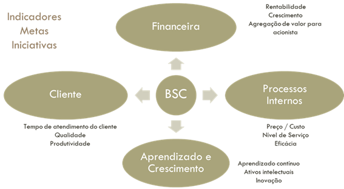

# Modelos de Gestão e Excelência Operacional {#sec-cap2}

::: {.callout-tip title="🎯 Objetivos deste Capítulo"}
* Compreender as três principais abordagens de excelência operacional: TQM, Lean e Seis Sigma.
* Diferenciar os objetivos, ferramentas e métricas de cada filosofia de gestão.
* Entender a aplicação dos modelos de excelência corporativa (MEG e VPS) no contexto mineral.
* Reconhecer como essas filosofias se integram ao Sistema de Gestão da Qualidade (SGQ).
:::

No @sec-cap1, estabelecemos os fundamentos conceituais e normativos da qualidade. Definimos o que é qualidade segundo a ISO 9000, compreendemos suas vertentes filosóficas e justificamos sua importância estratégica. Agora, daremos o próximo passo: conhecer os **modelos operacionais** que transformam essa teoria em sistemas de gestão práticos e escaláveis.

Este capítulo apresenta as três grandes filosofias de excelência que dominam o mercado global — **TQM (Gestão da Qualidade Total)**, **Lean Manufacturing (Manufatura Enxuta)** e **Seis Sigma** — e demonstra como elas foram adaptadas e integradas por grandes corporações minerais através de sistemas proprietários como o **VPS (Sistema de Produção Vale)**.

## As Abordagens de Excelência Operacional {#sec-abordagens-excelencia}

### TQM (Total Quality Management) - Gestão da Qualidade Total {#sec-tqm}

A Gestão da Qualidade Total é uma filosofia de gestão que coloca a qualidade como responsabilidade de todos os membros da organização, não apenas do departamento de qualidade. Desenvolvida no Japão pós-guerra e consolidada por Deming, Juran e Ishikawa, o TQM é a base conceitual de todos os sistemas modernos de gestão.

#### Princípios Fundamentais do TQM

1. **Foco no Cliente:** A qualidade é definida pelas necessidades e expectativas do cliente.
2. **Melhoria Contínua (Kaizen):** A busca permanente por pequenas melhorias incrementais.
3. **Envolvimento de Todos:** Do CEO ao operador, todos são responsáveis pela qualidade.
4. **Decisão Baseada em Fatos:** Uso intensivo de dados e estatísticas.
5. **Gestão de Processos:** Foco na prevenção de defeitos, não apenas na inspeção.

#### Ferramentas Características do TQM

* **Círculos de Controle da Qualidade (CCQ):** Grupos de trabalho autônomos focados em resolver problemas locais.
* **As 7 Ferramentas da Qualidade:** Diagrama de Pareto, Ishikawa, Histograma, Cartas de Controle, Diagrama de Dispersão, Fluxograma e Estratificação.
* **Ciclo PDCA:** Plan-Do-Check-Act como motor da melhoria contínua.

::: {.callout-note title="💡 APLICAÇÃO NA MINERAÇÃO"}
Na mineração, o TQM se manifesta através da integração entre Operação, Manutenção e Engenharia. A qualidade do minério não é responsabilidade apenas do laboratório, mas de toda a cadeia: desde o plano de lavra (que define a frente de extração) até o controle de blendagem na usina.
:::

#### Os 9 Fatores Críticos de Sucesso do TQM {#sec-tqm-9pilares}

```{mermaid}
%%| label: fig-9pilares-tqm
%%| fig-cap: "Os 9 Fatores Críticos de Sucesso do TQM"
graph TD
   TQM{Gestao da<br>Qualidade Total}

   TQM --> L[Lideranca e Estrategia]
   TQM --> P[Pessoas e Cultura]
   TQM --> O[Processos e Operacao]

   L --> 1[1. Comprometimento da Alta Administracao]
   L --> 2[2. Foco no Consumidor]
   L --> 8[8. Benchmarking]

   P --> 4[4. Envolvimento dos Funcionarios]
   P --> 5[5. Treinamento]
   P --> 9[9. Empowerment]

   O --> 3[3. Parceria com o Fornecedor]
   O --> 6[6. Mensuracao da Qualidade]
   O --> 7[7. Melhoria Continua]

   style TQM fill:#2c3e50,stroke:#333,color:#fff,stroke-width:2px
   style L fill:#ecf0f1,stroke:#333
   style P fill:#ecf0f1,stroke:#333
   style O fill:#ecf0f1,stroke:#333
```

Para que o TQM seja efetivamente implantado e mensurado, a literatura consolida **9 Fatores Críticos de Sucesso (FCS)**. Estes pilares permitem auditar o grau de maturidade organizacional e identificar as práticas gerenciais que precisam ser fortalecidas:

**1. Comprometimento da Alta Administração**

A qualidade deve começar no topo da hierarquia. A liderança não deve apenas apoiar, mas patrocinar ativamente o sistema.

* Avaliação periódica da qualidade executada pela alta gestão.
* Discussão constante da importância da qualidade nos fóruns executivos.
* Alocação de verbas e recursos específicos para a qualidade definidos em orçamento.
* Definição, identificação e documentação clara das metas.
* Inserção das metas da qualidade diretamente no planejamento estratégico da empresa.
* Comunicação ativa e visível do compromisso da direção para com toda a empresa.

**2. Foco no Consumidor**

O mercado dita o que é valor. O TQM exige ouvir e reagir às necessidades do cliente.

* Comparação da satisfação do cliente com indicadores internos e de concorrentes.
* Fornecimento e transparência das reclamações dos consumidores a todos os departamentos (não apenas ao SAC).
* Utilização das reclamações como base estrutural para a melhoria de processos.
* Manutenção de um serviço ágil e resolutivo de atendimento ao consumidor.
* Realização periódica de pesquisas de satisfação e expectativas.

**3. Parceria com o Fornecedor**

A qualidade do produto final depende intrinsecamente da qualidade dos insumos recebidos.

* Utilização da qualidade (e não apenas do preço) como critério de peso para a seleção de fornecedores.
* Estabelecimento de contratos de longo prazo, gerando estabilidade.
* Fornecimento de assistência técnica da contratante para desenvolver o fornecedor.
* Participação do fornecedor desde o processo de desenvolvimento e projeto do produto.

**4. Envolvimento dos Funcionários**

A qualidade é construída pelas pessoas que operam o processo diariamente.

* Realização periódica de reuniões em cada área específica para discussão sobre qualidade.
* Criação de equipes interfuncionais (multidisciplinares) para tratar de problemas sistêmicos.
* Avaliação rigorosa de todas as sugestões emitidas pelos funcionários.
* Implantação efetiva das sugestões aprovadas.
* Concessão de prêmios e recompensas não financeiras pelo engajamento e boas ideias.

**5. Treinamento**

A capacitação é o motor da estabilidade do processo.

* Alocação de recursos financeiros e de tempo necessários para o treinamento.
* Envolvimento de todos os escalões da empresa (da diretoria ao chão de fábrica) nos treinamentos de qualidade.
* Capacitação de uma grande base de funcionários em técnicas metódicas de solução de problemas.
* Treinamento técnico em ferramentas e controle estatístico.

**6. Mensuração da Qualidade**

O que não se mede, não se gerencia. A coleta de dados deve ser confiável e contínua.

* Execução de inspeções por amostragem durante o processo de produção (preventivo).
* Avaliação da qualidade em múltiplas etapas, não se limitando apenas à inspeção final do produto pronto.
* Medição periódica dos índices de desperdícios, retrabalho e falhas de produtos não-conformes.
* Manutenção rigorosa de registros e históricos das avaliações.
* Transparência no fornecimento dos resultados das avaliações a todos os funcionários.
* Utilização real dos resultados como suporte primário para a melhoria.

**7. Melhoria Contínua**

A busca incessante por estabelecer novos e melhores padrões de desempenho.

* Manutenção de uma estrutura organizacional específica dedicada a apoiar a qualidade.
* Existência de programas formais para a redução de tempo e custo nos processos internos.
* Execução de avaliações profundas nos processos-chave (gargalos) de produção.
* Programas formais para a redução do Lead Time (tempo de entrega do produto ao cliente).
* Programas formais para a redução do tempo de ciclo de fabricação.

**8. Benchmarking**

Olhar para o mercado e aprender com os melhores, independentemente do setor.

* Realização de visitas técnicas a outras organizações reconhecidamente líderes.
* Procedimento efetivo de benchmarking para monitorar os competidores diretos mais fortes.
* Procedimento de benchmarking com empresas líderes de outros setores (não competidores) para importar inovações.
* Manutenção do benchmarking não como uma ação isolada, mas como uma política contínua da empresa.

**9. Empowerment (Delegação de Poderes)**

Dar autonomia à operação para agir rapidamente sobre os desvios.

* Delegação de autoridade aos funcionários da linha de frente para a solução imediata de problemas operacionais.
* Fornecimento de apoio gerencial e técnico para que os funcionários tomem essas decisões.
* Transferência da execução da inspeção da qualidade para os próprios operadores (autocontrole), reduzindo a dependência de inspetores externos.
* Divulgação e celebração interna das experiências de sucesso na solução de problemas.

::: {.tech-note}
**A Evolução Histórica: TQC, CWQC e TQM**

A origem da Qualidade Total remonta à década de 1950 e desdobrou-se na seguinte evolução:

* **TQC (Total Quality Control) Norte-Americano:** Proposto por Feigenbaum, focava no controle conduzido por especialistas do departamento de qualidade.
* **CWQC (Company-wide Quality Control) Japonês:** Introduzido nos anos 1960, exige o engajamento de *todos* os departamentos. No Japão, a palavra "controle" é entendida como "gerenciamento" (manutenção da rotina e inovações). O estilo japonês consolidou-se em seis frentes: 1) Participação total; 2) Entusiasmo por educação/treinamento; 3) Atividades de CCQ; 4) Auditorias da presidência e Prêmio Deming; 5) Uso intensivo de métodos estatísticos; 6) Campanhas nacionais de promoção da qualidade.
* **TQM (Total Quality Management) Ocidental:** Nas décadas de 1980 e 1990, o modelo japonês foi customizado. Como a palavra "controle" na cultura ocidental carregava uma conotação negativa de "policiamento", ela foi substituída por "Management" (Gestão). O TQM ocidental enfatizou o planejamento de longo prazo, o redesenho de processos, o benchmarking competitivo e o trabalho em equipe.
:::

### Lean Manufacturing - Manufatura Enxuta {#sec-lean}

Originada no Sistema Toyota de Produção (TPS), a filosofia Lean foca na **eliminação de desperdícios** (mudas) e na maximização do fluxo de valor. Enquanto o TQM foca na qualidade do produto, o Lean foca na eficiência do processo.

#### Os 8 Desperdícios (Mudas) no Contexto Mineral

```{mermaid}
%%| label: fig-8mudas-lean
%%| fig-cap: "Os 8 Desperdícios (Mudas) do Lean"
graph LR
   M((8 Desperdícios<br>Mudas)) --> 1(1. Superprodução)
   M --> 2(2. Espera)
   M --> 3(3. Transporte)
   M --> 4(4. Superprocessamento)
   M --> 5(5. Estoque)
   M --> 6(6. Movimentação)
   M --> 7(7. Defeitos)
   M --> 8(8. Talento Subutilizado)

   style M fill:#e74c3c,stroke:#333,color:#fff,stroke-width:2px
```

1. **Superprodução:** Extrair mais minério do que a capacidade de beneficiamento pode processar.
2. **Espera:** Caminhões parados aguardando liberação de ponto de carga.
3. **Transporte:** Movimentação excessiva de material estéril sem valor agregado.
4. **Superprocessamento:** Realizar britagens desnecessárias quando a granulometria já está adequada.
5. **Estoque:** Pilhas de minério ROM acumuladas sem destino definido.
6. **Movimentação:** Deslocamento ineficiente de operadores entre equipamentos.
7. **Defeitos:** Minério fora de especificação que precisa ser reprocessado.
8. **Talento:** Subutilização do conhecimento e experiência dos operadores.

#### Ferramentas Lean Aplicadas à Mineração

* **5S (Seiri, Seiton, Seiso, Seiketsu, Shitsuke):** Organização e limpeza de áreas operacionais e oficinas.
* **Mapeamento do Fluxo de Valor (VSM):** Identificação de gargalos no ciclo de lavra-britagem-beneficiamento.
* **Kanban:** Sistema visual de controle de inventário de peças de reposição.
* **Poka-Yoke:** Dispositivos à prova de erro (ex: sensores que impedem alimentação excessiva de britadores).
* **TPM (Total Productive Maintenance):** Manutenção produtiva total integrada à operação.

::: {.callout-warning title="⚠️ ARMADILHA: Lean sem Contexto"}
Um erro comum é tentar aplicar Lean "de manual" sem adaptar ao contexto mineral. Reduzir estoque de peças críticas pode gerar economia de inventário, mas paralisa a mina se faltar um componente de reposição para uma correia transportadora estratégica.
:::

#### Os 14 Princípios do Sistema Toyota de Produção {#sec-lean-14principios}

```{mermaid}
%%| label: fig-casa-toyota
%%| fig-cap: "A Casa da Toyota - 14 Princípios e Blocos"
graph TD
   T[Teto: Qualidade Máxima, Menor Custo e Menor Lead Time]
   P1[Pilar 1: Just-in-Time<br>Fluxo Contínuo, Puxado, Heijunka]
   P2[Pilar 2: Jidoka<br>Parar e Resolver, Poka-Yoke]
   C[Centro: Pessoas, Parceiros e Melhoria Contínua Kaizen]
   B[Base: Filosofia de Longo Prazo e Processos Padronizados]

   T --- P1
   T --- P2
   P1 --- C
   P2 --- C
   C --- B

   style T fill:#2ecc71,stroke:#333,color:#fff
   style P1 fill:#3498db,stroke:#333,color:#fff
   style P2 fill:#3498db,stroke:#333,color:#fff
   style C fill:#f1c40f,stroke:#333
   style B fill:#95a5a6,stroke:#333,color:#fff
```

O Modelo Toyota estrutura a filosofia Lean em 14 princípios organizados em 4 blocos conceituais:

**Bloco 1: Filosofia de Longo Prazo**

1. **Basear as decisões em filosofia de longo prazo:** Mesmo em detrimento de metas financeiras de curto prazo, a estratégia deve ser sustentável e duradoura.

**Bloco 2: Processo Correto Produz Resultados Corretos**

2. **Criar fluxo contínuo para trazer problemas à tona:** Eliminar paradas e fazer o material fluir ininterruptamente.
3. **Usar sistemas puxados para evitar superprodução:** Produzir apenas o que o cliente demanda (Just-in-Time).
4. **Nivelar a carga de trabalho (Heijunka):** Evitar sobrecarga (muri) e variabilidade (mura).
5. **Construir uma cultura de parar e resolver problemas:** Qualidade no primeiro momento (Jidoka - automação com toque humano).
6. **Padronizar tarefas para melhoria contínua:** Tarefas estáveis são a base para o Kaizen.
7. **Usar controle visual:** Nenhum problema deve ficar oculto (Andon, 5S, gestão à vista).
8. **Usar somente tecnologia confiável:** Tecnologia deve servir às pessoas e processos, não o contrário.

**Bloco 3: Agregar Valor Desenvolvendo Pessoas e Parceiros**

9. **Desenvolver líderes que vivenciem a filosofia:** Líderes devem ensinar pelo exemplo.
10. **Desenvolver pessoas e equipes excepcionais:** Valorizar grupos pequenos que seguem a filosofia da empresa.
11. **Respeitar parceiros e fornecedores:** Desafiá-los e ajudá-los a melhorar.

**Bloco 4: Resolver Problemas na Raiz Gera Aprendizado**

12. **Ver por si mesmo para compreender a situação (Genchi Genbutsu):** Ir ao local real (Gemba) para entender os fatos.
13. **Tomar decisões lentamente por consenso, implementar rapidamente:** Considerar todas as opções (Nemawashi), mas agir com velocidade na execução.
14. **Tornar-se uma organização que aprende através da reflexão (Hansei) e melhoria contínua (Kaizen):** Aprender com erros e standardizar as lições.

::: {.tech-note}
**Aplicação do Jidoka na Mineração**

Na linha de britagem, sensores detectam automaticamente sobrecarga no alimentador. O sistema para a correia (autonomação), evitando danos mecânicos e forçando a equipe a investigar a causa raiz: problema de granulometria na alimentação ou falha no britador primário?
:::

### Seis Sigma - Excelência Estatística {#sec-seis-sigma}

Desenvolvido pela Motorola e popularizado pela GE, o Seis Sigma é uma metodologia rigorosa de melhoria de processos focada na **redução da variabilidade** e na busca por processos com no máximo 3,4 defeitos por milhão de oportunidades (DPMO).

Diferente de iniciativas subjetivas, o Seis Sigma opera como uma **Gestão de Portfólio**. A organização administra uma lista de projetos ativos, selecionando e priorizando aqueles mais alinhados com a estratégia financeira (Projetos Prioritários, Estratégicos e Lucrativos).

#### Critérios para Seleção de Projetos Seis Sigma

A seleção de um projeto Seis Sigma exige responder a perguntas vitais:

* **Quais são as Características Críticas para a Qualidade Interna ($CTQ_{in}$) e Externa ($CTQ_{ex}$)?**
* **Existe uma lacuna de desempenho (gap) significativa em relação aos concorrentes que justifique o projeto?**
* **O projeto impacta diretamente a lucratividade ou metas estratégicas da empresa?**

#### A Estrutura Organizacional (Belt System)

```{mermaid}
%%| label: fig-piramide-belts
%%| fig-cap: "Pirâmide de Belts - Hierarquia do Seis Sigma"
graph BT
   W[White Belt<br>Executores] --> Y[Yellow Belt<br>Participantes Ativos]
   Y --> G[Green Belt<br>Líderes Parciais]
   G --> B[Black Belt<br>Especialistas Full-time]
   B --> M[Master Black Belt<br>Mentores]
   M --> C[Champion / Executivos<br>Direcionamento Estratégico]

   style C fill:#2c3e50,stroke:#333,color:#fff
   style M fill:#8e44ad,stroke:#333,color:#fff
   style B fill:#000000,stroke:#333,color:#fff
   style G fill:#27ae60,stroke:#333,color:#fff
   style Y fill:#f1c40f,stroke:#333
   style W fill:#ffffff,stroke:#333
```

Para conduzir esses projetos sem perder o foco corporativo, o Seis Sigma cria uma estrutura hierárquica paralela baseada em capacitação técnica:

* **Executivo Líder:** Conduz, incentiva e supervisiona as iniciativas, selecionando os "Campeões".
* **Campeão (Champion):** Lidera os executivos-chave em direção aos objetivos do projeto e acompanha a implementação em toda a organização.
* **Master Black Belts:** Especialistas com treinamento intensivo em estatística que dão suporte aos Campeões e são fundamentais no processo de mudança.
* **Black Belts:** Profissionais dedicados integralmente a liderar equipes na condução direta dos projetos e solução de problemas.
* **Green Belts:** Profissionais com dedicação parcial aos projetos, que auxiliam na coleta de dados e lideram pequenas melhorias em suas respectivas áreas de atuação.
* **Yellow Belt:** Participantes ativos de projetos de melhoria, com conhecimento básico da metodologia.
* **White Belt:** Conhecimento básico, executores de melhorias pontuais.

#### DMAIC: O Roteiro Estruturado

```{mermaid}
%%| label: fig-dmaic-fluxo-seis-sigma
%%| fig-cap: "O Fluxo DMAIC do Seis Sigma"
graph LR
   D(Define<br>Definir) --> M(Measure<br>Medir)
   M --> A(Analyze<br>Analisar)
   A --> I(Improve<br>Melhorar)
   I --> C(Control<br>Controlar)

   style D fill:#e74c3c,stroke:#333,color:#fff
   style M fill:#e67e22,stroke:#333,color:#fff
   style A fill:#f1c40f,stroke:#333
   style I fill:#2ecc71,stroke:#333,color:#fff
   style C fill:#3498db,stroke:#333,color:#fff
```

O método Seis Sigma segue um roteiro rigoroso de 5 fases:

1. **Define (Definir):** Identificar as prioridades, os requisitos do cliente (CTQs) e mapear os processos críticos que os impactam. Identificar o problema e o impacto financeiro (ex: perda de recuperação mássica na flotação).

2. **Measure (Medir):** Desenhar as entradas e saídas (onde $Q=f(x)$), estabelecendo o sistema de medição adequado e coletando dados por meio de amostragem representativa. Calcular a capacidade atual do processo ($C_p, C_{pk}$).

3. **Analyze (Analisar):** Utilizar ferramentas estatísticas (regressão, DOE, testes de hipótese) para analisar os dados coletados, identificando as causas vitais (raízes) que geram defeitos e variações.

4. **Improve (Melhorar):** Eliminar as causas dos defeitos modificando os elementos geradores dos problemas e quantificar os efeitos obtidos nas CTQs. Testar e implementar soluções (ex: ajuste de dosagem de reagentes).

5. **Control (Controlar):** Definir sistemas de controle contínuos (cartas de controle, POPs) para garantir que o novo patamar de qualidade seja mantido ao longo do tempo.

::: {.callout-important title="🔬 EXEMPLO MINERAL: Projeto Seis Sigma"}
**Problema:** Taxa de disponibilidade física da frota de caminhões fora de estrada abaixo de 85%, impactando a meta de produção.

**Meta Seis Sigma:** Reduzir o tempo médio entre falhas (MTBF) em 30% e o tempo médio de reparo (MTTR) em 20%, elevando a disponibilidade para 90%.

**Ferramentas Aplicadas:** Análise de Weibull para identificar componentes críticos, FMEA para priorizar modos de falha, DOE para otimizar intervalos de manutenção preventiva.
:::

### Comparativo: TQM vs. Lean vs. Seis Sigma

| Aspecto | TQM | Lean | Seis Sigma |
|:--------|:----|:-----|:-----------|
| **Foco Principal** | Satisfação do cliente e cultura | Eliminação de desperdícios | Redução de variabilidade |
| **Métrica Chave** | Conformidade com requisitos | Lead Time / Throughput | Defeitos por milhão (DPMO) |
| **Estrutura** | Filosófica e cultural | Sistema de fluxo | Metodologia estatística (DMAIC) |
| **Origem** | Japão (Deming, Juran) | Toyota (TPS) | Motorola / GE |
| **Complexidade** | Média | Média | Alta (intensiva em estatística) |

: Comparação entre as principais filosofias de excelência operacional {#tbl-comparacao-filosofias}

## Modelos de Excelência e Sistemas Corporativos {#sec-modelos-corporativos}

Enquanto TQM, Lean e Seis Sigma são filosofias universais, grandes corporações desenvolvem **sistemas proprietários** que integram essas metodologias à sua cultura e operação específica. No Brasil, dois modelos se destacam: o **MEG (Modelo de Excelência da Gestão)** da FNQ e o **VPS (Sistema de Produção Vale)**.

### Modelos de Excelência em Gestão de Negócios e Prêmios Globais

Para estimular a adoção prática da Qualidade Total, diversos países criaram **Modelos de Excelência** atrelados a prêmios nacionais. Esses frameworks servem como guias rigorosos de avaliação de maturidade:

* **Prêmio Deming:** Criado no Japão (1951), é historicamente focado na aplicação rigorosa do CWQC e no controle estatístico de processos.
* **Prêmio Malcolm Baldrige (MBNQA):** Criado nos EUA (1987) pelo governo americano para resgatar a competitividade frente ao avanço japonês.
* **EFQM (European Foundation for Quality Management):** O principal modelo europeu de excelência, lançado em 1992.
* **Prêmio Nacional da Qualidade (PNQ):** A versão brasileira, baseada nos fundamentos do MEG.

### O Modelo de Excelência da Gestão (MEG) {#sec-meg}

Desenvolvido pela Fundação Nacional da Qualidade (FNQ), o MEG é o referencial brasileiro de gestão de classe mundial. Diferentemente da ISO 9001 (que é uma norma prescritiva), o MEG é um modelo descritivo que orienta a organização na jornada rumo à excelência.

#### Os 8 Fundamentos do MEG

1. **Pensamento Sistêmico:** Visão integrada da organização.
2. **Aprendizado Organizacional:** Cultura de melhoria contínua.
3. **Cultura de Inovação:** Estímulo à criatividade e renovação.
4. **Liderança Transformadora:** Líderes como agentes de mudança.
5. **Orientação por Processos:** Gestão baseada em fluxos de valor.
6. **Geração de Valor:** Foco em resultados para stakeholders.
7. **Valorização das Pessoas:** Capital humano como diferencial.
8. **Conhecimento sobre Clientes e Mercados:** Decisões baseadas em inteligência de mercado.

#### Ciclo PDCL (Plan-Do-Check-Learn)

O MEG adapta o PDCA clássico para o **PDCL**, enfatizando o aprendizado organizacional como pilar estratégico.

### O Sistema de Produção Vale (VPS) {#sec-vps}

A Vale, como uma das maiores produtoras globais de minério de ferro, desenvolveu o **VPS** como sua metodologia proprietária de excelência operacional. O VPS integra elementos do TQM, Lean e Seis Sigma em um framework único adaptado ao contexto de mineração de capital intensivo.

#### Pilares do VPS

1. **Segurança:** Prioridade absoluta (Zero Harm).
2. **Disponibilidade de Ativos:** Maximização do uptime de equipamentos críticos.
3. **Estabilidade dos Processos:** Redução da variabilidade operacional.
4. **Utilização e Produtividade:** Otimização do uso de recursos.
5. **Custos:** Eficiência financeira sustentável.
6. **Qualidade:** Atendimento às especificações de produto.
7. **Sustentabilidade:** Gestão ambiental e social.

#### Ferramentas do VPS

O VPS utiliza um portfólio integrado de ferramentas:

* **Rotina de Gestão:** SDCA para manutenção de padrões.
* **Solução de Problemas:** PDCA/MASP estruturado.
* **Gestão de Projetos:** PMBOK adaptado para o contexto mineral.
* **TPM (Total Productive Maintenance):** Foco em confiabilidade de ativos.
* **Quick Kaizen:** Eventos rápidos de melhoria (1-3 dias).
* **5S:** Organização de áreas operacionais e administrativas.

::: {.callout-tip title="💡 INSIGHT: Integração Sistêmica"}
O grande diferencial do VPS não está nas ferramentas individuais (que são públicas), mas na forma como elas são **integradas sistemicamente**. O 5S não é um programa isolado; ele suporta o TPM, que por sua vez aumenta a Disponibilidade de Ativos, que é um dos pilares estratégicos da Vale.
:::

### A Jornada de Maturidade

Tanto o MEG quanto o VPS operam sob a lógica de **maturidade evolutiva**, similar à Curva de Bradley aplicada à segurança. As organizações são classificadas em níveis:

```{mermaid}
%%| label: fig-maturidade-excelencia
%%| fig-cap: "Curva de Maturidade em Gestão da Excelência"
graph LR
    A[Estágio 0<br>Inexistente] --> B[Estágio 1<br>Reativo]
    B --> C[Estágio 2<br>Estruturado]
    C --> D[Estágio 3<br>Proativo]
    D --> E[Estágio 4<br>Classe Mundial]

    style A fill:#e74c3c,stroke:#333,color:#fff
    style B fill:#e67e22,stroke:#333,color:#fff
    style C fill:#f1c40f,stroke:#333
    style D fill:#2ecc71,stroke:#333,color:#fff
    style E fill:#27ae60,stroke:#333,color:#fff
```

* **Estágio 0 (Inexistente):** Não há gestão estruturada; operação por intuição.
* **Estágio 1 (Reativo):** Ações apenas quando problemas graves acontecem.
* **Estágio 2 (Estruturado):** POPs existem, mas não são rigorosamente seguidos.
* **Estágio 3 (Proativo):** Melhoria contínua acontece de forma sistemática.
* **Estágio 4 (Classe Mundial):** Excelência internalizada; benchmarking global.

## Metodologias de Suporte Estratégico e Analítico {#sec-metodologias-suporte}

Para que filosofias como TQM, Seis Sigma e Lean não atuem de forma isolada, as organizações utilizam metodologias de suporte para alinhar a estratégia e organizar a solução de problemas na rotina.

### O Balanced Scorecard (BSC) {#sec-bsc}

{#fig-perspectivas-bsc fig-align="center"}

O BSC atua como o grande tradutor da estratégia corporativa. Ele desdobra a visão da empresa em indicadores, metas e iniciativas através de quatro perspectivas interdependentes:

#### As 4 Perspectivas do BSC

1. **Perspectiva Financeira:** Foco em crescimento de receita, redução de custos e retorno sobre investimento (ROI).
   * *Exemplo mineral:* Reduzir custo operacional (OPEX) de US$/t por meio da otimização do consumo de energia na moagem.

2. **Perspectiva dos Clientes:** Satisfação, retenção, participação de mercado e reputação da marca.
   * *Exemplo mineral:* Aumentar o Net Promoter Score (NPS) garantindo entrega pontual de minério com especificação contratual.

3. **Perspectiva dos Processos Internos:** Eficiência operacional, qualidade dos processos e inovação.
   * *Exemplo mineral:* Reduzir tempo de ciclo de transporte (do pit até a usina) eliminando filas e otimizando rotas.

4. **Perspectiva de Aprendizado e Crescimento:** Capacitação de pessoas, sistemas de informação e cultura organizacional.
   * *Exemplo mineral:* Implementar programa de certificação de operadores em simuladores de equipamentos pesados.

::: {.callout-tip title="💡 COMO O BSC SE CONECTA À QUALIDADE"}
A Gestão da Qualidade atua como a engrenagem que melhora os **Processos Internos** (reduzindo variabilidade e defeitos), o que impacta diretamente o **Cliente** (satisfação com produto conforme), gerando rentabilidade na perspectiva **Financeira** (menos retrabalho = menor custo).
:::

#### Mapa Estratégico: Relações de Causa e Efeito

O poder do BSC está no **Mapa Estratégico**, que visualiza as relações de causa e efeito entre as 4 perspectivas:

* Se investimos em **Treinamento** (Aprendizado) → Os operadores cometem menos erros → **Qualidade do processo** melhora (Processos) → Menos retrabalho e reclamações → **Satisfação do cliente** aumenta (Clientes) → Contratos renovados e prêmio de qualidade → **Receita** aumenta (Financeira).

### A Metodologia de Análise e Solução de Problemas (MASP) {#sec-masp}

```{mermaid}
%%| label: fig-estrutura-masp
%%| fig-cap: "A Estrutura do MASP alinhada ao PDCA"
graph LR
   subgraph P[PLAN - Planejar]
      1[1. Problema] --> 2[2. Observação]
      2 --> 3[3. Análise]
      3 --> 4[4. Plano de Ação]
   end
   subgraph D[DO - Executar]
      4 --> 5[5. Execução]
   end
   subgraph C[CHECK - Verificar]
      5 --> 6[6. Verificação]
   end
   subgraph A[ACT - Agir/Padronizar]
      6 --> 7[7. Padronização]
      7 --> 8[8. Conclusão]
   end

   style P fill:#ebf5fb,stroke:#2980b9
   style D fill:#fef9e7,stroke:#f39c12
   style C fill:#fdedec,stroke:#e74c3c
   style A fill:#e9f7ef,stroke:#27ae60
```

Criada pela União dos Cientistas e Engenheiros Japoneses (JUSE), a MASP tem o objetivo de prevenir e corrigir falhas de processos de forma altamente estruturada. A metodologia auxilia na identificação da causa raiz, propõe ações corretivas e sugere o uso de ferramentas específicas (como Brainstorming, 5W2H e 5S) para convergir ideias.

#### A MASP como Personificação do PDCA

A MASP é a aplicação prática e estruturada do ciclo PDCA voltada para resolução de problemas crônicos:

**Plan (Planejar) - 4 Etapas:**

1. **Identificação do Problema:** Definir o problema prioritário utilizando Pareto ou análise de impacto financeiro.
   * *Ferramentas:* Brainstorming, Pareto, Estratificação.

2. **Observação:** Coletar dados sobre o problema, investigando as características do local, horário, tipo de ocorrência.
   * *Ferramentas:* 5W2H, Folha de Verificação, Histograma.

3. **Análise:** Identificar e validar as causas raiz utilizando ferramentas estatísticas e de correlação.
   * *Ferramentas:* Ishikawa (Espinha de Peixe), 5 Porquês, Diagrama de Scatter, Análise de Correlação.

4. **Plano de Ação:** Elaborar contramedidas específicas para eliminar as causas raiz.
   * *Ferramentas:* 5W2H expandido (What, Why, Where, When, Who, How, How  Much).

**Do (Executar) - 1 Etapa:**

5. **Execução:** Implementar as ações planejadas de forma disciplinada, comunicando a todos os envolvidos.
   * *Ferramentas:* Treinamento no trabalho (OJT), Gestão de Mudanças.

**Check (Verificar) - 1 Etapa:**

6. **Verificação:** Comparar resultados antes/depois para validar se as ações foram eficazes.
   * *Ferramentas:* Cartas de Controle, Análise de Tendência, Teste de Hipótese.

**Action (Padronizar/Agir) - 2 Etapas:**

7. **Padronização:** Se eficaz, transformar as ações em procedimento padrão (POP).
   * *Ferramentas:* Procedimentos Operacionais Padrão (POPs), Fluxogramas, Lições Aprendidas.

8. **Conclusão:** Reflexão sobre o processo, registro de lições aprendidas e identificação de problemas remanescentes.
   * *Ferramentas:* Banco de Dados de Conhecimento, Hansei (Reflexão).

::: {.tech-note}
**Diferença entre PDCA e MASP**

* **PDCA:** Genérico, aplicável a qualquer tipo de melhoria (incremental ou de inovação).
* **MASP:** Específico para **solução de problemas crônicos** que já foram identificados e priorizam causas raiz mensuráveis.
:::

### Círculos de Controle da Qualidade (CCQ) {#sec-ccq}

O Círculo de Controle da Qualidade é uma forma estruturada de reunir o pessoal que atua no dia a dia da operação para debater as oportunidades de melhoria. Consiste em encontros periódicos onde a equipe compartilha experiências, aponta problemas que atrapalham a rotina e pensa em soluções que realmente funcionem na prática.

#### Princípios do CCQ

A grande vantagem conceitual do CCQ é que **os participantes são os próprios trabalhadores**. Eles conhecem de perto os gargalos, as ineficiências e os riscos de segurança, pois sentem na pele o que dá certo e o que precisa mudar. Quando a ideia de melhoria surge de quem vive o problema, a chance de a solução ser sustentável e bem-sucedida é exponencialmente maior.

#### Dinâmica e Vantagens do CCQ

O grupo escolhe um problema específico da sua área, analisa as causas e tenta encontrar uma solução prática. Se a intervenção funcionar, essa melhoria é padronizada e vira o novo método de trabalho para toda a empresa. As principais vantagens incluem:

* **Simplicidade:** Tudo acontece de forma direta, sem a necessidade imediata de grandes recursos financeiros ou aprovações complexas.
* **Espírito de Equipe:** Além de otimizar o processo, a iniciativa faz a equipe trabalhar de maneira unida. O operador sente-se ouvido e valorizado.
* **Aplicação Prática:** Em operações de alta complexidade, como ferrovias e minas de grande porte, os CCQs têm sido fundamentais para resolver anomalias crônicas que antes pareciam difíceis de mapear, utilizando unicamente o conhecimento empírico de quem está na linha de frente.

::: {.tech-note}
**Reflexão Acadêmica**

Como destaca Oliveira (2009), a qualidade precisa ser construída de forma coletiva, envolvendo todas as pessoas no compromisso com padrões estáveis. Essa visão é corroborada por Deming (1990), que enfatiza que a verdadeira melhoria contínua só acontece quando existe método, uso disciplinado de dados e a valorização profunda do conhecimento de quem vive a rotina de produção. O CCQ é, portanto, o caminho mais simples, direto e eficiente para materializar o **Empowerment** discutido no TQM.
:::

### A Integração da Gestão da Qualidade com a Manutenção Industrial {#sec-qualidade-manutencao}

Se as pessoas são o motor intelectual da qualidade, as máquinas são o meio físico. Em ambientes de capital intensivo, como a mineração e a siderurgia, a capacidade gerencial (SGI) deve estar intimamente ligada à capacidade de utilização dos recursos de produção. Isso significa que a Gestão da Qualidade é diretamente dependente da **Gestão de Ativos** e da **Manutenção Industrial**.

#### Aplicação das Metodologias de Qualidade na Manutenção

As metodologias consagradas de qualidade encontram na manutenção um terreno fértil para aplicação:

* **O TQM na Manutenção:** Promove uma cultura onde a qualidade reflete-se na execução precisa das tarefas de manutenção (evitando retrabalhos mecânicos) e na busca por melhores práticas de lubrificação e inspeção.

* **O Seis Sigma na Manutenção:** Foca na redução da variabilidade do desgaste dos componentes e na minimização de quebras inesperadas, o que é crítico para garantir a confiabilidade dos ativos e a disponibilidade física da planta.

* **O Lean na Manutenção:** Concentra-se na eliminação de desperdícios (ferramentas distantes, excesso de peças no almoxarifado, tempo de espera por liberação de área), otimizando o fluxo de trabalho dos mecânicos e eletricistas.

#### A Gestão de Ativos e o Ciclo de Vida

```{mermaid}
%%| label: fig-ciclo-vida-ativo
%%| fig-cap: "Ciclo de Vida do Ativo - 7 Etapas"
graph LR
   1(1. Decisão) --> 2(2. Especificação)
   2 --> 3(3. Aquisição)
   3 --> 4(4. Instalação)
   4 --> 5(5. Manutenção)
   5 --> 6(6. Reforma)
   6 --> 7(7. Descarte)

   style 5 fill:#f39c12,stroke:#333,color:#fff,stroke-width:2px
   style 1 fill:#bdc3c7,stroke:#333
   style 7 fill:#bdc3c7,stroke:#333
```

A integração entre qualidade e manutenção atinge seu ápice na **Gestão de Ativos**. Essa abordagem estabelece que o valor da organização é gerado pelo desempenho de seus equipamentos. O período compreendido entre a decisão de compra de um ativo (como um caminhão fora de estrada ou um britador) e o seu descarte é conhecido como **vida útil do ativo**.

Para que a qualidade do processo produtivo não sofra variações ao longo dos anos, o ciclo de vida do ativo deve ser rigorosamente gerenciado em sete etapas:

1. **Decisão:** Análise sobre a real necessidade do ativo para o processo de produção.
2. **Especificação:** Determinação de suas especificações técnicas rigorosas para o uso pretendido.
3. **Aquisição:** Compra baseada no equilíbrio entre custo, desempenho garantido e risco operacional.
4. **Instalação e Operação:** O comissionamento (testes) e a introdução do produto no processo produtivo.
5. **Manutenção:** O foco central para manter ou restaurar o ativo, garantindo que ele execute a função requerida sem perder o rendimento nominal.
6. **Reforma ou Expansão:** Melhorias no equipamento (retrofits) ou substituições parciais para prolongar sua utilidade.
7. **Descarte:** O encerramento seguro e ambientalmente correto ao final da vida útil.

::: {.tech-note}
**Conclusão Operacional**

Para que os objetivos estratégicos da qualidade sejam alcançados sem sobressaltos, as propostas de manutenção, reforma e renovação dos ativos devem obrigatoriamente fazer parte do planejamento anual da empresa. Afinal, um processo cujos equipamentos falham constantemente jamais será capaz de entregar um produto em conformidade com as exigências do cliente.
:::

## Integração com o SGQ (Sistema de Gestão da Qualidade) {#sec-integracao-sgq}

É fundamental compreender que os sistemas normalizados (como a ISO 9001 ou a TS/IATF 16949 para o setor automotivo) **não são concorrentes** das filosofias de excelência (TQM, Lean, Seis Sigma) ou dos modelos corporativos (MEG, VPS). Pelo contrário, eles são **complementares** e estão intimamente associados à evolução da maturidade da gestão na empresa.

Na prática organizacional, a implantação de um Modelo de Excelência (MEG) ou da Gestão da Qualidade Total (TQM) deve, idealmente, ser precedida por uma sólida consolidação de um modelo SGQ (ISO). A definição de qual arquitetura é a mais adequada dependerá do contexto de mercado, da tecnologia e da estratégia competitiva da mineradora naquele momento.

### A Hierarquia de Integração

```{mermaid}
%%| label: fig-integracao-sgq
%%| fig-cap: "Integração entre SGQ, Filosofias de Excelência e Sistemas Corporativos"
graph TD
    A[ISO 9001<br>SGQ - Base Normativa] --> B[TQM + Lean + Seis Sigma<br>Filosofias de Excelência]
    B --> C[VPS / MEG<br>Sistema Corporativo Integrado]
    C --> D[Resultados Operacionais<br>Segurança, Produção, Qualidade, Custos]

    style A fill:#3498db,stroke:#333,color:#fff
    style B fill:#9b59b6,stroke:#333,color:#fff
    style C fill:#e67e22,stroke:#333,color:#fff
    style D fill:#2ecc71,stroke:#333,color:#fff
```

* **Camada 1 (ISO 9001 / SGQ):** Garante a conformidade legal, a padronização de processos e a rastreabilidade.
* **Camada 2 (TQM, Lean, Seis Sigma):** Fornece as ferramentas e métodos para melhoria contínua e eficiência.
* **Camada 3 (VPS, MEG):** Integra tudo em um sistema coeso alinhado à estratégia corporativa.
* **Camada 4 (Resultados):** Entrega os KPIs de desempenho esperados pela operação.

## Escolhendo a Abordagem Certa {#sec-escolha-abordagem}

Não existe uma "melhor" filosofia. A escolha depende do contexto operacional, maturidade da organização e natureza do problema:

::: {.callout-tip title="🎯 GUIA DE DECISÃO"}
* **Use TQM quando:** O problema é cultural; falta engajamento e responsabilização pela qualidade.
* **Use Lean quando:** O problema é desperdício; há muito tempo de espera, movimentação excessiva ou estoque.
* **Use Seis Sigma quando:** O problema é variabilidade; o processo oscila e não atinge o alvo consistentemente.
* **Use VPS/MEG quando:** A organização já possui maturidade e precisa integrar todas as frentes estrategicamente.
:::

No próximo capítulo (@sec-cap3), daremos o salto definitivo da filosofia para a matemática. Apresentaremos a **Modelagem Analítica de Requisitos (ARM)**, que transformará todas essas abordagens qualitativas em equações quantitativas capazes de orientar decisões operacionais e financeiras com precisão cirúrgica.

## 📝 Resumo do Capítulo

* **TQM (Gestão da Qualidade Total):** Filosofia cultural de engajamento de todos os colaboradores na busca pela qualidade. Ferramentas: PDCA, CCQ, 7 Ferramentas da Qualidade.
* **Lean Manufacturing:** Foco na eliminação dos 8 desperdícios (mudas) e otimização do fluxo de valor. Ferramentas: 5S, VSM, Kanban, TPM.
* **Seis Sigma:** Metodologia estatística rigorosa para redução de variabilidade, estruturada em belts (White, Yellow, Green, Black, Master Black) e seguindo o roteiro DMAIC.
* **MEG (Modelo de Excelência da Gestão):** Referencial brasileiro da FNQ baseado em 8 fundamentos e no ciclo PDCL (Plan-Do-Check-Learn).
* **VPS (Sistema de Produção Vale):** Sistema proprietário que integra TQM, Lean e Seis Sigma em 7 pilares estratégicos (Segurança, Disponibilidade, Estabilidade, Utilização, Custos, Qualidade, Sustentabilidade).
* **Integração Sistêmica:** As filosofias de excelência não substituem o SGQ (ISO 9001), mas o potencializam, criando uma arquitetura de gestão robusta e orientada a resultados.
