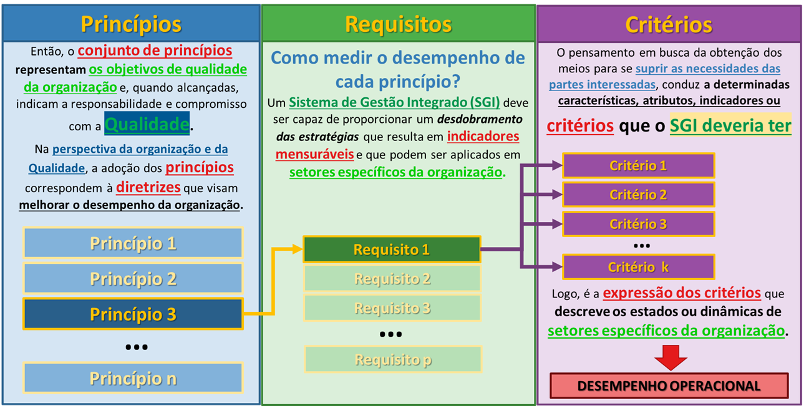

# O Desdobramento Estratégico e a Gestão da Qualidade {#sec-cap3}

No @sec-cap1, estabelecemos a pedra angular da nossa modelagem:

::: {.callout-note title="📌 DEFINIÇÃO NORMATIVA"}
**Qualidade (3.6.2):** Grau em que o conjunto de características (3.10.1) inerentes de um objeto (3.6.1) satisfaz requisitos (3.6.4).
:::

No entanto, a qualidade por si só é um estado passivo. Para que ela seja alcançada de forma repetível em uma operação industrial, ela precisa ser ativamente direcionada. É neste ponto que introduzimos os conceitos de controle corporativo:

::: {.callout-note title="📌 DEFINIÇÃO NORMATIVA"}
* **Gestão (3.3.3):**
  Atividades controladas para dirigir e controlar uma organização (3.2.1).
* **Organização (3.2.1):**
  Pessoa ou grupo de pessoas com suas próprias funções com responsabilidades, autoridades e relações para alcançar seus objetivos (3.7.1).
:::

Quando fundimos esses elementos — o estado desejado (Qualidade) com a ação de direcionamento (Gestão) sobre uma empresa (Organização) —, nasce a premissa central do nosso sistema:

::: {.callout-note title="📌 DEFINIÇÃO NORMATIVA"}
**Gestão da Qualidade (3.3.4):** Gestão (3.3.3) que diz respeito à qualidade (3.6.2).
* **NOTA 1:** A Gestão da qualidade pode incluir o estabelecimento de políticas da qualidade (3.5.9), objetivos da qualidade (3.7.2) e processos (3.4.1). Os objetivos da qualidade podem ser alcançados por meio do planejamento da qualidade (3.3.5), da garantia da qualidade (3.3.6), do controle da qualidade (3.3.7) e da melhoria da qualidade (3.3.8).
:::

A **NOTA 1** da Gestão da Qualidade é o verdadeiro "mapa tático" da engenharia de produção. Para transformar essa teoria em prática, desmembraremos esta nota passo a passo, mostrando como ela puxa toda a estrutura do nosso livro.

## A Estrutura Diretiva: Políticas, Visão e Missão {#sec-estrutura-diretiva}

A Nota 1 indica que a Gestão da Qualidade puxa, em primeiro lugar, o estabelecimento de Políticas. A política não nasce do vazio; ela é orientada pelas aspirações máximas da Alta Direção:

::: {.callout-note title="📌 DEFINIÇÃO NORMATIVA"}
* **Visão (3.5.10):**
  Aspiração do que uma organização (3.2.1) gostaria de se tornar, como expresso pela Alta Direção (3.1.1).
* **Missão (3.5.11):**
  Propósito da existência da organização (3.2.1), como expresso pela Alta Direção (3.1.1).
* **Política da Qualidade (3.5.9):**
  Política (3.5.8) com relação à qualidade (3.6.2).
  * *NOTA 1:* A política da qualidade geralmente é consistente com a política geral da organização (3.2.1), pode ser alinhada com a visão (3.5.10) e a missão (3.5.11) da organização e provê uma estrutura para se estabelecerem os objetivos da qualidade (3.7.2).
:::

A política é, portanto, a regra de ouro. Ela garante que a operação produza respeitando a identidade da empresa e fornece a estrutura para a próxima etapa normativa.

## A Fronteira da Execução: Processos {#sec-fronteira-processos}

Voltando à Nota 1 da Gestão da Qualidade, o segundo elemento estrutural puxado pela norma é o **Processo**.

::: {.callout-note title="📌 DEFINIÇÃO NORMATIVA"}
**Processo (3.4.1):** Conjunto de atividades inter-relacionadas ou interativas que utilizam entradas para entregar um resultado pretendido.
* *NOTA 1:* O “resultado pretendido” do processo é chamado de saída (3.7.5), produto (3.7.6) ou serviço (3.7.7), dependendo do contexto da referência.
* *NOTA 2:* As entradas para um processo são geralmente saídas de outros processos e as saídas de um processo são geralmente as entradas para outros processos.
* *NOTA 3:* Dois ou mais processos inter-relacionados ou que interagem em série também podem ser referidos como processos.
* *NOTA 4:* Processos em uma organização (3.2.1) são geralmente planejados e realizados sob condições controladas para agregar valor.
* *NOTA 5:* Um processo para o qual não for possível validar prontamente ou economicamente a conformidade (3.6.11) da saída é frequentemente chamado de “processo especial”.
:::

Na engenharia aplicada à mineração, é fundamental fazermos uma distinção prática baseada na Nota 1 deste item:

* **Qualidade do Produto (A Saída):**
  Focada na adequação ao uso e no atendimento das especificações do cliente externo. Na exploração mineral (como a de minério de ferro a céu aberto), o produto precisa passar pelo beneficiamento — etapas de cominuição, classificação, concentração e separação sólido/líquido — até atingir a constituição física exigida. Foi para quantificar esta qualidade de saída que utilizamos a Modelagem Analítica (ARM) no @sec-cap2.
* **Qualidade do Processo (A Execução):**
  Focada na eficiência interna. A mineração é caracterizada pelo efeito de alto volume com baixa variedade de produtos, configurando uma produção contínua de arranjo físico por produto. Para este cenário, o principal fator "ganhador de pedido" é o aspecto econômico (o menor custo unitário e o *lead-time*).

Para garantir essa dupla qualidade (do produto e do processo), a execução exige uma forte integração horizontal. Na indústria mineral, a Produção não é um departamento isolado, mas a soma sinérgica e inseparável de três forças:

**Produção = Operação + Manutenção + Engenharia**

Traduzindo essa equação para a arquitetura de gestão, o Planejamento e Controle da Produção (PCP) atua como o grande guarda-chuva integrador que consolida:
1. O **Planejamento e Controle da Operação (PCO):**
   Focado no cumprimento das metas de volume, taxa de alimentação e qualidade do produto final.
2. A **Programação e Controle da Manutenção (PCM):**
   Focada em garantir a confiabilidade operacional e a disponibilidade física imediata dos equipamentos.
3. A **Engenharia / Gestão de Ativos:**
   Focada na maximização do ciclo de vida das máquinas, análise de falhas crônicas e melhoria contínua do projeto.

Quando essa integração de processos (PCO + PCM + Engenharia) falha, surgem anomalias corporativas que destroem o valor agregado (Nota 4). Exemplos clássicos incluem a **falta de acurácia de estoques** (divergência entre o saldo físico nas pilhas e o contábil) e falhas de *compliance* na expedição e logística (divergências de peso nas balanças de transporte multimodal).

Para blindar a operação contra essas perdas, os processos de negócio precisam compor um **Sistema de Gestão Integrado (SGI)**. Este sistema deve disseminar a estratégia em todos os níveis, incorporando não apenas metas financeiras, mas também os Indicadores de Sustentabilidade (*Triple Bottom Line* - TBL), garantindo que a eficiência do processo não resulte em degradação ambiental ou riscos sociais.

## A Consolidação: O Sistema de Gestão da Qualidade (SGQ) {#sec-consolidacao-sgq}

Para que as Políticas e os Processos funcionem de forma coordenada, eles não podem operar soltos na fábrica. Eles precisam ser encapsulados e controlados.

::: {.callout-note title="📌 DEFINIÇÃO NORMATIVA"}
* **Sistema (3.5.1):**
  Conjunto de elementos inter-relacionados ou interativos.
* **Sistema de Gestão (3.5.3):**
  Atividades controladas para dirigir e controlar uma organização para estabelecer políticas, objetivos e processos para alcançar esses objetivos.
* **Sistema de Gestão da Qualidade - SGQ (3.5.4):**
  Parte de um sistema de gestão com relação à qualidade.
* **Implementação de SGQ (3.4.3):**
  Processo de estabelecimento, documentação, implementação, manutenção e melhoria contínua do sistema de gestão da qualidade.
:::

A função primária do SGQ é garantir a conformidade dos produtos e processos por meio de um conjunto de regras, recursos e procedimentos documentados (como a ISO 9001). Ele estabiliza o que já existe, garantindo que o cliente não receba minério fora de especificação.

### A Evolução da Maturidade: SGI, TQM e MEG

No entanto, a Gestão da Qualidade não é um fim em si mesma, mas uma jornada de maturidade que extrapola os limites do SGQ. O desempenho organizacional contemporâneo é multidimensional. Uma mineradora precisa entregar a meta de produção (Qualidade), mas não pode fazer isso causando acidentes (Segurança) ou poluindo rios (Meio Ambiente).

Para compreender essa evolução, alinhamos os diferentes "guarda-chuvas" gerenciais que a empresa adota na sua busca pela excelência:

* **Sistema de Gestão Integrado (SGI):**
  Incorpora outras dimensões normativas e de sustentabilidade ao SGQ. Ele transforma políticas de múltiplas disciplinas (*Triple Bottom Line* - econômico, social e ambiental) em requisitos e indicadores operacionais unificados para o chão de fábrica.
* **Gestão da Qualidade Total (TQM):**
  Enquanto o SGI fornece "regras", o TQM exige uma mudança de cultura. Iniciado no Japão (como CWQC) e adaptado no Ocidente, estabelece que a qualidade não é papel exclusivo da engenharia, mas um compromisso de todos os funcionários. Enfatiza a melhoria contínua, o redesenho de processos e a medição constante de resultados.
* **Modelo de Excelência da Gestão (MEG):** É o estado da arte. Gerido no Brasil pela Fundação Nacional da Qualidade (FNQ), não é uma norma prescritiva, mas um referencial de classe mundial. Inspirado no ciclo PDCL (*Plan, Do, Check, Learn*), estimula o alinhamento de toda a organização (Fundamentos $\rightarrow$ Temas $\rightarrow$ Processos $\rightarrow$ Ferramentas) para gerar resultados harmônicos na cadeia de valor para todas as partes interessadas.

## O Desdobramento Estratégico: Objetivos da Qualidade {#sec-desdobramento-objetivos}

Com a Política definida, os Processos mapeados e o modelo de maturidade (SGQ/SGI/MEG) estabelecido pela Alta Direção, chegamos ao terceiro elemento puxado pela definição normativa de Gestão da Qualidade: os **Objetivos**. Para que a excelência não seja apenas um quadro na parede, a estratégia precisa virar um alvo inquestionável.

::: {.callout-note title="📌 DEFINIÇÃO NORMATIVA"}
**Objetivos da Qualidade (3.7.2):** Objetivos (3.7.1) com relação à qualidade (3.6.2).
* *NOTA 1:* Um objetivo pode ser estratégico, tático ou operacional.
* *NOTA 2:* Objetivos podem se relacionar a diferentes disciplinas (como finanças, saúde e segurança e metas ambientais) e podem se referir a diferentes níveis (como estratégico, da organização, projeto, produto e processos).
* *NOTA 3:* Um objetivo pode ser expresso de outras formas, como resultado pretendido, propósito, critério operacional, finalidade, meta ou alvo.
* *NOTA 4:* No contexto da Gestão da Qualidade, objetivos da qualidade são estabelecidos pela organização, coerentemente com a política da qualidade, para alcançar resultados específicos.
:::

Como a Nota 1 deste item deixa claro, um objetivo precisa ser desdobrado do nível **estratégico** para o nível **operacional**. É aqui que a teoria normativa se funde com o **Gerenciamento pelas Diretrizes (GPD)**.

O Diretor foca no lucro anual (Estratégico), o Gerente foca na disponibilidade física da frota (Tático), e o Supervisor atua na redução do tempo de fila de caminhões (Operacional). O GPD garante que, de cima para baixo, todos estejam trabalhando para o mesmo resultado pretendido.

Para ilustrar a importância de compreender corretamente esse desdobramento de objetivos e evitar a miopia gerencial, considere o seguinte diálogo hipotético entre um engenheiro de processo e o gerente geral de uma usina:

> **Engenheiro:** "Nosso maior problema hoje é a quebra frequente das correias transportadoras."
> **Gerente Geral:** "A sua missão é ter muitas correias rodando?"
> **Engenheiro:** "Não, meu objetivo é alimentar a planta de beneficiamento com minério britado."
> **Gerente Geral:** "E qual é a taxa de alimentação exigida pela planta?"
> **Engenheiro:** "Precisamos entregar 4.500 toneladas por hora."
> **Gerente Geral:** "E qual é o nosso volume atual?"
> **Engenheiro:** "Estamos conseguindo manter apenas 3.800 toneladas por hora."
> **Gerente Geral:** "Entende a diferença? O seu problema não é a correia. O seu problema é um *déficit* de 700 toneladas por hora na alimentação da usina. A correia rasgada é apenas uma das possíveis causas. Foque no resultado, descubra o que gera esse déficit e resolva."

::: {.callout-important title="🎯 A REGRA DE OURO DA GESTÃO"}
Os problemas (desvios nos Objetivos da Qualidade) residem sempre nos **FINS** (nos resultados não alcançados) e nunca nos **MEIOS** (processos, máquinas ou recursos). A falha da máquina é a causa; o problema corporativo é o *gap* entre o desempenho atual e a meta estabelecida.
:::

### Indicadores e a Qualidade de Conformação

Numa visão da qualidade como componente estratégico, esses Objetivos da Qualidade são convertidos no chão de fábrica em **Indicadores Chave de Desempenho (ICDs ou KPIs)**. São estes indicadores que medem, na prática, se a operação está cumprindo o plano anual de produção e atingindo as premissas de custo e rentabilidade.

Para que a empresa cumpra a produção programada com a menor variabilidade possível, a engenharia desdobra a Qualidade do Processo em duas frentes:

1. **Qualidade do Projeto do Processo:**
   Consiste no desenvolvimento prévio e na definição da capacidade produtiva (ex: fluxograma, *layout* da usina e dimensionamento de equipamentos).
2. **Qualidade de Conformação (Ajustamento):**
   Estipula a relação executiva entre o projeto e a fabricação diária. São as ações necessárias para garantir que o minério seja processado rigorosamente de acordo com o planejado.

### O Ponto Crítico da Conformação: A Gestão de Ativos

Na mineração, o principal determinante da Qualidade de Conformação é a capacidade de utilização contínua dos recursos de produção. Isso está diretamente amarrado à **Gestão de Ativos**. Empresas de alto desempenho dependem da disponibilidade física de seus equipamentos, controlando o ativo durante sete etapas do seu ciclo de vida:

1. Decisão sobre a necessidade do ativo.
2. Determinação de suas especificações técnicas.
3. Aquisição com base no custo, desempenho e risco.
4. Instalação e operação.
5. Manutenção (restaurar ou manter a função).
6. Expansão, reforma ou substituição.
7. Descarte ao final da vida útil.

Para que os objetivos estratégicos sejam alcançados sem interrupções operacionais, as propostas de manutenção e renovação desses ativos devem obrigatoramente fazer parte do planejamento de longo prazo.

### O Desdobramento da Medição: Princípios, Requisitos e Critérios

Para que a Gestão de Ativos e os Indicadores (KPIs) funcionem em sintonia com a estratégia da diretoria, o Sistema de Gestão Integrado (SGI) precisa traduzir as intenções macro em elementos matemáticos e auditáveis. Esse processo ocorre através de um "funil" de desdobramento lógico.

A @fig-desdobramento-sgi ilustra exatamente essa cascata de desdobramento estrutural do SGI, demonstrando como uma diretriz ampla e abstrata se afunila até se transformar na expressão matemática do desempenho da operação.

{#fig-desdobramento-sgi fig-align="center"}

A lógica de conversão desse fluxo gerencial é dividida em três camadas sequenciais:

* **Princípios (A Diretriz Estratégica):**
  Representam os próprios objetivos de qualidade da organização estabelecidos pela Alta Direção. Quando alcançados, atestam o compromisso da empresa com a excelência. Na perspectiva organizacional, a adoção de um princípio atua como a diretriz primária focada na melhoria contínua do desempenho corporativo.
* **Requisitos (O Indicador do SGI):**
  Respondem à pergunta prática: *"Como medir o desempenho de cada princípio?"*. O SGI desdobra o princípio estratégico em requisitos, que assumem a forma de indicadores mensuráveis aplicáveis aos diversos setores da empresa (operação, manutenção, engenharia).
* **Critérios (A Avaliação Prática):**
  Um único requisito pode demandar várias avaliações no dia a dia. Para suprir as necessidades das partes interessadas (ex: clientes e acionistas), o SGI define as características, atributos e limites de tolerância específicos — os critérios — que a rotina deve respeitar.

Como o fluxograma conclui, o **Desempenho Operacional** não é medido por acaso. Ele é a expressão final e matemática desses critérios. É o cumprimento rigoroso dos critérios no chão de fábrica que descreve o estado real e a dinâmica de um setor da mineração, provando se a meta estipulada no topo da pirâmide foi ou não atingida.

### A Triangulação da Medição do Desempenho Organizacional

Ao incorporar objetivos estratégicos e desdobrá-los via GPD, uma quantidade substancial de dados operacionais passa a estar disponível. Para garantir que o Sistema de Gestão Integrado (SGI) funcione da maneira mais eficiente possível, a organização precisa de um sistema de medição rigoroso.

Um sistema de medição eficaz no SGI é impulsionado por três direcionamentos: a melhoria da capacidade organizacional (medida por indicadores), o suporte consistente de alto nível (medido pela maturidade) e a consciência dos problemas (medida pela percepção das pessoas).

Para traduzir esses três direcionadores na prática, a avaliação da qualidade e do desempenho em operações complexas de mineração deve ser triangulada em três processos de avaliação distintos (AQ1, AQ2 e AQ3):

**1. Avaliação por KPIs (A Eficácia Operacional - AQ1)**
Trata-se de uma medida direta e quantitativa que reflete a *Eficácia* da operação no alcance dos objetivos institucionais. O desempenho é avaliado comparando o resultado prático (real) com a meta programada. Na mineração, os KPIs são classificados em diferentes dimensões (técnica, temporal, manutenção, segurança) e distribuídos de forma hierárquica (do superintendente ao operador). O não atendimento da meta por um KPI é o gatilho exato que aponta a necessidade de melhoria contínua.

**2. Avaliação de Maturidade (A Eficiência do Processo - AQ2)**
Trata-se de uma medida indireta que reflete a *Eficiência* e a evolução do processo de implantação do próprio SGI. Como a mineração envolve múltiplos processos inter-relacionados, a excelência não é medida apenas pelo atingimento do volume, mas por "como" esse volume foi atingido. Inspirada em modelos como a Curva de Bradley, a avaliação categoriza o nível de maturidade da gestão em cinco estágios:
* Estágio 0: Prática inexistente.
* Estágio 1: Fraco ou em início de implantação.
* Estágio 2: Em implantação, mas não abrangente.
* Estágio 3: Implantado e atingindo os resultados esperados.
* Estágio 4: Excelência (internalizado e melhorado continuamente).

**3. Avaliação da Qualidade Percebida (O Fator Humano - AQ3)**
Trata-se de uma medida indireta e qualitativa. A maior parte da literatura foca apenas na anatomia do sistema, esquecendo que o desempenho da organização depende de como as pessoas se comportam dentro desse sistema. O reconhecimento e a consciência dos problemas pelas equipes de operação são o maior motor de impulsão de resultados.
Se há diferenças de qualidade percebida (ex: insatisfação com a burocracia do sistema, falhas de comunicação de metas ou atrito entre as áreas de operação e manutenção), isso influenciará diretamente o cumprimento das metas anuais. A intangibilidade do fator humano exige que a gestão meça o nível de engajamento e a compreensão comum da política da qualidade no chão de fábrica.

### O Caminho do Alcance: Rumo à Trilogia de Juran

Finalmente, com os objetivos desdobrados em KPIs, o processo em conformação e os ativos gerenciados, a norma determina que a qualidade só pode ser plenamente alcançada por meio de quatro frentes executivas (conforme o fechamento da Nota 1 da Gestão da Qualidade):

::: {.callout-note title="📌 DEFINIÇÃO NORMATIVA"}
* **Planejamento da Qualidade (3.3.5):**
  Estabelece os objetivos e especifica os recursos necessários.
* **Garantia da Qualidade (3.3.6):**
  Provê confiança de que os requisitos serão atendidos.
* **Controle da Qualidade (3.3.7):**
  Foca no atendimento prático dos requisitos (reduzir a variação).
* **Melhoria da Qualidade (3.3.8):**
  Aumenta a capacidade de atender aos requisitos.
:::

Enquanto a *Garantia da Qualidade* atua como a blindagem de confiança corporativa, as outras três ações (Planejamento, Controle e Melhoria) formam uma engrenagem estritamente operacional, cíclica e sequencial.

Essa divisão normativa é a consagração legal da mais robusta estrutura de gestão da história da engenharia de produção: a **Trilogia de Juran**. Nas próximas seções, mergulharemos no chão de fábrica para entender como operar essas três etapas na rotina mineral.

## O Motor Executivo: A Trilogia de Juran {#sec-trilogia-juran}

Como vimos na conclusão da arquitetura normativa da ISO 9000, o Sistema de Gestão e os Objetivos do BSC não se realizam sozinhos. Enquanto a *Garantia da Qualidade* atua como a blindagem de confiança de todo o sistema corporativo, as outras três frentes normativas — Planejamento, Controle e Melhoria — formam a engrenagem que faz a fábrica rodar.

Essa divisão não é uma coincidência. Ela é a consagração internacional da mais famosa estrutura de gestão da história da engenharia de produção, desenvolvida por Joseph Juran. Conhecida como a **Trilogia de Juran**, essa metodologia trata a gestão como um fluxo contínuo de três processos vitais e sequenciais.

A utilização do diagrama da Trilogia de Juran auxilia na percepção da relação entre as anomalias dos processos e a necessidade de intervir nos indicadores de qualidade.

### Planejamento da Qualidade (Quality Planning)

É o ponto de partida. O Planejamento da Qualidade é a atividade de desenvolver os produtos e processos necessários para atender às necessidades dos clientes e às metas do SGI.

Na mineração, esta fase está intimamente ligada à **Qualidade do Projeto do Processo**. Envolve dimensionar a usina, definir o *layout*, escolher a tecnologia de beneficiamento e estabelecer os limites de controle estatístico. O objetivo do planejamento é entregar à equipe de operação um processo que seja intrinsecamente capaz de bater a meta (ex: processar 4.500 t/h) sob as condições reais de operação.

#### O Roteiro de Juran

Para que não seja um exercício de "adivinhação", o planejamento segue um fluxo lógico de 6 passos definidos por Juran para converter necessidades abstratas em operação física:

1.  **Estabelecer metas de qualidade:** Definir o alvo estratégico.
2.  **Identificar os clientes:** Quem são as partes interessadas? (Siderúrgicas, Pelotização, Acionistas).
3.  **Determinar as necessidades dos clientes:** Traduzir expectativas em requisitos técnicos (Teor, Granulometria, Contaminantes).
4.  **Desenvolver características do produto:** Especificação técnica do minério (ex: *Sinter Feed*, *Pellet Feed Especial*).
5.  **Desenvolver características do processo:** O desenho da lavra, o plano de fogo e a rota de beneficiamento capazes de atingir o produto.
6.  **Estabelecer controles e transferir para operações:** Garantir que a operação (chão de fábrica) saiba executar o plano sob condições controladas.

#### Definição de Metas: Guidance, Previsão e Alvo

O primeiro passo do roteiro de Juran é o pilar de todo o planejamento: a definição correta do que é uma **Meta**. Na engenharia de minas, é crucial distinguir três conceitos que frequentemente se sobrepõem e causam confusão gerencial:

1.  **Guidance (Orientação):** É a informação que a empresa (especialmente as de capital aberto) fornece ao mercado projetando seu desempenho futuro. É uma promessa estratégica que ancora as expectativas dos investidores e acionistas.
2.  **Previsão (Forecast):** É a tentativa técnica de prever o futuro com a maior precisão possível, utilizando dados históricos e considerando eventos futuros previstos. É o cenário provável (o que vai acontecer se a operação continuar rodando como está).
3.  **Meta (Target):** É o que a diretoria **gostaria** que acontecesse.

::: {.callout-important title="🎯 O Conceito de Gap e Planejamento"}
A Meta deve ser definida com base na identificação de uma **Lacuna (Gap)**. O Planejamento da Qualidade é, em essência, a resposta às previsões e metas; é o processo de definição das ações de engenharia necessárias para alinhar a previsão (o histórico provável) com o objetivo (o desejado).
:::

Para que essa meta seja válida e não apenas um "desejo inatingível", ela deve seguir o critério **SMART**:
* **S (Specific):**
  Específica (Qual objeto? Produção? Teor de Ferro? Confiabilidade da frota?).
* **M (Measurable):**
  Mensurável (Como será medido e em qual unidade?).
* **A (Achievable):**
  Atingível (Está no poder da engenharia e da operação realizá-la?).
* **R (Realistic):**
  Realista (Baseada em capacidade técnica instalada e dados).
* **T (Timely):**
  Temporal (Quando exatamente deve ser entregue?).

#### Metodologia de Definição: Baseline e Benchmarking

Para transformar o desejo gerencial em um número realista (SMART), utilizamos a engenharia de confiabilidade e a análise de dados. O processo de definição matemática da lacuna (*gap*) segue a estrutura:

1.  **Baseline (Linha de Base):** Análise estatística do histórico (ex: últimos 3 ou 4 anos de produção). Recomenda-se o uso da **Média Aparada** para remover *outliers* (eventos extremos que "sujam" a análise, como quebras atípicas ou greves) e garantir robustez estatística na previsão.
2.  **Benchmarking:** Técnica de análise comparativa para definir a referência da meta.
    * *Referência Interna:* O melhor desempenho histórico já alcançado pela própria unidade.
    * *Referência Técnica:* O limite de placa do equipamento ou sua vida útil teórica projetada pelo fabricante.
    * *Referência Externa/Setor:* O desempenho dos concorrentes de mercado ou operações *Best in Class*.
3.  **Cenários:** A definição final da meta deve considerar cenários de estresse (Conservador, Moderado e Agressivo), baseados no nível de risco financeiro e operacional que a organização está disposta a assumir.

#### A Engenharia dos Passos 2 a 5: A Conexão com a Modelagem Analítica

Enquanto o Passo 1 do roteiro de Juran define o "número" que a diretoria deseja alcançar (a Meta SMART), os Passos 2 ao 5 representam o trabalho tático da engenharia para converter esse desejo em um produto físico e em um processo rodando na fábrica.

Essa conversão não é feita por intuição. Ela utiliza exatamente a base matemática e analítica que estabelecemos no @sec-cap2, operando da seguinte forma:

* **Passos 2 e 3 (Identificar Clientes e Necessidades):**
  A engenharia mapeia as partes interessadas (ex: Clientes Internos da fábrica vs. Clientes Externos) e utiliza ferramentas qualitativas, como o *Focus Group*, para extrair as necessidades subjetivas (ex: "o produto precisa ser confortável" ou "de baixo custo").
* **Passo 4 (Desenvolver Características do Produto):**
  As necessidades subjetivas são desdobradas em variáveis técnicas ($V_i$) através de Mapas Mentais e Árvores de Valor (ex: traduzir "conforto" para a variável de engenharia "inclinação do pedestal").
* **Passo 5 (Desenvolver Características do Processo):**
  Para que o processo consiga fabricar o produto especificado sem estourar o orçamento, a engenharia utiliza o Diagrama de Mudge para definir o peso ($W_i$) de cada requisito e cria Funções de Valor ($FV$) para parametrizar o desempenho ($S_i$). Isso permite simular cenários de *trade-off* matemático antes de rodar a fábrica.

#### Passo 6: Transferência para as Operações

O último passo do Planejamento da Qualidade de Juran é "Estabelecer controles e transferir para as operações". É o momento exato em que o projeto sai das mãos da engenharia de desenvolvimento e é entregue aos supervisores e operadores do chão de fábrica.

Para que essa transferência não resulte em caos, o planejamento é "congelado" e a rotina assume o comando. É neste ponto de transição que a Trilogia de Juran avança para a sua segunda fase vital.

### Controle da Qualidade (Quality Control)

Uma vez que o processo foi planejado (com sua *Baseline* e metas SMART definidas), ele entra na fase de operação diária, que chamamos de "Horizonte de 1 Dia". O objetivo do Controle da Qualidade é atuar na **Qualidade de Conformação**.

Contudo, controlar não é apenas observar; é o exercício ativo de domínio sobre o processo. O controle fundamenta-se em três ações básicas:
1.  **Estabelecimento da Diretriz:** Planejamento da Meta (o fim) e do Método (o meio/POP).
2.  **Manutenção do Nível de Controle:** Atuação contínua no resultado e na causa para manter o padrão.
3.  **Alteração da Diretriz:** Melhoria (quando se decide elevar a meta e mudar o método).

::: {.callout-important title="📌 A Falácia da Inspeção Final"}
A Gestão da Qualidade Total ensina que o processo empregado determina o resultado real. Logo, a **inspeção** (verificar apenas o produto no fim da linha) é um método fraco e elementar de controle. Para satisfazer a especificação, deve-se focar na descoberta e eliminação preventiva das fontes de variação dentro do processo.
:::

#### O Ciclo SDCA: A Rotina de Manutenção

Para garantir essa estabilidade, a engenharia utiliza o **Ciclo SDCA** (*Standardize, Do, Check, Act*).

Se o PDCA é a ferramenta para resolver os "picos esporádicos" e inovar, o SDCA é o método gerencial da rotina diária. Ele garante que os Procedimentos Operacionais Padrões (POPs) estipulados nas metas operacionais sejam rigorosamente cumpridos, estabilizando a variabilidade do processo e fechando a malha de sustentação.

#### A Hierarquia e Interligação das Metas

Para que o SDCA seja efetivo, os objetivos de controle não podem ficar restritos à sala da diretoria. As metas de cada nível hierárquico estão matematicamente interligadas:

* **Meta do Diretor (Estratégico):** Aumentar o OEE (Eficiência Global do Equipamento) da frota de transporte em 20%.
* **Meta do Gerente (Tático):** Desdobra-se em aumentar a disponibilidade física (PCM) e a utilização na lavra (PCO).
* **Meta do Supervisor (Operacional):** Atua diretamente nas restrições físicas (ex: reduzir em 60% o tempo de manutenção corretiva nas oficinas ou mitigar as paradas operacionais de troca de turno).

#### A Taxonomia dos Indicadores: Eficácia vs. Eficiência

Ao controlar esses indicadores no dia a dia, o engenheiro precisa monitorar constantemente o cruzamento de duas dimensões:

* **Eficácia (Fins):** Mede o atingimento do objetivo bruto (Ex: a usina entregou 1 milhão de toneladas?).
* **Eficiência (Meios):** Mede a otimização dos recursos utilizados (Ex: qual foi o consumo de diesel e energia para atingir essa entrega?).

::: {.callout-warning title="⚠️ ARMADILHA DE GESTÃO"}
Uma operação baseada apenas na eficácia, sem o controle da eficiência, cumpre a meta, mas destrói o orçamento da companhia. A aplicação técnica da Modelagem ARM discutida no @sec-cap2 é justamente a ferramenta matemática estruturada para equilibrar esses pesos.
:::

#### Estabilização e Variabilidade ao Longo do Tempo

O objetivo central da Engenharia é a redução sistemática da variabilidade. O controle acompanha os indicadores através da seguinte dinâmica temporal:

1.  **Zona Original de Controle:** O processo flutua dentro de uma variabilidade histórica esperada (Gerenciada pelo SDCA).
2.  **Pico Esporádico:** Ocorre uma falha ou desvio agudo (Causa Especial).
3.  **Ação de Melhoria:** A equipe atua para corrigir a anomalia (PDCA Corretivo).
4.  **Nova Zona de Controle:** O processo atinge um novo patamar, operando com menor variabilidade e maior eficiência.

#### Ferramentas Técnicas e Tecnológicas do Controle

Para sair do campo das ideias e medir estatisticamente o controle, a engenharia utiliza as seguintes abordagens principais:

* **Inspeção e Planos de Amostragem:** Avaliação clássica por **Atributos** (passa/não passa) ou por **Variáveis** (medição contínua).
* **Controle Estatístico de Processo (CEP):** Métodos que estabilizam o processo detectando desvios em tempo real. Utiliza limites matemáticos para separar variações comuns de variações especiais.
* **Planejamento de Experimentos (DOE):** Enquanto o CEP estabiliza, o DOE melhora. É utilizado para identificar preventivamente quais variáveis são mais influentes e ajustar parâmetros.

::: {.callout-note title="💻 TECH NOTE: R & DATA SCIENCE NA QUALIDADE 4.0"}
Com o avanço da Indústria 4.0, a "Gestão à Vista" evoluiu. Utilizando bancos de dados padronizados (como `ipcc_event_mine_e`), o analista programa interfaces interativas em R (`Shiny`). O código roda algoritmos estatísticos em segundo plano e gera alertas visuais imediatos nas telas da sala de controle se o processo violar os limites do CEP, permitindo uma intervenção em tempo real.
:::

### Melhoria da Qualidade (Quality Improvement)

O planejamento inicial tem limitações tecnológicas e restrições de capital, o que gera um nível inerente de perdas crônicas e desperdícios que o *Controle da Qualidade*, atuando sozinho, não consegue eliminar.

Quando a organização decide que a Zona Original de Controle não é mais suficiente e competitiva (por exemplo, quando a diretoria exige que a taxa de alimentação da usina passe de 4.500 t/h para 5.500 t/h para atender a um novo contrato), entra em ação a terceira e última engrenagem da trilogia: a **Melhoria da Qualidade**.

A melhoria é a quebra deliberada do *status quo*. Ela exige a alteração radical das diretrizes de controle (mudança na meta e no método) para elevar o processo a níveis inéditos de desempenho, criando uma "Nova Zona de Controle".

Para alcançar essa quebra de paradigma de forma segura, sem desestabilizar a fábrica, a engenharia não atua por intuição. Se um processo estiver fora de controle crônico ou precisar atingir um novo patamar, é imperativo o uso de metodologias estruturadas — como o **MASP**, o **PDCA** e o **DMAIC** (Seis Sigma) — para descobrir novas formas de operar e eliminar desperdícios sistêmicos. As ações que geram resultados positivos são validadas estatisticamente e, em seguida, padronizadas, reiniciando o ciclo de Controle em um nível superior de excelência.

É a busca constante para elevar o desempenho da qualidade a níveis superiores, reduzindo ineficiências e otimizando processos. Diferente do controle (que mantém), a melhoria transforma. Suas etapas principais são:

1.  **Estabelecer a infraestrutura:** Criar uma estrutura para a melhoria contínua (ex: formação de comitês, alocação de recursos).
2.  **Identificar projetos:** Selecionar processos prioritários que precisam de intervenção (projetos Kaizen, Six Sigma ou CCQ).
3.  **Analisar a causa raiz:** Identificar por que os problemas ocorrem, indo além dos sintomas.
4.  **Implementar soluções:** Aplicar ações para melhorar o desempenho e evitar recorrências, padronizando o novo nível alcançado.

::: {.callout-tip title="💡 Resumo da Trilogia"}
O **Planejamento** cria o processo, o **Controle** opera o processo (garantindo que ele se mantenha estável), e a **Melhoria** otimiza o processo (elevando-o a um novo patamar).
:::