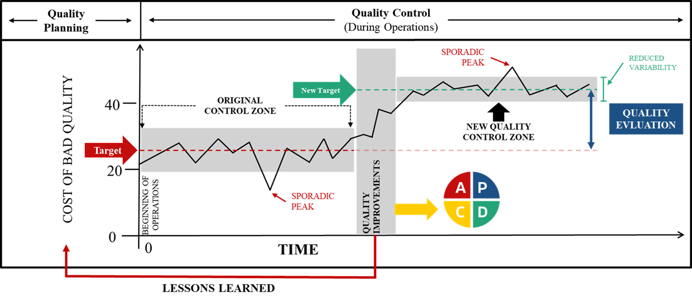

# Gestão da Qualidade e o Método {#sec-cap3}

A busca pela excelência operacional na mineração exige métodos estruturados que permitam medir a discrepância entre o planejamento (*target*) e o desempenho real. Este capítulo aborda as bases da Gestão da Qualidade, conectando a teoria clássica de Juran e os princípios do Controle da Qualidade Total às ferramentas estatísticas aplicadas ao *Mining Analytics*.

## O Conceito de Controle da Qualidade {#sec-conceito-controle}

A Gestão da Qualidade é o conjunto de atividades coordenadas para dirigir e controlar uma organização com foco na excelência de seus processos. O **Controle da Qualidade (CQ)**, especificamente, é definido como o exercício do domínio sobre as dimensões operacionais.

O conceito de controle não se limita a observar passivamente os resultados; ele envolve a busca implacável pelas causas dos problemas, a análise do processo, a padronização das atividades e o replanejamento quando necessário. O Controle da Qualidade é centrado no processo e fundamenta-se em três ações básicas:

1.  **Estabelecimento da Diretriz:** Planejamento que envolve a definição clara de **Metas** (os fins) e dos **Métodos** (os meios).
2.  **Manutenção do Nível de Controle:** Atuação contínua para manter o processo estabilizado, atuando tanto no resultado quanto na causa.
3.  **Alteração da Diretriz (Melhoria):** Replanejamento focado na alteração de metas e métodos para elevar o patamar de desempenho.

::: {.callout-important title="📌 Princípios da Gestão da Qualidade Total"}
Os princípios da Gestão da Qualidade Total ensinam que as necessidades dos clientes determinam o requisito, mas é o *processo empregado* que determina o resultado real. Logo, a **inspeção (verificar apenas o produto no fim da linha) é considerada um método fraco e reativo de controle**. Para satisfazer a especificação de forma rentável, deve-se focar na redução da variação do resultado real por meio da identificação e eliminação preventiva das fontes de variação.
:::

## O Motor da Gestão: A Trilogia de Juran {#sec-trilogia-juran}

A Trilogia de Juran, desenvolvida por Joseph Juran, é uma estrutura de gestão da qualidade composta por três processos fundamentais interligados: **Planejamento da Qualidade**, **Controle da Qualidade** e **Melhoria da Qualidade**. Ela trata a qualidade como um gerenciamento contínuo, focado na adequação ao uso e na redução de custos por falhas.

A @fig-juran-trilogy ilustra a dinâmica temporal entre os três processos:

* **Planejamento:** Cria o processo capaz de cumprir as metas de qualidade.
* **Controle:** Opera o processo, garantindo que os padrões sejam mantidos (Zona Original de Controle).
* **Melhoria:** Otimiza o processo, rompendo com o status quo para atingir níveis inéditos de desempenho (Nova Zona de Controle).

{#fig-juran-trilogy fig-align="center"}

### 1. Planejamento da Qualidade (Quality Planning)
Esta etapa foca em preparar a organização para atingir as metas de qualidade. O planejamento não é apenas definir um número, mas desenvolver produtos e processos robustos que atendam às necessidades dos clientes. O fluxo lógico desta etapa consiste em:

1.  **Identificar os clientes:** Determinar quem são os beneficiários do produto ou serviço (internos e externos).
2.  **Determinar as necessidades:** Descobrir quais são as necessidades reais das partes interessadas.
3.  **Desenvolver o produto/serviço:** Traduzir as necessidades em características técnicas e especificações que respondam a essas demandas.
4.  **Desenvolver o processo:** Criar processos capazes de produzir as características definidas com eficiência e sob condições controladas.
5.  **Transferir para operações:** Levar o planejamento para a execução operacional (chão de fábrica), garantindo que a equipe saiba executar o método definido.

### 2. Controle da Qualidade (Quality Control)
Trata-se do processo contínuo de monitoramento e inspeção durante as operações para assegurar que os padrões de qualidade sejam mantidos. O controle segue um ciclo de feedback constante:

1.  **Avaliar o desempenho atual:** Medir o que está sendo efetivamente produzido na mina ou na planta.
2.  **Comparar com metas:** Analisar a diferença (*gap*) entre o resultado real medido e a meta planejada.
3.  **Atuar sobre a diferença:** Tomar ações corretivas imediatas quando houver desvios, eliminando as causas de falhas para restabelecer a estabilidade.

### 3. Melhoria da Qualidade (Quality Improvement)
É a busca constante para elevar o desempenho da qualidade a níveis superiores, reduzindo ineficiências e otimizando processos. Diferente do controle (que mantém), a melhoria transforma. Suas etapas principais são:

1.  **Estabelecer a infraestrutura:** Criar uma estrutura para a melhoria contínua (ex: formação de comitês, alocação de recursos).
2.  **Identificar projetos:** Selecionar processos prioritários que precisam de intervenção (projetos Kaizen, Six Sigma ou CCQ).
3.  **Analisar a causa raiz:** Identificar por que os problemas ocorrem, indo além dos sintomas.
4.  **Implementar soluções:** Aplicar ações para melhorar o desempenho e evitar recorrências, padronizando o novo nível alcançado.

::: {.callout-tip title="💡 Resumo da Trilogia"}
O **Planejamento** cria o processo, o **Controle** opera o processo (garantindo que ele se mantenha estável), e a **Melhoria** otimiza o processo (elevando-o a um novo patamar).
:::

## A Natureza da Melhoria: Controle vs. Qualidade {#sec-natureza-melhoria}

Aprofundando a etapa de "Melhoria", é fundamental para o engenheiro distinguir as duas vertentes que a compõem, conforme detalhado na @tbl-tipos-melhoria:

| Tipo de Melhoria | Foco | Dimensão | Resultados Esperados |
| :--- | :--- | :--- | :--- |
| **Melhoria NO Controle** | **Processo (Técnico)** | Objetiva. Uso de ferramentas estatísticas (CEP/DOE) para agir no chão de fábrica. | • Diminuição da variabilidade<br>• Maior produtividade<br>• Efeito preventivo<br>• Menores custos da qualidade |
| **Melhoria DA Qualidade** | **Produto (Mercado)** | Subjetiva e Mercadológica. Impacta nas características do produto durante o uso. | • Agregação de valor e preço<br>• Maior participação de mercado<br>• Melhor reputação da marca<br>• Maior lucratividade |

: Diferenças entre Melhoria no Controle e Melhoria da Qualidade. {#tbl-tipos-melhoria}

## A Avaliação da Qualidade: Inspeção e Amostragem {#sec-avaliacao-qualidade}

Tão importante quanto produzir qualidade é avaliá-la corretamente. O Controle da Qualidade concentra-se na tecnologia estatística para realizar essa, utilizam-se **Planos de Amostragem**.

#### 1. Planos de Amostragem por Atributos
Neste método, a avaliação classifica o item qualitativamente como "defeituoso" ou "não defeituoso" (conforme/não conforme).


* **Entradas do Plano:**
    * **NQA (Nível de Qualidade Aceitável):** O limite aceitável de defeitos.
    * **FDT (Fração Defeituosa Tolerável):** A tolerância máxima do processo.
    * **Risco do Produtor ($\alpha$):** A probabilidade de rejeitar um lote bom.
    * **Risco do Consumidor ($\beta$):** A probabilidade de aceitar um lote ruim.
* **Saídas:** Tamanho da amostra ($n$), número de aceitação ($a$) e número de rejeição ($r$).
* **Critério de Decisão:** Se o número de peças defeituosas ($d$) na amostra for menor ou igual ao número de aceitação ($a$), o lote é aceito ($d \le a$). Caso contrário, o lote é rejeitado, podendo ser devolvido ou submetido a inspeção 100%.

#### 2. Planos de Amostragem por Variáveis
Neste método, analisa-se uma característica mensurável do produto (ex: teor de ferro, umidade, granulometria).

* **Procedimento:** 1. Coleta-se uma amostra aleatória de $n$ itens.
    2. Mede-se o valor característico em cada item ($x_1, x_2, \dots, x_n$).
    3. Calcula-se um parâmetro estatístico (como a média aritmética $\bar{x}$ e o desvio padrão $\sigma$).
    4. Compara-se esse parâmetro com o padrão estabelecido para decidir a aceitação ou rejeição do lote.

## Ferramentas Estatísticas de Estabilização e Melhoria {#sec-ferramentas-estatisticas}

Enquanto a inspeção avalia o lote *post-mortem* (depois de produzido), a engenharia moderna foca no controle do processo para reduzir a variabilidade na fonte.

### Controle Estatístico de Processo (CEP)
O PCEP (Planejamento e Controle Estatístico de Processos) envolve atividades para conhecer o processo e detectar variações. Ele utiliza métodos estatísticos (distribuições de probabilidade, inferência) para distinguir dois tipos de causas de variação:


* **Causas Aleatórias (Comuns):** Variação natural e esperada do processo.
* **Causas Atribuíveis (Especiais):** Falhas específicas que devem ser identificadas e eliminadas.

O objetivo do CEP é estabilizar o processo, garantindo previsibilidade através de **Gráficos de Controle** e da definição correta de limites.

### Planejamento de Experimentos (DOE)
O *Design of Experiments* (DOE) é utilizado para melhorar o processo produtivo através da identificação preventiva das causas da variabilidade. O DOE busca responder:


* Quais variáveis ($x$'s) são mais influentes na resposta final ($y$)?
* Qual valor deve ser atribuído a cada variável para que $y$ atinja a meta?
* Como minimizar os efeitos das variáveis não controláveis (ruídos)?

**A Relação CEP vs. DOE:**
São ferramentas complementares e intimamente correlacionadas. Se um processo está sob controle estatístico (CEP), mas sua capacidade ainda é inferior à exigida (muita variação natural), o DOE oferece uma maneira mais eficaz de reduzir a variabilidade restante do que apenas o monitoramento contínuo.

### Planejamento da Qualidade: A Engenharia de Metas {#sec-planejamento-detalhado}

Segundo Juran, o Planejamento da Qualidade é a atividade de desenvolvimento dos produtos e processos exigidos para a satisfação das necessidades dos clientes. Na mineração, esta etapa é frequentemente negligenciada ou confundida com o simples agendamento de lavra. No entanto, é aqui que se define a capacidade da organização de entregar valor.

Para estruturar este planejamento, devemos primeiro alinhar as definições normativas que sustentam a gestão:

::: {.callout-note title="📌 Conceitos Fundamentais (ISO)"}
* **Qualidade (3.6.2):** O grau em que um conjunto de características inerentes de um objeto satisfaz a **requisitos**.
* **Gestão da Qualidade (3.3.4):** Atividades coordenadas para dirigir e controlar uma organização no que diz respeito à qualidade. Inclui o estabelecimento de políticas e objetivos.
* **Política da Qualidade (3.5.9):** Intenções e diretrizes globais da organização, geralmente alinhada à visão e missão, fornecendo a estrutura para os objetivos.
* **Objetivos da Qualidade (3.7.2):** Aquilo que se busca ou almeja. Devem ser coerentes com a política, mensuráveis e desdobráveis em níveis táticos e operacionais.
:::

#### O Roteiro de Juran

O planejamento segue um fluxo lógico de 6 passos definidos por Juran para converter necessidades abstratas em operação física:

1.  **Estabelecer metas de qualidade:** Definir o alvo estratégico.
2.  **Identificar os clientes:** Quem são as partes interessadas? (Siderúrgicas, Pelotização, Acionistas).
3.  **Determinar as necessidades dos clientes:** Traduzir expectativas em requisitos técnicos (Teor, Granulometria, Contaminantes).
4.  **Desenvolver características do produto:** Especificação técnica do minério (*Sinter Feed*, *Pellet Feed*).
5.  **Desenvolver características do processo:** O desenho da lavra, o plano de fogo e a rota de beneficiamento capazes de atingir o produto.
6.  **Estabelecer controles e transferir para operações:** Garantir que a operação (chão de fábrica) saiba executar o plano sob condições controladas.

#### A Tríade da Engenharia de Metas: Previsão, Meta e Planejamento

Na engenharia de processos e na gestão corporativa, projetar cenários é uma atividade analítica fundamental para embasar decisões sobre alocação de frota, logística e dimensionamento de pessoal. Contudo, é um erro gerencial clássico — e frequentemente fatal para o orçamento — tratar Previsão, Meta e Planejamento como sinônimos. Para que a excelência operacional seja atingida, é vital separar rigorosamente esses três conceitos:

* **Previsão (*Forecast*):** Trata-se do esforço analítico e estatístico para predizer o futuro com a máxima exatidão técnica possível. A previsão é calculada considerando o histórico de dados consolidados e a modelagem de eventos futuros conhecidos. Em suma, a previsão responde à pergunta estatística: *"O que acontecerá com a nossa produção se não fizermos nada de diferente?"*
* **Metas (*Targets*):** Representam o estado futuro desejado pela organização; aquilo que a diretoria *gostaria* que acontecesse. Idealmente, as metas devem nascer ancoradas nas previsões e suportadas por planos de ação. Na prática, porém, é comum que organizações estipulem metas baseadas puramente em pressões financeiras ou "vontade política", ignorando completamente se os números são viáveis ou realistas frente à capacidade atual do sistema.
* **Planejamento:** É a ponte executiva entre a previsão e a meta. Constitui o conjunto de ações deliberadas, mudanças de método e alocação de novos recursos necessários para forçar a curva natural da *Previsão* a se encontrar com a *Meta*. Planejar é, por definição, agir metodicamente para alterar o futuro projetado.

Para que a tomada de decisão seja efetiva, a organização exige que essa tríade seja aplicada em diferentes horizontes temporais, dependendo do escopo da operação:

1. **Horizonte de Curto Prazo:** Foco imediato na estabilidade da rotina. É vital para o dimensionamento de turnos, programação de manutenções semanais, controle de transporte e atendimento da demanda imediata da planta de beneficiamento.
2. **Horizonte de Médio Prazo:** Direcionado à garantia de capacidade operacional. Envolve a projeção de necessidades futuras, como a aquisição de insumos críticos, planejamento de paradas de usina, contratação de mão de obra técnica e compra de maquinário de apoio.
3. **Horizonte de Longo Prazo:** Foco no posicionamento estratégico e na sobrevivência do negócio. Envolve o plano de exaustão da mina, análise de oportunidades de mercado, adaptação a novas exigências socioambientais e expansão de infraestrutura pesada.

Para sustentar toda essa arquitetura, a mineração moderna não pode depender de intuição. É imperativo desenvolver um ecossistema de *Analytics* robusto, combinando metodologias matemáticas, expertise técnica para modelar os problemas e, sobretudo, o patrocínio incondicional da alta liderança. Somente com esse apoio estrutural o uso de métodos formais de previsão deixa de ser um exercício acadêmico e passa a ditar as regras do sucesso da companhia.

::: {.callout-important title="🎯 O Conceito de Gap e Planejamento"}
A Meta deve ser definida com base na identificação de uma **Lacuna (Gap)**. O Planejamento da Qualidade é, em essência, a resposta às previsões e metas; é o processo de definição das ações necessárias para alinhar a previsão (o histórico) com o objetivo (o desejado).
:::

Para que uma meta seja válida, ela deve seguir o critério **SMART**:
* **S (Specific):** Específica (Qual objeto? Produção? Teor? Confiabilidade?).
* **M (Measurable):** Mensurável.
* **A (Achievable):** Atingível (Está em nosso poder realizá-la?).
* **R (Realistic):** Realista (Baseada em capacidade técnica e dados).
* **T (Timely):** Temporal (Quando exatamente?).

#### Metodologia de Definição: Baseline e Benchmarking

Para transformar o desejo em número realista, utilizamos a engenharia de confiabilidade e análise de dados. O processo de definição da lacuna segue a estrutura:

1.  **Baseline (Linha de Base):** Análise estatística do histórico (ex: últimos 3 ou 4 anos). Recomenda-se o uso da **Média Aparada** para remover *outliers* (eventos extremos que sujam a análise) e garantir robustez estatística.
2.  **Benchmarking:** Técnica de análise comparativa para definir a referência.
    * *Referência Interna:* Melhor desempenho histórico da própria unidade.
    * *Referência Técnica:* Limite do equipamento ou vida útil teórica.
    * *Referência Externa/Setor:* Desempenho dos concorrentes ou "Best in Class".
3.  **Cenários:** A definição da meta deve considerar cenários (Conservador, Moderado e Agressivo) baseados no risco que a organização deseja assumir.

---

### Estudo de Caso: Definição de Meta de MTBF (Carregamento e Transporte) {#sec-caso-mtbf}

Para ilustrar a aplicação prática deste método de planejamento, analisamos a etapa de **Lavra**, especificamente o ciclo de Carregamento e Transporte.

**O Processo:**
O ciclo operacional de um caminhão fora de estrada é composto pelos tempos:
$$Ciclo = TFC + TC + TMC + TVC + TFB + TB + TVV$$
Onde:
* *TFC:* Tempo de Fila para Carregar
* *TC:* Tempo de Carregamento
* *TMC:* Tempo de Manobra no Carregamento
* *TVC:* Tempo de Viagem Cheio
* *TFB:* Tempo de Fila para Bascular
* *TB:* Tempo de Basculamento
* *TVV:* Tempo de Viagem Vazio

**O Problema (Identificação da Lacuna):**
Para garantir a produtividade deste ciclo, a confiabilidade da frota é o KPI diretor. O objetivo é definir a meta de **MTBF (Mean Time Between Failures)** para o ano de 2024.

**Execução do Planejamento:**

1.  **Análise Histórica (Baseline):**
    * Foram analisados 41 meses de dados (Agosto/2020 a Dezembro/2023).
    * Comparou-se o número de caminhões físicos *versus* a frota programada.
    * Calculou-se a média aparada do MTBF histórico, identificando um baseline consolidado próximo a **42 horas**.

2.  **Benchmarking e Cenários:**
    * Identificou-se que a referência técnica para este modelo de equipamento permitia atingir até 50 horas em condições ideais.
    * Foram traçados cenários de melhoria baseados na eliminação de falhas crônicas.

3.  **Validação Estatística (Probabilidade):**

    * Utilizando software estatístico (Minitab), modelou-se a distribuição dos dados.
    * A premissa adotada foi definir uma meta que tivesse uma **probabilidade de sucesso superior a 53%**. Isso garante que a meta é desafiadora, mas matematicamente viável (Realista/SMART).

**Resultado Final:**
A Meta de MTBF para a frota foi definida em **46 horas** a partir de janeiro de 2024. Este valor representa o equilíbrio técnico entre o histórico (Baseline) e o potencial do ativo (Benchmark), fundamentado em dados e não em suposições.


### O Paralelo: O Mapa de Juran e a Modelagem Analítica

Embora a Trilogia de Juran tenha sido formulada no século XX, seu roteiro original de "Planejamento da Qualidade" (composto por 9 passos) continua sendo o alicerce da engenharia de processos. A grande diferença contemporânea é a capacidade de quantificar matematicamente etapas que antes eram apenas conceituais.

No Capítulo 2 desta obra, detalhamos a **Modelagem Analítica de Requisitos (ARM)**. Aquela estrutura matemática é, na prática, a execução rigorosa e moderna dos passos clássicos de Juran.

A @tbl-paralelo-juran demonstra como a teoria de Juran se conecta com as ferramentas de modelagem que construímos anteriormente:

```{r}
#| label: tbl-paralelo-juran
#| tbl-cap: "Paralelo entre o Mapa de Planejamento de Juran e a Modelagem Analítica de Requisitos (ARM)."
#| echo: false
#| message: false
#| warning: false

library(knitr)
library(kableExtra)

df_juran <- data.frame(
    Passo = c("1 e 2", "3", "4 e 5", "6 e 7", "8 e 9"),
    Juran = c(
        "Identificar os clientes (internos/externos) e determinar suas necessidades reais.",
        "Traduzir as necessidades para a linguagem técnica da empresa.",
        "Desenvolver o produto e otimizar suas características.",
        "Desenvolver o processo capaz de produzir as características e otimizá-lo.",
        "Provar a capacidade do processo e transferi-lo para a Operação (Controle)."
    ),
    Aplicacao = c(
        "Levantamento exploratório das variáveis (Abordagem Bottom-up ou Top-down).",
        "Consolidação das variáveis soltas (V_{i}) em grandes Dimensões de Gestão (D_{j}).",
        "Cálculo do ARM, utilizando matrizes (ex: Mudge) para calibrar os pesos (W_{i}).",
        "Parametrização do Desempenho (S_{i}) através de Funções de Valor e Metas SMART.",
        "Produção (Conformação) e início da Zona de Controle da Qualidade operacional."
    )
)

df_juran %>%
    kable(
        col.names = c("Passos", "O Mapa de Juran (Teoria Clássica)", "A Modelagem Analítica (ARM - Cap 2)"),
        align = "cll",
        booktabs = TRUE
    ) %>%
    kable_styling(bootstrap_options = c("striped", "hover"), full_width = FALSE, font_size = 14) %>%
    column_spec(1, bold = TRUE, width = "1.5cm") %>%
    column_spec(2, width = "6.5cm", background = "#f9f9f9") %>%
    column_spec(3, width = "8.5cm", border_left = TRUE) %>%
    row_spec(0, background = "#2c3e50", color = "white", bold = TRUE)
```

Essa correlação evidencia que o "Planejamento" termina quando o Passo 9 é atingido e a equipe de engenharia entrega a equação do ARM parametrizada para o chão de fábrica executar. Neste momento, o processo entra na Zona de Controle.

É apenas quando a Qualidade de Conformação falha e o controle detecta um "Pico Esporádico" que a organização é forçada a acionar a terceira perna da trilogia: a Melhoria da Qualidade, operada por meio do ciclo PDCA.

## O Caminho da Solução: PDCA e MASP {#sec-caminho-solucao}

O ciclo PDCA, como uma metodologia para melhoria, é uma ferramenta simples que promove alterações graduais no processo, impulsionando assim o desenvolvimento da empresa. O ciclo, conforme apresentado na @fig-ciclo-pdca, é dividido em etapas de planejamento (PLAN), execução (DO), verificação (CHECK) e ação (ACT).

{#fig-ciclo-pdca fig-align="center"}

::: {.callout-note title="📌 DEFINIÇÃO NORMATIVA"}
De acordo com Mendes (2007), o ciclo PDCA é um método estruturado para a melhoria contínua dos processos nas organizações, dividido nas seguintes etapas:

* **PLAN (Planejar):** Definir a situação atual, estabelecer metas mensuráveis e estratégias para alcançá-las.
* **DO (Executar):** Iniciar o processo, educar/treinar os envolvidos e implementar as estratégias definidas.
* **CHECK (Verificar):** Analisar e comparar os resultados obtidos contra os padrões esperados (metas).
* **ACT (Agir/Padronizar):** Tomar ações corretivas ou padronizar a melhoria com base na verificação dos resultados.
:::

Para que essas etapas sejam realizadas com eficácia, é essencial que as subetapas sejam definidas com precisão. É importante destacar que a etapa de planejamento (PLAN) exige o maior rigor e dedicação de tempo do projeto. A identificação e priorização das métricas proporcionarão uma investigação aprofundada das causas dos problemas, embasando as propostas de mudança em métodos estruturados.

::: {.callout-warning title="⚠️ ARMADILHA DE ENGENHARIA"}
O erro mais comum em projetos de melhoria é a "Miopia de Ação": a equipe pular a fase de Planejamento (P) e ir direto para a Execução (D). Implementar soluções baseadas em "achismos" e não em dados estratificados consome recursos financeiros da empresa e, na esmagadora maioria das vezes, ataca apenas o sintoma, permitindo que a falha real retorne no mês seguinte.
:::

## Fases e Atividades do Ciclo PDCA (MASP)

A tabela a seguir consolida a estrutura metodológica e o cronograma do projeto, servindo como a principal ferramenta de controle e auditoria das etapas — o Método de Análise e Solução de Problemas (MASP). A coluna *Status* é destinada ao acompanhamento qualitativo da evolução das tarefas.

```{r}
#| label: tbl-atividades-pdca-detalhada
#| tbl-cap: "Detalhamento das fases, etapas e atividades do MASP/PDCA aplicadas à gestão na mineração."
#| echo: false
#| message: false
#| warning: false

library(knitr)
library(kableExtra)
library(dplyr)

df_pdca <- data.frame(
    Fases = c(rep("P", 13), rep("D", 3), rep("C", 2), rep("A", 3)),
    Etapas = c(
        rep("Identificação do problema", 3), rep("Análise do Fenômeno", 3),
        rep("Análise do Processo", 3), rep("Estabelecimento do Plano de Ação", 4),
        rep("Execução do Plano de Ação", 3), rep("Verificação dos Resultados", 2),
        rep("Padronização", 3)
    ),
    Atividades = c(
        "Identificação das prioridades", "Estabelecimento da meta do projeto", "Quantificação dos ganhos do projeto",
        "Estratificação do problema", "Estudo das variações", "Definição das metas específicas",
        "Levantamento das causas potenciais", "Priorização das causas potenciais", "Quantificação das causas priorizadas",
        "Levantamento das possíveis soluções", "Priorização das possíveis soluções", "Realização de teste piloto (se necessário)", "Estabelecimento do plano de ação",
        "Comunicação do plano de ação", "Realização de treinamentos dos envolvidos", "Implantação e acompanhamento do plano de ação",
        "Verificação do alcance da meta geral e das metas específicas", "Quantificação dos ganhos do projeto",
        "Padronização das novas atividades", "Implantação de plano para monitoramento do processo", "Implantação de plano de ações corretivas"
    )
)

cores_id <- case_when(
    df_pdca$Fases == "P" & df_pdca$Etapas == "Identificação do problema" ~ "#174EA6",
    df_pdca$Fases == "P" & df_pdca$Etapas == "Análise do Fenômeno" ~ "#4285F4",
    df_pdca$Fases == "P" & df_pdca$Etapas == "Análise do Processo" ~ "#1A73E8",
    df_pdca$Fases == "P" & df_pdca$Etapas == "Estabelecimento do Plano de Ação" ~ "#8AB4F8",
    df_pdca$Fases == "D" ~ "#FBBC05",
    df_pdca$Fases == "C" ~ "#EA4335",
    df_pdca$Fases == "A" ~ "#34A853",
    TRUE ~ "white"
)

texto_cor <- ifelse(cores_id %in% c("#FBBC05", "#8AB4F8"), "black", "white")

df_pdca %>%
    kable(
        col.names = c("Fases", "Etapas", "Atividades"),
        align = "cll",
        booktabs = TRUE
    ) %>%
    kable_styling(bootstrap_options = c("striped", "hover", "condensed"), full_width = FALSE, font_size = 13) %>%
    column_spec(1, bold = TRUE, color = texto_cor, background = cores_id, width = "0.7cm") %>%
    column_spec(2, bold = TRUE, color = texto_cor, background = cores_id, width = "6.5cm") %>%
    column_spec(3, width = "12cm", background = "white", color = "black") %>%
    row_spec(0, background = "#35978f", color = "white", bold = TRUE) %>%
    collapse_rows(columns = 1:2, valign = "middle")
```

### Análise do Fluxo Metodológico

Conforme observado na tabela executiva, o ciclo inicia-se na **Identificação do Problema**, onde a definição das prioridades e a meta global servem de base para as atividades seguintes. Na **Análise do Fenômeno**, ocorre a estratificação dos dados e o estudo das variações, permitindo que a pesquisa tome forma sobre os principais KPIs a serem utilizados.

::: {.callout-important title="🛠️ LABORATÓRIO DE ENGENHARIA: Fase 1 (Identificação do Problema)"}
**Mão na massa:** Chegou a hora de iniciar o seu projeto aplicado.
Para esta etapa, crie um documento contendo:

1. **Termo de Abertura (TAP):** Nome do projeto, justificativa (por que este problema afeta a operação?), objetivos SMART e restrições.
2. **Matriz de Responsabilidades (RACI):** Quem executa, aprova, é consultado e informado.
3. **Definição do *Gap*:** Construa um comparativo gráfico entre o Indicador Real x Planejado. O "problema" do seu projeto será a diferença métrica entre esses dois valores.
:::

### O Mapeamento de Fronteiras: O Sistema de Produção e a Matriz SIPOC {#sec-sipoc}

Antes de mergulhar nas causas de um problema usando o Pareto ou o Ishikawa, a equipe de engenharia precisa garantir que todos compreendam o fluxo macro do processo e as suas fronteiras. O maior erro de um projeto de melhoria é a equipe não saber onde o processo começa e onde ele termina, correndo o risco de tentar "abraçar o mundo".

Para delimitar esse escopo, utilizamos a visão clássica do **Sistema de Produção**. Conforme ilustrado na @fig-sistema-producao, todo processo é um conjunto de atividades estruturadas que recebem entradas, aplicam uma metodologia de transformação utilizando recursos (pessoas, instalações, tecnologia) e geram saídas (produtos ou serviços), interagindo o tempo todo com variáveis ambientais e de segurança.

{#fig-sistema-producao fig-align="center"}

No método MASP, essa visão estrutural é operacionalizada pela ferramenta **SIPOC**, um acrônimo que padroniza o mapeamento de qualquer processo na operação mineral:

* **S (*Supplier* / Fornecedor):** Quem fornece os insumos ou informações para o processo iniciar? *(Ex: Equipe de Topografia e Planejamento de Mina).*
* **I (*Input* / Entrada):** Quais são os "Recursos a serem transformados" fornecidos? *(Ex: Malha de perfuração e plano de fogo).*
* **P (*Process* / Processo):** Quais são as macroatividades da "Metodologia de Processamento" (limitado a 5 ou 6 passos)? *(Ex: Posicionar perfuratriz $\rightarrow$ Furar $\rightarrow$ Carregar explosivo $\rightarrow$ Detonar).*
* **O (*Output* / Saída):** O que o processo efetivamente gera na "Saída"? *(Ex: Minério desmontado com granulometria específica).*
* **C (*Customer* / Cliente):** Quem recebe essa saída? *(Ex: Equipe de Carregamento / Operadores de Escavadeira).*

::: {.callout-note title="💡 INSIGHT OPERACIONAL"}
Na mineração, construir o SIPOC resolve 50% dos conflitos entre departamentos durante a fase de planejamento de um projeto. Ele deixa claro visualmente que se a Topografia (*Supplier*) entregar uma malha inadequada (*Input*), a detonação (*Process*) vai gerar matacões (*Output*), prejudicando a produtividade da escavadeira (*Customer*). O SIPOC define a responsabilidade de ponta a ponta e blinda as fronteiras do seu Termo de Abertura (TAP).
:::

### Análise do Processo: Ishikawa, 5 Porquês e Matriz GUT

Uma vez que o Gráfico de Pareto indicou *onde* o problema está concentrado, a fase passa para a **Análise do Processo**, que visa responder *por que* o problema ocorre.

A ferramenta primária é o **Diagrama de Ishikawa** (também conhecido como Diagrama de Espinha de Peixe ou Causa e Efeito). Ele organiza o *Brainstorming* da equipe classificando as possíveis origens do problema em seis categorias clássicas (os 6M):

1. **Máquina:** Falhas no equipamento ou manutenção inadequada.
2. **Material:** Insumos fora de especificação ou peças de má qualidade.
3. **Mão de Obra:** Falta de treinamento, desatenção ou fadiga do operador.
4. **Método:** Procedimentos operacionais (POPs) falhos ou inexistentes.
5. **Medida:** Erros de calibração em sensores ou indicadores mal calculados.
6. **Meio Ambiente:** Condições externas (chuva na mina, poeira, temperatura).

::: {.callout-tip title="💡 INSIGHT OPERACIONAL"}
Um erro comum é preencher o Ishikawa com "Falta de..." (ex: falta de treinamento, falta de peça). A falta de algo é uma solução ausente, não uma causa. A equipe deve descrever a anomalia real (ex: "Treinamento desatualizado para o modelo 793D" ou "Peça sofreu desgaste abrasivo prematuro").
:::

Com o diagrama preenchido, a equipe utiliza a **Matriz GUT** (Gravidade, Urgência e Tendência) para pontuar as causas e priorizar qual braço do diagrama será atacado primeiro.

Finalmente, para a causa vencedora da matriz GUT, aplica-se a técnica dos **5 Porquês**. A equipe deve perguntar o motivo do problema sucessivas vezes até ultrapassar os sintomas superficiais e atingir a verdadeira causa raiz (a anomalia sistêmica que, se removida, impede que o problema volte a acontecer).

::: {.callout-important title="🛠️ LABORATÓRIO DE ENGENHARIA: Fase 3 (Análise do Processo)"}
**Mão na massa: (Tarefa 06)**
1. **Ishikawa (6M):** Reúna sua equipe e faça um *Brainstorming* para mapear as possíveis causas do problema que venceu no seu Gráfico de Pareto.
2. **Priorização (GUT):** Utilize a Matriz GUT para decidir, de forma técnica e fria, quais causas mapeadas no Ishikawa serão efetivamente atacadas.
3. **Os 5 Porquês:** Aplique a técnica para a causa prioritária. Garanta que o plano de ação não foque em sintomas, mas sim na origem do problema.
:::

## O Chão de Fábrica e Ativos {#sec-chao-de-fabrica}

Nenhuma equação de qualidade ou modelagem estatística se sustenta na prática sem os dois pilares físicos e fundamentais da operação industrial: **as pessoas e as máquinas**. O Passo 10 da nossa trilha de excelência garante que, uma vez que o método de solução de problemas (MASP) tenha sido desenhado na engenharia, ele seja executado com precisão e sustentado pelas engrenagens de campo.

### O Engajamento Humano: Círculos de Controle da Qualidade (CCQ)

Historicamente, a mineração possuía uma gestão rigidamente vertical (comando e controle), onde a engenharia pensava e a operação apenas executava. O moderno *Mining Analytics* prova que essa barreira é disfuncional. Quem conhece a verdadeira "dor" do processo e os pequenos desvios não reportados não é o analista sentado no escritório, mas o operador dentro da cabine da escavadeira.

Para transformar essa experiência empírica em dados técnicos, a Gestão da Qualidade utiliza os **Círculos de Controle da Qualidade (CCQ)**.

O CCQ é um grupo voluntário de trabalhadores da mesma área que se reúne regularmente para identificar, analisar e solucionar problemas que afetam seus processos ou a qualidade do produto. A grande força dessa ferramenta é a inversão da abordagem hierárquica: a melhoria nasce de baixo para cima (*Bottom-up*).

#### Benefícios Diretos do CCQ na Mineração:
* **Detecção Precoce:** Os operadores costumam perceber mudanças sutis de som, vibração ou temperatura nos equipamentos semanas antes de um sensor emitir um alarme catastrófico.
* **Soluções de Baixo Custo:** Por estarem na linha de frente, as soluções propostas pelos círculos tendem a ser adaptações mecânicas criativas e baratas, em oposição às reestruturações milionárias propostas pelas diretorias.
* **Mudança de Cultura:** O colaborador deixa de ser um "apertador de botão" e passa a ser o dono do seu processo (sentimento de pertencimento e valorização).

::: {.callout-important title="🛠️ LABORATÓRIO DE ENGENHARIA: Dinâmica do CCQ"}
**Como estruturar um Círculo:**
1. **Treinamento Básico:** Capacite os operadores da linha de frente nas 7 Ferramentas Básicas (Pareto, Ishikawa, 5 Porquês). Eles precisam falar a mesma linguagem da engenharia.
2. **Tempo Dedicado:** O grupo deve ter de 1 a 2 horas semanais, durante o expediente, liberadas e pagas pela empresa para debater problemas. Reuniões de CCQ fora do horário não engajam.
3. **Reconhecimento:** Quando uma ideia do grupo gera redução de custo ou aumento de produção, o reconhecimento deve ser público e, de preferência, acompanhado de incentivos financeiros atrelados ao ganho.
:::

### A Confiabilidade Física: Gestão e Manutenção de Ativos

Se o ser humano engajado é a inteligência do chão de fábrica, o equipamento é a força bruta que garante o resultado quantitativo do MASP. A mineração é a indústria do maquinário pesado. Caminhões fora de estrada, perfuratrizes gigantescas e moinhos industriais operam em regimes de trabalho extenuantes (24 horas por dia, sujeitos a poeira, umidade e altíssimo torque).

A melhoria da qualidade na mineração é indissociável da **Gestão de Manutenção**. Um indicador de qualidade cai imediatamente quando a máquina entra em falha. A evolução da confiabilidade na gestão divide a manutenção em quatro grandes estratégias:

1. **Manutenção Corretiva (Reativa):** É o modelo mais caro e perigoso. Ocorre apenas quando o equipamento quebra. Gera lucro zero, para a produção de forma não programada e oferece grandes riscos à segurança dos operadores.
2. **Manutenção Preventiva (Baseada no Tempo):** É a manutenção estipulada pelo manual do fabricante (ex: trocar o óleo a cada 500 horas de motor). Melhora a segurança, mas muitas vezes troca-se uma peça que ainda possuía vida útil, encarecendo a operação.
3. **Manutenção Preditiva (Baseada na Condição):** Aqui a ciência de dados e a engenharia da qualidade começam a brilhar. Ao invés de trocar a peça por tempo, a engenharia monitora os sinais vitais do equipamento (ex: termografia de painéis elétricos, análise química do óleo, sensores de vibração de rolamentos). A peça só é trocada quando o sensor prevê a falha iminente.
4. **Manutenção Prescritiva (Analytics/Machine Learning):** O estado da arte. Utiliza Inteligência Artificial e modelos matemáticos para cruzar dados históricos de operação e desgaste. O algoritmo prescreve não apenas *quando* a máquina vai falhar, mas ajusta os parâmetros de operação autonomamente para esticar a vida útil (Ex: "Abaixe o limite de RPM na subida de rampa para o caminhão não fundir o motor até a próxima parada de oficina programada").

::: {.callout-note title="💡 INSIGHT OPERACIONAL: A Guerra entre Produção e Manutenção"}
Um dos maiores gargalos organizacionais da mineração é o conflito de interesses entre a área de **Operação** (que é cobrada para bater a meta de volume de toneladas) e a área de **Manutenção** (que é cobrada para parar a máquina e realizar preventivas). Sem a aplicação da Metodologia ARM para equilibrar os pesos ($W_i$) dessas áreas, a Operação "passa por cima" do plano de manutenção, gerando faturamento de curto prazo e destruição do equipamento a longo prazo.
:::