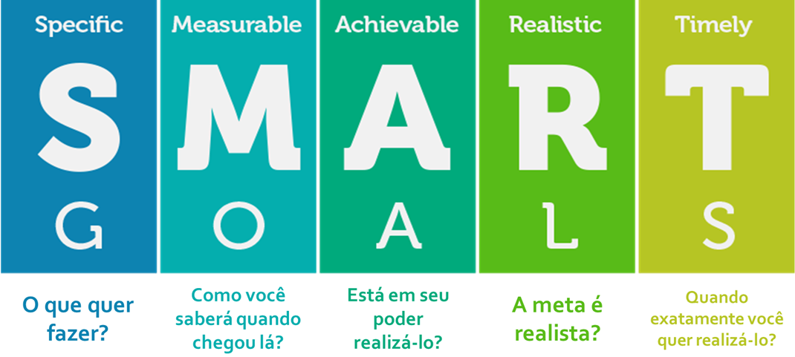
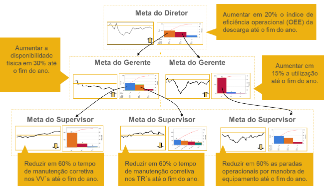
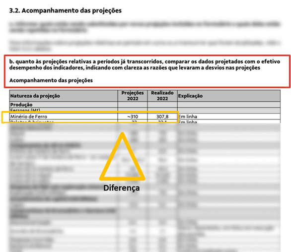
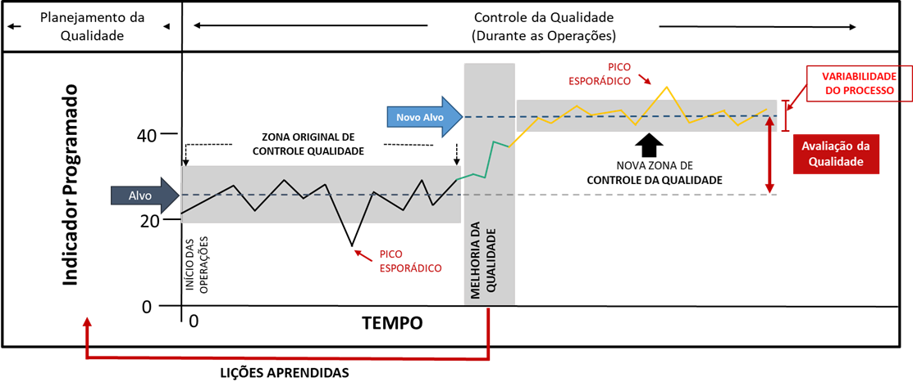
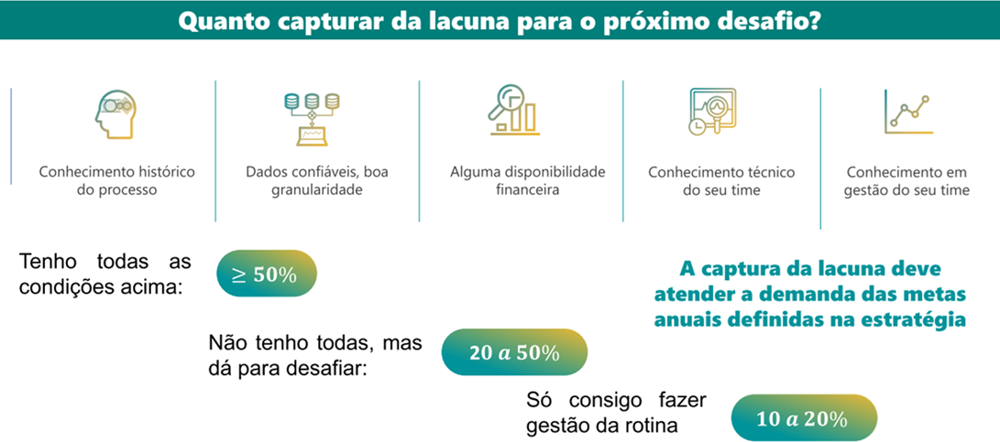

# A Alma do Negócio: Sistemas de Gestão e Estratégia {#sec-cap4}

::: {.callout-tip title="🎯 Objetivos deste Capítulo"}
* Compreender a transição entre o Planejamento e o Controle da Qualidade.
* Diferenciar Eficácia e Eficiência utilizando a modelagem ARM.
* Entender a aplicação prática do ciclo SDCA na rotina da mineração.
:::

No @sec-cap1, estabelecemos a pedra angular da nossa modelagem:

::: {.callout-note title="📌 DEFINIÇÃO NORMATIVA"}
**Qualidade (3.6.2):** Grau em que o conjunto de características (3.10.1) inerentes de um objeto (3.6.1) satisfaz requisitos (3.6.4).
:::

No entanto, a qualidade por si só é um estado passivo. Para que ela seja alcançada de forma repetível em uma operação industrial, ela precisa ser ativamente direcionada. É neste ponto que introduzimos os conceitos de controle corporativo:

::: {.callout-note title="📌 DEFINIÇÃO NORMATIVA"}
* **Gestão (3.3.3):**
  Atividades controladas para dirigir e controlar uma organização (3.2.1).
* **Organização (3.2.1):**
  Pessoa ou grupo de pessoas com suas próprias funções com responsabilidades, autoridades e relações para alcançar seus objetivos (3.7.1).
:::

Quando fundimos esses elementos — o estado desejado (Qualidade) com a ação de direcionamento (Gestão) sobre uma empresa (Organização) —, nasce a premissa central do nosso sistema:

::: {.callout-note title="📌 DEFINIÇÃO NORMATIVA"}
**Gestão da Qualidade (3.3.4):** Gestão (3.3.3) que diz respeito à qualidade (3.6.2).

* **NOTA 1:** A Gestão da qualidade pode incluir o estabelecimento de políticas da qualidade (3.5.9), objetivos da qualidade (3.7.2) e processos (3.4.1). Os objetivos da qualidade podem ser alcançados por meio do planejamento da qualidade (3.3.5), da garantia da qualidade (3.3.6), do controle da qualidade (3.3.7) e da melhoria da qualidade (3.3.8).
:::

A **NOTA 1** da Gestão da Qualidade é o verdadeiro "mapa tático" da engenharia de produção. Para transformar essa teoria em prática, desmembraremos esta nota passo a passo, mostrando como ela puxa toda a estrutura do nosso livro.

## A Estrutura Diretiva: Políticas, Visão e Missão {#sec-estrutura-diretiva}

A Nota 1 da definição de Gestão da Qualidade indica que o sistema é puxado, em primeiro lugar, pelo estabelecimento de **Políticas**. A política não nasce do vazio; ela é orientada pelas aspirações máximas da Alta Direção e serve como a "Constituição" do sistema produtivo.

::: {.callout-note title="📌 DEFINIÇÃO NORMATIVA"}
* **Visão (3.5.10):** Aspiração do que uma organização (3.2.1) gostaria de se tornar, como expresso pela Alta Direção (3.1.1).
* **Missão (3.5.11):** Propósito da existência da organização (3.2.1).
* **Política da Qualidade (3.5.9):** Intenções e diretrizes globais de uma organização relativas à qualidade, formalmente expressas pela Alta Direção.
  * *NOTA 1:* A política da qualidade geralmente é consistente com a política geral da organização, pode ser alinhada com a visão e a missão, e provê uma estrutura para se estabelecerem os objetivos da qualidade.
:::

A Política da Qualidade deixou de ser uma formalidade burocrática para se tornar um pilar estratégico. Ela deve refletir o compromisso da empresa com a melhoria contínua e o cumprimento de normas globais (como a ISO 9001). Para ser eficaz, deve obedecer a quatro princípios fundamentais:

1. **Foco no Cliente:** Garantir que produtos e processos atendam às expectativas de uso e contrato.

2. **Liderança e Comprometimento:** A Alta Direção deve liderar pelo exemplo, garantindo que a política seja compreendida em todos os níveis.

3. **Decisão Baseada em Evidências:** A gestão deve ser guiada por dados reais, minimizando riscos operacionais.

4. **Melhoria Contínua:** A política deve promover a evolução constante através do ciclo PDCA (*Plan-Do-Check-Act*).

### Roteiro de Implementação da Política

Para transformar a Política da Qualidade em prática operacional, a engenharia deve seguir um plano de ação metódico:

1. **Alinhamento Estratégico:** A política deve derivar diretamente da Missão e Visão. Se a estratégia é "baixo custo", a política foca em redução de desperdício; se é "inovação", foca em flexibilidade.

2. **Diagnóstico Inicial:** Antes de escrever a política, utiliza-se ferramentas como a análise **FMEA (Análise de Modos e Efeitos de Falha)** para identificar as fragilidades atuais dos processos e onde a política precisa ser mais rígida.

3. **Formalização e Disseminação:** A redação deve ser clara. Após aprovada, deve ser treinada exaustivamente para que cada colaborador saiba como sua função impacta a qualidade final.

4. **Monitoramento:** A política deve ser auditável e verificada através de auditorias internas e da análise crítica de indicadores.

### Estudo de Caso: O Arcabouço Estratégico na Mineração

Para materializar essa arquitetura teórica, podemos analisar o direcionamento estratégico de uma das maiores produtoras globais de minério de ferro, a Vale[^1]. A empresa estrutura sua identidade corporativa substituindo os termos clássicos por nomenclaturas orientadas à ação:

{#fig-estrategia-vale fig-align="center"}

* **Propósito (A Missão):** "Existimos para melhorar a vida e transformar o futuro. Juntos."

* **Ambições (A Visão):** A organização busca ser reconhecida pela sociedade como referência em segurança, a melhor operadora e mais confiável, além de líder em mineração sustentável.

* **Valores e Comportamentos:** A base cultural exige premissas inegociáveis, como "A vida em primeiro lugar" e a "Obsessão por segurança e gestão de riscos".

Essa estrutura filosófica é operacionalizada por meio de alavancas, como a Inovação e o VPS (Sistema de Gestão Vale). A partir daí, a política de qualidade desdobra-se em pilares estratégicos de execução para a "Vale do futuro":

1. **Portfólio Superior:** Foco no fornecimento de minério de ferro de alta flexibilidade e qualidade, com rápida adaptação às necessidades dos clientes e fornecimento de materiais para a transição energética.

2. **Orientada para Desempenho:** Busca por excelência operacional, confiabilidade das operações, integridade dos ativos e avanços na mineração circular.

3. **Parceira Confiável e Sustentável:** Adoção de uma abordagem de "operador sustentável", com metas agressivas (redução de 16% nas emissões até 2030) e gestão rigorosa de barragens.

#### A Governança como Blindagem da Política

Uma política de qualidade só sobrevive se houver uma governança que force o seu cumprimento. Na Vale, para garantir que a "Obsessão por segurança" não seja atropelada pela pressão por volume de produção, a organização atrela 25% da remuneração variável de longo prazo de seus executivos diretamente a metas ESG. Além disso, as áreas de Saúde, Segurança, Geotecnia e *Compliance* não possuem indicadores de resultados financeiros ou de produção em seus painéis, garantindo dedicação integral à mitigação de riscos.

[^1]: Dados e diretrizes estratégicas extraídos do portal oficial da Vale. Disponível em: [https://vale.com/pt](https://vale.com/pt).

### A Engenharia do Documento: Como Elaborar uma Política da Qualidade

Enquanto a Visão e a Missão são declarações filosóficas, a **Política da Qualidade** é o documento formal. Para ser válido em auditoria (ISO 9001), ele deve conter quatro promessas fundamentais:

::: {.callout-note title="📝 ELEMENTOS ESSENCIAIS DA POLÍTICA (ISO 9001)"}
1. **Foco no Cliente:** Compromisso explícito em satisfazer as necessidades de quem recebe o produto.

2. **Melhoria Contínua:** Promessa formal de evolução constante do Sistema de Gestão da Qualidade (SGQ).

3. **Atendimento a Requisitos:** Comprometimento em cumprir leis, normas técnicas e regulamentações.

4. **Alinhamento Estratégico:** Garantia de que a política apoia o modelo de negócio da empresa.
:::

#### A Especificidade do Setor Mineral (SGI / SSMA)

Na mineração, a qualidade do produto é indissociável de como ele foi extraído. Por isso, a Política da Qualidade é integrada a diretrizes de Segurança, Saúde e Meio Ambiente, formando o **Sistema de Gestão Integrado (SGI)** ou **SSMA**. O texto deve englobar:

* **Segurança e Saúde:** Integridade física e gestão de riscos geotécnicos.

* **Eficiência de Processos:** Redução da variabilidade e otimização da lavra.

* **Responsabilidade Socioambiental:** Respeito às comunidades e recuperação de áreas.

#### Exemplos Práticos de Aplicação

::: {.example #exm-politica-operacional name="Foco Operacional e Integrado (Perfil de Agregados / Médio Porte)"}
"A **[Nome da Mineração]**, fornecedora de Areia e Agregados para construção civil, compromete-se em satisfazer as expectativas dos seus clientes, produzindo agregados que atendam rigorosamente às especificações técnicas acordadas. Buscamos melhorar continuamente nossos processos produtivos e nosso Sistema de Gestão, proporcionando o desenvolvimento constante de nossos colaboradores, zelando pelo meio ambiente e garantindo a higiene e a segurança total do nosso ambiente de trabalho."
:::

::: {.example #exm-politica-excelencia name="Foco em Excelência e Stakeholders (Classe Mundial / Commodities Globais)"}
"Nossa organização compromete-se com a excelência operacional através de processos seguros e eficientes, garantindo o foco absoluto nas especificações do cliente e a melhoria contínua de nossa performance metalúrgica. Buscamos alcançar níveis de classe mundial em segurança e otimização de custos, gerenciando riscos de forma proativa, garantindo a conformidade legal ambiental e mantendo um diálogo aberto e transparente com todas as partes interessadas e comunidades."
:::

## A Fronteira da Execução: Processos {#sec-fronteira-processos}

Voltando à Nota 1 da Gestão da Qualidade, o segundo elemento estrutural puxado pela norma é o **Processo**.

::: {.callout-note title="📌 DEFINIÇÃO NORMATIVA"}
**Processo (3.4.1):** Conjunto de atividades inter-relacionadas ou interativas que utilizam entradas para entregar um resultado pretendido.

* *NOTA 1:* O "resultado pretendido" do processo é chamado de saída (3.7.5), produto (3.7.6) ou serviço (3.7.7), dependendo do contexto da referência.
* *NOTA 2:* As entradas para um processo são geralmente saídas de outros processos e as saídas de um processo são geralmente as entradas para outros processos.
* *NOTA 3:* Dois ou mais processos inter-relacionados ou que interagem em série também podem ser referidos como processos.
* *NOTA 4:* Processos em uma organização (3.2.1) são geralmente planejados e realizados sob condições controladas para agregar valor.
* *NOTA 5:* Um processo para o qual não for possível validar prontamente ou economicamente a conformidade (3.6.11) da saída é frequentemente chamado de “processo especial”.
:::

Na engenharia aplicada à mineração, é fundamental fazermos uma distinção prática baseada na Nota 1 deste item:

* **Qualidade do Produto (A Saída):**
  Focada na adequação ao uso e no atendimento das especificações do cliente externo. Na exploração mineral (como a de minério de ferro a céu aberto), o produto precisa passar pelo beneficiamento — etapas de cominição, classificação, concentração e separação sólido/líquido — até atingir a constituição física exigida. Foi para quantificar esta qualidade de saída que utilizamos a Modelagem Analítica (ARM) no @sec-cap3.
* **Qualidade do Processo (A Execução):**
  Focada na eficiência interna. A mineração é caracterizada pelo efeito de alto volume com baixa variedade de produtos, configurando uma produção contínua de arranjo físico por produto. Para este cenário, o principal fator "ganhador de pedido" é o aspecto econômico (o menor custo unitário e o *lead-time*).

Para garantir essa dupla qualidade (do produto e do processo), a execução exige uma forte integração horizontal. Na indústria mineral, a Produção não é um departamento isolado, mas a soma sinérgica e inseparável de três forças:

**Produção = Operação + Manutenção + Engenharia**

```{mermaid}
graph TD
    A[Operação / PCO] --> D((PRODUÇÃO))
    B[Manutenção / PCM] --> D
    C[Engenharia / Ativos] --> D

    style D fill:#e67e22,stroke:#333,stroke-width:4px,color:#fff
    style A fill:#3498db,stroke:#333,color:#fff
    style B fill:#3498db,stroke:#333,color:#fff
    style C fill:#3498db,stroke:#333,color:#fff
```
Traduzindo essa equação para a arquitetura de gestão, o Planejamento e Controle da Produção (PCP) atua como o grande guarda-chuva integrador que consolida:

1. O **Planejamento e Controle da Operação (PCO):** Focado no cumprimento das metas de volume, taxa de alimentação e qualidade do produto final.

2. A **Programação e Controle da Manutenção (PCM):** Focada em garantir a confiabilidade operacional e a disponibilidade física imediata dos equipamentos.

3. A **Engenharia / Gestão de Ativos:** Focada na maximização do ciclo de vida das máquinas, análise de falhas crônicas e melhoria contínua do projeto.

Quando essa integração de processos (PCO + PCM + Engenharia) falha, surgem anomalias corporativas que destroem o valor agregado (Nota 4). Exemplos clássicos incluem a **falta de acurácia de estoques** (divergência entre o saldo físico nas pilhas e o contábil) e falhas de *compliance* na expedição e logística (divergências de peso nas balanças de transporte multimodal).

Para blindar a operação contra essas perdas, os processos de negócio precisam compor um **Sistema de Gestão Integrado (SGI)**. Este sistema deve disseminar a estratégia em todos os níveis, incorporando não apenas metas financeiras, mas também os Indicadores de Sustentabilidade (*Triple Bottom Line* - TBL), garantindo que a eficiência do processo não resulte em degradação ambiental ou riscos sociais.

## A Consolidação: O Sistema de Gestão da Qualidade (SGQ) {#sec-consolidacao-sgq}

Para que as Políticas e os Processos funcionem de forma coordenada, eles não podem operar soltos na fábrica. Eles precisam ser encapsulados e controlados.

::: {.callout-note title="📌 DEFINIÇÃO NORMATIVA"}
* **Sistema (3.5.1):**
  Conjunto de elementos inter-relacionados ou interativos.
* **Sistema de Gestão (3.5.3):**
  Atividades controladas para dirigir e controlar uma organização para estabelecer políticas, objetivos e processos para alcançar esses objetivos.
* **Sistema de Gestão da Qualidade - SGQ (3.5.4):**
  Parte de um sistema de gestão com relação à qualidade.
* **Implementação de SGQ (3.4.3):**
  Processo de estabelecimento, documentação, implementação, manutenção e melhoria contínua do sistema de gestão da qualidade.
:::

A função primária do SGQ é garantir a conformidade dos produtos e processos por meio de um conjunto de regras, recursos e procedimentos documentados (como a ISO 9001). Ele estabiliza o que já existe, garantindo que o cliente não receba minério fora de especificação.

### A Evolução da Maturidade: SGI, TQM e MEG

No entanto, a Gestão da Qualidade não é um fim em si mesma, mas uma jornada de maturidade que extrapola os limites do SGQ. O desempenho organizacional contemporâneo é multidimensional. Uma mineradora precisa entregar a meta de produção (Qualidade), mas não pode fazer isso causando acidentes (Segurança) ou poluindo rios (Meio Ambiente).

Para compreender essa evolução, alinhamos os diferentes "guarda-chuvas" gerenciais que a empresa adota na sua busca pela excelência:

* **Sistema de Gestão Integrado (SGI):** Incorpora outras dimensões normativas e de sustentabilidade ao SGQ. Ele transforma políticas de múltiplas disciplinas (*Triple Bottom Line* - econômico, social e ambiental) em requisitos e indicadores operacionais unificados para o chão de fábrica.

* **Gestão da Qualidade Total (TQM):** Enquanto o SGI fornece "regras", o TQM exige uma mudança de cultura. Iniciado no Japão (como CWQC) e adaptado no Ocidente, estabelece que a qualidade não é papel exclusivo da engenharia, mas um compromisso de todos os funcionários. Enfatiza a melhoria contínua, o redesenho de processos e a medição constante de resultados.

* **Modelo de Excelência da Gestão (MEG):** É o estado da arte. Gerido no Brasil pela Fundação Nacional da Qualidade (FNQ), não é uma norma prescritiva, mas um referencial de classe mundial. Inspirado no ciclo PDCL (*Plan, Do, Check, Learn*), estimula o alinhamento de toda a organização (Fundamentos $\rightarrow$ Temas $\rightarrow$ Processos $\rightarrow$ Ferramentas) para gerar resultados harmônicos na cadeia de valor para todas as partes interessadas.

## O Desdobramento Estratégico: Objetivos da Qualidade {#sec-desdobramento-objetivos}

Com a Política definida, os Processos mapeados e o modelo de maturidade estabelecido, chegamos ao terceiro elemento puxado pela definição normativa: os **Objetivos**. Para que a excelência não seja apenas um quadro na parede, a estratégia precisa virar um alvo inquestionável.

Os objetivos são a tradução tangível da Política. Se a Política diz "focar na satisfação do cliente", o Objetivo diz "Reduzir o número de reclamações em 20% até dezembro". Para que um objetivo de engenharia seja válido, ele deve obrigatoriamente seguir a metodologia **SMART**:

{#fig-smart fig-align="center"}

* **Específico (Specific):** Claro e sem ambiguidade.
* **Mensurável (Measurable):** Quantificável através de KPIs.
* **Alcançável (Achievable):** Realista dentro da capacidade técnica instalada.
* **Relevante (Relevant):** Alinhado com a estratégia do negócio.
* **Temporal (Time-bound):** Com prazo definido.

### A Medição dos Objetivos e o GPD

Definir a meta não é suficiente; é fundamental mensurá-la para avaliar o desempenho. Na mineração, essa medição ocorre através de KPIs (ex: disponibilidade física, taxa de alimentação), auditorias e verificações de campo.

É aqui que a teoria se funde com o **Gerenciamento pelas Diretrizes (GPD)**. Um objetivo estratégico precisa ser desdobrado em cascata: o Diretor foca no OEE anual (Estratégico), o Gerente foca na Disponibilidade Física da frota (Tático), e o Supervisor atua na redução do tempo de manutenção corretiva (Operacional). O GPD garante que todos estejam trabalhando para o mesmo resultado, conforme ilustrado na @fig-desdobramento-metas.

{#fig-desdobramento-metas fig-align="center"}

::: {.callout-important title="🎯 A REGRA DE OURO DA GESTÃO"}
Os problemas (desvios nos Objetivos da Qualidade) residem sempre nos **FINS** (nos resultados não alcançados) e nunca nos **MEIOS** (processos, máquinas ou recursos). A falha da máquina é a causa; o problema corporativo é o *gap* entre o desempenho atual e a meta.
:::

### A Estrutura Prática dos Objetivos na Mineração

Na indústria mineral, os indicadores de desempenho (KPIs) costumam ser divididos em quatro pilares fundamentais:

#### 1. Foco no Produto e Processo (A Eficiência)

* **Redução de Variabilidade:** Manter o teor médio do minério útil dentro de uma margem de erro estatística rigorosa.
* **Aproveitamento de Lavra:** Aumentar em **5%** a recuperação de massa no beneficiamento.
* **Disponibilidade Física:** Manter a disponibilidade das máquinas de carga e transporte acima de **85%**.

#### 2. Foco no Cliente e Mercado (A Eficácia)

* **Índice de Satisfação (NPS):** Alcançar nota mínima de **8,5** nas pesquisas com compradores.
* **Conformidade de Embarque:** Garantir que **100%** dos lotes estejam dentro das especificações técnicas.
* **Prazos de Entrega:** Reduzir em **10%** o tempo médio de *lead time* da extração ao embarque.

#### 3. Foco em Segurança e Pessoas (O Pilar Crítico)

* **Segurança Operacional:** Reduzir a Taxa de Frequência de Acidentes (TF) para a meta de **Zero Dano**.
* **Capacitação Técnica:** Garantir **100%** de conclusão no plano de treinamento de reciclagem.
* **Retenção de Talentos:** Manter o *turnover* de especialistas abaixo de **8%** ao ano.

#### 4. Sustentabilidade e Conformidade (O Licenciamento Social)

* **Monitoramento Ambiental:** Cumprir **100%** do cronograma de inspeções de barragens.
* **Gestão de Resíduos:** Reutilizar ou reciclar **60%** dos resíduos gerados.

### O Painel de Gestão e o Ritual da Rotina

Para organizar essas frentes, a organização compila os indicadores em um **Painel de Gestão** (ou *Dashboard*).

A @tbl-painel-objetivos ilustra um recorte prático desse monitoramento:

| Objetivo da Qualidade Estratégico | Indicador de Controle (KPI) | Meta de Desempenho | Frequência de Análise |
| :--- | :--- | :--- | :--- |
| **Garantir a pureza do minério** | % de impurezas (ex: Sílica/Alumina) | $\le \mathbf{2,0\%}$ | Diária |
| **Reduzir custos operacionais** | Custo unitário por tonelada extraída | $\le \mathbf{15,00} \text{ USD/t}$ | Mensal |
| **Fomentar a melhoria contínua** | Nº de inovações/melhorias implementadas | **2** por trimestre | Trimestral |

: Exemplo de Painel de Gestão de Objetivos da Qualidade na Mineração {#tbl-painel-objetivos}

::: {.callout-tip title="💡 DICA DE ESPECIALISTA: A COMUNICAÇÃO DO OBJETIVO"}
Na mineração, o objetivo não pode ficar restrito aos painéis da gerência. Os objetivos da qualidade devem ser discutidos nos **Diálogos Diários de Segurança e Qualidade (DDSQ)** antes do início de cada turno. Esse ritual é fundamental para que o operador na escavadeira ou na sala de controle da usina entenda matematicamente como o seu trabalho afeta o indicador final da companhia.
:::

### Indicadores e a Qualidade de Conformação

Numa visão da qualidade como componente estratégico, esses Objetivos da Qualidade são convertidos no chão de fábrica em **Indicadores Chave de Desempenho (ICDs ou KPIs)**. São estes indicadores que medem, na prática, se a operação está cumprindo o plano anual de produção e atingindo as premissas de custo e rentabilidade.

Para que a empresa cumpra a produção programada com a menor variabilidade possível, a engenharia desdobra a Qualidade do Processo em duas frentes:

1. **Qualidade do Projeto do Processo:** Consiste no desenvolvimento prévio e na definição da capacidade produtiva (ex: fluxograma, *layout* da usina e dimensionamento de equipamentos).

2. **Qualidade de Conformação (Ajustamento):** Estipula a relação executiva entre o projeto e a fabricação diária. São as ações necessárias para garantir que o minério seja processado rigorosamente de acordo com o planejado.

### O Ponto Crítico da Conformação: A Gestão de Ativos

Na mineração, o principal determinante da Qualidade de Conformação é a capacidade de utilização contínua dos recursos de produção. Isso está diretamente amarrado à **Gestão de Ativos**. Empresas de alto desempenho dependem da disponibilidade física de seus equipamentos, controlando o ativo durante sete etapas do seu ciclo de vida:

1. Decisão sobre a necessidade do ativo.

2. Determinação de suas especificações técnicas.

3. Aquisição com base no custo, desempenho e risco.

4. Instalação e operação.

5. Manutenção (restaurar ou manter a função).

6. Expansão, reforma ou substituição.

7. Descarte ao final da vida útil.

Para que os objetivos estratégicos sejam alcançados sem interrupções operacionais, as propostas de manutenção e renovação desses ativos devem obrigatoramente fazer parte do planejamento de longo prazo.

## Planejamento da Qualidade: Projeção, Meta e Baseline {#sec-planejamento-qualidade}

Entre estabelecer um Objetivo da Qualidade (a intenção estratégica) e efetivamente alcançá-lo (o resultado operacional) existe um passo fundamental que diferencia empresas amadoras de organizações de classe mundial: o **Planejamento da Qualidade**.

No ambiente corporativo da grande mineração (como na produção global de minério de ferro, pelotas e metais básicos), o planejamento lida com três conceitos que frequentemente são confundidos: **Projeção** (Guidance), **Meta** e **Plano**.

### Projeção (Guidance): O Compromisso com o Mercado {#sec-projecao}

Constitui-se de informações que uma empresa de capital aberto oferece ao mercado como uma indicação oficial do seu desempenho futuro. Trata-se de prever o futuro com a maior precisão possível, levando em conta os dados históricos e o conhecimento de eventos futuros que possam impactar as operações.

A projeção não é apenas um exercício interno de planejamento — ela é uma **promessa pública** que impacta diretamente o valor das ações da empresa. Formulários de referência corporativos (como os exigidos pela CVM no Brasil ou SEC nos EUA) demonstram que antes de se cobrar um resultado, é necessário realizar e divulgar a projeção dos volumes de produção estimados.

::: {.example #exm-projecao-vale name="Projeção de Produção - Vale"}
Uma mineradora global de grande porte pode publicar em seu formulário de referência anual o seu *Guidance* de Produção.

{#fig-acompanha-projecoes-vale fig-align="center"}

Essa é a projeção oficial. O mercado ajusta suas expectativas com base nessa informação. Se a empresa entregar um volume de minério abaixo da faixa inferior (como pode ocorrer em anos de instabilidade), isso gera impacto imediato no valor de mercado e aciona gatilhos de análise crítica na diretoria.
:::

### Meta: O Que Você Gostaria Que Acontecesse {#sec-meta}

Se a projeção é o que **provavelmente vai acontecer**, a meta é o que você **gostaria que acontecesse**. Para que uma meta seja gerencialmente válida, ela precisa seguir o critério SMART, já discutido anteriormente:

* **Specific (Específica):** "Aumentar a produção" é vago. "Aumentar a taxa de britagem de 350 t/h para 380 t/h" é específico.

* **Measurable (Mensurável):** Deve ser quantificável com KPIs claros.

* **Achievable (Alcançável):** A meta deve ser tecnicamente viável com os recursos disponíveis.

* **Realistic (Realista):** Considerar restrições orçamentárias, técnicas e humanas.

* **Timely (Com Prazo):** Deve ter data de início e fim claramente estabelecidos.

::: {.callout-warning title="⚠️ ARMADILHA GERENCIAL"}
Muitas vezes, as metas são definidas sem qualquer plano de como alcançá-las. Isso gera frustração na equipe e descrédito no sistema de gestão. **A meta sem plano é apenas um desejo.**
:::

### O Plano: A Resposta Operacional {#sec-plano}

O planejamento é justamente a resposta (o conjunto de ações operacionais e de engenharia) para garantir que as previsões correspondam aos objetivos estipulados. Ele responde às perguntas críticas:

* **O QUE** precisa ser feito? (Ações específicas)

* **QUEM** é responsável por cada ação? (Ownership)

* **QUANDO** cada etapa deve estar concluída? (Cronograma)

* **ONDE** a ação será implementada? (Localização/Área)

* **POR QUE** essa ação é necessária? (Justificativa técnica)

* **COMO** a ação será executada? (Método/Procedimento)

* **QUANTO** custará? (Orçamento)

Quando a operação começa, ocorre o acompanhamento. **Acompanhar a variação entre o programado e o realizado é a essência do controle de qualidade.**

::: {.example #exm-planejamento-frota name="O Programado na Prática Operacional"}
Para tangibilizar o "Programado" na rotina de mina, observe o exemplo de planejamento de frota:

| **Período** | **Programado** | **Disponível (Real)** | **Gap** |
|-------------|----------------|-----------------------|---------|
| 2020-01     | 45             | 43                    | -2      |
| 2020-02     | 45             | 44                    | -1      |
| 2020-03     | 45             | 45                    | 0       |
| ...         | ...            | ...                   | ...     |
| 2023-05     | 50             | 48                    | -2      |

: Planejamento Programado vs. Disponível de Frota (2020-2023) {#tbl-planejamento-frota-exemplo}

A linha "Programado" representa o alvo gerencial planejado (os degraus do que deveria ocorrer). A coluna "Disponível" mostra o desempenho real. **A função do planejamento é criar a linha programada; a função do controle é forçar o real a ficar o mais próximo possível dela.**
:::

### Baseline: Conhecendo o Ponto de Partida {#sec-baseline}

Definir um indicador de qualidade exige primeiramente conhecer a **Lacuna** (o tamanho do problema ou oportunidade) para então definir a meta. A lacuna é a diferença entre a **referência de excelência desejada** (Benchmark) e a **base de desempenho atual do processo** (Baseline).

#### Técnicas Estatísticas para o Baseline

Para calcular o Baseline de um equipamento ou planta sem ser traído por anomalias estatísticas, a engenharia utiliza a técnica da **Média Aparada**:

1. Colete os dados históricos do KPI (mínimo 30 observações, idealmente 12 meses).

2. Ordene os valores do menor para o maior.

3. **Apare os dados extremos** (outliers) utilizando a Amplitude Interquartílica ou Interpercentílica:
   * Corte P20-P80 (remove 20% inferior e 20% superior)
   * Ou corte P05-P95 (remove 5% inferior e 5% superior)

4. Calcule a média dos valores remanescentes.

**Critério de Decisão:** A praxe é aparar entre **5% e 25%** da informação. O que determina o percentual exato é o equilíbrio entre o tamanho do banco de dados e a perda aceitável de informação representativa.

::: {.callout-tip title="💡 POR QUE APARAR?"}
Imagine que um britador opera normalmente a 280 t/h. Um dia, por uma falha rara, ele processa apenas 80 t/h. Se você calcular a média simples, esse outlier "puxa" o baseline para baixo artificialmente, distorcendo a realidade operacional. A média aparada elimina esses extremos, gerando um baseline mais representativo da capacidade real do processo.
:::

### Benchmarking: Definindo a Referência {#sec-benchmarking}

O benchmarking é um processo sistemático de avaliação comparativa (estudo de referências) para definir **onde o indicador deveria estar**. As referências usuais na mineração incluem:

#### Tipos de Referências

**1. Referência do Setor (Interna)**

A melhor média móvel de três meses na série histórica do KPI dos últimos 12 meses.

* *Exemplo:* Se a disponibilidade física da frota variou entre 82% e 91% no último ano, a referência do setor é a média dos 3 melhores meses consecutivos (ex: 89,2%).

**2. Referência da Empresa (Inter-unidades)**

O melhor resultado para esse KPI comparado entre todas as minas do mesmo grupo.

* *Exemplo:* A Mina A tem disponibilidade de 85%, enquanto a Mina B (mesmo tipo de equipamento) tem 92%. O benchmark interno é 92%.

**3. Referência Técnica (Padrão Ouro)**

Baseada em documentos de engenharia (manuais de fabricante, EPS), considerando a capacidade nominal e vida útil do ativo.

* *Exemplo:* O fabricante do caminhão especifica disponibilidade mecânica de 95% se a manutenção preventiva for rigorosamente seguida.

**4. Referência Externa (Classe Mundial)**

Consultorias e dados abertos de concorrentes de classe mundial.

* *Exemplo:* Relatórios técnicos mostram que mineradoras líderes na Austrália operam com disponibilidade de frota acima de 93%.

#### Definindo a Agressividade da Meta

A partir destas referências, o gestor escolhe a **agressividade da sua meta** projetando três cenários:

* **Cenário Conservador:** Média aritmética dos 5 melhores meses do último ano.

* **Cenário Moderado:** Média aritmética dos 3 melhores meses do último ano.

* **Cenário Agressivo:** Espelhar o valor do melhor mês absoluto do ano passado.

### Matriz de Captura da Lacuna {#sec-matriz-captura}

Identificada a lacuna entre o Baseline e o Benchmark, o gestor precisa responder: **Quanto desta lacuna nós vamos buscar no próximo ciclo?**

A resposta dependerá do **nível de maturidade e capacidade da equipe**. A decisão baseia-se em cinco pilares:

1. **Conhecimento histórico do processo**

2. **Dados confiáveis e granulares**

3. **Disponibilidade financeira/orçamento**

4. **Conhecimento técnico do time**

5. **Maturidade em gestão**

#### Critérios de Captura

* **Se a equipe possui TODAS as condições operacionais e analíticas:** Assumir uma captura **≥50%** da lacuna como meta anual.

* **Se a equipe possui PARTE das condições, mas suporta desafios de melhoria:** Captura da lacuna gira em torno de **20% a 50%**.

* **Se a equipe está em estágio reativo, limitando-se a gestão da rotina:** Captura da lacuna deve ser conservadora, girando em torno de **10% a 20%** do gap disponível.

::: {.example #exm-matriz-captura name="Aplicação da Matriz de Captura"}
**Situação:**

* Baseline atual: 82% de disponibilidade física
* Benchmark (Referência Técnica): 95% de disponibilidade
* Lacuna: 13 pontos percentuais

**Análise da Capacidade:**

* Conhecimento do processo: ✅ Temos 5 anos de dados históricos
* Dados confiáveis: ✅ Sistema de telemetria instalado
* Orçamento: ⚠️ Limitado (50% do ideal)
* Conhecimento técnico: ✅ Equipe treinada
* Maturidade: ⚠️ Estágio 2 (Estruturado, mas não proativo)

**Decisão:** Equipe possui 60% das condições → Capturar 35% da lacuna

**Meta 2024:** 82% + (13% × 0,35) = **86,5% de disponibilidade física**
:::

### O Objetivo Final: Definir Indicadores Programados

O objetivo desta primeira etapa do planejamento da qualidade é definir os **alvos de produção, de qualidade e de manutenção da planta**. Esses alvos são materializados por meio de **indicadores específicos, denominados "indicadores programados"**. Eles são estabelecidos pela alta gestão no começo do período de análise e servem como as metas primárias a serem atingidas pela operação.

Uma vez estabelecidos, esses indicadores programados serão o norte para o Controle da Qualidade e para os esforços de Melhoria da Qualidade, conforme veremos no @sec-cap5.

### O Desdobramento da Medição: Princípios, Requisitos e Critérios

Para que a Gestão de Ativos e os Indicadores (KPIs) funcionem em sintonia com a estratégia da diretoria, o Sistema de Gestão Integrado (SGI) precisa traduzir as intenções macro em elementos matemáticos e auditáveis. Esse processo ocorre através de um "funil" de desdobramento lógico.

A @fig-desdobramento-sgi ilustra exatamente essa cascata de desdobramento estrutural do SGI, demonstrando como uma diretriz ampla e abstrata se afunila até se transformar na expressão matemática do desempenho da operação.

```{mermaid}
%%| label: fig-desdobramento-sgi
%%| fig-cap: "Desdobramento lógico das estratégias no SGI: dos Princípios ao Desempenho Operacional"
graph TD
    A[Objetivos da Qualidade<br>Alta Direção] --> B(Princípios<br>Diretriz Estratégica)
    B --> C(Requisitos<br>Indicador do SGI)
    C --> D(Critérios<br>Avaliação Prática<br>Características + Limites)
    D --> E{Desempenho<br>Operacional<br>Medição Matemática}

    style A fill:#2c3e50,stroke:#333,color:#fff
    style B fill:#3498db,stroke:#333,color:#fff
    style C fill:#2ecc71,stroke:#333,color:#fff
    style D fill:#f39c12,stroke:#333
    style E fill:#e74c3c,stroke:#333,color:#fff
```

A lógica de conversão desse fluxo gerencial é dividida em três camadas sequenciais:

* **Princípios (A Diretriz Estratégica):** Representam os próprios objetivos de qualidade da organização estabelecidos pela Alta Direção. Quando alcançados, atestam o compromisso da empresa com a excelência.

* **Requisitos (O Indicador do SGI):** Respondem à pergunta prática: *"Como medir o desempenho de cada princípio?"*. O SGI desdobra o princípio estratégico em requisitos aplicáveis aos diversos setores da empresa.

* **Critérios (A Avaliação Prática):** Um único requisito pode demandar várias avaliações. Para suprir as necessidades das partes interessadas, o SGI define as características, atributos e limites de tolerância específicos que a rotina deve respeitar.

Como o fluxograma conclui, o **Desempenho Operacional** não é medido por acaso. Ele é a expressão final e matemática desses critérios.

### A Triangulação da Medição do Desempenho Organizacional

Ao incorporar objetivos estratégicos e desdobrá-los via GPD, uma quantidade substancial de dados operacionais passa a estar disponível. Um sistema de medição eficaz no SGI é impulsionado por três direcionamentos: a melhoria da capacidade organizacional (medida por indicadores), o suporte consistente de alto nível (medido pela maturidade) e a consciência dos problemas (medida pela percepção das pessoas).

A avaliação da qualidade e do desempenho deve ser triangulada em três processos distintos (AQ1, AQ2 e AQ3):

**1. Avaliação por KPIs (A Eficácia Operacional - AQ1):**
Trata-se de uma medida direta e quantitativa que reflete a *Eficácia* da operação no alcance dos objetivos institucionais. O desempenho é avaliado comparando o resultado prático (real) com a meta programada.

**2. Avaliação de Maturidade (A Eficiência do Processo - AQ2):**
Trata-se de uma medida indireta que reflete a *Eficiência* e a evolução do processo de implantação do próprio SGI. Inspirada na Curva de Bradley, categoriza o nível da gestão em estágios que variam do Estágio 0 (Prática inexistente) ao Estágio 4 (Excelência internalizada).

**3. Avaliação da Qualidade Percebida (O Fator Humano - AQ3):**
Trata-se de uma medida indireta e qualitativa. A intangibilidade do fator humano exige que a gestão meça o nível de engajamento e a compreensão comum da política da qualidade no chão de fábrica, visto que a percepção das equipes é o maior motor de impulsão de resultados.

### O Caminho do Alcance: Rumo à Trilogia de Juran

Finalmente, com os objetivos desdobrados em KPIs, o processo em conformação e os ativos gerenciados, a norma determina que a qualidade só pode ser plenamente alcançada por meio de quatro frentes executivas:

::: {.callout-note title="📌 DEFINIÇÃO NORMATIVA"}
* **Planejamento da Qualidade (3.3.5):** Estabelece os objetivos e especifica os recursos necessários.

* **Garantia da Qualidade (3.3.6):** Provê confiança de que os requisitos serão atendidos.

* **Controle da Qualidade (3.3.7):** Foca no atendimento prático dos requisitos (reduzir a variação).

* **Melhoria da Qualidade (3.3.8):** Aumenta a capacidade de atender aos requisitos.
:::

Enquanto a *Garantia da Qualidade* atua como a blindagem corporativa, as outras três ações formam uma engrenagem estritamente operacional, cíclica e sequencial. Nas próximas seções, mergulharemos no chão de fábrica para entender como operar essas três etapas na rotina mineral.

## O Motor Executivo: A Trilogia de Juran {#sec-trilogia-juran}

Essa divisão não é uma coincidência. Ela é a consagração internacional da mais famosa estrutura de gestão da história da engenharia de produção, desenvolvida por Joseph Juran. Conhecida como a **Trilogia de Juran**, essa metodologia trata a gestão como um fluxo contínuo de três processos vitais e sequenciais.

{#fig-trilogia-juran fig-align="center"}

### Planejamento da Qualidade (Quality Planning)

O Planejamento da Qualidade é a atividade de desenvolver os produtos e processos necessários para atender às necessidades dos clientes e às metas do SGI. Na mineração, o objetivo do planejamento é entregar à equipe de operação um processo que seja intrinsecamente capaz de bater a meta (ex: processar 4.500 t/h) sob as condições reais.

#### O Roteiro de Juran


nejamento segue um fluxo lógico de 6 passos para converter necessidades abstratas em operação física:

1. **Estabelecer metas de qualidade:** Definir o alvo estratégico.

2. **Identificar os clientes:** Quem são as partes interessadas? (Siderúrgicas, Pelotização, Acionistas).

3. **Determinar as necessidades dos clientes:** Traduzir expectativas em requisitos técnicos (Teor, Granulometria).

4. **Desenvolver características do produto:** Especificação técnica do minério (ex: *Sinter Feed*).

5. **Desenvolver características do processo:** O desenho da lavra e a rota de beneficiamento.

6. **Estabelecer controles e transferir para operações:** Garantir a execução sob condições controladas.

#### Definição de Metas: Guidance, Previsão e Alvo

O primeiro passo é distinguir três conceitos que frequentemente causam confusão gerencial:

1. **Guidance (Orientação):** Promessa estratégica que ancora as expectativas dos investidores.

2. **Previsão (Forecast):** Cenário provável de "o que vai acontecer se a operação continuar rodando como está".

3. **Meta (Target):** O que a diretoria **gostaria** que acontecesse.

::: {.callout-important title="🎯 O Conceito de Gap e Planejamento"}
A Meta deve ser definida com base na identificação de uma **Lacuna (Gap)**. O Planejamento da Qualidade é a resposta para alinhar a previsão (o histórico provável) com o objetivo (o desejado).
:::

A meta deve ser **SMART**: Específica, Mensurável, Atingível, Realista e Temporal.

#### Metodologia de Definição: Baseline e Benchmarking

Para transformar o desejo em um número SMART, a análise de dados define a lacuna (*gap*) utilizando:

1. **Baseline (Linha de Base):** Recomenda-se o uso da **Média Aparada** do histórico para remover *outliers* e garantir robustez na previsão.

2. **Benchmarking:** Referência Interna (melhor histórico da unidade), Referência Técnica (limite de placa) ou Referência Externa (*Best in Class*).

3. **Cenários:** Avaliação de cenários de estresse (Conservador, Moderado e Agressivo).

#### A Engenharia dos Passos 2 a 5: A Conexão com a Modelagem Analítica

Os Passos 2 ao 5 representam o trabalho tático da engenharia para converter o desejo em um produto físico, utilizando a base analítica estabelecida no @sec-cap3:

* **Passos 2 e 3:** Utilizam ferramentas qualitativas (*Focus Group*) para extrair necessidades subjetivas.
* **Passo 4:** Desdobram as necessidades em variáveis técnicas ($V_i$) através de Árvores de Valor.
* **Passo 5:** Utiliza o Diagrama de Mudge para definir o peso ($W_i$) de cada requisito e cria Funções de Valor ($FV$) para parametrizar o desempenho ($S_i$), permitindo simular cenários de *trade-off* matemático.

#### Passo 6: Transferência para as Operações

O projeto é "congelado" e transferido aos supervisores do chão de fábrica, onde a rotina assume o comando e inicia a segunda fase da Trilogia.

### Controle da Qualidade (Quality Control)

Uma vez planejado, o processo entra na fase de operação diária ("Horizonte de 1 Dia"). O objetivo é atuar na **Qualidade de Conformação**. Controlar é o exercício ativo de domínio sobre o processo, fundamentado em:

1. **Estabelecimento da Diretriz:** Planejamento da Meta e do Método (POP).

2. **Manutenção do Nível de Controle:** Atuação contínua para manter o padrão.

3. **Alteração da Diretriz:** Melhoria.

::: {.callout-important title="📌 A Falácia da Inspeção Final"}
A inspeção (verificar apenas o produto no fim da linha) é um método fraco de controle. Para satisfazer a especificação, deve-se focar na descoberta e eliminação preventiva das fontes de variação dentro do processo.
:::

#### O Ciclo SDCA: A Rotina de Manutenção

Para garantir estabilidade, utiliza-se o **Ciclo SDCA** (*Standardize, Do, Check, Act*). Enquanto o PDCA resolve "picos esporádicos" e inova, o SDCA garante o cumprimento rigoroso dos Procedimentos Operacionais Padrões (POPs), fechando a malha de sustentação.

```{mermaid}
graph TD
    S(Standardize<br>Padronizar Meta e POP) --> D(Do<br>Executar e Coletar Dados)
    D --> C(Check<br>Verificar Indicadores)
    C --> A(Act<br>Agir na Causa do Desvio)
    A --> S

    style S fill:#9b59b6,stroke:#333,color:#fff
    style D fill:#9b59b6,stroke:#333,color:#fff
    style C fill:#9b59b6,stroke:#333,color:#fff
    style A fill:#9b59b6,stroke:#333,color:#fff
```
#### A Hierarquia e Interligação das Metas

As metas devem estar interligadas em cascata:

* **Diretor (Estratégico):** Aumentar o OEE em 20%.

* **Gerente (Tático):** Aumentar a disponibilidade física (PCM) e utilização (PCO).

* **Supervisor (Operacional):** Reduzir em 60% o tempo de manutenção corretiva.

#### A Taxonomia dos Indicadores: Eficácia vs. Eficiência

* **Eficácia (Fins):** Atingimento do objetivo bruto (ex: usina entregou 1 milhão de toneladas).

* **Eficiência (Meios):** Otimização dos recursos utilizados (ex: consumo de diesel).

::: {.callout-warning title="⚠️ ARMADILHA DE GESTÃO"}
Uma operação baseada apenas na eficácia destrói o orçamento da companhia. A Modelagem ARM do @sec-cap3 é a ferramenta para equilibrar esses pesos.
:::

::: {.example #exm-gestao name="Qualidade pelo Atingimento de Metas (Gestão)"}
Para finalizar a aplicação conceitual, utilizaremos como objeto a própria Organização e sua eficácia no cumprimento do plano estratégico.

**1. Atribuição de Pesos ($W_i$)**

A Alta Direção define o que é prioritário para o sucesso do negócio no trimestre:

* **$W_1 = 0,4$ (40%):** Aderência ao Plano de Produção (Volume).
* **$W_2 = 0,4$ (40%):** Custo Operacional Unitário (Eficiência financeira).
* **$W_3 = 0,2$ (20%):** Índice de Treinamento e Capacitação (Desenvolvimento de pessoas).

**2. Avaliação da Qualidade ($S_i$)**

Desempenho apurado no fechamento do período:

* **$S_1 = 10,0$:** O volume produzido superou a meta estabelecida.
* **$S_2 = 4,0$:** O custo foi muito superior ao orçado devido a gastos imprevistos.
* **$S_3 = 8,5$:** A maioria das horas de treinamento previstas foi executada.

**3. Cálculo da Função ARM**
$$ARM = (0,4 \times 10,0) + (0,4 \times 4,0) + (0,2 \times 8,5)$$
$$ARM = 4,0 + 1,6 + 1,7 = \mathbf{7,3}$$

**4. Análise do Resultado**
A Qualidade Total da Organização foi **7,3**.

* **Interpretação Didática:** O sucesso operacional em volume ($S_1=10$) não foi suficiente para garantir excelência, pois a gestão financeira ($S_2$) falhou e possuía o mesmo peso estratégico.
* **Conclusão:** A Melhoria da Qualidade deve focar urgentemente no controle de custos, sob pena de o volume produzido não se traduzir em valor real (lucro) para o sistema.
:::

#### Estabilização e Variabilidade ao Longo do Tempo

A dinâmica temporal do controle funciona em 4 fases:

1. **Zona Original de Controle:** O processo flutua na variabilidade esperada (SDCA).

2. **Pico Esporádico:** Ocorre desvio agudo (Causa Especial).

3. **Ação de Melhoria:** A equipe corrige a anomalia (PDCA Corretivo).

4. **Nova Zona de Controle:** O processo atinge um novo patamar de eficiência.

#### Ferramentas Técnicas e Tecnológicas do Controle

A engenharia utiliza as seguintes abordagens estatísticas:

* **Inspeção e Amostragem:** Por atributos ou variáveis.

* **Controle Estatístico de Processo (CEP):** Limites matemáticos para detectar desvios em tempo real.

* **Planejamento de Experimentos (DOE):** Identifica variáveis influentes para ajustar parâmetros.

::: {.callout-note title="💻 TECH NOTE: R & DATA SCIENCE NA QUALIDADE 4.0"}
Utilizando bancos de dados (como `ipcc_event_mine_e`), o analista programa interfaces em R (`Shiny`) que rodam algoritmos em segundo plano, gerando alertas visuais na sala de controle se o CEP for violado.
:::

### Melhoria da Qualidade (Quality Improvement)

O planejamento inicial gera perdas crônicas inerentes que o controle sozinho não elimina. Quando a Zona Original de Controle não é mais competitiva, entra a **Melhoria da Qualidade**.

Diferente do controle (que mantém), a melhoria transforma. Ela é a quebra deliberada do *status quo*, exigindo a alteração radical da meta e do método para elevar o processo a níveis inéditos. Para alcançar essa quebra de paradigma de forma segura, aplica-se metodologias estruturadas como **MASP**, **PDCA** e **DMAIC**.

Na prática, a estruturação dessa melhoria contínua segue quatro etapas principais:

1. **Estabelecer a infraestrutura:** Criar comitês e alocar recursos.

2. **Identificar projetos:** Selecionar processos prioritários (projetos Kaizen ou Six Sigma).

3. **Analisar a causa raiz:** Identificar a origem, indo além dos sintomas.

4. **Implementar soluções:** Aplicar ações e padronizar o novo nível alcançado.

::: {.callout-tip title="💡 Resumo da Trilogia"}
O **Planejamento** cria o processo, o **Controle** opera o processo (garantindo que ele se mantenha estável), e a **Melhoria** otimiza o processo (elevando-o a um novo patamar).
:::

## Resumo do Capítulo

* **A Regra de Ouro:** Problemas residem nos fins (resultados), não nos meios (máquinas).

* **A Falácia da Inspeção:** Controlar no final da linha é reativo; a engenharia deve atuar nas fontes de variação.

* **A Trilogia de Juran:** Planejamento (cria), Controle (mantém via SDCA) e Melhoria (eleva via PDCA).

---

## Exercícios de Fixação {#sec-exercicios-cap4}

::: {#exr-cap4-desdobramento-metas}
**Desdobramento de Metas (Hoshin Kanri)**

Você é gestor de mineração e recebe a meta estratégica: *"Reduzir custos de operação em 20% no próximo ano, mantendo produção acima de 10.000 Kt/mês"*. Desdobre essa meta em:

a) 3 objetivos táticos (trimestral);

b) Pelo menos 1 objetivo operacional (mensal) associado a cada tático;

c) Defina a equipe responsável para cada nível.
:::

::: {#exr-cap4-cadeia-causalidade}
**Cadeia de Causalidade: Causa-Efeito**
Em uma frente de mineração, a meta estratégica é aumentar a recuperação metalúrgica em 5%. Construa a cadeia de causalidade mostrando como ações operacionais (perfuração, britagem, lixiviação) impactam o resultado final.
:::

::: {#exr-cap4-x-matrix}
**X-Matrix (Matriz X) Hoshin**
Crie uma versão simplificada da X-Matrix (relacionando objetivos estratégicos com temas críticos e indicadores) para uma operação de carregamento com meta de aumentar a DF em 15%.
:::

### Seção 2: A Trilogia de Juran

::: {#exr-cap4-planejamento-controle-melhoria}
**Diferenciação Conceitual: Planejamento vs. Controle vs. Melhoria**
Explique com exemplos práticos na mineração como as três fases da Trilogia de Juran se diferenciam. Por que é necessário executar todas as três, sequencialmente?
:::

::: {#exr-cap4-sdca-britador}
**Ciclo SDCA: Manutenção da Estabilidade**
Um britador primário opera com DF (Disponibilidade Física) de 92%. O objetivo é manter essa DF consistentemente. Estruture o ciclo SDCA (Standardize-Do-Check-Act) para garantir que o processo mantenha esse nível de excelência.
:::

::: {#exr-cap4-pdca-melhoria}
**Ciclo PDCA: Elevação de Nível**
A mesma operação de britagem deseja melhorar a DF de 92% para 96%. Estruture o ciclo PDCA (Plan-Do-Check-Act) especificando as ações em cada etapa.
:::

### Seção 3: Engenharia de Metas

::: {#exr-cap4-meta-realizavel}
**Definição de Meta Realizável**
Para uma frota de escavadeiras com DF atual de 75%, qual seria uma meta realizável em 12 meses? Como você definiria essa meta de forma que seja ambiciosa mas viável? Cite as ferramentas para validação.
:::

::: {#exr-cap4-gp-design}
**Growth Potential (GP) Design**
Em um processo de escavação, a engenharia máxima teórica (100% de eficiência) é de 500 t/h. A operação atual alcança 380 t/h. Qual é o Growth Potential? Como sua meta de melhoria deveria ser definida?
:::

### Seção 4: Estudo de Caso Integrado

::: {#exr-cap4-case-hoshin-completo}
**Implantação Completa de Hoshin Kanri em Mina de Cobre**
Uma mineradora de cobre necessita integrar suas operações de Geologia, Perfuração, Carregamento, Transporte e Britagem sob uma única estratégia.

1. Defina a meta estratégica para o ano (relacionada a produção, custo e qualidade).
2. Construa a Matriz Hoshin (pelo menos 3 objetivos estratégicos).
3. Demonstre a cadeia de causalidade mostrando como ações em Perfuração impactam o Transporte.
4. Defina 5 KPIs críticos para o acompanhamento mensal.
5. Estruture a governança (reuniões, comitês, responsáveis) para sustentabilidade.
:::

### Seção 5: Questões de Reflexão

::: {#exr-cap4-ref-q1}
**Alinhamento Top-Down vs. Bottom-Up**
No Hoshin Kanri, as estratégias fluxo "de cima para baixo" (top-down), mas há espaço para contribuições "de baixo para cima" (bottom-up). Como balancear essas duas forças?
:::

::: {#exr-cap4-ref-q2}
**Trilogia e Sustentabilidade**
Por que uma organização que implementa apenas Planejamento (sem Controle e Melhoria) tende a fracassar após o primeiro ano?
:::

::: {#exr-cap4-ref-q3}
**Meta e Realidade**
Se a meta definida for muito fácil de atingir, qual é o risco à cultura de melhoria contínua? E se for impossível?
:::

### 💻 TECH NOTE: Laboratório de R - Definição de Metas pelo Método da Lacuna

Definir um Objetivo da Qualidade SMART exige conhecer a **Lacuna (Gap)** existente. Na engenharia aplicada, a meta não nasce de um desejo subjetivo da diretoria, mas de uma análise estatística rigorosa comparando o desempenho atual (Baseline) com a referência desejada (Benchmark).

A @fig-metodo-lacuna ilustra o "Método da Lacuna". O processo segue quatro passos matemáticos:
1.  **Baseline:** O desempenho médio atual purgado de outliers (ex: 12.96).
2.  **Referência (Benchmark):** O alvo de excelência, muitas vezes definido pelo Q10 (o 10º melhor resultado da série) (ex: 7.0).
3.  **Lacuna:** A diferença total entre o Baseline e a Referência (5.96).
4.  **Meta Final:** Define-se quanto da lacuna será "capturado" neste ciclo (ex: 60% de captura), resultando na nova meta SMART calculada (9.38).

{#fig-metodo-lacuna fig-align="center"}

O código a seguir demonstra como realizar esse cálculo em R, utilizando bibliotecas de manipulação de dados (`dplyr`) e visualização (`ggplot2`), partindo de dados históricos calculados (`fig19_nic_calculate_kpi`). Observe como cada variável teórica (Lacuna, Captura, Meta) é traduzida em expressão matemática:

```{r}
#| label: lab-r-metodo-lacuna
#| echo: true
#| message: false
#| warning: false
#| eval: false

# ------------------------------------------------------------------------------
# Cálculo Matemático das Metas
# ------------------------------------------------------------------------------

# 1. Definir a Referência (Benchmark) utilizando o Quantil 10
ref_q10_val <- quantile(fig19_nic_calculate_kpi$NIC, probs = 0.10)

# 2. Calcular a Lacuna (Gap total) entre a Média e a Referência
lacuna_val  <- mean(fig19_nic_calculate_kpi$NIC) - ref_q10_val

# 3. Definir a agressividade da meta (Agressividade de Captura = 60%)
captura_val <- lacuna_val * 0.60

# 4. Calcular o valor final da Meta SMART
meta_val    <- mean(fig19_nic_calculate_kpi$NIC) - captura_val

# ------------------------------------------------------------------------------
# Geração da Visualização (Gráfico da Lacuna)
# ------------------------------------------------------------------------------

# Preparar dados para o gráfico de barras (formato rect para efeito waterfall)
fig20_gap_process_data <- data.frame(
  item  = factor(c("Baseline", "Referência", "Lacuna", "Captura", "Meta"), levels = c("Baseline", "Referência", "Lacuna", "Captura", "Meta")),
  valor = c(fig19_nic_process_pars$baseline_nic[1], ref_q10_val, lacuna_val, captura_val, meta_val)
) %>% mutate(
  xmin = as.numeric(item)-0.4, xmax = as.numeric(item)+0.4,
  ymin = c(0, 0, ref_q10_val, meta_val, 0),
  ymax = c(fig19_nic_process_pars$baseline_nic[1], ref_q10_val, fig19_nic_process_pars$baseline_nic[1], fig19_nic_process_pars$baseline_nic[1], meta_val)
)

# Plotar o gráfico utilizando ggplot2
fig20_gap <- ggplot(fig20_gap_process_data) +
  geom_rect(aes(xmin = xmin, xmax = xmax, ymin = ymin, ymax = ymax, fill = item), colour = "white") +
  geom_text(aes(x = (xmin+xmax)/2, y = ymax + 0.5, label = round(abs(valor), 2)), fontface = "bold") +
  scale_fill_manual(values = cores_projeto[c(1, 2, 3, 4, 10)]) +
  scale_x_continuous(breaks = 1:5, labels = fig20_gap_process_data$item) +
  labs(title = "Método da Lacuna", x = "Etapa de Cálculo", y = "Valor Indicador") +
  theme_default + theme(legend.position = "none")

print(fig20_gap)
```

## Exercícios Adicionais {#sec-exercicios-adicionais-cap4}

::: {#exr-cap4-2-2}
**Análise de Modo de Falha (FMEA Simplificado)**

**Contexto:** Um sistema de correias em uma moega apresenta falhas crônicas de desalinhamento.

**Pergunta:**

a) Identifique pelo menos 3 **modos de falha** possíveis (ex: desgaste de rolamento, desalinhamento axial, fadiga de estrutura).

b) Para cada modo, estime a **Severidade (S)**, **Ocorrência (O)** e **Detecção (D)** em escala 1-10.

c) Calcule o **RPN (Risco de Priorização)** para cada modo.

d) Qual modo deveria receber prioridade máxima de correção?
:::

**Resposta:** Consulte o [Gabarito da Parte I](appendix/gabarito-parte1.qmd#sec-gabarito-2-2){target="_blank"} para a resolução detalhada.