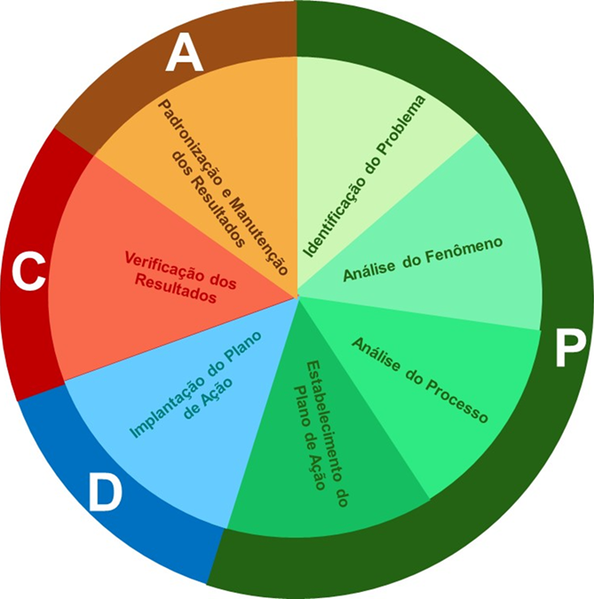

# O Cérebro da Operação: Método, Rotina e Controle {#sec-cap5}

::: {.callout-tip title="🎯 Objetivos deste Capítulo"}
* Compreender a mecânica do Gerenciamento pelas Diretrizes (GPD) e os horizontes de gestão.
* Aplicar a sistemática do *Hoshin Kanri* e a Matriz X para o desdobramento tático de metas.
* Estruturar indicadores de desempenho utilizando o *Balanced Scorecard* (BSC).
* Integrar a agilidade dos OKRs ao controle rigoroso dos KPIs.
* Construir um roteiro prático de execução metodológica (PDCA/MASP).
* Entender a função da padronização (POP) e das auditorias como a "trava" do ciclo de melhoria.
:::

No capítulo anterior, estabelecemos a estrutura diretiva da organização — da Política da Qualidade aos Objetivos — e compreendemos o motor da excelência através da Trilogia de Juran. No entanto, planejar a qualidade e definir metas é apenas metade da batalha na engenharia de produção; a outra metade, frequentemente mais desafiadora, é **executar e manter o ganho** ao longo do tempo.

A excelência operacional não sobrevive de esforços heroicos isolados. Sem um sistema robusto de desdobramento e sustentação, os processos tendem à entropia, as falhas retornam e o indicador de qualidade regride ao seu estado anterior. Este capítulo aborda a arquitetura gerencial necessária para garantir que a estratégia definida pela Alta Direção seja perfeitamente compreendida, executada e controlada pela linha de frente.

## O Desdobramento da Estratégia (GPD e Hoshin Kanri) {#sec-hoshin-kanri}

Para garantir que toda a organização esteja focada em resolver os problemas corretos — lembrando sempre da Regra de Ouro da Gestão, onde problemas são desvios nos *fins* e não nos *meios* (revisite a @sec-desdobramento-objetivos) —, o Sistema de Gestão precisa conectar a visão macro da diretoria com a execução microscópica do operador. O alinhamento entre o que a diretoria deseja e o que a operação executa é o maior desafio das organizações complexas. Para solucionar esse abismo corporativo, a engenharia de produção utiliza o **Gerenciamento pelas Diretrizes (GPD)**.

Como define Vicente Falconi, um dos maiores especialistas no tema:
> *"O Gerenciamento pelas Diretrizes é uma metodologia que concentra toda a força intelectual dos colaboradores da empresa para atingir as metas da organização oriundas da Formulação Estratégica."*

A @fig-alinhamento-gpd ilustra visualmente a principal vantagem do GPD. Sem diretrizes claras, os esforços e talentos da equipe apontam para direções difusas, anulando a força resultante. Com o GPD implantado, todos os vetores de força da empresa alinham-se em uma única direção, impulsionando os resultados de forma avassaladora.

```{mermaid}
%%| label: fig-alinhamento-gpd
%%| fig-cap: "Alinhamento de esforços com e sem o GPD"
graph LR
	subgraph Sem GPD [Sem GPD: Esforços Difusos]
		A1((Equipe)) -->|Prioridade A| B1(Direção 1)
		A1 -->|Prioridade B| C1(Direção 2)
		A1 -->|Prioridade C| D1(Direção 3)
	end

	subgraph Com GPD [Com GPD: Esforços Alinhados]
		A2((Equipe)) -->|Foco Total| B2(Meta Estratégica Única)
	end

	style B2 fill:#2ecc71,stroke:#333,color:#fff
	style Sem GPD fill:#f9f9f9,stroke:#e74c3c
	style Com GPD fill:#f9f9f9,stroke:#2ecc71
```

A arquitetura dessa integração divide a atuação corporativa em três horizontes, conforme ilustrado na @fig-horizontes-gestao:

```{mermaid}
%%| label: fig-horizontes-gestao
%%| fig-cap: "Horizontes do Modelo de Gestão (3 a 5 anos, 1 ano e 1 dia)"
graph TD
	A[Horizonte 3 a 5 anos<br>ESTRATÉGICO] -->|Diretrizes e Políticas| B[Horizonte de 1 ano<br>TÁTICO / MELHORIAS]
	B -->|Metas e Projetos| C[Horizonte de 1 dia<br>OPERACIONAL / ROTINA]

	style A fill:#1A73E8,stroke:#333,color:#fff
	style B fill:#FBBC05,stroke:#333,color:#000
	style C fill:#34A853,stroke:#333,color:#fff
```

1. **Horizonte de 3 a 5 anos (Formulação Estratégica):** Nível da Alta Direção, focado na identidade da empresa (Visão, Missão e Valores), Políticas e Objetivos de longo prazo.
2. **Horizonte de 1 ano (Melhoria da Operação):** Nível gerencial, onde ocorre o desdobramento do GPD através de Metas Anuais de Melhoria (via Projetos *Six Sigma*, DMAIC ou MASP) e Inovação.
3. **Horizonte de 1 dia (Operação):** Nível do chão de fábrica, focado no Gerenciamento da Rotina, Sistema de Padronização (SDCA) e Orçamento para garantir os Resultados diários.

### Hoshin Kanri: O Desdobramento em 13 Passos

Para que a visão de futuro (horizonte de 5 anos) se torne uma ação no chão de fábrica (horizonte de 1 dia), utilizamos a sistemática japonesa do **Hoshin Kanri** (que pode ser traduzida como "Direção e Gerenciamento"). Trata-se de um ciclo rigoroso de 13 passos, detalhado na @fig-hoshin-passos, que garante que a estratégia não se perca no meio do caminho:

```{mermaid}
%%| label: fig-hoshin-passos
%%| fig-cap: "Os 13 passos do Hoshin Kanri"
graph TD
	subgraph Fase 1: Planejamento
	1(1. Situação Atual) --> 2(2. Objetivos Longo Prazo)
	2 --> 3(3. Priorizar Objetivos Anuais)
	3 --> 4(4. Iniciativas Estratégicas)
	end

	subgraph Fase 2: Desdobramento
	4 --> 5(5. Metas Táticas)
	5 --> 6(6. Especificar Metas - SMART)
	6 --> 7(7. Elaborar Matriz X)
	7 --> 8(8. Definir Responsabilidades)
	end

	subgraph Fase 3: Execução e Revisão
	8 --> 9(9. Estruturar Plano A3)
	9 --> 10(10. Implantar Plano A3)
	10 --> 11(11. Revisar Plano Curto Prazo)
	11 --> 12(12. Revisar Anualmente)
	12 --> 13(13. Revisar Longo Prazo)
	end

	13 -.->|Novo Ciclo| 1
	style 13 fill:#e74c3c,color:#fff
	style 1 fill:#2ecc71,color:#fff
```

1. Determinar a situação atual.
2. Determinar objetivos de longo prazo.
3. Priorizar objetivos (Metas Anuais).
4. Definir as iniciativas estratégicas.
5. Definir as metas táticas.
6. Especificar metas (Objetivo + Valor + Prazo).
7. Elaborar a Matriz X.
8. Definir responsabilidades.
9. Estruturar o Plano A3 (documento visual de resolução de problemas).
10. Implantar o Plano A3.
11. Revisar o plano de curto prazo.
12. Revisar o plano anualmente.
13. Revisar o plano de longo prazo (3 a 5 anos).

### Especificação de Metas e o Balanced Scorecard (BSC)

Uma meta estratégica bem construída não pode ser subjetiva. Ela deve obrigatoriamente ser SMART e conter a tríade: **Objetivo + Valor + Prazo** (conforme detalhado na @sec-desdobramento-objetivos). Exemplo: *Aumentar a produção de Sinter Feed em 1.500.000 toneladas até dezembro de 2024*.

Para garantir que as metas não foquem apenas no lucro imediato — o que poderia destruir a sustentabilidade a longo prazo —, as organizações utilizam o **Balanced Scorecard (BSC)** na fase de determinação da situação atual e dos objetivos.

```{mermaid}
%%| label: fig-bsc-mapa
%%| fig-cap: "Mapa Estratégico do Balanced Scorecard (BSC)"
graph BT
	subgraph Aprendizado e Inovação
		A[Capacitação, Clima e Tecnologia]
	end
	subgraph Processos Internos
		B[Excelência Operacional e Produtividade]
	end
	subgraph Clientes e Mercado
		C[Satisfação e Proposta de Valor]
	end
	subgraph Perspectiva Financeira
		D[Maximização do Lucro / Redução de Custos]
	end

	A ==>|Habilita a melhoria dos| B
	B ==>|Garante a entrega para| C
	C ==>|Gera o resultado na| D

	style D fill:#27ae60,stroke:#333,color:#fff
	style C fill:#2980b9,stroke:#333,color:#fff
	style B fill:#f39c12,stroke:#333,color:#fff
	style A fill:#8e44ad,stroke:#333,color:#fff
```

O BSC divide as metas em quatro perspectivas interdependentes para evitar a armadilha de focar apenas em volume (Eficácia) e destruir o orçamento (Eficiência), cuja prova matemática demonstramos através da Função ARM no @exm-gestao:

* **Perspectiva Financeira:** Foca nos resultados econômicos esperados pelos acionistas.
* **Perspectiva de Clientes e Mercado:** Foca na proposta de valor entregue ao consumidor.
* **Perspectiva de Processos Internos:** Foca na excelência da operação para garantir a entrega de valor.
* **Perspectiva de Aprendizado e Inovação:** Foca no desenvolvimento do capital humano e tecnológico.

A @tbl-bsc-exemplo demonstra a aplicação prática do desdobramento destas quatro perspectivas, amarrando a visão estratégica diretamente aos indicadores de controle e às iniciativas táticas em um cenário comercial.

| Objetivos | Metas | Indicadores (KPIs) | Iniciativas Táticas |
| :--- | :--- | :--- | :--- |
| **Perspectiva Financeira:** Melhorar o capital de giro da empresa | 30% de aumento no capital de giro | Fluxo de caixa | Diminuir o número de meses para o parcelamento do cliente.<br>Pesquisar novos fornecedores. |
| **Perspectiva do Cliente:** Conquistar novos perfis de consumidores | 12% de aumento no faturamento | DRE (Demonstrativo de Resultado) | Ampliar o portfólio e mix de produtos. |
| **Perspectiva Interna:** Otimizar o espaço e a qualidade da exposição | Aumento de 25% do ticket médio por $m^2$ | Ticket médio por $m^2$ de loja | Atualizar o *visual merchandising*.<br>Instalar telas interativas nos núcleos de exposição. |
| **Perspectiva de Aprendizagem:** Abordagem e atendimento consultivos | 100% de participação da equipe de vendas | Lista de presença e taxa de conversão | Atualização sobre tendências e treinamento em novas técnicas de venda. |

: Exemplo prático de BSC desdobrado (Cenário Comercial) {#tbl-bsc-exemplo}

### A Ferramenta de Amarração: A Matriz X

Quando uma empresa possui dezenas de metas no BSC e centenas de ações táticas, o acompanhamento torna-se caótico. Para resolver isso, o *Hoshin Kanri* utiliza a **Matriz X** (@fig-matriz-x).

```{mermaid}
%%| label: fig-matriz-x
%%| fig-cap: "Estrutura da Matriz X no Hoshin Kanri"
graph TD
	A[Estratégias de Longo Prazo<br>EIXO SUL] <--> C((MATRIZ X<br>Correlaciona<br>os 4 eixos))
	B[Objetivos Anuais<br>EIXO OESTE] <--> C
	D[Ações Táticas e Projetos<br>EIXO NORTE] <--> C
	E[Indicadores e Responsáveis<br>EIXO LESTE] <--> C

	style C fill:#e74c3c,stroke:#333,color:#fff
	style A fill:#ecf0f1,stroke:#333
	style B fill:#ecf0f1,stroke:#333
	style D fill:#ecf0f1,stroke:#333
	style E fill:#ecf0f1,stroke:#333
```

Esta matriz visual de correlação cruza, num único diagrama de uma página: as prioridades de nível superior, os objetivos anuais, as metas de longo prazo, as métricas de acompanhamento e os responsáveis diretos pela execução. A Matriz X força a diretoria a enxergar imediatamente se existe alguma "meta órfã" (sem responsável) ou um recurso alocado em ações que não impactam a estratégia.

## OKR vs. KPI: O Equilíbrio entre Foco e Controle {#sec-okr-kpi}

Com as diretrizes desdobradas, o sistema de gestão precisa operar no dia a dia. Um erro comum é a equipe confundir os modelos de acompanhamento. Na nossa arquitetura, OKRs e KPIs funcionam como o sistema simpático e parassimpático do cérebro organizacional:

### 1. OKR (*Objectives and Key Results*) - O Foco na Mudança
O OKR é voltado para o que a organização deseja **mudar, inovar ou acelerar**. É ágil, geralmente revisado trimestralmente, e foca em resultados ambiciosos de curto prazo.
* **Objetivo (Qualitativo e Inspiracional):** "Tornar a nossa planta de beneficiamento a mais eficiente do complexo."
* **Key Result (Quantitativo e SMART):** "Atingir 95% de recuperação mássica no Sinter Feed até o final do Q3."

### 2. KPI (*Key Performance Indicator*) - O Controle da Saúde
O KPI é o painel de instrumentos, voltado para o que a organização precisa **manter**. É o termômetro. Se o KPI sai da meta, o cérebro emite um alerta para o método de solução de problemas (MASP/PDCA) agir.

| Característica | KPI (Manutenção da Operação) | OKR (Melhoria e Mudança) |
| :--- | :--- | :--- |
| **Foco de Atuação** | Saúde do processo (Controle) | Direção e Progresso (Aceleração) |
| **Frequência de Análise** | Diário / Mensal | Trimestral |
| **Função Metodológica** | Estabilizar a rotina (Ciclo SDCA) | Desafiar o *Status Quo* (Ciclo PDCA) |

## A Anatomia de uma Meta Inteligente {#sec-anatomia-meta}

Para que a arquitetura de gestão funcione, o "cérebro" (diretoria) precisa enviar ordens claras aos "braços" (operação). Uma meta mal redigida gera ruído no sistema e desperdício de capital. Na engenharia da qualidade, toda meta deve seguir rigorosamente a seguinte estrutura matemática e verbal:

**Meta = Verbo de Ação + Objeto + Valor (Gap) + Prazo**

Veja o contraste entre uma intenção subjetiva e uma meta de engenharia:

> ❌ **Exemplo Ruim:** "Melhorar a segurança e a produtividade na mina." *(Vago, impossível de medir e sem prazo).*
>
> ✅ **Exemplo de Engenharia:** "Reduzir [Verbo] a Taxa de Frequência de Acidentes [Objeto] para 0,5 [Valor] até dezembro de 2024 [Prazo]."

::: {.callout-important title="🎯 O CÉREBRO NÃO ACEITA MEIOS COMO FINS"}
Como discutimos na Regra de Ouro da Gestão (@sec-desdobramento-objetivos), o sistema deve focar sempre nos **Resultados (Fins)**.
Se um gestor define como meta *"Comprar 5 novos caminhões fora de estrada até julho"*, ele está a premiar um gasto (meio). A meta real e focada no resultado deveria ser *"Aumentar a movimentação de estéril em 20% até julho"*. Se a operação conseguir atingir este fim otimizando o tempo de ciclo da frota atual, a compra dos camiões (o meio) torna-se desnecessária, poupando milhões à companhia.
:::

### Projeções, Guidance e o Conceito de Meta

No ambiente corporativo da grande mineração (como na produção global de minério de ferro e metais básicos), o planejamento lida com três conceitos que frequentemente são confundidos pela gestão:

1. **A Projeção (Guidance):** Constitui-se de informações que uma empresa de capital aberto oferece ao mercado como uma indicação oficial do seu desempenho futuro. Trata-se de prever o futuro com a maior precisão possível, levando em conta os dados históricos e o conhecimento de eventos futuros.
2. **A Meta:** Se a projeção é o que *provavelmente* vai acontecer, a meta é o que você *gostaria* que acontecesse (exigindo o critério SMART).
3. **O Plano:** Muitas vezes, as metas são definidas sem qualquer plano de como alcançá-las. O plano é justamente a resposta (o conjunto de ações operacionais e de engenharia) para garantir que as previsões correspondam aos objetivos estipulados.

#### O "Programado" na Prática Operacional

Para tangibilizar o "Programado" na rotina de mina, observe o exemplo de planejamento de frota. A @tbl-planejamento-frota estabelece o número exato de caminhões fora de estrada programados e disponíveis para um período de acompanhamento.

| **Período** | **Programado (Alvo)** | **Disponível (Realizado)** |
|-------------|-----------------------|----------------------------|
| 2020-01     | 45                    | 43                         |
| 2020-02     | 45                    | 44                         |
| ...         | ...                   | ...                        |
| 2023-05     | 50                    | 48                         |

: Planejamento Programado de Frota Disponível (2020 a 2023). *Fonte: Adaptado de TCC Adriane e Elizeth.* {#tbl-planejamento-frota}

A função do planejamento é criar a linha do programado (os degraus do que deveria ocorrer); a função do controle é forçar o desempenho real diário a ficar o mais próximo possível dela. Acompanhar essa variação e agir sobre a lacuna é a essência do controle de qualidade.

## O Caminho da Solução: PDCA e MASP {#sec-caminho-solucao}

O ciclo PDCA, como uma metodologia para melhoria, é uma ferramenta simples que promove alterações graduais no processo, impulsionando assim o desenvolvimento da empresa. O ciclo, conforme apresentado na @fig-ciclo-pdca, é dividido em etapas de planejamento (PLAN), execução (DO), verificação (CHECK) e ação (ACT).

{#fig-ciclo-pdca fig-align="center"}

::: {.callout-note title="📌 DEFINIÇÃO NORMATIVA"}
De acordo com Mendes (2007), o ciclo PDCA é um método estruturado para a melhoria contínua dos processos nas organizações, dividido nas seguintes etapas:

* **PLAN (Planejar):** Definir a situação atual, estabelecer metas mensuráveis e estratégias para alcançá-las.
* **DO (Executar):** Iniciar o processo, educar/treinar os envolvidos e implementar as estratégias definidas.
* **CHECK (Verificar):** Analisar e comparar os resultados obtidos contra os padrões esperados (metas).
* **ACT (Agir/Padronizar):** Tomar ações corretivas ou padronizar a melhoria com base na verificação dos resultados.
:::

Para que essas etapas sejam realizadas com eficácia, é essencial que as subetapas sejam definidas com precisão. É importante destacar que a etapa de planejamento (PLAN) exige o maior rigor e dedicação de tempo do projeto. A identificação e priorização das métricas proporcionarão uma investigação aprofundada das causas dos problemas, embasando as propostas de mudança em métodos estruturados.

::: {.callout-warning title="⚠️ ARMADILHA DE ENGENHARIA"}
O erro mais comum em projetos de melhoria é a "Miopia de Ação": a equipe pular a fase de Planejamento (P) e ir direto para a Execução (D). Implementar soluções baseadas em "achismos" e não em dados estratificados consome recursos financeiros da empresa e, na esmagadora maioria das vezes, ataca apenas o sintoma, permitindo que a falha real retorne no mês seguinte.
:::

## Fases e Atividades do Ciclo PDCA (MASP)

A tabela a seguir consolida a estrutura metodológica e o cronograma do projeto, servindo como a principal ferramenta de controle e auditoria das etapas — o Método de Análise e Solução de Problemas (MASP). A coluna *Status* é destinada ao acompanhamento qualitativo da evolução das tarefas.

```{r}
#| label: tbl-atividades-pdca-detalhada
#| tbl-cap: "Detalhamento das fases, etapas e atividades do MASP/PDCA aplicadas à gestão na mineração."
#| echo: false
#| message: false
#| warning: false

library(knitr)
library(kableExtra)
library(dplyr)

df_pdca <- data.frame(
    Fases = c(rep("P", 13), rep("D", 3), rep("C", 2), rep("A", 3)),
    Etapas = c(
        rep("Identificação do problema", 3), rep("Análise do Fenômeno", 3),
        rep("Análise do Processo", 3), rep("Estabelecimento do Plano de Ação", 4),
        rep("Execução do Plano de Ação", 3), rep("Verificação dos Resultados", 2),
        rep("Padronização", 3)
    ),
    Atividades = c(
        "Identificação das prioridades", "Estabelecimento da meta do projeto", "Quantificação dos ganhos do projeto",
        "Estratificação do problema", "Estudo das variações", "Definição das metas específicas",
        "Levantamento das causas potenciais", "Priorização das causas potenciais", "Quantificação das causas priorizadas",
        "Levantamento das possíveis soluções", "Priorização das possíveis soluções", "Realização de teste piloto (se necessário)", "Estabelecimento do plano de ação",
        "Comunicação do plano de ação", "Realização de treinamentos dos envolvidos", "Implantação e acompanhamento do plano de ação",
        "Verificação do alcance da meta geral e das metas específicas", "Quantificação dos ganhos do projeto",
        "Padronização das novas atividades", "Implantação de plano para monitoramento do processo", "Implantação de plano de ações corretivas"
    )
)

cores_id <- case_when(
    df_pdca$Fases == "P" & df_pdca$Etapas == "Identificação do problema" ~ "#174EA6",
    df_pdca$Fases == "P" & df_pdca$Etapas == "Análise do Fenômeno" ~ "#4285F4",
    df_pdca$Fases == "P" & df_pdca$Etapas == "Análise do Processo" ~ "#1A73E8",
    df_pdca$Fases == "P" & df_pdca$Etapas == "Estabelecimento do Plano de Ação" ~ "#8AB4F8",
    df_pdca$Fases == "D" ~ "#FBBC05",
    df_pdca$Fases == "C" ~ "#EA4335",
    df_pdca$Fases == "A" ~ "#34A853",
    TRUE ~ "white"
)

texto_cor <- ifelse(cores_id %in% c("#FBBC05", "#8AB4F8", "#f39c12"), "black", "white")

df_pdca %>%
    kable(
        col.names = c("Fases", "Etapas", "Atividades"),
        align = "cll",
        booktabs = TRUE
    ) %>%
    kable_styling(bootstrap_options = c("striped", "hover", "condensed"), full_width = FALSE, font_size = 13) %>%
    column_spec(1, bold = TRUE, color = texto_cor, background = cores_id, width = "0.7cm") %>%
    column_spec(2, bold = TRUE, color = texto_cor, background = cores_id, width = "6.5cm") %>%
    column_spec(3, width = "12cm", background = "white", color = "black") %>%
    row_spec(0, background = "#35978f", color = "white", bold = TRUE) %>%
    collapse_rows(columns = 1:2, valign = "middle")
```

### O Paralelo: O Mapa de Juran e a Modelagem Analítica

Embora a Trilogia de Juran tenha sido formulada no século XX, seu roteiro original de "Planejamento da Qualidade" (composto por 9 passos) continua sendo o alicerce da engenharia de processos. A grande diferença contemporânea é a capacidade de quantificar matematicamente etapas que antes eram apenas conceituais.

No Capítulo 2 desta obra, detalhamos a **Modelagem Analítica de Requisitos (ARM)**. Aquela estrutura matemática é, na prática, a execução rigorosa e moderna dos passos clássicos de Juran.

A @tbl-paralelo-juran demonstra como a teoria de Juran se conecta com as ferramentas de modelagem que construímos anteriormente:

```{r}
#| label: tbl-paralelo-juran
#| tbl-cap: "Paralelo entre o Mapa de Planejamento de Juran e a Modelagem Analítica de Requisitos (ARM)."
#| echo: false
#| message: false
#| warning: false

library(knitr)
library(kableExtra)

df_juran <- data.frame(
    Passo = c("1 e 2", "3", "4 e 5", "6 e 7", "8 e 9"),
    Juran = c(
        "Identificar os clientes (internos/externos) e determinar suas necessidades reais.",
        "Traduzir as necessidades para a linguagem técnica da empresa.",
        "Desenvolver o produto e otimizar suas características.",
        "Desenvolver o processo capaz de produzir as características e otimizá-lo.",
        "Provar a capacidade do processo e transferi-lo para a Operação (Controle)."
    ),
    Aplicacao = c(
        "Levantamento exploratório das variáveis (Abordagem Bottom-up ou Top-down).",
        "Consolidação das variáveis soltas ($V_i$) em grandes Dimensões de Gestão ($D_j$).",
        "Cálculo do ARM, utilizando matrizes (ex: Mudge) para calibrar os pesos ($W_i$).",
        "Parametrização do Desempenho ($S_i$) através de Funções de Valor e Metas SMART.",
        "Produção (Conformação) e início da Zona de Controle da Qualidade operacional."
    )
)

df_juran %>%
    kable(
        col.names = c("Passos", "O Mapa de Juran (Teoria Clássica)", "A Modelagem Analítica (ARM - Cap 2)"),
        align = "cll",
        booktabs = TRUE
    ) %>%
    kable_styling(bootstrap_options = c("striped", "hover"), full_width = FALSE, font_size = 14) %>%
    column_spec(1, bold = TRUE, width = "1.5cm") %>%
    column_spec(2, width = "6.5cm", background = "#f9f9f9") %>%
    column_spec(3, width = "8.5cm", border_left = TRUE) %>%
    row_spec(0, background = "#2c3e50", color = "white", bold = TRUE)
```

Essa correlação evidencia que o "Planejamento" termina quando o Passo 9 é atingido e a equipe de engenharia entrega a equação do ARM parametrizada para o chão de fábrica executar. Neste momento, o processo entra na Zona de Controle.

É apenas quando a Qualidade de Conformação falha e o controle detecta um "Pico Esporádico" que a organização é forçada a acionar a terceira perna da trilogia: a Melhoria da Qualidade, operada por meio do ciclo PDCA.

### Análise do Fluxo Metodológico

Conforme observado na tabela executiva, o ciclo inicia-se na **Identificação do Problema**, onde a definição das prioridades e a meta global servem de base para as atividades seguintes. Na **Análise do Fenômeno**, ocorre a estratificação dos dados e o estudo das variações, permitindo que a pesquisa tome forma sobre os principais KPIs a serem utilizados.

::: {.callout-important title="🛠️ LABORATÓRIO DE ENGENHARIA: Fase 1 (Identificação do Problema)"}
**Mão na massa:** Chegou a hora de iniciar o seu projeto aplicado.
Para esta etapa, crie um documento contendo:

1. **Termo de Abertura (TAP):** Nome do projeto, justificativa (por que este problema afeta a operação?), objetivos SMART e restrições.
2. **Matriz de Responsabilidades (RACI):** Quem executa, aprova, é consultado e informado.
3. **Definição do *Gap*:** Construa um comparativo gráfico entre o Indicador Real x Planejado. O "problema" do seu projeto será a diferença métrica entre esses dois valores.
:::

### O Mapeamento de Fronteiras: O Sistema de Produção e a Matriz SIPOC {#sec-sipoc}

Antes de mergulhar nas causas de um problema usando o Pareto ou o Ishikawa, a equipe de engenharia precisa garantir que todos compreendam o fluxo macro do processo e as suas fronteiras. O maior erro de um projeto de melhoria é a equipe não saber onde o processo começa e onde ele termina, correndo o risco de tentar "abraçar o mundo".

Para delimitar esse escopo, utilizamos a visão clássica do **Sistema de Produção**. Conforme ilustrado na @fig-sistema-producao, todo processo é um conjunto de atividades estruturadas que recebem entradas, aplicam uma metodologia de transformação utilizando recursos (pessoas, instalações, tecnologia) e geram saídas (produtos ou serviços), interagindo o tempo todo com variáveis ambientais e de segurança.

{#fig-sistema-producao fig-align="center"}

No método MASP, essa visão estrutural é operacionalizada pela ferramenta **SIPOC**, um acrônimo que padroniza o mapeamento de qualquer processo na operação mineral:

* **S (*Supplier* / Fornecedor):** Quem fornece os insumos ou informações para o processo iniciar? *(Ex: Equipe de Topografia e Planejamento de Mina).*
* **I (*Input* / Entrada):** Quais são os "Recursos a serem transformados" fornecidos? *(Ex: Malha de perfuração e plano de fogo).*
* **P (*Process* / Processo):** Quais são as macroatividades da "Metodologia de Processamento" (limitado a 5 ou 6 passos)? *(Ex: Posicionar perfuratriz $\rightarrow$ Furar $\rightarrow$ Carregar explosivo $\rightarrow$ Detonar).*
* **O (*Output* / Saída):** O que o processo efetivamente gera na "Saída"? *(Ex: Minério desmontado com granulometria específica).*
* **C (*Customer* / Cliente):** Quem recebe essa saída? *(Ex: Equipe de Carregamento / Operadores de Escavadeira).*

::: {.callout-note title="💡 INSIGHT OPERACIONAL"}
Na mineração, construir o SIPOC resolve 50% dos conflitos entre departamentos durante a fase de planejamento de um projeto. Ele deixa claro visualmente que se a Topografia (*Supplier*) entregar uma malha inadequada (*Input*), a detonação (*Process*) vai gerar matacões (*Output*), prejudicando a produtividade da escavadeira (*Customer*). O SIPOC define a responsabilidade de ponta a ponta e blinda as fronteiras do seu Termo de Abertura (TAP).
:::

### Análise do Processo: Ishikawa, 5 Porquês e Matriz GUT

Uma vez que o Gráfico de Pareto indicou *onde* o problema está concentrado, a fase passa para a **Análise do Processo**, que visa responder *por que* o problema ocorre.

A ferramenta primária é o **Diagrama de Ishikawa** (também conhecido como Diagrama de Espinha de Peixe ou Causa e Efeito). Ele organiza o *Brainstorming* da equipe classificando as possíveis origens do problema em seis categorias clássicas (os 6M):

1. **Máquina:** Falhas no equipamento ou manutenção inadequada.
2. **Material:** Insumos fora de especificação ou peças de má qualidade.
3. **Mão de Obra:** Falta de treinamento, desatenção ou fadiga do operador.
4. **Método:** Procedimentos operacionais (POPs) falhos ou inexistentes.
5. **Medida:** Erros de calibração em sensores ou indicadores mal calculados.
6. **Meio Ambiente:** Condições externas (chuva na mina, poeira, temperatura).

::: {.callout-tip title="💡 INSIGHT OPERACIONAL"}
Um erro comum é preencher o Ishikawa com "Falta de..." (ex: falta de treinamento, falta de peça). A falta de algo é uma solução ausente, não uma causa. A equipe deve descrever a anomalia real (ex: "Treinamento desatualizado para o modelo 793D" ou "Peça sofreu desgaste abrasivo prematuro").
:::

Com o diagrama preenchido, a equipe utiliza a **Matriz GUT** (Gravidade, Urgência e Tendência) para pontuar as causas e priorizar qual braço do diagrama será atacado primeiro.

Finalmente, para a causa vencedora da matriz GUT, aplica-se a técnica dos **5 Porquês**. A equipe deve perguntar o motivo do problema sucessivas vezes até ultrapassar os sintomas superficiais e atingir a verdadeira causa raiz (a anomalia sistêmica que, se removida, impede que o problema volte a acontecer).

::: {.callout-important title="🛠️ LABORATÓRIO DE ENGENHARIA: Fase 3 (Análise do Processo)"}
**Mão na massa: (Tarefa 06)**
1. **Ishikawa (6M):** Reúna sua equipe e faça um *Brainstorming* para mapear as possíveis causas do problema que venceu no seu Gráfico de Pareto.
2. **Priorização (GUT):** Utilize a Matriz GUT para decidir, de forma técnica e fria, quais causas mapeadas no Ishikawa serão efetivamente atacadas.
3. **Os 5 Porquês:** Aplique a técnica para a causa prioritária. Garanta que o plano de ação não foque em sintomas, mas sim na origem do problema.
:::

## O Chão de Fábrica e Ativos {#sec-chao-de-fabrica}

Nenhuma equação de qualidade ou modelagem estatística se sustenta na prática sem os dois pilares físicos e fundamentais da operação industrial: **as pessoas e as máquinas**. O Passo 10 da nossa trilha de excelência garante que, uma vez que o método de solução de problemas (MASP) tenha sido desenhado na engenharia, ele seja executado com precisão e sustentado pelas engrenagens de campo.

### O Engajamento Humano: Círculos de Controle da Qualidade (CCQ)

Historicamente, a mineração possuía uma gestão rigidamente vertical (comando e controle), onde a engenharia pensava e a operação apenas executava. O moderno *Mining Analytics* prova que essa barreira é disfuncional. Quem conhece a verdadeira "dor" do processo e os pequenos desvios não reportados não é o analista sentado no escritório, mas o operador dentro da cabine da escavadeira.

Para transformar essa experiência empírica em dados técnicos, a Gestão da Qualidade utiliza os **Círculos de Controle da Qualidade (CCQ)**.

O CCQ é um grupo voluntário de trabalhadores da mesma área que se reúne regularmente para identificar, analisar e solucionar problemas que afetam seus processos ou a qualidade do produto. A grande força dessa ferramenta é a inversão da abordagem hierárquica: a melhoria nasce de baixo para cima (*Bottom-up*).

#### Benefícios Diretos do CCQ na Mineração:
* **Detecção Precoce:** Os operadores costumam perceber mudanças sutis de som, vibração ou temperatura nos equipamentos semanas antes de um sensor emitir um alarme catastrófico.
* **Soluções de Baixo Custo:** Por estarem na linha de frente, as soluções propostas pelos círculos tendem a ser adaptações mecânicas criativas e baratas, em oposição às reestruturações milionárias propostas pelas diretorias.
* **Mudança de Cultura:** O colaborador deixa de ser um "apertador de botão" e passa a ser o dono do seu processo (sentimento de pertencimento e valorização).

::: {.callout-important title="🛠️ LABORATÓRIO DE ENGENHARIA: Dinâmica do CCQ"}
**Como estruturar um Círculo:**
1. **Treinamento Básico:** Capacite os operadores da linha de frente nas 7 Ferramentas Básicas (Pareto, Ishikawa, 5 Porquês). Eles precisam falar a mesma linguagem da engenharia.
2. **Tempo Dedicado:** O grupo deve ter de 1 a 2 horas semanais, durante o expediente, liberadas e pagas pela empresa para debater problemas. Reuniões de CCQ fora do horário não engajam.
3. **Reconhecimento:** Quando uma ideia do grupo gera redução de custo ou aumento de produção, o reconhecimento deve ser público e, de preferência, acompanhado de incentivos financeiros atrelados ao ganho.
:::

### A Confiabilidade Física: Gestão e Manutenção de Ativos

Se o ser humano engajado é a inteligência do chão de fábrica, o equipamento é a força bruta que garante o resultado quantitativo do MASP. A mineração é a indústria do maquinário pesado. Caminhões fora de estrada, perfuratrizes gigantescas e moinhos industriais operam em regimes de trabalho extenuantes (24 horas por dia, sujeitos a poeira, umidade e altíssimo torque).

A melhoria da qualidade na mineração é indissociável da **Gestão de Manutenção**. Um indicador de qualidade cai imediatamente quando a máquina entra em falha. A evolução da confiabilidade na gestão divide a manutenção em quatro grandes estratégias:

1. **Manutenção Corretiva (Reativa):** É o modelo mais caro e perigoso. Ocorre apenas quando o equipamento quebra. Gera lucro zero, para a produção de forma não programada e oferece grandes riscos à segurança dos operadores.
2. **Manutenção Preventiva (Baseada no Tempo):** É a manutenção estipulada pelo manual do fabricante (ex: trocar o óleo a cada 500 horas de motor). Melhora a segurança, mas muitas vezes troca-se uma peça que ainda possuía vida útil, encarecendo a operação.
3. **Manutenção Preditiva (Baseada na Condição):** Aqui a ciência de dados e a engenharia da qualidade começam a brilhar. Ao invés de trocar a peça por tempo, a engenharia monitora os sinais vitais do equipamento (ex: termografia de painéis elétricos, análise química do óleo, sensores de vibração de rolamentos). A peça só é trocada quando o sensor prevê a falha iminente.
4. **Manutenção Prescritiva (Analytics/Machine Learning):** O estado da arte. Utiliza Inteligência Artificial e modelos matemáticos para cruzar dados históricos de operação e desgaste. O algoritmo prescreve não apenas *quando* a máquina vai falhar, mas ajusta os parâmetros de operação autonomamente para esticar a vida útil (Ex: "Abaixe o limite de RPM na subida de rampa para o caminhão não fundir o motor até a próxima parada de oficina programada").

::: {.callout-note title="💡 INSIGHT OPERACIONAL: A Guerra entre Produção e Manutenção"}
Um dos maiores gargalos organizacionais da mineração é o conflito de interesses entre a área de **Operação** (que é cobrada para bater a meta de volume de toneladas) e a área de **Manutenção** (que é cobrada para parar a máquina e realizar preventivas). Sem a aplicação da Metodologia ARM para equilibrar os pesos ($W_i$) dessas áreas, a Operação "passa por cima" do plano de manutenção, gerando faturamento de curto prazo e destruição do equipamento a longo prazo.
:::

## O Roteiro de Execução: O Ciclo PDCA na Prática {#sec-roteiro-pdca}

Quando o Painel de Controle mostra que um KPI está fora da meta, o engenheiro não deve atuar por instinto. Ele deve acionar o Método de Análise e Solução de Problemas (MASP). Abaixo, apresentamos o guia de bolso (o "PDCA Mineral") para a resolução implacável de anomalias operacionais no chão de fábrica.

### FASE P (PLAN) - O Diagnóstico Cirúrgico
A fase de planejamento deve consumir 70% do tempo do projeto. Se planejar mal, executará a solução errada.

* **Passo 1: Baseline, Benchmarking e a Captura da Lacuna (*Gap*)** Definir o problema exige conhecer a diferença entre a base de desempenho atual do processo e a referência de excelência desejada.
  * **Cálculo do Baseline (A Base):** Para calcular o desempenho atual sem ser traído por anomalias estatísticas, a engenharia utiliza a técnica da **Média Aparada**. Apare os dados extremos (*outliers*) utilizando a Amplitude Interquartílica (ex: cortando P05-P95). A praxe é aparar entre 5% e 25% da informação para manter apenas os dados representativos da rotina estabilizada.
  * **Benchmarking (A Referência):** Defina onde o indicador deveria estar buscando a Referência do Setor (melhor média móvel), a Referência Técnica (capacidade de placa do equipamento) ou a Referência Externa (*Best in Class* global).
  * **Matriz de Captura da Lacuna:** Identificada a diferença total entre o Baseline e o Benchmark, quanto buscar no próximo ciclo? A decisão depende da maturidade da equipe:

```{mermaid}
%%| label: fig-matriz-captura-lacuna
%%| fig-cap: "Matriz de Decisão para Captura da Lacuna (Gap)"
graph LR
    A[Tamanho Total da Lacuna<br>Baseline vs Benchmark] --> B{Maturidade e<br>Recursos da Equipe}
    B -->|Alta Maturidade<br>Dados Confiáveis + Orçamento| C(Capturar $\ge 50\%$ da Lacuna)
    B -->|Maturidade Média<br>Apenas parte das condições| D(Capturar de 20% a 50%)
    B -->|Maturidade Baixa<br>Estágio puramente reativo| E(Capturar de 10% a 20%)

    style C fill:#2ecc71,stroke:#333,color:#fff
    style D fill:#f1c40f,stroke:#333
    style E fill:#e74c3c,stroke:#333,color:#fff
```

* **Passo 2: Mapeamento de Fronteiras (SIPOC):** Não tente "abraçar o mundo". Defina visualmente onde o processo começa (Fornecedor/Entrada) e onde termina (Saída/Cliente). Se o problema é no britador primário, não perca tempo analisando a expedição do porto.
* **Passo 3: Descoberta da Causa Raiz:** Esqueça o "achismo". Utilize dados.
  * *Onde está o problema?* Aplique o Gráfico de Pareto.
  * *Por que ocorre?* Reúna a equipe, faça um *Brainstorming* e preencha o Diagrama de Ishikawa.
  * *Qual atacar primeiro?* Filtre as causas com a Matriz GUT e desça até a raiz com os 5 Porquês. *(Nota: O passo a passo matemático para construir cada uma destas ferramentas será detalhado na nossa "Caixa de Ferramentas" no @sec-cap6).*
* **Passo 4: O Plano de Ação (5W2H):** Para a causa raiz encontrada, defina um plano de ação estanque: O que será feito (*What*), Quem fará (*Who*), Quando (*When*), Onde (*Where*), Por que (*Why*), Como (*How*) e Quanto custará (*How much*).

### FASE D (DO) - O Chão de Fábrica
O plano sai da sala de engenharia e vai para o terreno (*Gemba*).

* **Passo 5: Execução e Treinamento:** Nenhuma mudança sobrevive se o operador não a compreender. Antes de executar, a engenharia deve apresentar o plano nos Diálogos Diários de Segurança e Qualidade (DDSQ) e envolver os Círculos de Controle da Qualidade (CCQ). A operação executa o 5W2H rigorosamente como planejado.

### FASE C (CHECK) - A Verificação Matemática
A hora da verdade. O esforço gerou resultado?

* **Passo 6: Validação Estatística:** Meça novamente o KPI. O *Gap* foi fechado? A Função ARM da usina melhorou?
  * *Se o resultado for negativo:* O plano falhou. A causa raiz mapeada no Passo 3 estava errada. Aborte a implementação e rode o PDCA novamente a partir da Fase P.
  * *Se o resultado for positivo:* Avance imediatamente para a Fase A.

### FASE A (ACT) - A Trava do Sistema
Se a solução funcionou, ela não pode depender da memória do operador. Precisa se tornar lei.

* **Passo 7: Padronização:** Conforme detalhado no tópico a seguir, a solução converte-se na "trava" do sistema.

## A Trava do PDCA: Padronização e Auditorias {#sec-trava-pdca}

Se, durante o acompanhamento da Matriz X ou dos KPIs, um indicador sai da meta estipulada, a equipe de engenharia roda o roteiro de melhoria que estruturamos acima para descobrir a causa raiz e testar soluções.

No entanto, se a solução for eficaz, entra-se na fase mais crítica do processo: a fase **"A" (Act / Padronizar)**. O novo conhecimento adquirido deve ser imediatamente convertido em um **Procedimento Operacional Padrão (POP)**.

O POP atua como a "cunha" ou a "trava" do ciclo PDCA, impedindo que o processo sofra entropia e escorregue ladeira abaixo de volta ao patamar de ineficiência anterior. Esta trava operacionaliza, na essência, o cumprimento do ciclo SDCA e a etapa de Controle da Qualidade da Trilogia de Juran (detalhada na @sec-trilogia-juran).

Para garantir que esse padrão seja rigorosamente seguido no Horizonte de 1 Dia, as empresas de mineração instituem **Auditorias Escalonadas** e avaliações de conformidade. Nelas, líderes e supervisores vão ao campo (*Gemba*) não para punir, mas para diagnosticar desvios no sistema de gestão e garantir que as diretrizes táticas estejam, de fato, gerando a Qualidade Total esperada.

## A Construção Coletiva da Qualidade e o Foco na Operação {#sec-construcao-coletiva-qualidade}

Por mais robusto que seja o roteiro do PDCA ou as modelagens matemáticas da engenharia, eles correm o risco de se tornarem puramente burocráticos se não estiverem ancorados em dois alicerces práticos do chão de fábrica: o engajamento das **pessoas** e a confiabilidade física das **máquinas**.

A qualidade verdadeira não é imposta de cima para baixo; ela é construída na operação.

### O Papel das Pessoas: Círculos de Controle de Qualidade (CCQ)

Para materializar a execução da qualidade na linha de frente, a mineração utiliza o Círculo de Controle da Qualidade (CCQ). Consiste em uma forma estruturada de reunir encontros periódicos onde a equipe compartilha experiências, aponta anomalias da rotina e pensa em soluções.

A grande vantagem conceitual do CCQ é a inversão hierárquica. Os participantes conhecem de perto os gargalos (vibrações anormais, falhas de processo, riscos) pois sentem na pele o que dá certo e o que precisa mudar. Quando a ideia de melhoria (a Fase "P" do PDCA) surge de quem vive o problema, a chance da solução ser sustentável é exponencialmente maior, gerando simplicidade, baixo custo de implementação e espírito de equipe.

::: {.callout-tip title="💡 INSIGHT OPERACIONAL: O Exemplo da EFC"}
Em operações de altíssima complexidade, como a Estrada de Ferro Carajás (EFC) da Vale, os CCQs têm sido fundamentais para resolver anomalias crônicas que antes pareciam difíceis de mapear pela engenharia de escritório, utilizando unicamente o conhecimento empírico e a observação de quem está na linha de frente da ferrovia.
:::

### O Papel das Máquinas: Qualidade e Gestão de Ativos

Se as pessoas são o motor intelectual da qualidade, as máquinas são o meio físico. Em ambientes de capital intensivo como a mineração, o indicador de qualidade cai imediatamente quando a máquina entra em falha. Isso significa que a Gestão da Qualidade é diretamente dependente da **Gestão de Ativos e Manutenção Industrial**.

Para que a variabilidade do processo seja controlada, o ciclo de vida do ativo (desde a aquisição até o descarte) deve ser rigorosamente gerenciado. As metodologias consagradas de qualidade encontram na manutenção um terreno fértil para aplicação:

* **Foco na Estabilidade:** Promover uma cultura onde a qualidade reflete-se na execução precisa das tarefas de manutenção (evitando retrabalhos mecânicos) e na busca por melhores práticas de lubrificação e inspeção.
* **Redução de Variabilidade:** Minimizar o desgaste prematuro de componentes e as quebras inesperadas, garantindo que o britador ou caminhão opere sempre dentro da sua capacidade nominal (Referência Técnica).
* **Eliminação de Desperdícios:** Otimizar o fluxo de trabalho dos mecânicos, reduzindo o tempo de espera por liberação de área ou falta de peças no almoxarifado.

::: {.callout-warning title="⚠️ ARMADILHA: A Guerra entre Produção e Manutenção"}
Para que os objetivos do PDCA sejam alcançados sem sobressaltos, as propostas de manutenção e renovação dos ativos devem obrigatoriamente fazer parte do planejamento. Um dos maiores gargalos da mineração é o conflito entre a **Operação** (cobrada por volume) e a **Manutenção** (cobrada por parar a máquina). Se a operação "passar por cima" do plano de manutenção para bater a meta diária, o processo sofrerá quebras catastróficas, destruindo o KPI de qualidade a longo prazo.
:::

## 📝 Resumo do Capítulo

* **O Desdobramento da Estratégia:** O alinhamento de uma organização exige método. Utilizando o **GPD (Gerenciamento pelas Diretrizes)** e os passos do *Hoshin Kanri*, a estratégia é desdobrada em três horizontes temporais críticos: longo prazo (3 a 5 anos), tático (1 ano) e rotina (1 dia).
* **O Equilíbrio das Metas:** O *Balanced Scorecard* (BSC) evita que o foco exclusivo no volume de produção destrua o orçamento ou a segurança. A **Matriz X** atua consolidando essas perspectivas, amarrando ações, metas e responsáveis em uma única visão sistêmica.

```{mermaid}
%%| label: fig-resumo-bsc
%%| fig-cap: "As 4 perspectivas integradas do BSC"
graph LR
    A(Aprendizado) -->|Suporta| P(Processos)
    P -->|Garante| C(Clientes)
    C -->|Gera Resultado| F(Financeira)

    style F fill:#27ae60,stroke:#333,color:#fff
    style C fill:#2980b9,stroke:#333,color:#fff
    style P fill:#f39c12,stroke:#333,color:#fff
    style A fill:#8e44ad,stroke:#333,color:#fff
```

* **OKR vs. KPI:** O "sistema nervoso" da empresa divide-se em dois: os **OKRs** atuam como o motor da mudança e da inovação (os aceleradores), enquanto os **KPIs** medem a saúde e a estabilidade da rotina operacional (os termômetros).
* **A Engenharia da Meta:** Na gestão da rotina, não se aceitam "meios" como "fins". Toda meta deve focar no resultado final e seguir uma anatomia rigorosa: **Verbo + Objeto + Valor (Gap) + Prazo**. Ruídos estatísticos da linha de base (*Baseline*) devem ser purgados utilizando técnicas como a Média Aparada.
* **O Roteiro Prático de Solução (PDCA/MASP):** Quando a fase de Controle da rotina falha, a engenharia aciona o método. O roteiro se divide em: **Plan** (medir o Gap, delimitar o sistema com SIPOC, mapear a causa raiz com Ishikawa/GUT e planejar via 5W2H); **Do** (treinar e executar); **Check** (validar estatisticamente); e **Act** (padronizar).

```{mermaid}
%%| label: fig-resumo-ishikawa
%%| fig-cap: "Conceito do Diagrama de Ishikawa (Causa e Efeito)"
graph LR
    M1(Máquina) -.-> Efeito
    M2(Material) -.-> Efeito
    M3(Mão de Obra) -.-> Efeito
    M4(Método) -.-> Efeito
    M5(Medida) -.-> Efeito
    M6(Meio Ambiente) -.-> Efeito
    Efeito{Causa Raiz<br>Identificada} --> Ação[Plano de Ação<br>5W2H]

    style Efeito fill:#e74c3c,stroke:#333,color:#fff
    style Ação fill:#2ecc71,stroke:#333,color:#fff
```

* **Os Motores Físicos e Humanos:** O método não roda no vácuo. Ele depende das pessoas (mobilizadas *bottom-up* através dos Círculos de Controle da Qualidade - CCQ) e da saúde das máquinas (integrando a Qualidade à Manutenção de Ativos).
* **A Trava do Sistema:** O Procedimento Operacional Padrão (POP) e as Auditorias funcionam como a "cunha" estrutural do PDCA. São eles que impedem a entropia do processo, garantindo que a operação não regrida aos padrões antigos de falha.