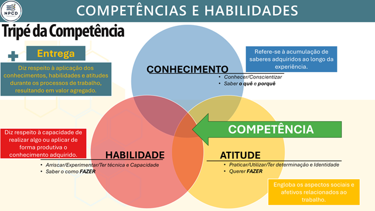

# Estudos de Caso na Prática Mineral {#sec-cap7}

Este capítulo consolida o poder analítico do método apresentado ao longo do livro. Até o momento, aplicamos a Modelagem Analítica de Requisitos (ARM) em avaliações de qualidade de produtos físicos e rotinas logísticas. Agora, elevaremos o nível de complexidade para demonstrar a escalabilidade do modelo em três frentes avançadas: a avaliação de perfis humanos (competências do engenheiro), a auditoria de sistemas técnicos (planos de manutenção) e a mensuração do relacionamento interno em sistemas de gestão.

## A Expansão Multidimensional: Avaliação de Competências Humanas {#sec-arm-competencias}

Para demonstrar a verdadeira escalabilidade matemática do modelo ARM, elevaremos a aplicação para um cenário de alta complexidade intangível: a avaliação de competências humanas e o *People Analytics*.

Avaliá-las de forma puramente subjetiva ("é um bom aluno" ou "é um bom profissional") destrói a capacidade de melhoria contínua dos sistemas de ensino e de gestão de RH. Precisamos de métricas exatas. Para demonstrar como a engenharia de dados resolve esse problema, dividiremos esta seção em duas frentes complementares de aplicação acadêmica e mercadológica:

1. **Modelagem de Perfis (Estudo de Caso I - Engenharia):** Como usar o motor matemático multivariado para alocar alunos em arquétipos de atuação e formar equipes multidisciplinares.

2. **Auditoria de Instrumentos e Gaps (Estudo de Caso II - Administração):** Como utilizar a Teoria da Resposta ao Item (TRI) e o cruzamento de percepções (Exigência vs. Desempenho) para validar estatisticamente um questionário e encontrar lacunas curriculares críticas.

---

### Estudo de Caso I: O Perfil do Egresso na Engenharia (Modelo CHAE) {#sec-arm-multidimensional}

O egresso de engenharia de produção deve integrar saberes que permitam a sua inserção decisiva no contexto social e profissional. Para estruturar essa análise, o perfil do profissional moderno é parametrizado através do **Modelo CHAE** (Conhecimento, Habilidades, Atitudes e Entregas):

* **Conhecimento (Saber o quê e porquê):** O acúmulo de saberes técnicos e científicos (ex: cálculo, física, pesquisa operacional).

* **Habilidade (Saber como fazer):** A técnica e a capacidade de aplicar o conhecimento na prática.

* **Atitude (Querer fazer):** A determinação, a identidade e os aspectos socioafetivos (ex: liderança, ética, empatia).

* **Entrega (Geração de Valor):** A aplicação do tripé CHA durante os processos de trabalho, resultando em valor agregado real para a sociedade e para a organização.

### A Modelagem Sistêmica do Ensino (Input-Process-Output)

Para parametrizar o modelo CHAE na equação do ARM (@eq-arm-intensidade), a engenharia pedagógica (neste caso, inspirada nas diretrizes curriculares do MEC/CNE e no PPC de Engenharia de Produção) enxerga a sala de aula como um sistema integrado de produção.

Essa estrutura conceitual foi operacionalizada em uma matriz que integra os recursos, os conhecimentos, as competências, as habilidades e as atitudes do egresso. A formação compreende conhecimentos básicos, que sustentam as competências técnicas e de gestão na Engenharia de Produção.

{#fig-matriz-chae fig-align="center"}

Conforme ilustrado na @fig-matriz-chae, os recursos e a infraestrutura adequados são considerados as entradas do processo de ensino-aprendizagem. Ao centro, representando o processo de ensino-aprendizagem em si, existe a formação das competências que dependem dos agentes do processo (docentes, discentes e servidores técnico-administrativos), que tem como base o desenvolvimento dos conhecimentos básicos, profissionalizantes e específicos necessários para atuação. Os conhecimentos e competências são transformados em habilidades e atitudes, que são as saídas do processo:

1. **Entradas (Inputs):** São os recursos e a infraestrutura (docentes capacitados, metodologias ativas, laboratórios e tecnologias).
2. **Processo (Transformation):** É a internalização dos **Conhecimentos** (núcleos básico, profissionalizante e específico) que formam as **Competências** centrais do indivíduo.
3. **Saídas (Outputs):** O resultado final desse processo de transformação não é apenas uma nota em uma prova teórica, mas a consolidação de **Habilidades** e **Atitudes** observáveis.

Para sustentar a formação das competências (o Processo de transformação), a matriz curricular do curso é estruturada em três grandes blocos de conhecimento, que conectam a ciência pura à prática profissional:

* **📘 Núcleo Básico:** Algoritmos e Programação, Administração e economia, Ciências dos materiais, Ciências do ambiente, Estatística, Desenho técnico, Expressão gráfica, Eletricidade, Fenômenos de transporte, Física, Informática, Matemática, Mecânica dos sólidos, Metodologia científica e tecnológica, Química.

* **⚙️ Núcleo Profissionalizante:** Automação industrial, Eletrônica básica e instrumentação, Gestão da saúde e segurança, Mecânica geral, Metrologia, Processos de fabricação.

* **🏭 Núcleo Específico:** Engenharia de operações e processo de produção, Logística, Pesquisa operacional, Engenharia da qualidade, Engenharia do produto, Engenharia organizacional, Engenharia econômica, Engenharia do trabalho, Engenharia da sustentabilidade, Educação em engenharia de produção.

### O Estudo de Caso: People Analytics na Avaliação de Competências {#sec-caso-competencias}

Este estudo avança sobre a intangibilidade do capital humano. O objetivo é utilizar o modelo ARM para quantificar o perfil profissional do Engenheiro de Produção frente às exigências do mercado e à sua própria percepção de desenvolvimento.

O grande desafio analítico é traduzir as diretrizes abstratas do Ministério da Educação (O Processo) em comportamentos observáveis mensuráveis (As Saídas). Para estruturar o cálculo, o perfil do engenheiro foi desdobrado em três grandes dimensões analíticas.

**Dimensão 1: A Matriz de Competências Macros**

| Grupo Analítico | Variável de Avaliação ($x_i$) | Descrição Prática do Comportamento |
| :--- | :--- | :--- |
| **Resolução de Problemas** | **C01** Formular e conceber soluções desejáveis de Engenharia. | Contribuir com ideias; manter a calma diante de problemas inesperados; transformar ideias em ações; propor soluções criativas; enxergar o problema como um todo. |
| **Análise Científica** | **C02** Analisar e compreender fenômenos físicos e químicos. | Interpretar gráficos e tabelas; analisar informações antes de decidir; compreender fundamentos técnicos; identificar causas de problemas; reconhecer padrões. |
| **Concepção de Projetos** | **C03** Conceber, projetar e analisar sistemas, componentes ou processos. | Organizar etapas de uma tarefa; priorizar atividades importantes; estruturar planejamento; aplicar conceitos teóricos na prática. |
| **Gestão e Controle** | **C04** Implantar, supervisionar e controlar soluções de Engenharia. | Cumprir prazos com qualidade; manter persistência em tarefas longas; seguir normas técnicas; manter o grupo organizado e produtivo. |
| **Comunicação** | **C05** Comunicar-se eficazmente nas formas escrita, oral e gráfica. | Explicar conceitos a colegas; comunicar-se claramente em apresentações; ter empatia comunicativa; organizar ideias ao escrever relatórios. |
| **Liderança e Equipe** | **C06** Trabalhar e liderar equipes multidisciplinares. | Contribuir com ideias para o grupo; colaborar com pessoas diferentes; compreender pontos de vista; manter o grupo engajado. |
| **Ética e Compliance** | **C07** Conhecer e aplicar com ética a legislação e os atos normativos. | Relacionar conteúdo com impactos socioambientais; seguir requisitos técnicos; assumir responsabilidade social; refletir sobre impactos a longo prazo. |
| **Autonomia** | **C08** Aprender de forma autônoma e lidar com situações complexas. | Adaptar-se a novas ferramentas tecnológicas; buscar informações por conta própria; aprender conteúdos sem depender exclusivamente do professor. |

: Matriz de Desdobramento das Competências do Egresso {#tbl-competencias-egresso}


**Dimensão 2: A Matriz de Habilidades Profissionais**

| Grupo Analítico | Variável de Avaliação ($x_i$) | Descrição Prática do Comportamento |
| :--- | :--- | :--- |
| **Cognitivas e Analíticas** | **H01** Conhecer e reconhecer situações e contextos. <br> **H02** Compreender fenômenos e processos. <br> **H03** Analisar e avaliar dados e cenários. <br> **H04** Formular e modelar problemas. <br> **H05** Diferenciar causas e impactos. <br> **H06** Exercitar pensamento crítico. <br> **H07** Lidar com a complexidade sociotécnica. | Identificar variáveis-chave e o cenário macro do problema. <br> Explicar a lógica de funcionamento de um sistema. <br> Extrair *insights* de planilhas e relatórios. <br> Traduzir um problema real em equações ou fluxos lógicos. <br> Separar o sintoma visível da causa-raiz do problema. <br> Avaliar a validade da informação antes de assumi-la. <br> Equilibrar restrições técnicas com impactos humanos. |
| **Técnicas e Operacionais** | **H08** Aplicar e implementar métodos. <br> **H09** Utilizar tecnologias e ferramentas computacionais. <br> **H10** Desenvolver melhorias de processos. <br> **H11** Planejar atividades e projetos. <br> **H12** Pesquisar informações relevantes. <br> **H13** Aplicar conhecimentos em situações reais. | Executar ferramentas padronizadas (PDCA, 5S) na prática. <br> Operar softwares (Excel, R, CAD) para processar dados. <br> Identificar gargalos e propor rotinas mais eficientes. <br> Criar cronogramas, alocar recursos e definir entregas. <br> Buscar normas, literaturas e dados em fontes confiáveis. <br> Transpor a teoria da sala para a resolução de *cases*. |
| **Comunicacionais** | **H14** Comunicar de forma clara (oral, escrita e gráfica). <br> **H15** Explicar conceitos para outras pessoas. <br> **H16** Organizar informações de forma compreensível. | Redigir textos objetivos e falar sem ambiguidades. <br> Traduzir jargões técnicos para públicos leigos. <br> Estruturar apresentações com começo, meio e fim lógicos. |
| **Interpessoais e Colab.** | **H17** Trabalhar em equipe. <br> **H18** Colaborar em ambientes multidisciplinares. <br> **H19** Facilitar discussões. <br> **H20** Mediar conflitos e alinhar expectativas. | Dividir tarefas de forma justa e apoiar os colegas. <br> Integrar ideias de pessoas de diferentes formações. <br> Guiar reuniões para que não percam o foco. <br> Acalmar ânimos e buscar meios-termos construtivos. |
| **Criativas e de Inovação** | **H21** Ser criativo na solução de problemas. <br> **H22** Propor alternativas e novas abordagens. <br> **H23** Integrar diferentes perspectivas para gerar soluções. | Contornar a falta de recursos com ideias não convencionais. <br> Não se contentar com o "sempre foi feito assim". <br> Juntar ideias opostas para criar um terceiro caminho. |

: Matriz Consolidada de Habilidades do Egresso {#tbl-habilidades-egresso}


**Dimensão 3: A Matriz de Atitudes Comportamentais**

| Grupo Analítico | Variável de Avaliação ($x_i$) | Descrição Prática do Comportamento |
| :--- | :--- | :--- |
| **Cognitivas e Reflexivas** | **A01** Visão sistêmica. <br> **A02** Visão holística. <br> **A03** Reflexão. <br> **A04** Pensamento crítico. <br> **A05** Curiosidade intelectual. | Enxergar o todo, conexões e impactos. <br> Integrar múltiplas perspectivas antes de agir. <br> Avaliar o próprio desempenho e corrigir rotas. <br> Questionar e não aceitar respostas prontas. <br> Buscar entender os porquês, além do mínimo exigido. |
| **Éticas e Humanistas** | **A06** Ética. <br> **A07** Consciência social e ambiental. <br> **A08** Visão humanista. <br> **A09** Empatia. <br> **A10** Respeito às diferenças. | Agir com total integridade e transparência. <br> Perceber e mitigar os impactos das operações industriais. <br> Considerar o bem-estar das pessoas em primeiro lugar. <br> Compreender e validar o ponto de vista alheio. <br> Lidar de forma respeitosa com a diversidade no grupo. |
| **Autonomia e Proatividade**| **A11** Autonomia. <br> **A12** Persistência. <br> **A13** Iniciativa. <br> **A14** Criatividade. <br> **A15** Empreendedorismo. | Conduzir tarefas complexas sem microgerenciamento. <br> Manter o esforço e o foco mesmo diante de falhas. <br> Antecipar-se aos problemas e propor ações. <br> Gerar saídas originais para restrições clássicas. <br> Identificar oportunidades onde outros veem problemas. |
| **Interpessoais e Liderança**| **A16** Colaboração. <br> **A17** Cooperação. <br> **A18** Liderança. <br> **A19** Comunicação empática. <br> **A20** Responsabilidade coletiva. | Contribuir ativamente para o avanço da equipe. <br> Trabalhar em sintonia para atingir um objetivo comum. <br> Influenciar, motivar e orientar colegas em momentos de crise. <br> Relacionar-se com diferentes perfis sem gerar atrito. <br> Cumprir integralmente sua parte no que foi acordado. |

: Matriz Consolidada de Atitudes do Egresso {#tbl-atitudes-egresso}

### Do Modelo Univariável à Extensão Multivariada {#sec-uni-para-multi}

Após mapear as **51 variáveis operacionais** ($x_i$) nas matrizes acima, o desafio da engenharia é transformá-las em um diagnóstico algorítmico. Para entender como a ponderação destas características ocorre na prática, precisamos contrastar a abordagem linear básica com a nossa solução avançada.

**O Exemplo Univariável (*Flat Model* - @sec-arm-uni) e a Teoria Clássica da Medida:**
Se fôssemos aplicar o modelo de forma univariada (@eq-arm-uni), apoiados na Teoria Clássica da Medida (TCM), o nosso objetivo seria calcular um único Construto Latente ($\theta$) global para definir o "Engenheiro Perfeito". Neste cenário, a nota final seria a simples soma das respostas. Como temos 51 itens pontuados em uma escala *Likert* de 1 a 5, o total variaria matematicamente entre 51 e 255. O problema desta abordagem é duplo. Primeiro, o mercado de trabalho não busca um único tipo de engenheiro; uma mineradora precisa tanto do estatístico brilhante quanto do líder de campo carismático. Segundo, a avaliação humana linear sofre um impacto massivo de distorções de percepção.

::: {.callout-warning title="⚠️ GARGALO ANALÍTICO: Vieses gerados no processo de resposta"}

Ao aplicar questionários de autopercepção, a abordagem linear é frequentemente corrompida. A literatura e a prática evidenciam 10 vieses principais que "achatam" os resultados:

1. **Viés de desejabilidade social:** Tendência a responder aquilo que parece “correto”, “bem‑visto” ou “profissional”, e não aquilo que realmente representa o comportamento da pessoa.
2. **Viés de autopercepção:** Pessoas costumam superestimar habilidades técnicas e subestimar habilidades socioemocionais, criando distorções sistemáticas.
3. **Viés de familiaridade:** Itens mais fáceis de entender ou mais próximos da experiência do respondente recebem notas mais altas, independentemente da competência real.
4. **Viés de consistência:** Respondentes tendem a repetir padrões (ex.: marcar 4 ou 5 em sequência), reduzindo a variabilidade e mascarando diferenças reais entre dimensões.
5. **Viés de ancoragem:** A primeira resposta influencia as seguintes; se o início é alto, o restante tende a ser alto também.
6. **Viés de esforço cognitivo:** Itens mais abstratos, complexos ou vagos recebem notas mais baixas por dificuldade de interpretação, não por falta de competência.
7. **Viés de saturação dos pesos:** Quando um perfil tem muitos itens classificados como “Forte”, ele tende a ser favorecido independentemente das respostas, porque acumula mais multiplicadores altos.
8. **Viés estrutural da matriz:** Perfis com pesos calibrados maiores em itens mais respondidos tendem a dominar, mesmo que o respondente não tenha intenção de expressar esse perfil.
9. **Viés de ordem das perguntas:** Itens no início do formulário recebem mais atenção; itens no final sofrem fadiga e respostas mais rápidas e menos refletidas.
10. **Viés de interpretação:** Respondentes podem interpretar o mesmo item de maneiras diferentes, especialmente em atitudes e habilidades socioemocionais.
:::

A soma desses vieses resulta em uma **baixa variabilidade das respostas**, invalidando o uso cru da Teoria Clássica da Medida.

**A Extensão Multivariada (*Simultaneous Scores* - @sec-arm-multivariavel):**
Para resolver o esmagamento da diversidade e mitigar esses vieses, estendemos o modelo (@eq-arm-multi). Em vez de uma equação, construímos várias rodando em paralelo. O valor de entrada (a nota $x_i$ que o aluno dá a si mesmo) é o mesmo, mas a matriz de pesos ($w_{i,p}$) muda dinamicamente dependendo do *Cluster* ($p$) calculado, gerando construtos latentes simultâneos ($\theta_p$).

### A Racionalidade dos 6 Perfis: Por que não mais ou menos? {#sec-porquê-6-perfis}

A definição de 6 perfis cobre o espaço vetorial completo da atuação do Engenheiro de Produção, mantendo a parcimônia estatística:

1. **🧠 Perfil Analítico-Técnico (O "Cérebro"):** Forte em matemática, estatística e algoritmos. Habilidade de avaliar cenários e propor soluções fundamentadas.
2. **🏭 Perfil de Processos e Operações (O "Motor"):** Interesse por logística, produção e qualidade. Gosta de otimizar rotinas e fluxos.
3. **🎨 Perfil Criativo-Inovador (A "Visão"):** Gera ideias, pensa “fora da caixa” e desenvolve novos produtos e serviços.
4. **🗣️ Perfil Comunicador-Articulador (A "Voz"):** Facilita discussões, media conflitos e comunica-se bem oralmente e graficamente.
5. **🧩 Perfil Organizacional-Líder (O "Eixo"):** Coordena tarefas, distribui funções e supervisiona equipes com ética e consciência.
6. **🌱 Perfil Sustentável-Responsável (A "Consciência"):** Foco em meio ambiente, segurança, análise de riscos e impactos legais.

### A Lógica das Intensidades: O Paradoxo da Variabilidade {#sec-logica-intensidades}

Para que o motor do $ARM$ consiga alocar o aluno no *cluster* correto sem o uso demorado do Diagrama de Mudge, adotamos pesos predefinidos. Para forçar a explosão de variância contra o "Viés de Consistência", a modelagem adotou uma escala de intensidade ($I_{i,p}$) agressiva:

* **Forte ($I = 2.0$) $\rightarrow$ Define o perfil:** Características inegociáveis.

* **Moderado ($I = 1.0$) $\rightarrow$ Contribui:** Características de suporte.

* **Fraco ($I = 0.2$) $\rightarrow$ Não representa:** Características periféricas.

#### Abrindo a Caixa-Preta: A Construção do Perfil 1 (Analítico-Técnico)

Vamos analisar como as Variáveis reagem contra a lente do **Perfil 1**:

1. **Competências Macros (C): O Foco no Método**

   - **FORTE (2.0):** *(O núcleo matemático)*
     - (C01) Análise de dados

     - (C02) Modelagem de processos

     - (C03) Raciocínio lógico

     - (C08) Criatividade técnica

   - **MODERADA (1.0):** *(Habilidades úteis, mas não centrais)*
     - (C04) Comunicação

     - (C05) Trabalho em equipe

   - **FRACA (0.2):** *(Entregas delegadas a outros perfis)*
     - (C06) Sustentabilidade

     - (C07) Liderança

2. **Habilidades Profissionais (H): O Domínio das Ferramentas**

   - **FORTE (2.0):** *(Uso de softwares e solução estruturada)*
     - H01, H02, H03, H04: Reconhecer contextos, compreender fenômenos, analisar dados, formular problemas

     - H06, H07: Pensamento crítico e complexidade sociotécnica

     - H11: Planejar atividades e projetos

     - H16: Organizar informações

   - **MODERADA (1.0):** *(Leitura técnica e avaliação)*
     - H08, H09: Aplicar métodos e utilizar ferramentas computacionais

     - H20: Mediar conflitos e alinhar expectativas

   - **FRACA (0.2):** *(Funções periféricas ao foco analítico)*
     - H05, H10: Diferenciar causas e desenvolver melhorias

     - H12 a H15: Pesquisa, aplicação prática e comunicação

     - H17 a H19: Trabalho em equipe e facilitação

     - H21 a H23: Criatividade e integração de perspectivas

3. **Atitudes Comportamentais (A): A Postura do Cientista**

   - **FORTE (2.0):** *(Questionar dados e buscar causa-raiz)*
     - A01: Visão sistêmica

     - A02: Visão holística

     - A03: Reflexão

     - A04: Pensamento crítico

     - A05: Curiosidade intelectual

   - **MODERADA (1.0):** *(Ética e consciência como guardrails)*
     - A06: Ética

     - A07: Consciência social e ambiental

     - A20: Responsabilidade coletiva

   - **FRACA (0.2):** *(Gestão subjetiva de emoções)*
     - A08 a A10: Visão humanista, empatia, respeito às diferenças

     - A11 a A15: Autonomia, persistência, iniciativa, criatividade, empreendedorismo

     - A16 a A19: Colaboração, cooperação, liderança, comunicação empática

#### A Demonstração Matemática: Como o algoritmo calcula os pesos?

Para que você entenda o "motor" dessa equação, vamos abrir a caixa-preta do algoritmo e utilizar os **Pesos Base originais** (extraídos do Mudge) para demonstrar como o sistema atinge exatamente os valores da tabela para o Perfil Analítico (P01).

Suponha que a avaliação original de relevância da diretoria gerou a seguinte base para estas três variáveis: C02 (14,62%), C04 (5,85%) e C06 (11,69%). Veja como a injeção do Fator de Intensidade ($I_{i,p}$) reage contra a lente do **Perfil 1**:

**1. Cálculo do Peso Efetivo (Peso Base $\times$ Intensidade):**

* **C02 (Analisar Fenômenos):** Peso Base (14,62) $\times$ Forte (2.0) = **29,24**

* **C04 (Implantar Soluções):** Peso Base (5,85) $\times$ Moderada (1.0) = **5,85**

* **C06 (Liderar Equipes):** Peso Base (11,69) $\times$ Fraca (0.2) = **2,34**

*(Nota técnica: Ao realizar este mesmo cálculo isolado para todas as 8 competências da dimensão, o Somatório dos Pesos Efetivos totais deste cenário atingiu exatamente **116,95**).*

**2. A Normalização a 100%:**

O algoritmo não pode trabalhar com um agrupamento que passe de 100%. Portanto, ele divide o valor efetivo de cada característica pelo somatório total (116,95) para encontrar a nova participação percentual final do Perfil:

* Peso final de **C02**: $29,24 \div 116,95 = \mathbf{25,00\%}$ *(O núcleo é exponencialmente amplificado).*

* Peso final de **C04**: $5,85 \div 116,95 = \mathbf{5,00\%}$ *(A variável de suporte sofre o recuo proporcional).*

* Peso final de **C06**: $2,34 \div 116,95 = \mathbf{2,00\%}$ *(A variável oposta ao perfil é matematicamente esmagada, apesar de seu peso base original ser alto).*

#### A Prova do Contraste: A Distribuição Final dos Pesos ($w_i$)

A verdadeira inteligência do motor multivariado da modelagem ARM não está apenas em exaltar o que um perfil tem de melhor, mas em penalizar ativamente as variáveis que não pertencem ao seu escopo central. Essa mecânica de exclusão mútua vista na normalização acima é o que garante a independência matemática dos arquétipos.

Para visualizar esse efeito na prática, precisamos olhar para o resultado final da nossa calibragem sistêmica. Quando aplicamos esses multiplicadores de intensidade (2.0, 1.0 e 0.2) em **todas** as variáveis, o algoritmo normaliza as dimensões e gera a Matriz de Pesos Definitiva.

A Tabela abaixo demonstra a distribuição exata dos pesos percentuais ($w_{i,p}$) das 8 competências curriculares ao longo do cálculo simultâneo dos 6 perfis:

| Cód | Descrição da Competência Macro | P01 (Analítico) | P02 (Operações) | P03 (Criativo) | P04 (Comunicador) | P05 (Líder) | P06 (Sustentável) |
| :--- | :--- | :---: | :---: | :---: | :---: | :---: | :---: |
| **C01** | Formular e conceber soluções desejáveis de Engenharia | 20,00 | 15,00 | 30,00 | 10,00 | 15,00 | 15,00 |
| **C02** | Analisar e compreender fenômenos físicos e químicos | 25,00 | 10,00 | 10,00 | 2,00 | 2,00 | 20,00 |
| **C03** | Conceber, projetar e analisar sistemas e processos | 25,00 | 25,00 | 25,00 | 10,00 | 10,00 | 15,00 |
| **C04** | Implantar, supervisionar e controlar soluções | 5,00 | 30,00 | 5,00 | 3,00 | 25,00 | 5,00 |
| **C05** | Comunicar-se eficazmente (escrita, oral e gráfica) | 3,00 | 5,00 | 5,00 | 40,00 | 5,00 | 3,00 |
| **C06** | Trabalhar e liderar equipes multidisciplinares | 2,00 | 3,00 | 3,00 | 20,00 | 35,00 | 2,00 |
| **C07** | Conhecer e aplicar com ética a legislação e normas | 5,00 | 2,00 | 2,00 | 5,00 | 5,00 | 30,00 |
| **C08** | Aprender de forma autônoma e lidar com complexidade | 15,00 | 10,00 | 20,00 | 10,00 | 3,00 | 10,00 |
| | **TOTAL DA DIMENSÃO (100%)** | **100,00** | **100,00** | **100,00** | **100,00** | **100,00** | **100,00** |

: Matriz d
e Pesos Percentuais ($w_{i,p}$) das Competências por Perfil {#tbl-pesos-competencias}

**Analisando o Contraste Matemático:**

A matriz revela imediatamente como o algoritmo "molda" a vocação do aluno filtrando as respostas do questionário:

* **A Concentração Analítica (P01):** O Perfil 1 tem metade de todo o seu peso (50%) concentrado em apenas duas variáveis puramente exatas: Análise de Fenômenos (C02) e Projetos de Sistemas (C03). Competências interpessoais como Liderança (C06) e Comunicação (C05) somam míseros 5%, provando matematicamente o foco no "Cérebro" da operação.

* **O Deslocamento do Chão de Fábrica (P02):** No Perfil de Operações, o peso sai da ideação e migra para a execução. A competência "Implantar, supervisionar e controlar" (C04) salta de 5% no P01 para expressivos 30% no P02.

* **A Oposição Ortogonal (P04 - O Comunicador):** Este é o teste definitivo da calibragem. O Perfil 4 é a antítese técnica do Perfil 1; sua entrega central é a empatia e a articulação. Note que a competência de Comunicação (C05) suga quase metade da pontuação do perfil (40%), enquanto as competências de física e química (C02) desabam para apenas 2%.

Essa mecânica de distribuição anula definitivamente o "Viés de Consistência" (o aluno que responde nota máxima em tudo). Ao multiplicar a resposta linear do avaliado ($x_i$) por uma matriz altamente assimétrica, a engenharia de dados "puxa o tapete" das variáveis que não interessam àquele perfil específico, forçando o afloramento isolado da verdadeira vocação do avaliado.

### A Dinâmica de Triangulação e a Formação de Equipes {#sec-dinamica-perfis}

O objetivo central desta modelagem não é apenas rotular o aluno, mas utilizar o algoritmo para a formação estratégica de equipes.

::: {.callout-tip title="⚙️ Tech Note: Engenharia de Equipes e People Analytics"}

**Afinal, como o algoritmo deve formar os grupos?**
Na engenharia de produção e nas práticas modernas de *People Analytics*, a regra de ouro para a inovação e a resolução de problemas complexos é a **complementaridade**. O modelo não deve agrupar indivíduos com perfis idênticos, mas sim distribuir a diversidade. O objetivo estatístico é formar **Esquadrões Multidisciplinares** (*Cross-Functional Teams*), uma arquitetura organizacional onde o ponto cego de um arquétipo é blindado pela força natural do outro.
:::

Se um grupo for formado apenas por perfis Analíticos (P01), o projeto terá excelente fundamentação matemática, mas falhará na apresentação (falta o P04 - Comunicador). Se for formado apenas por Líderes (P05), haverá disputas de comando e falha na execução operacional (falta o P02). Portanto, o motor do modelo ARM é utilizado para distribuir e balancear os perfis, garantindo que cada equipe possua uma mescla complementar (O Cérebro, O Motor, A Visão, A Voz e A Consciência).

Para que o mapeamento seja preciso e colete dados robustos para calibração de turmas e semestres futuros, a dinâmica abandona a avaliação estática e aplica um ciclo de triangulação em três rodadas (*Time-Boxed*).

#### ⏱️ Rodada 1: Autopercepção e o Score Inicial (Individual)

* **O que acontece:** O aluno responde individualmente ao questionário baseado na sua própria percepção de competência.

* **O Processamento:** Imediatamente após o preenchimento, o script em `R` processa as respostas contra a matriz de pesos ($w_i$) e gera o **Score Inicial ($\theta$)**.

* **Ação Gerencial:** Com os perfis dominantes calculados, o professor (ou o algoritmo) distribui os alunos fisicamente na sala, formando os Esquadrões Multidisciplinares. A partir deste momento, o aluno senta-se com colegas que possuem visões de mundo (e matrizes de pontuação) diferentes da sua.

* **🔗 Link de Acesso:** [FORMULÁRIO 1 — Autopercepção de Desempenho](https://forms.office.com/Pages/ResponsePage.aspx?id=DQSIkWdsW0yxEjajBLZtrQAAAAAAAAAAAAZ__pCJeT1UMk8zNThSUjFJTTVBN09KR0k1VVBFNVhSUC4u)

#### ⏱️ Rodada 2: Exigência na Prática Profissional (Em Grupo)

* **O que acontece:** Agora em suas novas equipes complementares, os alunos debatem qual é a exigência do mercado para cada uma das 51 variáveis. O grupo deve enviar **apenas uma resposta em consenso**.

* **O Efeito Psicológico:** Ocorre um choque de realidade. Como o grupo é heterogêneo, o Perfil Analítico defenderá que a variável "Estatística" exige nota 5, mas o Perfil Comunicador argumentará que a exigência é nota 3. Esse atrito força a calibragem da percepção individual, ancorando o aluno na realidade plural do mercado.

* **🔗 Link de Acesso:** [FORMULÁRIO 2 — Exigência das Competências](https://forms.office.com/Pages/ResponsePage.aspx?id=DQSIkWdsW0yxEjajBLZtrQAAAAAAAAAAAAZ__pCJeT1UNTI5UFU2RzVMQjhRWTZIWTJPN0o4QzJUSC4u)

#### ⏱️ Rodada 3: Atribuição de Pares (Individual)

* **O que acontece:** Após a intensa interação da Rodada 2, os alunos voltam ao escopo individual para avaliar a média de desempenho **dos seus colegas de grupo**.

* **O Efeito Matemático:** Estatisticamente, espera-se uma queda nos *Scores* globais ($\theta$) nesta etapa. Como os alunos não decoram as respostas da Rodada 1 e acabaram de vivenciar a exigência real do grupo, a avaliação de pares corrige o excesso de otimismo da autopercepção inicial.

* **🔗 Link de Acesso:** [FORMULÁRIO 3 — Atribuição de Desempenho dos Colegas](https://forms.office.com/Pages/ResponsePage.aspx?id=DQSIkWdsW0yxEjajBLZtrQAAAAAAAAAAAAZ__pCJeT1URjBXUVU2TTlRVlNTMzNKVE9PTVcxMjhMTi4u)

---

::: {.callout-note title="💡 Insight Analítico (A Calibragem em Malha Fechada)"}

A mágica dessa dinâmica ocorre quando o ciclo se fecha. A cada formulário, o perfil do aluno sofre uma atualização paramétrica. O sistema atua como uma malha fechada de controle: a Rodada 1 revela como o aluno se vê; a Rodada 2 expõe o que o mundo exige; e a Rodada 3 revela como o mundo vê o aluno.

Ao sobrepor matematicamente essas três camadas via algoritmo ARM, o *Dashboard* revela imediatamente os **Gaps de Formação** (quando a exigência do mercado é 5, mas a avaliação dos pares atribui 2) e a **Miopia de Competência** (quando a autopercepção é 5, mas os pares atribuem 2). Isso transcende a pedagogia tradicional, entregando um raio-X exato e rastreável para o Plano de Desenvolvimento Individual (PDI) de futuros engenheiros.
:::

### A Escalabilidade Pedagógica: Aplicação Multidisciplinar {#sec-escalabilidade-disciplinas}

A robustez do motor matemático multivariado (ARM) permite que a sua aplicação seja dosada de acordo com a maturidade técnica da turma e os objetivos da disciplina. A arquitetura de dados não precisa ser utilizada em sua totalidade a todo momento; ela pode ser escalada em três níveis de complexidade acadêmica:

**1. Nível Básico: Introdução à Engenharia de Produção**
Nesta disciplina de calouros, o foco é o alinhamento de expectativas. Aplica-se apenas o **Formulário 1 (Autopercepção)**. O objetivo não é formar grupos complexos, mas apresentar o Projeto Pedagógico do Curso (PPC) de forma interativa. O aluno preenche o formulário e o algoritmo revela a distância entre o seu perfil atual ($\theta$) e o perfil esperado do egresso, servindo como uma bússola inicial de carreira.

**2. Nível Intermediário: Gestão da Qualidade**
Aqui, o foco é a auditoria de processos e a mitigação de vieses. Aplica-se a dinâmica de triangulação completa vista anteriormente **(Formulários 1, 2 e 3)**. O aluno aprende, na prática, como a avaliação de um sistema (neste caso, o próprio comportamento humano) varia dependendo do ponto de vista do avaliador (Autopercepção vs. Mercado vs. Pares).

**3. Nível Avançado: Sistemas de Gestão Integrados (SGI)**
Na disciplina de SGI (que envolve as normas ISO 9001, 14001 e 45001), o aluno já possui bagagem técnica. Portanto, a escala de concordância (*Likert*) é substituída pelos **Testes de Julgamento Situacional (SJT)**. O aluno não avalia mais "o quanto ele acha que sabe", mas sim "como ele decide sob pressão". Para isso, introduzimos os **Formulários 4 e 5**, focados em dilemas contextuais.

---

### A Dinâmica Avançada SGI: Testes de Julgamento Situacional (SJT)

A aplicação dos formulários de SGI testa a capacidade do aluno de integrar Qualidade, Meio Ambiente, Saúde e Segurança. Para operacionalizar essa etapa, a engenharia pedagógica requer um design de formulário completamente diferente da autopercepção inicial. O aluno não avalia "o quanto acha que sabe", mas é jogado virtualmente no centro de uma crise operacional.

Para garantir a lisura da coleta de dados e evitar o viés de desejabilidade social, o instrumento é configurado no Microsoft Forms (Forms 365) como um **teste cego**. O aluno visualiza apenas o cenário e as opções de ação, sem nenhuma indicação ou pontuação visível. As respostas não possuem "certo ou errado" absoluto, mas cada opção carrega um peso matemático direcionado a perfis específicos do modelo hexadimensional.

#### ⏱️ Rodada 4: A Decisão Sob Pressão (Individual) - Formulário 4

Nesta etapa, o aluno responde individualmente a dilemas operacionais. O objetivo é recalibrar o perfil original do aluno com base nas suas reais prioridades de gestão (Risco vs. Custo vs. Compliance).

**Instruções de Preenchimento projetadas aos alunos:**
> *Bem-vindo(a) à simulação de Gestão de Crises. A partir de agora, você assume a cadeira de Gerente de Operações de uma instalação industrial complexa. Você tem exatos 10 minutos para concluir. Escolha apenas uma alternativa por cenário.*

##### Dilema 1 — Qualidade vs. Produção (Conflito ISO 9001)

* **Contexto:** Durante o carregamento de um navio no porto, o laboratório identifica que o lote de minério de ferro está com sílica 0,5% acima do limite de um cliente europeu *premium*. O navio está 40% carregado. Paralisar gerará *demurrage* de US$ 100.000/dia e comprometerá a meta trimestral de produção.
   - **Opção A (Foco em Compliance):** Interrompo o embarque imediatamente. Assumo o prejuízo, reporto a NC e corrijo o lote.
   - **Opção B (Foco em Negociação):** Continuo o carregamento para não gerar multas e aciono o comercial para oferecer desconto agressivo (15%) ao cliente.
   - **Opção C (Foco em Risco Operacional):** Suspendo apenas para contraprova. Se der o mesmo resultado, libero o navio para bater a meta e lido com a reclamação depois.

##### Dilema 2 — Saúde e Segurança vs. Cultura (Conflito ISO 45001)

* **Contexto:** A planta está a 1 dia de bater 1 ano sem acidentes, o que garante 2 salários de bônus para 500 operadores. No turno da noite, um operador torce o tornozelo gravemente. O supervisor sugere registrar como 'acidente de trajeto doméstico' para salvar o bônus.
   - **Opção A (Ética Inflexível):** Registro o acidente industrial imediatamente. Fraude é inegociável.
   - **Opção B (Paternalismo):** Aceito a sugestão. Protejo o bônus e a motivação de 500 famílias.
   - **Opção C (Estratégia Corporativa):** Isolo a área para investigação da causa-raiz. Após neutralizar o risco, negocio exceção contratual com o RH para pagar o bônus legalmente, apesar do acidente.

##### Dilema 3 — Meio Ambiente vs. Orçamento (Conflito ISO 14001)

* **Contexto:** Um filtro crítico na chaminé da usina de pelotização apresenta falhas intermitentes. Substituí-lo imediatamente paralisará a produção por 2 dias e custará US$ 50.000, estourando o seu orçamento de manutenção do trimestre.

* **O Conflito:** Se o filtro falhar de vez, as emissões de particulados ultrapassarão os limites legais do CONAMA, gerando multas pesadas e paralisação pelo órgão ambiental. Porém, a produção já está atrasada.
   - **Opção A (Foco Ambiental/Técnico):** Paro a usina e troco o filtro imediatamente. Estouro o orçamento, mas garanto o compliance ambiental e elimino o risco de interdição técnica.
   - **Opção B (Foco Operacional/Risco):** Mantenho a usina rodando, mas coloco um técnico monitorando a chaminé a cada hora. Preparamos um plano de contingência para desligamento emergencial apenas se o limite legal for atingido.
   - **Opção C (Foco em Negociação/Criatividade):** Reduzo a carga da usina para 50%, diminuindo a pressão no filtro para que ele não quebre, enquanto negocio emergencialmente com a diretoria um orçamento extra para a troca no fim de semana.

##### Dilema 4 — Auditoria vs. Ética Interna (Conflito ISO 19011)

* **Contexto:** Durante uma auditoria interna do SGI, você descobre que a certificação do principal fornecedor de EPIs está vencida. O Gerente de Compras (um veterano influente e amigo do CEO) falsificou a data no sistema para evitar o bloqueio, pois este fornecedor é o mais barato.

* **O Conflito:** Reportar a falsificação causará a demissão do gerente e uma crise de suprimentos. Ignorar o fato coloca a empresa em risco de perder a certificação na auditoria externa no mês que vem.
   - **Opção A (Foco em Compliance/Auditoria):** Registro a Não Conformidade formalmente no relatório de auditoria e bloqueio o fornecedor no sistema de imediato, assumindo o desgaste político com o CEO.
   - **Opção B (Foco em Liderança/Relacionamento):** Chamo o Gerente de Compras para uma conversa a portas fechadas. Dou a ele 48 horas para regularizar o fornecedor ou achar um substituto antes de fechar o meu relatório, resolvendo o problema sem exposição.
   - **Opção C (Foco em Processos/Contorno):** Reclassifico o fornecedor no sistema como "Experimental Temporário", status que isenta a certificação imediata, enquanto oriento a equipe a procurar novos orçamentos discretamente.

##### Dilema 5 — Responsabilidade Social vs. Lucro (Conflito NBR 16001 / ISO 26000)

* **Contexto:** A empresa fará uma expansão lucrativa na mina. O caminho mais barato exige desapropriar uma pequena comunidade local. A equipe jurídica encontrou uma brecha legal que permite forçar a desapropriação pagando indenizações irrisórias.

* **O Conflito:** Usar a brecha economiza US$ 2 milhões e 6 meses de projeto. Conduzir o processo de forma ética e colaborativa custará o valor de mercado e atrasará o cronograma.
   - **Opção A (Foco Social/Transparência):** Recuso a brecha legal. Inicio um processo transparente com a comunidade e pago o valor justo de mercado, protegendo a imagem e a licença social de operação da empresa.
   - **Opção B (Foco em Compensação Cruzada):** Uso a brecha para garantir o terreno rápido, mas pego parte dos US$ 2 milhões economizados para construir uma escola e um posto de saúde na nova vila deles, apaziguando os ânimos.
   - **Opção C (Foco em Eficiência Financeira):** Analiso friamente o risco legal. Se a brecha for sólida, executo a desapropriação pelo menor custo possível. Trato o impacto social estritamente como uma métrica de custo operacional.

##### Dilema 6 — Crise do Indicador de Desempenho (Conflito ISO 9001 / Liderança)

* **Contexto:** A diretoria exige que o índice de satisfação do cliente suba para 95% neste mês para garantir o bônus de todos os gerentes. O índice está em 88%. A equipe comercial sugere disparar as pesquisas apenas para a lista de clientes que já deram notas positivas no passado, garantindo a meta.

* **O Conflito:** Fraudar a amostragem garante o bônus de dezenas de gestores, mas mascara um problema real de qualidade perante a norma.
   - **Opção A (Foco em Serviço/Comunicação):** Recusa o filtro viciado, mas cria uma campanha de engajamento oferecendo novos serviços agregados aos clientes insatisfeitos para reverter a percepção deles de forma amigável.
   - **Opção B (Foco em Postura/Liderança):** Veta a fraude por violar a ética corporativa. Assume a liderança da crise e vai até a diretoria apresentar o risco de imagem que essa maquiagem traria a longo prazo.
   - **Opção C (Foco em Estatística/Causa-raiz):** Nega a manipulação. Puxa a base de dados completa do semestre para analisar estatisticamente a causa-raiz da insatisfação e atua para otimizar o processo.

##### Dilema 7 — Cadeia de Suprimentos vs. Qualidade Assegurada (Conflito ISO 9001 / Lean Manufacturing)

* **Contexto:** Uma greve portuária atrasou a importação de um componente eletrônico crítico para a linha de montagem. O estoque de segurança zerou. Parar a linha custará US$ 80.000 por turno. A equipe de compras encontrou um fabricante local não homologado pelo Sistema de Gestão da Qualidade, que tem o componente a pronta entrega, mas sem histórico de confiabilidade.

* **O Conflito:** Homologar o fornecedor leva 15 dias e paralisa a fábrica. Comprar sem homologar viola os procedimentos de qualidade e pode gerar falhas no produto final no mercado.
   - **Opção A (Foco em Qualidade/Processos):** Interrompo a linha de montagem, assumo o custo da parada e só volto a operar quando a peça do fornecedor importado original chegar.
   - **Opção B (Foco em Risco/Contingência):** Compro um lote pequeno do fornecedor não homologado, mas implemento uma barreira de inspeção de qualidade 100% no recebimento e no final da linha, mitigando o risco de falha.
   - **Opção C (Foco Operacional/Custos):** Compro o lote inteiro do fornecedor local e rodo a produção normalmente. O impacto financeiro de parar a fábrica é muito pior do que lidar com um eventual acionamento de garantia pelos clientes depois.

##### Dilema 8 — Segurança Cibernética vs. Continuidade Produtiva (Conflito ISO 27001 / Indústria 4.0)

* **Contexto:** A equipe de TI detectou uma tentativa de invasão (*ransomware*) na rede corporativa. Para garantir que os CLPs (Controladores Lógicos Programáveis) e robôs do chão de fábrica não sejam infectados, a TI exige derrubar toda a rede industrial por 12 horas para aplicar correções de segurança.

* **O Conflito:** Desligar a rede agora interrompe o processamento do lote do maior cliente da empresa, cujo prazo de entrega inegociável é amanhã de manhã.
   - **Opção A (Foco em Segurança da Informação):** Autorizo a TI a derrubar a rede imediatamente. O risco de ter a planta sequestrada por hackers e perder todos os dados é inaceitável, mesmo perdendo o maior cliente.
   - **Opção B (Foco em Negociação/Criatividade):** Acordo com a TI para desconectar fisicamente a fábrica da internet (*air gap*), isolando o risco, e mantenho a produção rodando em modo manual/local até concluir o lote.
   - **Opção C (Foco em Produção/Risco Operacional):** Nego a paralisação. O risco de um ataque chegar ao chão de fábrica é uma hipótese estatística, mas a multa milionária e a quebra de contrato com o cliente por atraso são certezas absolutas.

##### Dilema 9 — Manutenção de Ativos vs. Pressão de Cronograma (Conflito ISO 55001 / Gestão de Riscos)

* **Contexto:** O sistema de manutenção preditiva emitiu um alerta vermelho de vibração severa no redutor da correia transportadora principal. O laudo técnico indica que a quebra catastrófica pode ocorrer a qualquer momento. A troca preventiva do rolamento leva 3 dias.

* **O Conflito:** A equipe de PCP (Planejamento e Controle da Produção) implora para você manter a máquina rodando por mais 7 dias para fechar a meta de exportação do mês.
   - **Opção A (Foco em Engenharia/Confiabilidade):** Paro a correia hoje e inicio a manutenção preventiva imediatamente. Respeito o laudo técnico, independentemente da grita do setor de planejamento e vendas.
   - **Opção B (Foco em Monitoramento/Eficiência):** Mantenho o equipamento rodando, mas reduzo a velocidade operacional em 30% para diminuir o estresse mecânico, aceitando uma queda na produtividade para tentar chegar vivo até o fim do mês.
   - **Opção C (Foco Operacional/Run-to-Failure):** Rodo a máquina na capacidade máxima para tentar terminar a campanha de exportação o quanto antes. Se quebrar, aciono a manutenção corretiva de emergência e lido com as consequências.

##### Dilema 10 — Qualificação de Pessoal vs. Escassez de Mão de Obra (Conflito Normas Regulamentadoras / Continuidade)

* **Contexto:** Um surto repentino de virose afasta todos os operadores de empilhadeira certificados do turno da madrugada. Há 15 carretas no pátio esperando carregamento, e cada carreta parada gera multa (*demurrage*) por hora.

* **O Conflito:** O encarregado do turno sugere colocar ajudantes de armazém, que têm experiência prática não documentada em dirigir empilhadeiras, para operar as máquinas, mesmo sem o treinamento formal e a certificação da NR-11.
   - **Opção A (Foco em Segurança/Legalidade):** Proíbo terminantemente. Travo o carregamento, mando as carretas aguardarem até o turno da manhã (quando chegam os operadores certificados) e a empresa paga as multas.
   - **Opção B (Foco em Liderança/Contorno):** Autorizo os ajudantes a operarem apenas na área externa (sem prateleiras altas) e assumo pessoalmente a supervisão visual direta deles durante toda a madrugada, assumindo o risco gerencial.
   - **Opção C (Foco em Eficiência/Riscos Ocultos):** Autorizo os ajudantes a fazerem o trabalho normal para liberar os caminhões rápido, mas combino com o encarregado de não registrar os nomes deles nos diários de bordo das máquinas para não deixar rastros em auditorias futuras.

#### A Engenharia de Dados do SJT: A Matriz de Injeção de Pesos ($w_{SJT}$)

Essa é uma evolução importante para a engenharia do instrumento. No mundo real da Gestão de Operações, as decisões raramente são unidimensionais: uma escolha centrada em Qualidade (como parar para investigar causa-raiz com MASP/PDCA) pode ter um eixo principal Analítico, mas também exigir um componente secundário de Liderança para sustentar a decisão sob pressão.

Ao adotar uma lógica *fuzzy* (peso primário +5 e secundário +2), o algoritmo deixa de ser binário e passa a mapear o "perfil sombra" do aluno. Em cenários de empate no peso primário, o peso secundário atua como critério de desempate refinado, capturando nuances de tomada de decisão.

```{r}
#| label: tbl-pesos-sjt
#| tbl-cap: "Matriz de Injeção de Pesos Cruzada ($w_{SJT}$): Primário (+5) e Secundário (+2)"
#| echo: false
#| message: false
#| warning: false

library(kableExtra)

fmt_peso <- function(v) {
  ifelse(
    v == 5,
    cell_spec("+5.0", bold = TRUE),
    ifelse(v == 2, cell_spec("+2.0", color = "#154360", bold = TRUE), "+0.0")
  )
}

pesos_raw <- rbind(
  # D1: Qualidade vs. Produção
  c(2,0,0,0,0,5), c(0,2,0,5,0,0), c(5,0,0,0,2,0),
  # D2: Saúde/Segurança vs. Cultura
  c(0,0,0,0,2,5), c(0,0,2,5,0,0), c(2,0,0,0,5,0),
  # D3: Meio Ambiente vs. Orçamento
  c(0,0,0,0,2,5), c(2,5,0,0,0,0), c(0,0,5,2,0,0),
  # D4: Auditoria vs. Ética Interna
  c(0,0,0,0,5,2), c(0,0,0,5,2,0), c(0,2,5,0,0,0),
  # D5: Resp. Social vs. Lucro
  c(0,0,0,2,0,5), c(0,0,5,2,0,0), c(5,2,0,0,0,0),
  # D6: Indicador vs. Liderança
  c(0,0,2,5,0,0), c(0,0,0,0,5,2), c(5,2,0,0,0,0),
  # D7: Suprimentos vs. Qualidade
  c(2,0,0,0,5,0), c(2,0,5,0,0,0), c(0,5,0,2,0,0),
  # D8: Cybersec vs. Continuidade
  c(0,0,0,0,5,2), c(0,2,5,0,0,0), c(2,5,0,0,0,0),
  # D9: Manutenção vs. Cronograma
  c(5,0,0,0,0,2), c(0,2,5,0,0,0), c(0,5,0,0,2,0),
  # D10: Qualificação vs. Escassez
  c(0,0,0,0,2,5), c(0,2,0,0,5,0), c(0,5,2,0,0,0)
)

opcoes <- c(
  "\u21b3 A. Compliance/Cliente", "\u21b3 B. Negociação/Crise",  "\u21b3 C. Burlar/Meta",
  "\u21b3 A. Ética/Risco 0",      "\u21b3 B. Clima/Equipe",      "\u21b3 C. Investigação/RH",
  "\u21b3 A. Parar/Trocar",       "\u21b3 B. Monitorar/Risco",   "\u21b3 C. Reduzir/Negociar",
  "\u21b3 A. Reportar/NC",        "\u21b3 B. Barganhar/Prazo",   "\u21b3 C. Manobra/Sistema",
  "\u21b3 A. Transparência",      "\u21b3 B. Compens. Cruzada",  "\u21b3 C. Eficiência Legal",
  "\u21b3 A. Serviço/Redação",    "\u21b3 B. Vetar/Postura",     "\u21b3 C. Estatística/Causa",
  "\u21b3 A. Qualidade/Parada",    "\u21b3 B. Inspeção-Barreira",  "\u21b3 C. Custo/Continuidade",
  "\u21b3 A. Segurança/TI",        "\u21b3 B. Air Gap Manual",     "\u21b3 C. Entrega/Contrato",
  "\u21b3 A. Confiabilidade",      "\u21b3 B. Reduz Velocidade",   "\u21b3 C. Run-to-Failure",
  "\u21b3 A. NR-11/Legalidade",    "\u21b3 B. Supervisão Direta",  "\u21b3 C. Ocultação/Expedição"
)

df_sjt <- data.frame(
  Opcao = opcoes,
  P01   = fmt_peso(pesos_raw[, 1]),
  P02   = fmt_peso(pesos_raw[, 2]),
  P03   = fmt_peso(pesos_raw[, 3]),
  P04   = fmt_peso(pesos_raw[, 4]),
  P05   = fmt_peso(pesos_raw[, 5]),
  P06   = fmt_peso(pesos_raw[, 6]),
  stringsAsFactors = FALSE
)

kbl(df_sjt,
    escape    = FALSE,
    align     = c("l", rep("c", 6)),
    col.names = c("Dilema / Opção",
                  "P01 (Analítico)", "P02 (Operações)", "P03 (Criativo)",
                  "P04 (Comunicador)", "P05 (Líder)", "P06 (Sustentável)")) |>
  kable_styling(
    bootstrap_options = c("striped", "hover", "condensed", "bordered"),
    full_width = TRUE,
    font_size  = 13
  ) |>
  column_spec(1, width = "30%") |>
  row_spec(0, background = "#1a5276", color = "white", bold = TRUE) |>
  pack_rows("1. Quali/Prod (ISO 9001)",          1,  3, bold = TRUE, background = "#d6eaf8", color = "#1a5276") |>
  pack_rows("2. SST/Cultura (ISO 45001)",         4,  6, bold = TRUE, background = "#d6eaf8", color = "#1a5276") |>
  pack_rows("3. Amb/Orçam (ISO 14001)",           7,  9, bold = TRUE, background = "#d6eaf8", color = "#1a5276") |>
  pack_rows("4. Auditoria (ISO 19011)",          10, 12, bold = TRUE, background = "#d6eaf8", color = "#1a5276") |>
  pack_rows("5. Social/Lucro (NBR 16001)",       13, 15, bold = TRUE, background = "#d6eaf8", color = "#1a5276") |>
  pack_rows("6. Indicador (ISO 9001)",           16, 18, bold = TRUE, background = "#d6eaf8", color = "#1a5276") |>
  pack_rows("7. Cadeia de Suprimentos (ISO 9001/Lean)", 19, 21, bold = TRUE, background = "#d6eaf8", color = "#1a5276") |>
  pack_rows("8. Segurança Cibernética (ISO 27001)",     22, 24, bold = TRUE, background = "#d6eaf8", color = "#1a5276") |>
  pack_rows("9. Manutenção de Ativos (ISO 55001)",      25, 27, bold = TRUE, background = "#d6eaf8", color = "#1a5276") |>
  pack_rows("10. Qualificação de Pessoal (NR-11)",      28, 30, bold = TRUE, background = "#d6eaf8", color = "#1a5276")
```

#### A Racionalidade dos Pesos Secundários (+2)

A injeção do peso secundário (+2) revela a ferramenta de gestão ou a postura subjacente à escolha principal do aluno, refinando o diagnóstico do perfil:

* **Dilema 1, Opção A:** ao priorizar o compliance e barrar o embarque (**P06 +5**), o aluno também sinaliza método de garantia da qualidade (**P01 +2**).
* **Dilema 6, Opção C:** a análise estatística da base indica eixo analítico (**P01 +5**), mas com objetivo operacional de melhoria de processo (**P02 +2**), típico de Lean Six Sigma.
* **Dilema 7, Opção B:** criar uma barreira de inspeção para manter fluxo combina improviso técnico/criativo (**P03 +5**) com rigor de controle (**P01 +2**).
* **Dilema 9, Opção C:** a estratégia *run-to-failure* prioriza throughput (**P02 +5**), mas pressupõe decisão de risco sob pressão gerencial (**P05 +2**).

**A Lógica de Backend (Motor R):**
Todo o mapeamento ocorre de forma invisível no *backend*. Quando o tempo acaba, o professor exporta o `.csv` e o script em **R** executa um cruzamento relacional (`left_join`) entre as escolhas dos 10 dilemas e a Matriz $w_{SJT}$. O resultado é um perfil recalibrado em 360 graus.

#### A Mecânica de Reorganização Pós-Formulário 4

Com os novos perfis revelados, a coordenação **desfaz os grupos antigos e forma novas equipes multidisciplinares**. O terreno está preparado para a aplicação do **Formulário 5**, onde esses perfis remapeados terão que debater e negociar a sobrevivência operacional em conjunto.

#### ⏱️ Rodada 5: A Engenharia de Equipes e Validação (Dinâmica Presencial)

Com os perfis individuais recalibrados de forma objetiva pelo algoritmo, a dinâmica abandona o uso de formulários. O objetivo desta etapa presencial é garantir que as "Consultorias" (os grupos definitivos) possuam a resiliência multidisciplinar necessária para iniciar e concluir a disciplina com sucesso.

**Passo 1: A Formação Algorítmica (Os 10 Grupos)**
O professor projeta o resultado do *Dashboard*, distribuindo os 48 alunos matriculados em **10 equipes definitivas** (oito grupos de 5 membros e dois grupos de 4 membros). A alocação obedece a uma regra estrita de complementaridade: nenhuma equipe pode ser homogênea. Para que o grupo seja validado, o sistema garante o cruzamento das matrizes, misturando o núcleo operacional (Perfis 1 e 2), o núcleo de articulação (Perfis 4 e 5) e o núcleo de visão sistêmica (Perfis 3 e 6).

**Passo 2: O Teste de Viabilidade da Equipe**

Já reunidos fisicamente em suas novas formações, os alunos executam o rito de validação do grupo:

1. **Análise do Radar da Equipe:** O grupo analisa o seu próprio gráfico de competências cruzadas gerado pelo script em R. Eles devem identificar imediatamente os "pontos cegos" da equipe (ex: "Temos alta capacidade analítica, mas nossa habilidade de comunicação está baixa").

2. **Distribuição Estratégica de Papéis:** Baseado nas forças individuais reveladas pelo SJT, os membros distribuem as responsabilidades reais para o semestre. Quem será o gestor do cronograma? Quem estruturará as análises de risco do projeto? Quem fará a ponte nas apresentações dos seminários?

3. **Pactuação de Regras Internas:** A equipe formaliza como lidará com faltas, atrasos nas entregas das 8 tarefas práticas e nivelamento de qualidade dos trabalhos.

A partir deste momento de alinhamento e transparência, o grupo está oficialmente homologado como uma equipe multidisciplinar, pronta para conduzir o desenvolvimento do Sistema de Gestão Integrado da empresa fictícia ao longo das semanas seguintes.

---

### Estudo de Caso II: Perspectivas em Administração e a Auditoria via TRI {#sec-caso-administracao}

Uma vez que o modelo multivariado (ARM) fornece a arquitetura de cálculo para os perfis (como vimos no caso da Engenharia), surge um novo desafio para a gestão de dados: **como auditar a qualidade, a dificuldade e a confiabilidade das perguntas que compõem o próprio questionário?** Para superar as limitações da Teoria Clássica da Medida — que apenas soma as notas de forma linear —, a modelagem evolui para a **Teoria da Resposta ao Item (TRI)**.

::: {.callout-note title="📄 Ficha Técnica do Estudo de Caso"}
**Título original:** Perspectivas dos graduandos e egressos sobre as competências desenvolvidas nos cursos de Administração (Trabalho de Conclusão de Curso).

* **Objetivo:** Analisar as percepções de alunos e egressos quanto às competências relevantes para um administrador (desenvolvidas no curso vs. demandadas pelo mercado), sob as dimensões de Exigência, Importância e Desempenho.
* **Metodologia:** Pesquisa descritiva quantitativa. O instrumento (escala Likert de 5 pontos) foi validado por grupo focal e aplicado a egressos e alunos.
* **Resultados Principais:** O baixo desempenho geral reflete a necessidade de um melhor alinhamento entre a formação acadêmica e os requisitos profissionais, destacando o “domínio da língua estrangeira” como o item mais crítico.
* **Contribuição:** Sugere revisões contínuas de métodos e conteúdos curriculares para formar profissionais alinhados às reais necessidades da gestão.
:::

Para demonstrar essa estruturação matemática, utilizaremos os dados reais desta pesquisa acadêmica. O instrumento de pesquisa definitivo contém $I=25$ itens (C01 a C25), medidos de forma independente por uma escala do tipo *Likert* de $k=5$ pontos. O diferencial analítico deste modelo é que, para cada variável de competência, o indivíduo emite três percepções distintas: a **Exigência ($P_e$)** do mercado, a **Importância ($P_i$)** dada pelo aluno e o **Desempenho real ($P_d$)** desenvolvido durante o curso.

Abaixo, apresentamos a matriz do instrumento validado para este estudo:

| Item | Competência Avaliada | Exigência | Importância | Desempenho |
| :--- | :--- | :---: | :---: | :---: |
| **C01** | Adaptar-se às novas situações e/ou pressões de trabalho | $Pe_{C01}$ | $Pi_{C01}$ | $Pd_{C01}$ |
| **C02** | Agir com responsabilidade, respondendo às demandas críticas | $Pe_{C02}$ | $Pi_{C02}$ | $Pd_{C02}$ |
| **C03** | Buscar o aperfeiçoamento contínuo da qualidade dos trabalhos | $Pe_{C03}$ | $Pi_{C03}$ | $Pd_{C03}$ |
| **C04** | Buscar soluções originais e criativas, de forma inovadora | $Pe_{C04}$ | $Pi_{C04}$ | $Pd_{C04}$ |
| **C05** | Comunicar-me na forma escrita e verbal de forma clara | $Pe_{C05}$ | $Pi_{C05}$ | $Pd_{C05}$ |
| **C06** | Elaborar e implementar projetos em organizações | $Pe_{C06}$ | $Pi_{C06}$ | $Pd_{C06}$ |
| **C07** | Identificar problemas, definir características e elaborar soluções | $Pe_{C07}$ | $Pi_{C07}$ | $Pd_{C07}$ |
| **C08** | Permanecer produtivo diante das pressões naturais do trabalho | $Pe_{C08}$ | $Pi_{C08}$ | $Pd_{C08}$ |
| **C09** | Buscar e adquirir conhecimentos para atualização contínua | $Pe_{C09}$ | $Pi_{C09}$ | $Pd_{C09}$ |
| **C10** | Raciocinar de forma lógica com embasamento matemático | $Pe_{C10}$ | $Pi_{C10}$ | $Pd_{C10}$ |
| **C11** | Realizar consultoria em gestão e administração | $Pe_{C11}$ | $Pi_{C11}$ | $Pd_{C11}$ |
| **C12** | Tomar decisões a partir da análise dos aspectos do trabalho | $Pe_{C12}$ | $Pi_{C12}$ | $Pd_{C12}$ |
| **C13** | Ter autocrítica | $Pe_{C13}$ | $Pi_{C13}$ | $Pd_{C13}$ |
| **C14** | Compartilhar e aplicar conhecimentos técnicos para resolver problemas | $Pe_{C14}$ | $Pi_{C14}$ | $Pd_{C14}$ |
| **C15** | Administrar e formular estratégias de vendas e marketing | $Pe_{C15}$ | $Pi_{C15}$ | $Pd_{C15}$ |
| **C16** | Tomar decisões de investimento e financiamento | $Pe_{C16}$ | $Pi_{C16}$ | $Pd_{C16}$ |
| **C17** | Gerir e utilizar tecnologias da informação nos processos | $Pe_{C17}$ | $Pi_{C17}$ | $Pd_{C17}$ |
| **C18** | Liderar equipes de forma inspiradora e eficaz | $Pe_{C18}$ | $Pi_{C18}$ | $Pd_{C18}$ |
| **C19** | Assumir o processo decisório (planejamento, direção e controle) | $Pe_{C19}$ | $Pi_{C19}$ | $Pd_{C19}$ |
| **C20** | Domínio de língua estrangeira | $Pe_{C20}$ | $Pi_{C20}$ | $Pd_{C20}$ |
| **C21** | Considerar os valores éticos da profissão | $Pe_{C21}$ | $Pi_{C21}$ | $Pd_{C21}$ |
| **C22** | Gerenciar de forma completa um sistema logístico | $Pe_{C22}$ | $Pi_{C22}$ | $Pd_{C22}$ |
| **C23** | Interpretar a informação contábil para a tomada de decisão | $Pe_{C23}$ | $Pi_{C23}$ | $Pd_{C23}$ |
| **C24** | Conhecimentos jurídicos aplicados à gestão empresarial | $Pe_{C24}$ | $Pi_{C24}$ | $Pd_{C24}$ |
| **C25** | Promover esforços de negociação para obtenção de resultados | $Pe_{C25}$ | $Pi_{C25}$ | $Pd_{C25}$ |

: Instrumento de medida para Avaliação de Competências em Gestão {#tbl-instrumento-gestao tbl-colwidths="[10, 60, 10, 10, 10]"}

#### Estruturação Algébrica do Modelo

Para viabilizar a análise estatística dos dados em lote (preparando o terreno computacional para a linguagem **R** e a modelagem da TRI), introduzimos a seguinte notação matemática rigorosa para o instrumento de medida:

* $\{I_i\}_{(i \ge 1)}$: Conjunto de itens mensurados no formulário ($i = 1, 2, \dots, I$).
* $\{m_k\}_{(k \ge 1)}$: Os escores numéricos das categorias de resposta. Especificamente, $\{m_1 = 1, m_2 = 2, \dots, m_k = k\}$ representam as alternativas da escala *Likert* (neste caso, de 1 a 5), considerando a obrigatoriedade de respostas em todos os itens.
* $\{N_j\}_{(j \ge 1)}$: Conjunto de indivíduos ($j = 1, 2, \dots, n$) de uma população avaliada.
* $\{y_j\}$: Vetor com as respostas capturadas do indivíduo para os itens avaliados.

Ao considerar um instrumento de medida para uma determinada percepção $p \in \{P_e, P_i, P_d\}$, este será composto por um conjunto $\{I_i\}$ de itens, medidos de forma independente por $\{m_k\}$ categorias de respostas, sendo $\{N_j\}$ a amostra da população de interesse. Logo, se cada indivíduo ($j$) tiver uma percepção única de um item ($i$), gerando um possível padrão de resposta $y_{i,j}^p$, o espaço amostral $\Omega$ será o conjunto de todas as combinações matemáticas possíveis ($k^I$).

Essa fundação algébrica permite desdobrar a análise em quatro níveis de profundidade:

**1. O Espaço Amostral Global**
Como exemplo, para a avaliação da percepção de Exigência do Mercado ($P_e$), os $I=25$ itens ($Pe_{C01}$ a $Pe_{C25}$) são medidos de forma independente por sua respectiva escala de resposta de $k=5$ pontos. O espaço amostral $\Omega$ desta matriz atinge $5^{25}$ combinações possíveis de respostas.

**2. O Score do Indivíduo**
Cada indivíduo produzirá um *Score Total* ($T_j$), que matematicamente é limitado pela multiplicação do número de itens e os limites extremos da escala de resposta. Para este instrumento de 25 itens com nota máxima 5:
$$T_j = \sum_{i=1}^{25} y_{i,j}^{P_e} \in [25, 125]$$

**3. O Score da Variável (Item)**
Para auditar e ranquear quais itens específicos são mais exigidos pelo mercado de forma isolada, o sistema calcula o Total do Item ($Y_i$) e sua respectiva Média ($M_i$) em relação ao número total de respondentes ($n$):
$$Y_i^{P_e} = \sum_{j=1}^n y_{i,j}^{P_e} \in [n, 5n]$$
$$M_i^{P_e} = \frac{Y_i^{P_e}}{n}$$

**4. O Score por Agrupamentos (Clusters)**
Quando há necessidade de separar a amostra em subgrupos demográficos (ex: alunos vs. egressos), denotados por $g \in \{G_1, \dots, G_q\}$ com intersecção nula ($\bigcap_1^q G. = \emptyset$), onde $q$ é o número de repartições. Todo respondente deve pertencer a apenas um grupo. O Somatório do Grupo ($T_{G.}^p$) e a sua Média ($M_{G.}^p$) são definidos de forma vetorizada como:
$$T_{G.}^p = \sum_{j \in G.} T_j^p \quad \text{e} \quad M_{G.}^p = \frac{T_{G.}^p}{n_{G.}}$$

> **A Aplicação Prática da Álgebra:** O rigor dessa estruturação matemática foi o que permitiu à pesquisa original isolar o *gap* de formação acadêmica. Ao calcular o Score Médio da Variável ($M_i$) cruzando as três percepções, o algoritmo identificou conclusivamente que o **Item C20 (Domínio de língua estrangeira)** apresentava a maior distância entre a Exigência e o Desempenho.

#### Procedimentos Teóricos e Elaboração do Instrumento

**Construção do Referencial Teórico e Escalas**
A pesquisa bibliográfica focou nas competências do administrador baseadas nos trabalhos de Oliveira e Araújo (2014), Souza, Ferrugini e Zambalde (2017), Regio et al. (2014) e Rossoni (2013). Seguindo a recomendação de Collis e Hussey (2005), optou-se pela escala *Likert* de 5 pontos para quantificar a Exigência (1=Pouquíssima a 5=Muita), Importância (1=Pouquíssima a 5=Muita) e Desempenho (1=Muito ruim a 5=Muito bom).

**Validação de Conteúdo (Grupo Focal)**
Diante das competências selecionadas, realizou-se um grupo focal (01/07/2024) formado por quatro discentes do curso de Administração da UFRA. Oito itens (C02, C07, C08, C09, C11, C12, C15 e C23) foram reformulados para maior clareza, e o antigo item C10 foi excluído por alto nível de imprecisão, consolidando os 25 itens definitivos da @tbl-instrumento-gestao.

#### Caracterização e Coleta de Dados

A plataforma Google Forms foi utilizada para a aplicação entre 12/09/2024 e 24/09/2024. O questionário foi respondido por 67 discentes. A @tbl-recorte-respostas apresenta um recorte didático da matriz: o indivíduo $j=2$ obteve score máximo ($T_j = 125$), significando que ele percebe todas as competências com nota máxima de importância, enquanto o respondente $j=66$ já apresenta variabilidade ($T_j = 94$).

| Indivíduo ($j$) | $Pi_{C01}$ | $Pi_{C02}$ | $Pi_{C03}$ | $\dots$ | $Pi_{C25}$ | Score Total ($T_j$) |
| :---: | :---: | :---: | :---: | :---: | :---: | :---: |
| **1** | 5 | 5 | 5 | $\dots$ | 5 | **124** |
| **2** | 5 | 5 | 5 | $\dots$ | 5 | **125** |
| **3** | 5 | 4 | 5 | $\dots$ | 4 | **115** |
| **$\dots$** | $\dots$ | $\dots$ | $\dots$ | $\dots$ | $\dots$ | $\dots$ |
| **66** | 5 | 5 | 5 | $\dots$ | 4 | **94** |
| **67** | 5 | 5 | 5 | $\dots$ | 5 | **115** |
| **Média ($M_i^{P_i}$)** | **4,70** | **4,81** | **4,91** | $\dots$ | **4,43** | |

: Recorte do conjunto de respostas para a dimensão de Importância {#tbl-recorte-respostas}

#### Resultados e Gaps de Competência

Os participantes apresentaram idade média de 28,23 anos, sendo 67,16% do sexo feminino. A maior pontuação média foi observada na dimensão de Exigência para a partição "Indecisão na carreira" ($M_{G_4^M}^{P_e} = 120,33$), e a mais baixa no Desempenho para "Falta de opção" ($M_{G_2^M}^{P_d} = 87,14$).

| Categoria ($g^u$) | Partição ($G_.^u$) | Amostra ($n$) | % | Exigência ($M^{P_e}$) | Importância ($M^{P_i}$) | Desempenho ($M^{P_d}$) |
| :--- | :--- | :---: | :---: | :---: | :---: | :---: |
| | **Total Geral** | **67** | **100%** | **110,91** | **112,46** | **96,72** |
| **Sexo** | Feminino | 45 | 67,16% | 109,22 | 112,53 | 95,20 |
| | Masculino | 22 | 32,84% | 114,36 | 112,32 | 99,82 |
| **Motivação** | Identificação/Interesse | 38 | 56,72% | 109,68 | 110,97 | 96,03 |
| | Busca por ascensão | 17 | 25,37% | 109,12 | 113,94 | 100,94 |
| **Status** | Discente ativo | 53 | 79,10% | 111,60 | 111,89 | 96,17 |
| | Egresso (> 1 ano) | 8 | 11,94% | 103,00 | 112,38 | 101,75 |

: Informações demográficas e médias por cluster analítico (Recorte) {#tbl-demografia-respondentes}

A comparação entre as variáveis revela discrepâncias (*Gaps*) críticas. Valores negativos próximos de -1 representam defasagem de uma escala inteira. Por exemplo, na competência de vendas (C15), os respondentes percebem que são exigidos (4,34) e dão importância (4,39), mas reportam um desempenho acadêmico moderado/baixo (3,49).

| Item | Exigência ($M_e$) | Importância ($M_i$) | Desempenho ($M_d$) | Gap (E-I) | Gap (D-I) | Gap (D-E) |
| :---: | :---: | :---: | :---: | :---: | :---: | :---: |
| **C01** | 4,70 | 4,57 | 3,94 | -0,13 | -0,63 | -0,76 |
| **C02** | 4,51 | 4,81 | 4,37 | 0,30 | -0,43 | -0,13 |
| **C03** | 4,76 | 4,91 | 4,25 | 0,15 | -0,66 | -0,51 |
| **C15** | 4,34 | 4,39 | 3,49 | 0,04 | -0,90 | -0,85 |
| **C20** | 4,28 | 3,84 | 2,69 | -0,45 | -1,15 | -1,60 |
| **C21** | 4,54 | 4,84 | 4,46 | 0,30 | -0,37 | -0,07 |
| **C25** | 4,54 | 4,43 | 3,87 | -0,10 | -0,57 | -0,67 |

: Média e discrepância (*Gaps*) entre as competências (Recorte dos itens críticos) {#tbl-gaps-competencias}

A dinâmica visual de interação comprova estatisticamente a tese central: as expectativas de Exigência e Importância são elevadas e homogêneas, enquanto o Desempenho real apresenta scores severamente menores e com alta variabilidade.

* **O Maior Alinhamento:** A competência C21 (Valores éticos) apresentou o maior desempenho ($M_d = 4,46$), refletindo excelente alinhamento com a exigência ($M_e = 4,54$).
* **A Maior Lacuna Curricular:** O extremo oposto reside no item C20 (Domínio de língua estrangeira). Ele despencou com o menor desempenho geral do estudo ($M_d = 2,69$), configurando a área de maior fragilidade frente a uma considerável exigência do mercado ($M_e = 4,28$).

#### Diagnóstico Gerencial e Recomendações Estratégicas

A extração dos dados através do modelo multidimensional permite transcender a mera constatação estatística e avançar para a engenharia pedagógica. A análise comparativa dos *clusters* revelou dinâmicas comportamentais profundas sobre como o profissional de Administração enxerga o seu próprio valor no mercado:

**1. O Impacto da Motivação e do Status de Carreira**
A análise não revelou diferenças significativas na percepção entre os sexos. Contudo, o fator **Motivação** provou ser um gatilho crucial de desempenho.
* Indivíduos no grupo de "Indecisão na carreira" apresentaram a mais alta pontuação em Exigência, sugerindo que profissionais em busca de propósito sentem um peso maior do mercado.
* Em contrapartida, o grupo cuja motivação era a "Falta de opção" apresentou o menor Desempenho geral. Fica provado matematicamente que profissionais com objetivos claros e motivação intrínseca entregam melhores resultados.
* O status da carreira também distorce a percepção: recém-formados sentem maior pressão e menor confiança; discentes têm uma visão intermediária; e egressos veteranos demonstram alta adaptação e autoconfiança.

**2. Os Ofensores de Empregabilidade (*Hard Skills* Críticas)**
O algoritmo isolou as lacunas que cerceiam diretamente as chances de contratação e sucesso em grandes corporações:
* **Idiomas (Item C20):** Como demonstrado, o "Domínio de língua estrangeira" é a principal falha do sistema. Multinacionais são severamente impactadas por esse déficit. Uma intervenção cirúrgica no currículo — como a inclusão de aulas de idiomas aplicadas aos negócios — teria baixo impacto na estrutura de custos da IES, mas um altíssimo Retorno sobre o Investimento (ROI) na empregabilidade do aluno.
* **Finanças e Logística (Itens C16, C22 e C23):** Competências como "Interpretar informações contábeis" e "Gestão financeira e logística" apresentaram baixo desempenho. Como o objetivo primário das organizações é a geração de lucro, administradores sem esse domínio limitam o crescimento da empresa. A solução pedagógica requer a substituição de aulas puramente teóricas por **simulações empresariais e estudos de caso focados em resolução de problemas**.

**3. As Fortalezas Culturais (*Soft Skills* e Ética)**
Se o sistema falha em algumas habilidades técnicas, ele acerta de forma louvável na formação cultural:
* **Ética Profissional (Item C21):** A competência de considerar os valores éticos obteve altíssimo desempenho ($M_d = 4,47$), provando que a base de confiança e relacionamento no ambiente de trabalho está consolidada.
* **Aperfeiçoamento Contínuo (Item C03):** Os participantes reconhecem fortemente a necessidade de se manterem atualizados frente às mudanças do mercado. Curiosamente, a percepção de Importância atribuída pelo aluno ($P_i$) superou a própria Exigência do mercado ($P_e$). Isso gera um *insight* valioso para a gestão de RH: **quanto maior o valor intrínseco (Importância) que o indivíduo atribui a uma competência, maior será o seu comprometimento orgânico em desenvolvê-la**.

**4. O Plano de Ação: Curricularização da Extensão**
O diagnóstico final do motor ARM aponta que a melhor estratégia estrutural para nivelar esses *gaps* não é apenas adicionar carga horária em sala de aula, mas sim alavancar a **Curricularização da Extensão**.

Ao criar projetos interdisciplinares que levam os alunos a campo e trazem as empresas para dentro da Instituição de Ensino Superior (IES) através de parcerias, a academia cria um "laboratório vivo". O aluno deixa de ser um receptor passivo e passa a aplicar conhecimentos de contabilidade, logística e idiomas em contextos reais e de impacto comunitário, fechando em definitivo a lacuna entre a sala de aula e o chão de fábrica corporativo.


## O Índice de Qualidade de Plano de Manutenção (IQPL)

No segundo estudo de caso corporativo, a modelagem ARM abandona a avaliação humana e é aplicada diretamente à gestão de ativos físicos e engenharia de confiabilidade.

Um plano de manutenção mal estruturado gera paradas não programadas e destrói o fluxo de caixa. Para auditar a robustez desses planos, cria-se o **Índice de Qualidade de Plano de Manutenção (IQPL)**. O IQPL é a consolidação da nossa equação de qualidade multidimensional em uma nota cuja pontuação máxima atinge 100 pontos.

Para garantir o rigor técnico, o modelo audita **35 variáveis operacionais ($x_i$)**, metodicamente agrupadas em **5 áreas de interesse ($D_j$)**:
1. **Programáveis:** (Tolerâncias, horizontes de disparo, etc.)
2. **Processuais:** (Disponibilidade de materiais, apontamento de falhas, etc.)
3. **Ativos:** (Taxonomia, árvore de equipamentos, etc.)
4. **Lista de Tarefas:** (Duração, segurança, bloqueios, etc.)
5. **Desempenho:** (Relação de Manutenção Corretiva).

> **Avançando para a Prática Operacional:** Como o IQPL exige uma compreensão profunda do Macrofluxo de Planejamento e Controle da Manutenção (PCM), o desdobramento completo de suas variáveis, o cálculo do construto global ($\theta_{IQPL}$) e o código do motor matemático em R foram isolados em um capítulo próprio. Para explorar esta modelagem a fundo, consulte o **Capítulo 11 (@sec-iqpl)**.

## Avaliação de Sistemas de Gestão Integrados e o Ambiente de Relacionamento Interno (ARI) {#sec-caso-ari-irt}

O terceiro estudo de caso explora a dinâmica comportamental e os gargalos de comunicação dentro de um **Ambiente de Relacionamento Interno (ARI)**. Em grandes operações minerais, a qualidade não depende apenas da máquina, mas do fluxo de informações entre a equipe que planeja (Apoio) e a equipe que executa (Operação).

O objetivo deste caso é instrumentalizar a Modelagem Analítica de Requisitos (ARM) para medir o efeito das **diferenças de percepção** de qualidade entre os clientes internos. Historicamente, a literatura foca muito na formulação de sistemas de gestão ou em fatores de mercado externo, havendo uma lacuna em quantificar como a percepção distorcida entre departamentos impacta o desempenho organizacional.

Para transpor essa barreira, o desenvolvimento do instrumento de medição seguirá um rigoroso fluxo metodológico:

1. **Modelagem Conceitual:** Mapeamento do ARI, caracterização das partes envolvidas (Apoio vs. Operação) e definição dos fatores críticos que impactam esse ecossistema.

2. **Coleta e Refinamento:** Utilização de dados informacionais da empresa, *focus groups* exploratórios e confirmatórios, aliados à análise temática de conteúdo.

3. **Instrumentalização Matemática:** Para modelar e codificar essas percepções, a modelagem se apoiará na **Teoria da Resposta ao Item (TRI)** *(Item Response Theory - IRT)*, técnica estatística avançada que permitirá validar as variáveis qualitativas do sistema de gestão.

*(Nota: O desenvolvimento do código, das equações da Teoria da Resposta ao Item e das funções matemáticas em R para este estudo de caso serão detalhados nas seções seguintes).*